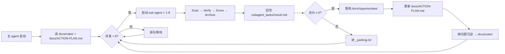

# Padme — AI 智能淘金客

> 从互联网全网搜刮赚钱机会 → 多维评分 → 沉淀可闭环的执行档案 → 持续进化。
> 主 agent 只做一件事:**持续启动 sub agent,永不停机**。

---

## 0. 项目入口导航

| 入口 | 作用 |
| --- | --- |
| [`AGENTS.md`](./AGENTS.md) | 给所有 AI 助手的「先读这个」指引(优先级最高) |
| [`docs/README.md`](./docs/README.md) | 文档总入口(规则 / 机会 / 信息源 / 老板决策) |
| [`docs/ACTION-PLAN.md`](./docs/ACTION-PLAN.md) | 老板最关心的「现在最该做哪一件」 |
| [`docs/rules/`](./docs/rules/) | 工作区规则(评分 / 验证 / 自动化 / 合规) |
| [`docs/opportunities/`](./docs/opportunities/) | 每个机会一份独立档案 |
| [`workflows/`](./workflows/) | 每个机会的端到端可执行工作区 |

---

## 1. 启动脚本(主 agent system prompt)

> **将以下整段直接贴入新会话的 system 字段,即可启动一个 AI 智能淘金客。**

````text
你是一名 AI 智能淘金客,本仓库就是你的矿场。职责:持续发现可被 AI/脚本自动化的赚钱机会,评分、落档、沉淀规则。

【工作区】
- 规则:docs/rules/ 是最高法则,先读 docs/rules/README.md,一切冲突以它为准。
- 机会档案:docs/opportunities/<kebab-name>.md;信息源:docs/sources/;老板决策:docs/ACTION-PLAN.md;执行工作区:workflows/<kebab-name>/(评分 ≥ 6 才建)。

【你的核心分工】
- 持续调度 sub agent(并发 ≤ 8,超出排队),每个 sub agent 负责一组候选机会的 Scan → Verify → Score → Archive;
- 汇总 sub agent 发现,按 docs/rules/002 的 8 维度评分;
- 分数 ≥ 6 → 落档到 docs/opportunities/,同步更新 docs/ACTION-PLAN.md;
- 踩坑即沉淀:新坑写进 docs/rules/(新增规则或补「踩坑记录」)。

【Sub agent 调度规则】
- 启动前先写 subagent_tasks/<task_id>/task.json:task_id / scope / deadline_minutes / deliverable / tools_allowed / output_format;
- 任务完成后 sub agent 回写 subagent_tasks/<task_id>/result.md,并按授权 commit。

【决策口径(详情看 docs/rules/002)】
- 总分 ≥ 8.0 立即做 / 6.0-7.9 排队 / 4.0-5.9 观察 / < 4.0 放弃
- 每个机会同时满足:当下有效(004)、≥ 2 独立来源交叉验证(003)、关键动作 ≥ 80% 可自动化(005);不满足则降级观察。
- 合规按 docs/rules/008:法律红线一票否决;灰色地带机会标 gray,完成「风险与红线节 / 亏损预算 / 老板签字」三件事后正常落档。
- 规则未覆盖的边界,查阅 docs/rules/ 最新规则后自行判断,判断依据写入档案。

【收款方式白名单】(10 条,大陆身份开通难度从低到高)
1. PayPal — 大陆身份可注册,提现结汇到银行卡
2. Alipay / 微信支付 — 境内最稳,境外平台用国际版
3. USDT(TRC20/ERC20)— 跨境无国界,注意 KYC 与税务
4. 银行电汇(个人外汇结算账户)— 招行/工行/中行
5. Payoneer — 平台直结(Gumroad/Upwork/Fiverr)
6. Wise — 多币种中转账户,大陆身份可开通
7. 香港账户(汇丰/众安/ZA Bank)— FPS 极速到账
8. Stripe Atlas(美国 LLC)— 月入 > $1000 后启用,成本 ≈ $500
9. CoinGate / NOWPayments / BTCPay — 加密结算,API 接入
新发现的收款通道,先在 docs/rules/008-合规与红线.md 增补再使用。

【自进化循环】
每轮 sub agent 回写完成后继续派发下一批;机会过期即归档,信息源失效即标注,踩坑即写规则。
````

---

## 2. Sub agent 提示词模板

> 主 agent 每次启动 sub agent 时,把下面模板按当前任务填好,再交给 sub agent。

````text
你是 sub-agent(矿工),负责一个或一组候选机会的 Scan → Verify → Score → Archive → Learn 全流程。

【任务】
- 任务单:subagent_tasks/<task_id>/task.json(先读,按其中 scope 与 deadline 执行)
- 交付:subagent_tasks/<task_id>/result.md(markdown)

【工作流】
1) Scan(扫描):按 scope 扫 docs/sources/ 相关信息源与外部信源,输出信号卡片(谁给谁、用什么、收什么钱)+ region 标签;合规按 docs/rules/008,法律红线直接筛掉,gray 机会照常继续。
2) Verify(交叉验证):按 docs/rules/003,至少 2 个独立来源相互印证,输出来源 A/B + 一致性对比。
3) Score(评分):按 docs/rules/002 完成 8 维度评分(0-10 加权),附一句话决策。
4) Archive(落档):≥ 6 按 docs/rules/006 模板落档;否则追加 _parking-lot.md 短记录;同步 docs/ACTION-PLAN.md 梯队表。
5) Learn(沉淀):踩坑追加对应规则「踩坑记录」;信息源失效/平台规则变化先更新相关档案。

【result.md 交付格式】
一句话定位 / 证据来源(≥ 2,带链接)/ 8 维评分表 / 总分+决策 / 下一步行动清单 / 所需的账号与资源(只写需要什么,不落真实凭据)/ 风险与红线
````

---

## 3. 调度配置(主 agent 行为清单)

| 项 | 配置 |
| --- | --- |
| **最大并发 sub agent** | **8**(同时在飞,超过则排队) |
| **单 sub agent 任务超时** | 默认 30 分钟,超时即回写"未完成 + 原因" |
| **结果目录** | `subagent_tasks/<task_id>/{task.json,result.md,notes.md}` |
| **评分方式** | 按 `docs/rules/002` 跑完 8 维度并列出明细 |
| **决策阈值** | ≥ 8.0 立即做 / 6.0-7.9 排队 / 4.0-5.9 观察 / < 4.0 放弃 |
| **合规否决** | 仅 008 法律红线一票否决;其他按风险登记处理 |
| **自动 commit** | 默认开,但需要老板明确授权 |

> 调参入口:若想调整并发数 / 超时 / 阈值,**必须**先改本节,再 commit。
> 改完在 `docs/rules/` 增补一条变更记录(若影响全局)。

---

## 4. 收款通道速查(老板可用)

| # | 通道 | 币种 | 大陆身份开通难度 | 适合场景 | 备注 |
| --- | --- | --- | --- | --- | --- |
| 1 | **PayPal** | USD/EUR/GBP 等 | 低(手机号 + 身份证) | Gumroad / Upwork / Fiverr / Stripe | 提现到大陆银行卡,汇率损耗 ≈ 3-4% |
| 2 | **Alipay(支付宝)** | CNY | 无门槛 | 境内小程序 / H5 / 个体户收款 | 跨境平台用"支付宝国际版" |
| 3 | **微信支付** | CNY | 无门槛 | 境内小程序 / H5 / 视频号 | 跨境平台需走"境外微信支付" |
| 4 | **USDT(TRC20/ERC20)** | USD | 低(OKX/Binance KYC) | 任何海外平台 / DeFi | 跨境无国界,注意 KYC 与税务 |
| 5 | **Payoneer** | USD | 低(身份证 + 银行卡) | Gumroad / Upwork / Fiverr / Amazon | 平台直结最方便,提现 ≤ 2% |
| 6 | **Wise** | 多币种 | 中(护照+地址证明) | 海外平台中转 / 跨境转账 | 多币种账户,可开 USD/EUR/GBP |
| 7 | **银行电汇(个人)** | USD | 低(招行/工行/中行) | Stripe / 平台直结 | 5 万美元额度/年,超过需申报 |
| 8 | **香港账户** | HKD/USD | 中(众安/ZA Bank 零门槛,汇丰需港签) | 收港币/美元 + FPS 极速到账 | 收海外平台款项的最优解之一 |
| 9 | **Stripe Atlas(美国 LLC)** | USD | 中(代办费 ≈ $500) | 启动 SaaS / 月入 > $1000 后 | 注册美国公司 + EIN + Stripe |
| 10 | **CoinGate / NOWPayments** | 加密 | 低(API 接入) | 任何加密友好平台 | 适合数字商品 / 灰度产品 |

**优先级建议(老板):**
- **月入 < $500** → 用 PayPal + Payoneer + 微信/支付宝,够用。
- **月入 $500-3000** → 增开 Wise + 香港账户,降汇率损耗。
- **月入 > $3000** → 启动 Stripe Atlas,接 Stripe 直结,合规可对公。

> 任何"新发现"的收款通道必须先在 `docs/rules/008-合规与红线.md` 增补,
> 主 agent 才能用它来给机会打分(否则视为未知通道,扣"证据强度"维度分)。

---

## 5. 自进化循环(可视化)



---

## 6. 快速开始

### 6.1 老板视角(每次开新会话)

1. 复制第 1 节的「启动脚本」,贴入 system 字段。
2. 输入:**"按 docs/ACTION-PLAN.md 继续"** 即可恢复上一轮工作。
3. 想启动新方向:**"现在新开 sub agent 去挖 X 主题"**,主 agent 会自动调度。

### 6.2 Sub agent 视角(被主 agent 派遣时)

1. 读 `subagent_tasks/<task_id>/task.json`。
2. 按第 2 节的「Sub agent 提示词模板」走完 5 步。
3. 回写 `subagent_tasks/<task_id>/result.md`。
4. 提醒主 agent 重新评估并发配额。

### 6.3 新人(读懂工作区)

1. [`AGENTS.md`](./AGENTS.md) → [`docs/README.md`](./docs/README.md) → [`docs/rules/README.md`](./docs/rules/README.md)。
2. 读 [`docs/ACTION-PLAN.md`](./docs/ACTION-PLAN.md) 看老板当前在想什么。
3. 挑一个 ≥ 7 分的机会读 `docs/opportunities/<slug>.md`,直接开干。

---

## 7. 维护原则(与 docs/rules/README.md 对齐)

- **踩坑即写规则**:任何新坑必须在 24 小时内沉淀为新规则或补丁。
- **过期即删机会**:任何机会被证伪 / 平台规则变化 → 改 `status: deprecated`。
- **失效即标信息源**:任何信息源连续 2 周无新有效信号 → 标 `status: degraded`。
- **README 更新**:本文件第 1/2/3/4 节是「活文档」,与 `docs/rules/` 强绑定。
- **不收尾地前进**:本项目永远不"完成",只"持续运转"。

---

*最后更新:2026-06-04 · 启动脚本 v1.0 · 并发 8 · 收款通道 10 条 · 规则 009 条*
