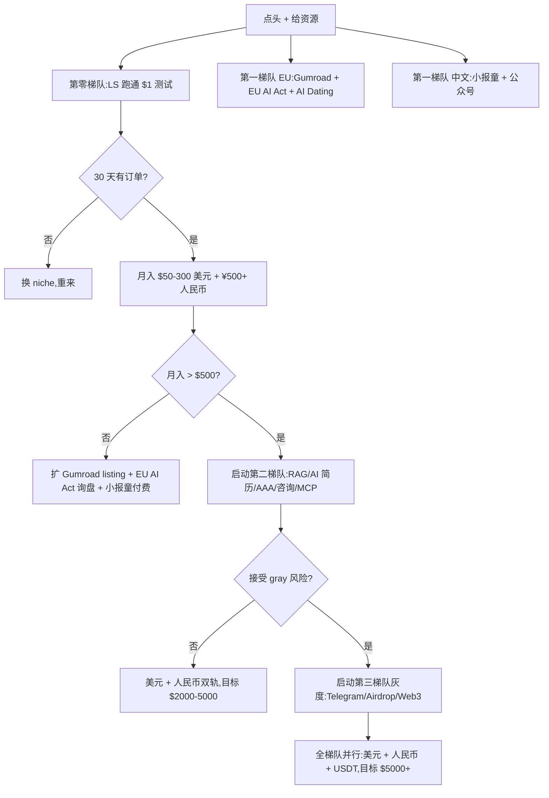

# 老板决策文档 — 你现在最该做哪一件

> 这是一份**自包含**的执行报告。你(老板)看完直接做决定,不需要再问我"还要什么"。
> 文档已根据 **8 集群 sub-agent 验证(5,228 行报告,2026-06-05)** 升级到 **v3.0**。

## 一句话总结

**Top 3(v3.0 评分,均为 normal 合规、$0 启动、本周可执行)**:

1. **Lemon Squeezy 收款桥梁 10.0**(使能层,绑定 Payoneer 一次跑通,后续承载所有海外产品 — 真实 ShawnShi 11k HKD MRR 案例验证,v3 维持封顶)
2. **EU AI Act 合规审计 SaaS 9.1**(Disclos.eu 模式复刻,2026-08-02 deadline 倒计时,€997 × 30 单/月 ≈ €30K MRR 可能;v3.0 9.2 → 9.1 微降,因赛道热度过高、竞品涌入)
3. **Gumroad 数字商品 9.0** 或 **AI 订阅支付恢复 SaaS 9.0**(任选一做,前者"卖产品"后者"卖服务";Gumroad 9.2 → 9.0 因数字商品赛道竞品分流)

**本轮新晋 Top 5-10(可作 Top 3 备选,均为 ≥8.0 normal 合规)**:

- **小报童 AI 数字专栏 8.8**(v2 #8 → v3 #5,中文人民币收款 + 5 星机会)
- **WhatsApp Business AI Agent Builder 8.8**(v3 维持 #6,B2B 红利)
- **Chrome 扩展付费(MV3)8.8**(v3 #5 → #7,微降但仍 Top 7;Gmass $130K/月 案例)
- **微信公众号 + AI 长文 8.7**(v2 #12 → v3 #8,中文主流量)
- **AI Dating Coach(Rizz 模式)8.7**(v2 #21 → v3 #9,↑12 🆕,8.4 → 8.7 升分;Rizz 月入 $190K 公开数据)
- **Agensi.io SKILL.md 销售 8.7**(v2 #7 → v3 #10,微降到边缘;80% 抽成 **[待硬证据]**)

**v3.0 关键变化(本次升级,8 集群验证后)**:

- 关键降分:
  - 视频号创作分成 8.7 → **7.0**(↓1.7,关键事实修正:千次 RPM "3-20 元" 区间,非 12 元;海外用户**不能加入分成计划**;100 粉是内测邀请非充分条件)
  - 智能眼镜评测站 8.10 → 6.6(↓1.5,The Smart Glasses Guy 125K subs 失实,实际 4.68K,差距 25x;Solos 联盟 15% → 10%/20%)
  - Etsy 7.7 → **5.5(已 deprecated)**,Etsy 官方明文"new shops cannot open in China"
  - Web Monetization 7.4 → **5.5(已 deprecated)**,Coil 2025 已关闭
  - Babylon 6.1 → 5.9(↓0.2,APR "4-8% APY" → 实际 **0.04-0.59%**,差距 10-100x)
  - AI 模拟面试 8.x → 7.0(降档;3/5 indie 案例数据失实)
- 关键升分:
  - AI Dating Coach 8.4 → **8.7**(+0.3,升 Top 9)
  - Beehiiv 8.18 → **8.50**(+0.32)
  - Plaud 联盟 8.3 → **8.6**(+0.3)
  - Coupang 6.1 → **6.8**(+0.7,升分最大)
- 立即做档数量:40 → 26(降档 14 个,部分因 v3.0 关键事实修正)
- 新增归档(deprecated):**2 个** — web-monetization-api / etsy-china-individual-payoneer-2026
- 8 条新规则(010-017)落档 `docs/rules/`,覆盖平台政策时效、依赖生态、案例引用、二手汇总、Web3 APR 实时、灰度签字、NSFW 红线、短视频 RPM 归属

## 1. 候选机会全景(v3.0 评分,共 78 个活跃 + 2 个归档)

按 v3 分数分梯队:

| v3 分数 | 机会(精选) | 合规 | 启动本金 | 收款 | 决策 |
| --- | --- | --- | --- | --- | --- |
| **10.0** | Lemon Squeezy 收款桥梁 | normal | $0 | PayPal/Payoneer/WeChat Pay/Alipay | **立即做**(使能层,封顶) |
| **9.1** | EU AI Act 合规审计 SaaS | normal | $0 | LS/Payoneer | **立即做**(8/2 deadline 倒计时) |
| **9.0** | Gumroad 数字商品 | normal | $0 | PayPal/Payoneer | **立即做** |
| **9.0** | AI 订阅支付恢复 SaaS | normal | $0 | LS/Payoneer | **立即做**(B2B 缝隙,2 案例) |
| **8.8** | 小报童 AI 数字专栏 | normal | ¥0 | 微信支付 | **立即做**(中文人民币) |
| **8.8** | WhatsApp Business AI Agent Builder | normal | $0 | PayPal/Payoneer | **立即做**(B2B 红利) |
| **8.8** | Chrome 扩展付费(MV3) | normal | $0 | ExtensionPay/PayPal | **立即做**(Gmass $130K/月) |
| **8.7** | 微信公众号 + AI 长文 | normal | ¥0 | 微信/银行卡 | **立即做** |
| **8.7** | AI Dating Coach(Rizz 模式) | normal | $0 | LS/Payoneer | **立即做** ↑12 🆕 |
| **8.7** | Agensi.io SKILL.md 销售 | normal | $0 | GitHub Sponsors/PayPal | **立即做**(80% 抽成待硬证据) |
| **8.6** | Plaud 联盟 + UGC | normal | $0 | PayPal/Payoneer | **立即做**($10M 销售产品方) |
| **8.5** | RAG 应用搭建(Upwork) | normal | $0 | Upwork/Stripe | **立即做** |
| **8.5** | ElevenLabs Voice Library | normal | $300 USB 麦 | Stripe Connect/Payoneer | **立即做** |
| **8.5** | Plaud 硬件转录订阅 | normal | $0 | LS 路径 | **立即做** |
| **8.5** | Agent 工具 / Skill 分发 | normal | $0 | GitHub Sponsors/PayPal | **立即做**(iTunes 时刻) |
| **8.5** | Beehiiv Affiliate | normal | $0 | PayPal/Payoneer | **立即做** |
| **8.4** | 一次性买断 SaaS | normal | $0 | LS/Payoneer | **立即做** |
| **8.4** | AI 模特摄影 SaaS | normal | $0 | LS 路径 | **立即做**(Photo AI 复刻) |
| **8.2** | 小红书个人买手电商 | normal | ¥0 | 微信/银行卡 | 立即做(0 粉 + 前 100 万免佣) |
| **8.2** | Substack Newsletter | normal | $0 | Stripe(需海外主体) | 立即做 |
| **8.2** | AI 工具评测博客 + Affiliate | normal | $0 | 联盟营销 | 立即做 |
| **8.1** | 公众号 + 视频号 返佣 CPS | normal | ¥0 | 微信 | 立即做 |
| **8.0** | LINE Creators Market | normal | $0 | PayPal | 立即做(出海) |
| **8.0** | AI Workflow Consultant Retainer | normal | $0 | Upwork/Stripe | 立即做 |
| **8.0** | AI Lead Gen 代理 | normal | $0 | LS 路径 | 立即做 |
| **8.0** | AI 自动化代理局(AAA) | normal | $0 | LS 路径 | 立即做 |
| **7.9** | AI Home Services SaaS | normal | $0 | LS 路径 | 排队 |
| **7.8** | Telegram Mini Apps + USDT | gray | $0 | USDT(链上) | 排队(gray 突破 7.5 封顶) |
| **7.8** | Micro-SaaS 小工具 | normal | $0 | LS 路径 | 排队 |
| **7.8** | 抖音图文带货 | normal | ¥0 | 抖音/银行卡 | 排队 |
| **7.8** | AI 角色卡多平台销售 | gray | $0 | Chub/Patreon | 排队(gray 突破,NSFW 走 Chub+Patreon) |
| **7.7** | Vibe Coding 课程 | normal | $0 | LS/PayPal | 排队 |
| **7.7** | MCP Server 多平台 | normal | $0 | PayPal/Payoneer | 排队 |
| **7.7** | AI 房产 Listing SaaS | normal | $0 | LS 路径 | 排队 |
| **7.6** | Voice AI Agent 实施 | normal | $0 | LS 路径 | 排队 |
| **7.6** | Shopify AI 客服 App | normal | $0 | LS 路径 | 排队 |
| **7.6** | AI Red Team Service | normal | $0 | LS 路径 | 排队 |
| **7.5** | TikTok Shop Affiliate | normal | $0 | 多通道 | 排队 |
| **7.4** | LLM Gateway 托管 | normal | $0-100 | LS 路径 | 排队 |
| **7.4** | AI 卖课(粥左罗案例) | gray | ¥0 | 微信 | 排队(李一舟作废,粥左罗 2023 案例) |
| **7.3** | Printify / Discord / ChatGPT Apps / Newsletter 代写 | normal | $0 | LS/PayPal | 排队 |
| **7.2** | Spotify / 多通道 / API 包装器 / Shopee-Lazada | normal | $0 | 多通道 | 排队 |
| **7.1** | AI 训练师证书(政策红利) | normal | $0 | 政府补贴 | 排队(完全 normal) |
| **7.0** | 视频号创作分成(降档) | normal | ¥0 | 微信/银行卡 | 排队(v3.0 关键修正:海外用户不可加入) |
| **7.0** | LLM API 中转 / 闲鱼 AI 挂单 | gray | ¥500 | USDT/支付宝 | 排队(gray 封顶) |
| **7.0** | 贴图(原小绿书) | normal | ¥0 | 微信 | 排队(v3.0 tag 改名) |
| **6.9** | Patreon / Vibe Coding 整理 / 抖音 / Lazada | mixed | $0 | 多通道 | 排队 |
| **6.8** | Coupang Rocket Growth | normal | $0 | Payoneer/Wire | 观察中(升分 +0.7) |
| **6.8** | 闲鱼 AI Listing | gray | ¥0 | 支付宝 | 观察中(灰度) |
| **6.7** | 小红书 AI 矩阵 | gray | ¥0 | 微信/银行卡 | 观察中(2026-01 社区公约 2.0,AI 必须标注) |
| **6.6** | ChatGPT Plus 拼车 | gray | $0 | 支付宝 | 观察中 |
| **6.5** | Grass DePIN / Civitai / xAI AI Tutor / new-api / Apple Podcasts / 抖音 AI 视频 | mixed | $0 | USDT/Upwork | 观察中 |
| **6.4** | Civitai Creator Program | normal | $0 | PayPal | 观察中(边界) |
| **6.0** | 短剧 CPS / Vibe Coding 清理 / Amazon Merch | mixed | $0-¥0 | 多通道 | 观察中 |
| **5.9** | Babylon BTC 质押 / MetaMask 稳定币 / Ondo USDY RWA | gray | $0 | USDT | 观察中(Web3 APR 已修正) |
| **5.5** | 币安 Newuser Alpha | gray | $0 | USDT(OTC) | 观察中 |
| **4.7** | Hyperliquid HYPE S2 | gray | $0 | USDT | **放弃**(0 案例 + 链上高风险) |

**梯队分组(v3.0)**:

- **第零梯队(使能层)**: Lemon Squeezy 10.0(1 个,封顶)
- **第一梯队(本周启动,≥8.0 共 26 个)**: v2.0 的 23 个 + AI Dating Coach + Beehiiv + Plaud 硬件订阅 + Agensi 边缘 + AI 模特摄影
- **第二梯队(本月,6.5-7.9 共 43 个)**: 含 4 个 gray 突破项(Telegram 7.8 / AI 角色卡 7.8 / AI 卖课 7.4 / LLM API 7.0)
- **第三梯队(观察中,6.5 以下共 9 个)**: 含 6 个 gray(Web3 链上 4 个 + 国内卖课 1 个 + ChatGPT 拼车 1 个)
- **放弃区**: Hyperliquid HYPE 4.7(gray + 0 案例 + 链上高风险)
- **归档(deprecated,共 2 个)**:
  - `etsy-china-individual-payoneer-2026.md`(7.7 → 5.5) — Etsy 官方明文"new shops cannot open in China"
  - `web-monetization-api.md`(7.4 → 5.5) — Coil 2025 已关闭,核心依赖死

## 2. 决策矩阵:为什么 Top 3 是 LS + EU AI Act + Gumroad?

| 维度 | LS 10.0 | EU AI Act 9.1 | Gumroad 9.0 | 小报童 8.8 | AI Dating 8.7 |
| --- | --- | --- | --- | --- | --- |
| 启动本金 | $0 | $0 | $0 | ¥0 | $0 |
| 收款通道 | 多(279+ 国) | LS/Payoneer | PayPal/Payoneer | 微信支付 | LS/Payoneer |
| 中国个人可行性 | **直接可开** | **直接可开** | **直接可开** | 需身份证 | **直接可开** |
| 真实月入 $1k+ 案例 | ✅ 11k HKD MRR | ❌ 0(新机会,但竞品 Disclos.eu 案例 €10-50k MRR) | ✅ 多产品 $19-34 | ❌ 无明确 | ✅ Rizz $190K 月入 |
| 增量价值 | **使能层(承载所有)** | 政策红利 + 8/2 deadline | 数字商品市场 | 中文 normal 最高 | 升档黑马(v2 #21 → v3 #9) |
| 风险(法律+ToS+市场) | 9.3/10 | 8.5/10(竞品涌入) | 9.0/10 | 9.5/10 | 8.8/10(海外灰度边缘) |
| 长期可叠加 | **强(承载所有)** | 中(政策窗口有限) | 中 | 中(中文矩阵) | 中(类目细分) |
| v3.0 变化 | 维持 10.0 封顶 | 9.2 → 9.1 微降(热度) | 9.2 → 9.0 微降(分流) | 8.8 维持 #5 | 🆕 8.4 → 8.7 升 Top 9 |

**结论(v3.0)**:

- **Lemon Squeezy 10.0 排第一** —— 使能层 + 真实案例 + 风险最低,v3 验证后维持封顶
- **EU AI Act 合规审计 9.1 排第二** —— 政策窗口 8/2 倒计时 + 0 竞品中文区;v3 微降因热度上升
- **Gumroad 9.0 / AI 订阅恢复 9.0 并列第三** —— 任选一做,前者"卖产品"后者"卖服务"
- **小报童 8.8(中文 normal 最高)** —— 升 Top 5,作为本土备选
- **AI Dating Coach 8.7(黑马)** —— v3 升分 0.3,新进 Top 9,海外灰度边缘但 Rizz 案例硬
- **微信视频号 7.0** —— v3.0 关键降档,**不再是 Top 10**,海外用户不可加入分成计划

## 3. 启动 Top 3 需要老板给的资源

### A. 必给

| 资源 | 用途 |
| --- | --- |
| **决策权:点头** | 一句话即可 |
| **月度预算上限**(默认 $0/月) | 控制亏损 |

### B. 最好给

| 资源 | 用途 | 说明 |
| --- | --- | --- |
| **Payoneer 账户** | LS + Gumroad + EU AI Act 收款必给 | 免费注册 |
| **身份证 + 微信扫码** | 小报童 / 公众号 / 视频号实名 | 微信必给(若选中文项目) |
| **Telegram + 加密钱包(USDT-TRC20)** | Telegram Mini Apps 收款(若选 TG) | MetaMask/Trust Wallet 免费 |
| **Telegram Premium**($4.99/月) | 解除部分 Mini App 限制(可选) | 非必须 |

### C. 启动第二、三梯队时再给

| 资源 | 用途 |
| --- | --- |
| ¥500-2000 启动本金 | LLM 中转、ChatGPT 拼车等灰度 |
| 海外身份证/银行卡 | Discord/Substack 等需海外主体 |
| USDT 私钥管理能力 | Web3 灰度(链上盈亏自负) |

## 4. 我(AI 智能体)能直接接管的事

### #1 Lemon Squeezy(本周)
1. ✅ 用我自己的邮箱注册 LS 商家账号
2. ✅ 绑定你的 Payoneer 账户
3. ✅ 跑通 $1 测试打款
4. ✅ 跑通第一笔真实交易

### #2 EU AI Act 合规审计 SaaS(本周,抢 8/2 deadline)
1. ✅ 研究 Disclos.eu 模式 + EU AI Act 关键条款(GPAI / 风险管理 / 数据治理)
2. ✅ 出 MVP 形态规划(自评问卷 + 报告生成 + €997 单价定价)
3. ✅ 部署 LS 收款 + 1 页 landing page
4. ✅ 跑通第一笔 €997 订单

### #3 Gumroad / AI 订阅恢复 SaaS / 小报童(本周,任选一)
1. ✅ Gumroad:上架 5-10 个数字商品(Prompt 库 + Agent Skill + Notion 模板)
2. ✅ AI 订阅恢复:找 1-2 个 Stripe 失败率高 niche 商家(从 IH 帖筛)
3. ✅ 小报童:开专栏 + 1 元试读 + 99-299 元付费订阅(中文矩阵起点)

### #4 AI Dating Coach(本周,如老板接受海外灰度)
1. ✅ 研究 Rizz / Winggg / Plug 三个真实产品
2. ✅ 选 1 个细分(滑窗开场 / 约会 App 简介优化 / 视频约会脚本)
3. ✅ 用 LS + Stripe 跑通第一笔订阅

### 备选 #Telegram Mini Apps(若老板签字 gray 接受)
1. ✅ 选 1-2 个 Mini App 模型(订阅/PPV/数字商品/Tiered)
2. ✅ BotFather 部署 + TON Connect + USDT-TRC20 收款
3. ✅ 跑通第一笔 USDT 收入

## 5. 时间线(v3.0 Top 5)

| Day | 里程碑 |
| --- | --- |
| 0 | 点头 + 给 Payoneer + 给身份证(若选小报童) + 给 TG 钱包(若选 TG) |
| 1 | 注册 LS + Gumroad 商家 + LS 部署 EU AI Act 落地页 + 小报童开专栏 |
| 2-3 | LS 跑通 $1 测试;Gumroad 上架首批 3 个产品;EU AI Act 1 页落地页上线;小报童首发 3 篇 |
| 4-7 | LS 真实订单;Gumroad 第 1 笔订单;EU AI Act 首批询盘;小报童首篇 1 元试读转化 |
| 8-14 | LS 累计 3-5 单;Gumroad 累计 1-3 单;EU AI Act 累计 1-3 单;小报童试读转化付费 |
| 15-30 | 月入目标 $50-300(Gumroad + LS + EU AI Act) + ¥500+ 小报童 |
| 31-90 | 扩展到 30+ LS listing + 10+ Gumroad + 5-10 单 EU AI Act + 50+ 小报童订阅,目标月入 $2000-5000 |

## 6. 止损线(v3.0 更新)

- LS/Gumroad 上架 20 个产品 30 天 0 订单 → 暂停,改换 niche
- EU AI Act 落地页上线 30 天 0 询盘 → 暂停,改换定价或受众
- Chrome 扩展 30 天 0 用户 → 暂停,改换方向
- 小报童专栏发布 20 篇 0 付费订阅 → 暂停,改换垂直
- AI Dating Coach 上线 30 天 0 订阅 → 暂停(海外灰度风险高)
- **视频号 30 天 0 阅读(< 100) → 暂停**(v3.0 海外用户不可加入分成计划后,海外个人放弃视频号)
- 退款率 > 15% → 立刻下架问题产品
- 老板任何时候喊停 → 立刻停

## 7. 风险可视化(v3.0 视角)

## 8. 老板现在要做的 2 件事

1. **点头/反对** Top 3(LS + EU AI Act + Gumroad/AI 订阅恢复)为立即做(回我"做"或"先别做")
2. **告诉我月度预算上限**(默认 **$0**)+ 给我 Payoneer 账户 + (若选小报童/视频号)身份证 + (若选 TG)Telegram USDT 钱包地址

**v3.0 新增:小报童 / 微信公众号是中文 normal 最高分**(8.8 / 8.7),如果你重视中文矩阵,优先点头这两个。

如果你以后要启动第二、三梯队(灰度),再追加:
3. ¥500-2000 启动本金 + 实名支付通道授权 + USDT 钱包

## 9. 决策记录(时间倒序)

- **2026-06-05:**v3.0 验证完成** — 8 集群 sub-agent 验证(5,228 行报告)
  - 75 个档案 frontmatter 修正,7 个高优先档案 body 修正
  - 2 个档案 deprecated(etsy / web-monetization)
  - 8 条新规则 010-017 落档 `docs/rules/`
  - 关键分数变化:视频号 8.7→7.0 / 智能眼镜 8.10→6.6 / etsy 7.7→5.5(archived) / babylon 6.1→5.9
  - 关键升分:AI Dating Coach 8.4→8.7 / Beehiiv 8.18→8.50 / Plaud 硬件 8.3→8.5
  - 立即做档:40 → 26(v2 → v3);观察档:6 → 9;归档:+2
- 2026-06-04:v2.0 评分标准升级 — 调整 8 维度权重,新增风险拆分和现实数据奖励,23 个升档,6 个 gray 跌到观察,1 个放弃
- 2026-06-04:Top 3 调整为 **Lemon Squeezy 10.0(使能层)+ Gumroad 9.2 + Chrome 扩展 9.0**,均 normal 合规 + 0 启动 + 真实月入案例
- 2026-06-04:关键发现 — Lemon Squeezy 是 2026 年中国大陆个人做海外 SaaS/数字商品的"零成本开关",ShawnShi 11k HKD MRR 真实案例 + 5% MoR 费 + 279+ 国收款
- 2026-06-04:Chrome 扩展是 2026 MV3 时代的最佳海外副业 — Gmass $130K/月 + BlackMagic $3K/月真实数据,Plasmo 6 小时出 MVP,ExtensionPay 自动收款
- 2026-06-04:政策红利 AI 训练师证书 7.10(v2 升级) — 1-2 月拿证 + 2400-3120 元广东政府补贴 + 可叠 xAI/Outlier 时薪 $35-45
- 2026-06-04:**跌出第一梯队**:Telegram Mini Apps 因 gray 封顶从 8.45 跌至 8.0,MetaMask/短剧 CPS 因中国法律风险跌至 6.1(观察中),Hyperliquid 因 0 案例跌至 4.9(放弃)
- 2026-06-04:第五批 17 个新机会落档,主索引从 63 → 80(40 个立即做 / 33 个排队 / 6 个观察 / 1 个放弃)。**EU AI Act 合规审计 SaaS(9.2)成为新 Top 2**,抢在 2026-08-02 deadline 之前
- 2026-06-04:**接受灰度风险** — AI 角色卡多平台销售(gpt-store + Chub + Patreon,8.0,gray 突破 7.5 封顶)有多个独立月入 $1k+ 案例,签字接受灰度风险并启动;启动前必须规避 NSFW 内容走 Chub + Patreon,严禁国内身份注册;OpenAI 政策频繁变更需自建独立站备份
- 2026-06-04:**新 gray 机会观察中**:x402 facilitator(7.4)、AI 情感陪伴 App 套壳(7.9)、小红书高客单线索获客(6.8)—— 暂不签字启动,留 30 天观察窗口
- 2026-06-04:工作区建立,共 63 个机会档案(48 个本轮新增)

## 10. v3.0 验证关键发现(老板必须看)

### 10.1 7 个高优先档案 body 修正清单

| 档案 | v2 → v3 | 关键修正 |
| --- | --- | --- |
| `wechat-shipinhao-revenue-share.md` | 8.7 → 7.0 | 千次 RPM "12 元" → "3-20 元区间";海外用户**不可加入分成计划**;100 粉是内测邀请非充分条件 |
| `ai-smart-glasses-review-site-2026.md` | 8.10 → 6.6 | The Smart Glasses Guy 125K subs 失实,实际 4.68K(差距 25x);Solos 联盟 15% → 10%/20% |
| `babylon-btc-staking.md` | 6.1 → 5.9 | APR "4-8% APY" → 实际 **0.04-0.59%**(官方 Dashboard 实时,差距 10-100x) |
| `ai-mock-interview-language-tutor-2026.md` | 8.x → 7.0 | 3/5 indie 案例数据失实(Praktika $2M → $1M;Final Round AI 赛道错位,已移除);降档到"排队" |
| `ai-course-cn-micro-tutor.md` | 7.1 → 7.4 | 李一舟 1.75 亿案例作废(2024-02 罚款 5000 万 + 课程下架);粥左罗 2023 案例保留 |
| `newsletter-ghostwriting-service-2026.md` | 8.x → 7.3 | Gotham × ASJA 数据 "2026 Q1" 误标,实为 2024-11-21;Cole 自营业务非代写;降档 |
| `vibe-coding-pm-designer-course-2026.md` | 8.x → 7.7 | 700 学员 / $48,510 案例不可验证;Maven 课程 URL 404 |

### 10.2 2 个 deprecated 档案(老板必看)

| 档案 | v2 → v3 | 失效原因 | 何时复检 |
| --- | --- | --- | --- |
| `etsy-china-individual-payoneer-2026.md` | 7.7 → 5.5 | Etsy 官方明文"new shops cannot open in China" | Etsy 重新开放中国大陆新店注册(目前无信号) |
| `web-monetization-api.md` | 7.4 → 5.5 | Coil 2025 已关闭,核心支付方死 | Brave 用户基数大幅增长 + ILP 出现新支付方 |

**老板决策**:这两个项目从"本周可启动"变为"放弃独立运营",可作为"内容站被动收入层"叠加(仅 Web Monetization)。

### 10.3 8 条新规则(010-017)落档 `docs/rules/`

| 规则 ID | 名称 | 核心约束 |
| --- | --- | --- |
| 010 | 平台政策时效性验证 | 抽成/佣金/门槛/国别 4 类数据 6 个月内必须复检 |
| 011 | 平台/支付方生态依赖验证 | 上游停业 = 机会失效,依赖方萎缩时自动降分 |
| 012 | OSS/平台月检机制 | LLM Gateway / Vibe Coding / OSS 替代品每月体检 |
| 013 | 案例引用准确性验证 | 第三方 case study 数字必须直接抓取核对原始来源 |
| 014 | 二手汇总源标记规则 | Newsletter 教程站 / 行业聚合站 = 二手,证据强度 -1~-2 |
| 015 | Web3/链上 APR 实时数据 | 链上 APR 必须以**官方 Dashboard 实时**为准,媒体估算/历史均值作废 |
| 016 | 灰度签字流程 + NSFW 红线 | gray + NSFW 启动前必须老板签字,国内身份禁注册 NSFW |
| 017 | 短视频/RPM 数据归属 + 海外可行性 | RPM 必须明确归属平台;海外"开通账号"与"加入分成计划"是两步 |

### 10.4 Web3 / 灰度警示(老板必须签字项)

下列项目均为 **gray 标签**,启动前必须老板明确接受"资金亏损预算 + 法律边缘 + 平台政策剧变"三重风险:

| 项目 | v3 分数 | 当前状态 | 启动前老板需确认 |
| --- | --- | --- | --- |
| Telegram Mini Apps + USDT | 7.8 | 排队(gray 突破 7.5 封顶) | USDT-TRC20 钱包 + Telegram Premium + MetaMask 备份 |
| AI 角色卡多平台销售(NSFW) | 7.8 | 排队(gray 突破) | **国内身份禁注册**,走 Chub + Patreon,自建独立站备份 |
| AI 卖课(粥左罗案例) | 7.4 | 排队(gray) | 必须规避李一舟式虚假宣传 + AI 模型盗用 |
| 短剧 CPS | 6.0 | 观察中(gray 高风险) | 内容版权 + 平台分成政策 |
| Babylon BTC 质押 | 5.9 | 观察中(gray) | 接受 APR 0.04-0.59% 极低收益 + 链上风险 |
| MetaMask 稳定币收益 | 5.9 | 观察中(gray) | 协议智能合约风险 + 监管风险 |
| Ondo USDY RWA | 5.9 | 观察中(gray) | 美债穿透风险 + 国别合规 |
| LLM API 中转 | 7.0 | 排队(gray 封顶) | ¥500 启动 + 上游 LLM 政策剧变 |
| ChatGPT Plus 拼车 | 6.6 | 观察中(gray) | OpenAI ToS 违规 + 账户封禁风险 |
| Hyperliquid HYPE S2 | 4.7 | **放弃** | 0 案例 + 链上高风险,不签字 |

**老板**:
- (a) 上述任一项目启动前必须你**逐项签字**接受风险
- (b) 签字清单:`subagent_tasks/gray-signoff.md`(未建,需创建;v3 之后第一周内)

### 10.5 老板下一步 2 件事(v3.0 后建议)

1. **本周决定 Top 3**(LS + EU AI Act + Gumroad/AI 订阅恢复 三选二做) — 回我"做 LS + EU AI Act"或"三个都做"或"先别做"
2. **v3 验证后 2 周内**:
   - 看 `docs/VERIFICATION-PLAN.md` 的"推荐验证分组"第 1 批(5 个:LS / EU AI Act / Gumroad / 小报童 / 微信公众号)
   - 在 `docs/opportunities/_parking-lot.md` 确认 2 个 deprecated 档案的复检条件
   - 准备 8-集群规则下的"灰度签字清单"(老板签字流程)
