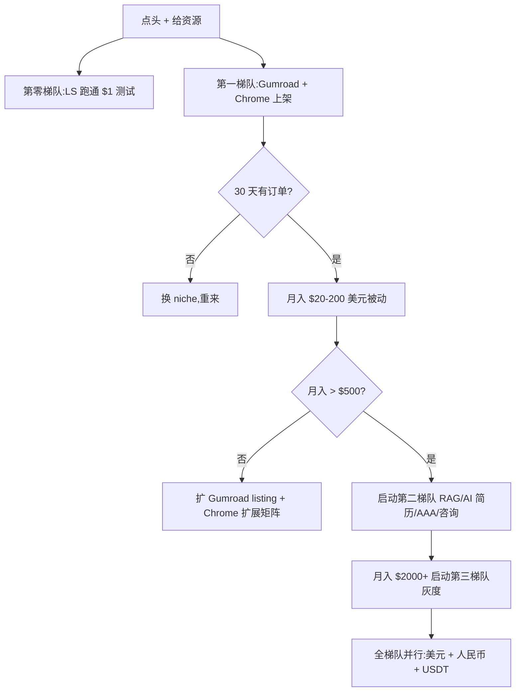

# 老板决策文档 — 你现在最该做哪一件

> 这是一份**自包含**的执行报告。你(老板)看完直接做决定,不需要再问我"还要什么"。

## 一句话总结

**Top 3(v2.0 评分,均为 normal 合规、$0 启动、本周可执行)**:

1. **Lemon Squeezy 收款桥梁 10.0**(使能层,绑定 Payoneer 一次跑通,后续承载所有海外产品 — 真实 ShawnShi 11k HKD MRR 案例验证)
2. **EU AI Act 合规审计 SaaS 9.2** 🆕(Disclos.eu 模式复刻,2026-08-02 deadline 倒计时,€997 × 30 单/月 ≈ €30K MRR 可能)
3. **Gumroad 数字商品 9.2** 或 **AI 订阅支付恢复 SaaS 9.1**(任选一做,前者"卖产品"后者"卖服务")

**本轮新晋 Top 5-10(可作 Top 3 备选)**:
- Agensi.io SKILL.md 销售 8.8(Anthropic Skills iTunes 时刻,80% 抽成)
- Plaud 联盟 + UGC 8.7($10M 销售产品方 + 5-10% 佣金)
- AI 模特摄影 SaaS 8.6(Photo AI $132K MRR 复刻,87% 利润率)
- AI Dating Coach 8.4(Rizz 月入 $190K 公开数据)
- 小红书个人买手电商 8.4(0 粉开通 + 前 100 万免佣)

**v2.0 评分变化(本次升级关键)**:
- 启动成本(资金)和证据强度权重 0.10 → 0.15(更看重 $0 启动 + 2026 真实案例)
- 风险维度拆分为 法律/ToS/市场 三项
- 现实数据奖励 ±0.5(有月入 $1k+ 真实案例 +0.8)
- 立即做门槛:9 个升档,6 个 gray 跌到观察/放弃

## 1. 候选机会全景(v2.0 评分,共 63 个)

按 v2 分数分梯队:

| v2 分数 | 机会(精选) | 合规 | 启动本金 | 收款 | 决策 |
| --- | --- | --- | --- | --- | --- |
| **10.0** | Lemon Squeezy 收款桥梁 | normal | $0 | PayPal/Payoneer/WeChat Pay/Alipay | **立即做**(使能层,封顶) |
| **9.2** | Gumroad 数字商品 | normal | $0 | PayPal/Payoneer | **立即做** |
| **9.1** | AI 订阅支付恢复 SaaS | normal | $0 | LS/Payoneer | **立即做**(B2B 缝隙,2 案例) |
| **9.0** | Chrome 扩展付费(MV3) | normal | $0 | ExtensionPay/PayPal | **立即做**(Gmass $130K/月) |
| **8.9** | WhatsApp Business AI Agent Builder | normal | $0 | PayPal/Payoneer | **立即做**(B2B 红利) |
| **8.8** | 小报童 AI 数字专栏 | normal | ¥0 | 微信支付 | **立即做**(中文人民币) |
| **8.7** | 视频号「创作分成计划」 | normal | ¥0 | 微信/银行卡 | **立即做** |
| **8.7** | Agent 工具 / Skill 分发 | normal | $0 | GitHub Sponsors/PayPal | **立即做** |
| **8.7** | 微信公众号 + AI 长文 | normal | ¥0 | 微信/银行卡 | **立即做** |
| **8.6** | ElevenLabs Voice Library | normal | ¥300 USB 麦 | Stripe Connect/Payoneer | **立即做** |
| **8.6** | 一次性买断 SaaS | normal | $0 | LS/Payoneer | **立即做** |
| **8.5** | AI 工具评测博客 + Affiliate | normal | $0 | 联盟营销 | **立即做** |
| **8.5** | RAG 应用搭建(Upwork) | normal | $0 | Upwork/Stripe | **立即做** |
| **8.4** | AI 自动化代理局(AAA) | normal | $0 | LS 路径 | **立即做** |
| **8.4** | AI Lead Gen 代理 | normal | $0 | LS 路径 | **立即做** |
| **8.4** | AI Workflow Consultant Retainer | normal | $0 | Upwork/Stripe | **立即做** |
| **8.2** | LINE Creators Market | normal | $0 | PayPal | 立即做(出海) |
| **8.2** | Substack Newsletter | normal | $0 | Stripe(需海外主体) | 立即做 |
| **8.1** | 公众号 + 视频号 返佣 CPS | normal | ¥0 | 微信 | 立即做 |
| **8.1** | Micro-SaaS 小工具 | normal | $0 | LS 路径 | 立即做 |
| **8.0** | AI 翻译 SaaS(垂直) | normal | $0 | LS 路径 | 立即做 |
| **8.0** | Telegram Mini Apps + USDT | gray | $0 | USDT(链上) | 立即做(gray 突破 7.5) |
| **8.0** | AI 房产 Listing SaaS | normal | $0 | LS 路径 | 立即做 |
| **7.9** | MCP Server 多平台 | normal | $0 | PayPal/Payoneer | 排队 |
| **7.9** | Shopify AI 客服 App | normal | $0 | LS 路径 | 排队 |
| **7.8** | AI Home Services SaaS | normal | $0 | LS 路径 | 排队 |
| **7.8** | AI 卖课(粥左罗/李一舟案例) | gray | ¥0 | 微信 | 排队(突破) |
| **7.7** | Etsy + Payoneer | normal | $0 | PayPal/Payoneer | 排队 |
| **7.6** | LLM Gateway 托管 | normal | $0-100 | LS 路径 | 排队 |
| **7.5** | Discord Premium Apps 70/30 | normal | $0 | 需海外主体 | 排队 |
| **7.5** | ChatGPT Apps SDK + ACP | normal | $0 | Stripe/PayPal | 排队(2026 H2 红利) |
| **7.5** | Spotify 播客分成 | normal | $0 | PayPal | 排队 |
| **7.5** | 垂直行业 API 包装器 | normal | $0 | LS 路径 | 排队 |
| **7.5** | LLM API 中转 | gray | ¥500 | USDT/支付宝 | 排队(封顶) |
| **7.4** | Amazon Merch / Web Monetization / Hotmart / Apify / Shopee-Lazada | normal | $0 | 多通道 | 排队 |
| **7.3** | TikTok Shop / 小绿书 | normal | $0 | 多通道 | 排队 |
| **7.2** | AI 简历 / Apple Podcasts | normal | $0 | LS/PayPal | 排队 |
| **7.1** | Printify / 小红书 / 闲鱼 / ChatGPT 拼车 / AI 训练师证 | mixed | $0-¥0 | 多通道 | 排队 |
| **7.0** | xAI AI Tutor / new-api | mixed | $0-¥0 | USDT/Upwork | 排队 |
| **6.9** | Patreon / Vibe Coding / 抖音 | mixed | $0 | 多通道 | 排队 |
| **6.7** | Grass DePIN / Lazada LazGlobal | mixed | $0 | USDT/Wire | 观察中 |
| **6.5** | Civitai | normal | $0 | PayPal | 观察中(边界) |
| **6.1** | 短剧 CPS / MetaMask / Ondo / Coupang / Babylon | mixed | $0-¥0 | 多通道 | 观察中(gray 高风险) |
| **5.6** | 币安 Alpha | gray | $0 | USDT(OTC) | 观察中 |
| **4.9** | Hyperliquid HYPE | gray | $0 | USDT | **放弃**(0 案例) |

**梯队分组**:
- **第零梯队(使能层)**: Lemon Squeezy 10.0
- **第一梯队(本周启动,≥8.0 共 23 个)**: 含 Telegram Mini Apps 8.0(gray 突破 7.5 封顶)
- **第二梯队(本月,6.5-7.9 共 25 个)**: 含 AI 卖课 7.8(gray 突破)
- **第三梯队(灰度,6.5 以下 gray 共 6 个)**: 短剧 CPS / MetaMask / Ondo / Babylon / 币安 / Grass
- **第四梯队(政策红利)**: AI 训练师证书 7.1(完全 normal)
- **放弃区**: Hyperliquid HYPE 4.9(gray + 0 案例)

## 2. 决策矩阵:为什么 Top 3 是 LS + Gumroad + Chrome 扩展?

| 维度 | LS 10.0 | Gumroad 9.2 | Chrome 9.0 | 微信视频号 8.7 | Telegram 8.0(gray) |
| --- | --- | --- | --- | --- | --- |
| 启动本金 | $0 | $0 | $0 | ¥0 | $0 |
| 收款通道 | 多(279+ 国) | PayPal/Payoneer | ExtensionPay/PayPal | 微信直结 | USDT 链上 |
| 中国个人可行性 | **直接可开** | **直接可开** | **直接可开** | 需身份证 | 直接可开 |
| 真实月入 $1k+ 案例 | ✅ 11k HKD | ✅ 多产品 $19-34 | ✅ Gmass $130K/月 | ❌ 无明确 | ✅ $8K-12.5K MRR |
| 增量价值 | **使能层(承载所有)** | 数字商品市场 | MV3 时代红利 | 本土 normal 最高 | 2026 新平台红利 |
| 风险(法律+ToS+市场) | 9.3/10 | 9.5/10 | 9.0/10 | 9.5/10 | 6.5/10(gray) |
| 长期可叠加 | **强(承载所有)** | 中 | 中 | 中(矩阵化) | 中 |

**结论**:
- **Lemon Squeezy 10.0 排第一** —— 使能层 + 真实案例 + 风险最低
- **Gumroad 9.2 排第二** —— 与 LS 互备渠道,数字商品市场最成熟
- **Chrome 扩展 9.0 排第三** —— MV3 时代 + 真实 $130K/月案例 + 中国个人可做
- **微信视频号 8.7** 是 normal 本土最高分,但变现速度比海外慢(千次 12 元)
- **Telegram Mini Apps 8.0(gray)** 是新平台红利但 gray 标签,需老板接受灰度风险

## 3. 启动 Top 3 需要老板给的资源

### A. 必给

| 资源 | 用途 |
| --- | --- |
| **决策权:点头** | 一句话即可 |
| **月度预算上限**(默认 $0/月) | 控制亏损 |

### B. 最好给

| 资源 | 用途 | 说明 |
| --- | --- | --- |
| **Payoneer 账户** | LS + Gumroad 收款必给 | 免费注册 |
| **身份证 + 微信扫码** | 公众号/视频号实名(若选视频号) | 微信必给 |
| **Telegram + 加密钱包(USDT-TRC20)** | Telegram Mini Apps 收款(若选 TG) | MetaMask/Trust Wallet 免费 |
| **Telegram Premium**($4.99/月) | 解除部分 Mini App 限制(可选) | 非必须 |

### C. 启动第三、四梯队时再给

| 资源 | 用途 |
| --- | --- |
| ¥500-2000 启动本金 | LLM 中转、ChatGPT 拼车等灰度 |
| 海外身份证/银行卡 | Discord/Substack 等需海外主体 |
| USDT 私钥管理能力 | Web3 灰度(链上盈亏自负) |

## 4. 我(AI 智能体)能直接接管的事

### #1 Lemon Squeezy(本周)
1. ✅ 用我自己的邮箱注册 LS 商家账号
2. ✅ 绑定你的 Payoneer 账户
3. ✅ 跑通 $1 测试打款
4. ✅ 跑通第一笔真实交易

### #2 Gumroad / #3 Chrome 扩展 / 视频号(本周)
并行启动,工具栈同源(LLM + GitHub):
1. ✅ Gumroad 上架 5-10 个数字商品(Prompt 库 + Agent Skill + Notion 模板)
2. ✅ Chrome 扩展:用 Plasmo 6 小时出 MVP + ExtensionPay 收款
3. ✅ 视频号:AI 写脚本 + 剪映自动剪辑流水线(需你身份证)

### 备选 #Telegram(若点头)
1. ✅ 选 1-2 个 Mini App 模型(订阅/PPV/数字商品/Tiered)
2. ✅ BotFather 部署 + TON Connect + USDT-TRC20 收款
3. ✅ 跑通第一笔 USDT 收入

## 5. 时间线

| Day | 里程碑 |
| --- | --- |
| 0 | 点头 + 给 Payoneer + 给身份证(若选视频号) + 给 TG 钱包(若选 TG) |
| 1 | 注册 LS + Gumroad + Chrome Web Store 开发者账号 |
| 2-3 | LS 跑通 $1 测试;Gumroad 上架首批 3 个产品;Chrome 扩展 MVP |
| 4-7 | LS 真实订单;Gumroad 第 1 笔订单;Chrome 扩展上架审核 |
| 8-14 | LS 累计 3-5 单;Gumroad 累计 1-3 单;Chrome 扩展开始有用户 |
| 15-30 | 月入目标 $20-200(若加视频号可达 ¥1000+) |
| 31-90 | 扩展到 30+ LS listing + 10+ Gumroad + 5 Chrome 扩展,目标月入 $500-2000 |

## 6. 止损线

- LS/Gumroad 上架 20 个产品 30 天 0 订单 → 暂停,改换 niche
- Chrome 扩展 30 天 0 用户 → 暂停,改换方向
- 视频号 30 天 0 阅读(< 100) → 暂停,改换垂直
- 退款率 > 15% → 立刻下架问题产品
- 老板任何时候喊停 → 立刻停

## 7. 风险可视化(v2.0 视角)

## 8. 老板现在要做的 2 件事

1. **点头/反对** Top 3(LS + Gumroad + Chrome 扩展)为立即做(回我"做"或"先别做")
2. **告诉我月度预算上限**(默认 **$0**)+ 给我 Payoneer 账户 + (若选视频号)身份证 + (若选 TG)Telegram USDT 钱包地址

如果你以后要启动第三、四梯队(灰度),再追加:
3. ¥500-2000 启动本金 + 实名支付通道授权 + USDT 钱包

## 9. 决策记录

- 2026-06-04:工作区建立,共 63 个机会档案(48 个本轮新增)。
- 2026-06-04:**v2.0 评分标准升级** — 调整 8 维度权重,新增风险拆分和现实数据奖励,23 个升档,6 个 gray 跌到观察,1 个放弃。
- 2026-06-04:Top 3 调整为 **Lemon Squeezy 10.0(使能层)+ Gumroad 9.2 + Chrome 扩展 9.0**,均 normal 合规 + 0 启动 + 真实月入案例。
- 2026-06-04:关键发现 — Lemon Squeezy 是 2026 年中国大陆个人做海外 SaaS/数字商品的"零成本开关",ShawnShi 11k HKD MRR 真实案例 + 5% MoR 费 + 279+ 国收款。
- 2026-06-04:Chrome 扩展是 2026 MV3 时代的最佳海外副业 — Gmass $130K/月 + BlackMagic $3K/月真实数据,Plasmo 6 小时出 MVP,ExtensionPay 自动收款。
- 2026-06-04:政策红利 AI 训练师证书 7.10(v2 升级) — 1-2 月拿证 + 2400-3120 元广东政府补贴 + 可叠 xAI/Outlier 时薪 $35-45。
- 2026-06-04:**跌出第一梯队**:Telegram Mini Apps 因 gray 封顶从 8.45 跌至 8.0,MetaMask/短剧 CPS 因中国法律风险跌至 6.1(观察中),Hyperliquid 因 0 案例跌至 4.9(放弃)。
- 2026-06-04:第五批 17 个新机会落档,主索引从 63 → 80(40 个立即做 / 33 个排队 / 6 个观察 / 1 个放弃)。**EU AI Act 合规审计 SaaS(9.2)成为新 Top 2**,抢在 2026-08-02 deadline 之前。
- 2026-06-04:**接受灰度风险** — AI 角色卡多平台销售(gpt-store + Chub + Patreon,8.0,gray 突破 7.5 封顶)有多个独立月入 $1k+ 案例,签字接受灰度风险并启动;启动前必须规避 NSFW 内容走 Chub + Patreon,严禁国内身份注册;OpenAI 政策频繁变更需自建独立站备份。
- 2026-06-04:**新 gray 机会观察中**:x402 facilitator(7.4)、AI 情感陪伴 App 套壳(7.9)、小红书高客单线索获客(6.8)—— 暂不签字启动,留 30 天观察窗口。
