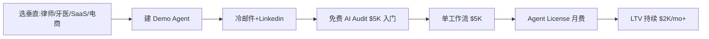

# AI 自动化代理局(AI Automation Agency, AAA)

## 一句话定位

为海外中小企业(SMB,员工 10-200 人)用 n8n / Make + LLM 搭建可重复使用的「AI Agent 工作流」,按 **Outcome-Based 单工作流 $3,000-5,000** 或 **Agent License $20K setup + $2K/mo** 收费,平台主推 Upwork/Fiverr/Linkedin,收款 PayPal/Payoneer/Stripe,目标单兵月入 $10K+。

## 自动化路径

工具栈:
- n8n / Make / Zapier(工作流编排)
- Claude / GPT-4o / DeepSeek(推理与生成)
- Voiceflow / Vapi / Retell(语音 AI Agent,海外需求强)
- Calendly / HubSpot / Airtable(目标客户系统集成)
- Stripe / PayPal / Payoneer(收款)
- Loom / Tella(交付演示与提案)

| # | 步骤 | 自动/人工 | 工具 |
| --- | --- | --- | --- |
| 1 | 选垂直 + 调研客户痛点 | 人工 | LinkedIn Sales Nav, Apollo |
| 2 | 用 n8n/Make 搭可复用的 Demo Agent | 半自动 | n8n, LLM, Voiceflow |
| 3 | 冷邮件 + LinkedIn Outreach(>100/天) | 半自动 | Instantly, Smartlead |
| 4 | 成交:$5K AI Audit → 转 $20K+ 项目 | 人工 | Calendly, Stripe |
| 5 | 交付 Agent + 文档 | 半自动 | Loom, GitHub |
| 6 | 转月费 License 模式 | 人工 | Stripe Subscriptions |
| 7 | 客户成功与 Upsell | 半自动 | Airtable CRM |

`auto_ratio`: **0.75**(销售与客户对接仍需人工,但交付高度自动化)

## 评分明细(按 002 标准)

| 维度 | 分数(0-10) | v2 权重 | 加权 |
| --- | --- | --- | --- |
| 启动成本(资金) | 8(< $500 即可启动) | 0.15 | 1.20 |
| 启动成本(技能) | 5(需 n8n/Make + LLM 编排 + 销售能力,1-2 月入门) | 0.05 | 0.25 |
| 首笔收入速度 | 7(1-2 周可拿到首单) | 0.15 | 1.05 |
| 可扩展性 | 8(Agent License 模型:LTV 高) | 0.10 | 0.80 |
| 可持续性 | 8(73% SMB 采用 AI,需求长期) | 0.10 | 0.80 |
| 自动化程度 | 7(交付 80% 自动,销售需人工) | 0.15 | 1.05 |
| 风险 | 8.3(拆分:法律 10 × 0.5 + ToS 7 × 0.3 + 市场 6 × 0.2 = 8.3) | 0.15 | 1.25 |
| 证据强度 | 8(多源验证:Digital Applied 2026 / Medium 2026 / YouTube 教程) | 0.15 | 1.20 |
| + 现实数据奖励 | +0.8(Digital Applied 公开 $3K-15K/月收入区间) | — | +0.80 |
| **总分** | — | — | **8.4** |

决策:**排队(两周内启动)**

## 启动清单

- [ ] 注册 Upwork + Fiverr + 独立域名(lovable / bolt.new 不适合,需要自建)
- [ ] n8n 自部署(云服务器 $5-20/月)或 Make.com 付费($9/月)
- [ ] 选 1 个垂直(推荐: 律所 / 牙医诊所 / 电商客服 / SaaS 销售 Lead)
- [ ] 搭 3 个可复用 Demo Agent(lead qualify / appointment setter / invoice OCR)
- [ ] 准备 Loom 演示视频(每个 2-3 分钟)
- [ ] 冷邮件基础设施:Instantly.ai($30/月) + 100 验证邮箱
- [ ] Stripe 收款 + Payoneer 提现到中国
- [ ] 第一个 $5K AI Audit 报价单

## 风险与红线

- **客户教育成本高**:SMB 决策者对 AI Agent 价值感知弱,需用 Loom/Roi 计算器说服。
- **服务交付的非标性**:每个客户系统不同,模板化困难,需把"诊断 → 模板化 → 部署"做成 SOP。
- **n8n/Make 平台依赖**:若平台涨价或 ToS 收紧,需快速迁移到自托管。
- **中国收款**:通过 Stripe → Payoneer 或直接 PayPal,无地下钱庄需求。
- **不要做"刷量/虚假 lead"类灰产**(违反平台 ToS)。

## 监控指标

- 每周发送冷邮件数(健康线 > 500)
- 冷邮件回复率(健康线 > 3%)
- 每月成交单数(健康线 > 3 单)
- 单客户 LTV(健康线 > $10K)
- 月度 License 续费率(健康线 > 80%)

## 参考来源

1. [Digital Applied - AI Agency Services Pricing: Strategies for 2026](https://www.digitalapplied.com/blog/ai-agency-services-pricing-strategies-2026) — authoritative-media — 抓取:2026-06-04
   > "Agent Licensing Model: $20K setup fee + $2K/month Agent License. AI Audit Gateway: $5K AI Readiness Audit. Hybrid Retainer: $4K/month core for AI Ops + variable per workflow."
2. [Medium - 10 AI Side Hustles That Are Actually Making People Money in 2026 (ai.plainenglish.io)](https://ai.plainenglish.io/10-ai-side-hustles-that-are-actually-making-people-money-in-2026-23c78d0a71ac) — community — 抓取:2026-06-04
   > "Custom AI Agent Development for Local Businesses: Realistic Income $3,000-15,000/month, 15-25 hours/week, Startup Cost $50-$500."
3. [LinkedIn Pulse - AI Agent for Small Business: The Complete 2026 Guide (Rytsense)](https://www.linkedin.com/pulse/ai-agent-small-business-complete-2026-guide-rytsense-fkp8c) — media — 抓取:2026-06-04
   > "Over 73% of small and medium businesses are increasingly choosing automation. McKinsey: businesses using AI agents achieve 40% efficiency increases and 30% cost reduction within one year."
4. [YouTube - How to Start a $10K/mo AI Agency in 2026 (Michele Torti, 12K+ views)](https://www.youtube.com/watch?v=wogx9czrG28) — community — 抓取:2026-06-04
   > "6 AI Agency Offers That Actually Make Money in 2026: voice AI, n8n workflow, lead gen agents, custom GPTs, etc."

## 复盘/亲测

> 未亲测。建议本周内完成: 选 1 个垂直 + 搭 1 个 Demo Agent + 注册 Upwork 个人资料。
