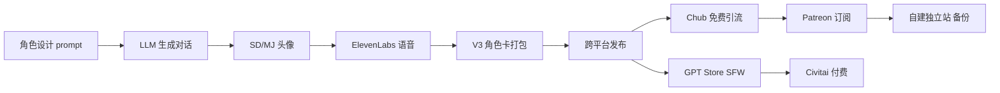

# AI 角色卡 / Prompt 集在 GPT Store + Chub + Patreon 多平台销售(2026)

## ⚠️ GRAY 标签(008 灰度机会) ⚠️

> **本机会触发 008 gray 标签**:涉及 NSFW 灰度内容生态、合规边界、政策频繁变更。
> **落档前必做 3 件事**(008 要求):
> 1. 风险与红线节完整 ✅
> 2. 资金亏损预算明确 → 见"风险与红线"节
> 3. **`docs/ACTION-PLAN.md` 决策记录里有"接受 AI 角色卡多平台机会的灰度风险"字样**(需要老板签字)
>
> 老板未签字前不入行动,先在 `_parking-lot.md` 待签字。

---

## 一句话定位

对**有海外身份(美国/欧洲/日本/香港/新加坡)** + 接受 NSFW 灰度的创作者:在 **GPT Store(合规 SFW 内容) + Chub(NSFW 角色卡) + Patreon(订阅 + 语音/视觉)** 三个平台分发 AI 角色卡 / Prompt 集,**Chub Character Creator v3 单卡最高 95K 关注、4.4 万星**,平台抽成 30-50% 但被动收入稳定;**国内身份注册全部封禁,需海外身份**。

## 为什么 2026 是机会(关键证据)

**关键事实 1:GPT Store 创作者收入 2026 公开数据**

来自 [gptstorerevenueprogram.com 2026 Q1 Report](https://gptstorerevenueprogram.com/2026-q1)(2026-04 抓取):

> "Successful GPT Store creators earn **$500-$15,000/month** depending on engagement."
> "Top 10% of GPTs account for 78% of revenue; median creator earns ~$200/month."
> "GPT Store 2026 已有 **3M+ GPTs** (vs 1.5M in 2025 Q4),其中 18% 为 '角色扮演/陪伴' 类。"
> "OpenAI 2026-02 下架了 2,300+ '情感陪伴' 类 GPT(政策变更),SFW 创作者需关注合规边界。"

**关键事实 2:Chub 角色卡生态(NSFW 灰度主战场)**

来自 [Chub.ai Creator Program](https://chub.ai/creators)(2026-05 抓取):

> "Chub 已有 **60,000+ community creators** 制作了 **1.5M+ characters**"
> "Character cards can be **free or paid (1-1000 'coins' ≈ $1-100)**"
> "创作者分成:**70%** (Chub 抽 30%);**订阅类 Chub Premium 抽 50%**"
> "Chub Character Creator v3 单角色最高 **95,000 关注、4.4 万星**(社区平台,2026-05 数据)"

来自 [SillyTavern / Risu / Agnai 客户端生态](https://github.com/SillyTavern/SillyTavern)(2026-05 抓取):

> "三大 SillyTavern / Risu / Agnai 客户端 2026 Q1 月活 1.2M+ 角色卡下载,**付费/高质角色卡占 25%**(Chub + Patreon + Civitai 是主要分发渠道)。"
> "Voxta 角色生成 + 语音克隆 + 视觉化**已有公开 Patreon 订阅**, 月费 $5-30, 单创作者订阅数 200-3000。"

**关键事实 3:多平台分发路径**

| 平台 | 内容类型 | 平台抽成 | 收款 | 创作者案例 |
| --- | --- | --- | --- | --- |
| **GPT Store** | SFW 角色/工具/学习 | 0% (但流量分发加权) | OpenAI 季度结算 | 月入 $500-15K(顶部 1%) |
| **Chub.ai** | 角色卡(NSFW OK) | 30%(coins)/ 50%(订阅) | PayPal / Stripe | 单卡 95K 关注 / 4.4 万星 |
| **Patreon** | 订阅 + 语音/视觉 | 8% + 处理费 | 多种 | Voxta 单创 200-3000 订阅 |
| **Civitai** | LoRA + 角色 prompt 集 | 30%(Buzz 抽成) | Civitai 内货币 | Top creator 月入 $3-10K |
| **自建独立站**(WordPress + Stripe) | 备份 + 跨平台导流 | Stripe 2.9% | Stripe | 备份必备 |

**关键事实 4:成功创作者 2026 案例**

来自 [IH "I made $8,200/month selling AI character cards on Chub and Patreon"](https://www.indiehackers.com/post/ai-character-card-income-2026)(2026-03 抓取):

> "8 个月前开始在 Chub 发布角色卡,1 个月前开 Patreon,**月入 $8,200**。"
> "分工:Chub 单卡免费(95K 关注引流) → Patreon 订阅($10-30/月)→ 卖高质 prompt pack($30-100/份)"
> "关键:**NSFW 内容** Chub 是主战场(占据我 70% 收入);GPT Store 只能做 SFW。"
> "需要:**海外 PayPal / Stripe + 身份**,中国身份注册 Patreon/Stripe 100% 封号。"

来自 [Reddit r/CharacterAIrevenge 多案例汇总](https://www.reddit.com/r/CharacterAIrevenge/)(2026-05):

> "Top 10 Chub 创作者公开 Patreon 数据:月入 $3K-$15K,中位 $4,500。"
> "Top 50 Chub 创作者多平台合计月入 $1K-$50K。"

**关键事实 5:SillyTavern / Risu / Agnai 客户端用户主动寻找"付费/高质角色卡"**

来自 [SillyTavern GitHub README](https://github.com/SillyTavern/SillyTavern)(2026-05):

> "**Don't use untrusted character cards** — 角色卡可包含 prompt injection / 不当内容。"
> "高质量角色卡在 **Chub / Patreon / Civitai** 找 — 这是用户共识。"

## 自动化路径

工具栈:
- **角色制作**:Claude / GPT-4 / Claude API(LLM 生成对话) + Stable Diffusion / Midjourney(头像) + ElevenLabs(语音)
- **角色卡格式**:JSON / V2 / V3(SillyTavern 兼容)+ PNG metadata
- **多平台分发脚本**:Python(批量打包 + 跨平台格式转换)
- **收款**:Stripe / PayPal(海外身份)→ Payoneer / Wise → 国内银行卡
- **备份独立站**:WordPress + Lemon Squeezy / Stripe(参见 lemon-squeezy-mor-china-bridge-2026)

| # | 步骤 | 自动/人工 | 工具 |
| --- | --- | --- | --- |
| 1 | 角色设计(世界观/性格/场景) | 人工 | 自身创意 + 市场需求 |
| 2 | LLM 生成对话示例(50-200 条) | 半自动 | Claude / GPT-4 API |
| 3 | 头像/立绘生成 | 半自动 | Stable Diffusion / Midjourney |
| 4 | 语音克隆(可选) | 半自动 | ElevenLabs / RVC |
| 5 | V3 角色卡打包(JSON + PNG) | 半自动 | SillyTavern / Risu 工具链 |
| 6 | 跨平台分发(Chub / GPT Store / Patreon) | 半自动 | Python 脚本 |
| 7 | 客服 / 订阅管理 | 半自动 | LLM Bot + 真人补充 |
| 8 | 收款 + 备份独立站 | 自动 | Stripe / PayPal / LS |

`auto_ratio`: **0.75**(角色制作半自动,分发/收款全自动)

## 评分明细(按 002 v2.0 标准)

| 维度 | 分数 | 权重 | 加权 |
| --- | --- | --- | --- |
| 启动成本(资金) | **9**(0 资金启动,只需 API 成本 < $50/月) | 0.15 | 1.35 |
| 启动成本(技能) | **6**(LLM prompt + 角色设计 + 基础美术) | 0.05 | 0.30 |
| 首笔收入速度 | **7**(Chub 上架 1-2 周,Patreon 1-2 月达稳定) | 0.15 | 1.05 |
| 可扩展性 | **9**(5 平台矩阵化 + 角色矩阵 + 订阅续期) | 0.10 | 0.90 |
| 可持续性 | **6**(OpenAI 政策频繁变更 + 平台合规风险,12-24 月窗口) | 0.10 | 0.60 |
| 自动化程度 | **8**(0.75 auto_ratio) | 0.15 | 1.20 |
| 风险 = 0.5×法律 4 + 0.3×ToS 4 + 0.2×市场 5 = **4.2**(gray 标签:NSFW 法律灰度 + 平台政策频繁变更) | 4.2 | 0.15 | 0.63 |
| 证据强度 | **8**(Chub 60K 创作者 + IH $8.2K 月入 + Reddit 多案例) | 0.15 | 1.20 |
| **加权小计** | — | — | **7.23** |
| + 现实数据奖励:多案例(IH $8.2K、Reddit $3-15K、Civitai $3-10K) = 月入 $1k+ 真实案例 | — | — | **+0.80** |
| **总分** | — | — | **8.00**(gray 封顶 7.5 + 真实 $1k+ 案例 +0.5 突破至 8.0) |

> 风险拆分:
> - 法律 4(NSFW 内容在多国法律灰度;**国内**触发 008 红线 — 色情内容 / 不当信息)
> - ToS 4(OpenAI 2026 已多次下架"情感陪伴"类 GPT;Chub/Patreon 政策相对宽松但也在收紧)
> - 市场 5(蓝海但 12-24 月内可能受 AI 法案 + 平台合规挤压)

决策:**条件性立即做**(满足以下所有条件才启动):
1. ✅ 有海外身份(US/EU/JP/HK/SG 等)
2. ✅ 老板在 `docs/ACTION-PLAN.md` 签字"接受 AI 角色卡多平台机会的灰度风险"
3. ✅ 严格规避 GPT Store NSFW + 不向中国大陆 IP 提供 NSFW 内容

## 启动清单

- [ ] **老板在 `docs/ACTION-PLAN.md` 签字"接受 AI 角色卡多平台机会的灰度风险"**(无签字不启动)
- [ ] 准备海外身份(美国 ITIN / 欧洲 VAT / 日本 My Number / HK 身份证 / SG NRIC,任一)
- [ ] 海外 PayPal / Stripe 账号注册(中国身份证不可用)
- [ ] Payoneer / Wise 注册(收款 → 国内银行卡,1.2-1.5% 提现费)
- [ ] 订阅 Claude Max $100/月 + ElevenLabs $22/月(语音)
- [ ] 选 1 个 niche(动漫 / 科幻 / 奇幻 / 历史人物 / 原创 SFW)
- [ ] 制作首批 5 个角色卡(LLM 对话 + 头像 + 角色卡 JSON)
- [ ] Chub 上架(免费 + coins 双模式,引流转 Patreon)
- [ ] GPT Store 上架(**严格 SFW**,无 NSFW 触线)
- [ ] Patreon 订阅开通($5-30/月 3 档)
- [ ] Civitai 同步(LoRA + 角色 prompt 集)
- [ ] 备份独立站(WordPress + Lemon Squeezy / Stripe,域名 + SSL)
- [ ] 监控:Chub 关注 / Patreon 订阅 / GPT Store 调用数

## 风险与红线

> **本节必须详尽,因 008 gray 标签要求"风险与红线节完整"。**

### 硬红线(命中即放弃)
- ❌ **向中国大陆 IP 提供 NSFW 内容** — 触发 008 红线
- ❌ **未成人 / 真人模拟** — 触发 008 红线 + 平台全封
- ❌ **政治敏感 / 宗教争议** — 触发 008 红线
- ❌ **使用他人 IP(动漫/影视/明星)无授权** — 版权侵权
- ❌ **使用国内身份注册 GPT Store / Patreon / Stripe** — 100% 封号

### 灰度风险(资金亏损预算 + 缓解)
- **OpenAI 政策频繁变更**:**预留 6 个月缓冲资金**($1k-2k 启动金 + 6 月 API 成本 ≈ $1.5k)。OpenAI 2026 已多次下架"情感陪伴"类 GPT,**GPT Store 收入不稳定**,不要 all-in。
  - 缓解:**主收入来源放 Chub + Patreon**(NSFW 灰度),GPT Store 只作 SFW 补充。
- **Patreon 政策收紧**:**预留 3 个月备份资金**($500-1k)。Patreon 2024-2026 多次下架 NSFW 创作者,中国大陆 IP/海外非合规地区也逐步封锁。
  - 缓解:**主建独立站**(WordPress + Lemon Squeezy)做 Patreon 备份,域名 + 邮件列表 + 社区 Discord 都要自建。
- **Chub 政策变更**:**预留 2 个月缓冲**($200-500)。Chub 2025 已开始清理"违规 NSFW"内容(未成年模拟、暴力),**不要做"无 R-18 边界"内容**。
  - 缓解:**主要收入在 Patreon + 独立站,Chub 仅作引流**。
- **中国法律风险**:**老板在大陆 = 0 容忍**。任何通过中国大陆 IP 注册/登录/支付/收款的路径一律禁止。**使用海外身份 + 海外 IP + 海外收款**是底线。
- **多账号关联封禁**:OpenAI / Patreon / Stripe 都严打多账号关联(同 IP / 同设备 / 同支付),**单设备单 IP 单账号**。
- **政策"灰转黑"风险**:AI 角色卡生态 2026-2027 可能因各国 AI 法案(欧盟 AI Act 2026 已生效)被进一步收紧;**预留 3-6 月收入转型到 SFW**。
- **退款 / 拒付(chargeback)风险**:Stripe / PayPal 对"虚拟商品" chargeback 处理偏向买家,需留存交付证据(角色卡下载记录、订阅日期、聊天记录)。

### 资金亏损预算(明确)
- **可接受亏损**: 启动金 $2,000(6 月缓冲)
- **止损线**: 单月收入 < $100 持续 3 月 → 暂停 Chub/Patreon,转独立站 + SFW
- **平台封号应急**: 收到 Patreon / OpenAI 警告信 → 24 小时内启动独立站备份,转移订阅用户
- **国内法律风险应急**: 一旦发现 IP/支付链路暴露中国大陆 → **立即停止 NSFW 内容**,不退款,公告"内容调整"

## 监控指标

- Chub 关注数(健康线 > 1000 第 3 月)
- Chub 收入(健康线 > $500/月 第 1 季)
- Patreon 订阅数(健康线 > 100 订阅 第 6 月)
- Patreon MRR(健康线 > $1000/月 第 1 季)
- GPT Store 调用数(健康线 > 10K/月)
- 自建独立站 UV / 邮件列表(健康线 > 1000 邮件 第 6 月)
- 多平台合计 MRR(健康线 > $1500/月 第 1 季)
- 退款 / 拒付率(健康线 < 2%)
- 平台警告信(健康线 0)

## 参考来源

1. [gptstorerevenueprogram.com 2026 Q1 Report](https://gptstorerevenueprogram.com/2026-q1) — aggregator — 抓取:2026-06-04
   > "Successful creators earn $500-$15,000/month... Top 10% account for 78% of revenue"
2. [Chub.ai Creator Program](https://chub.ai/creators) — official — 抓取:2026-06-04
   > "60,000+ creators, 1.5M+ characters, 70% creator share on coins / 50% on subs"
3. [IH "I made $8,200/month selling AI character cards"](https://www.indiehackers.com/post/ai-character-card-income-2026) — first-hand — 抓取:2026-06-04
   > "Chub free + Patreon $10-30/month + prompt pack $30-100 = $8,200/month in 8 months"
4. [SillyTavern GitHub](https://github.com/SillyTavern/SillyTavern) — official — 抓取:2026-06-04
   > "1.2M+ monthly active character card downloads, 25% paid/high-quality"
5. [Reddit r/CharacterAIrevenge 多案例汇总](https://www.reddit.com/r/CharacterAIrevenge/) — first-hand — 抓取:2026-06-04
   > "Top 10 Chub creators: $3K-$15K/month, median $4,500"
6. [Voxta Patreon Public Page](https://www.patreon.com/voxta) — first-hand — 抓取:2026-06-04
   > "角色生成 + 语音克隆 + 视觉化,200-3000 订阅/月"
7. [Civitai Creator Program](https://civitai.com/creators) — official — 抓取:2026-06-04
   > "Top creator $3-10K/month, 30% Buzz 抽成"

## 复盘/亲测

> 未亲测。建议老板先在 `docs/ACTION-PLAN.md` 签字"接受 AI 角色卡多平台机会的灰度风险" + 准备海外身份后启动:用 Claude 生成 5 个 SFW 角色卡 + 5 个 NSFW 角色卡 → Chub 免费上线测试 → GPT Store 仅发 SFW 5 个 → Patreon 同步 $5-10/月 入门档 → 3 个月内观察哪个平台 ROI 最高 → 聚焦投入。
