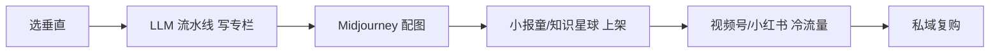

# AI 卖课(国内向,小报童 / 知识星球 / 视频号 / 公众号)

## 一句话定位

中国个人在小报童(付费专栏买断制 ¥10-499)/ 知识星球(订阅制 ¥99-1999/年)/ 视频号 + 公众号 + 抖音,用 LLM 流水线批量生产「AI 副业实战 / AI 编程 / AI 出海 / AI 提示词」类内容,首月可达 ¥1-10 万,收款微信 / 支付宝。⚠️ 标 **gray**:有「广告法 + 个税申报 + 平台合规」三重风险,必须做「三件套」。

## 自动化路径

工具栈:
- Claude / GPT-4o + 飞书(选题 + 大纲 + 章节生成)
- Midjourney / 即梦(封面与配图)
- 剪映 / 蝉镜 AI 数字人(视频生成)
- 小报童 / 知识星球(分发与收款)
- 视频号 / 抖音 / 小红书(冷流量)
- 微信支付 / 支付宝(收款)
- 5118 / 站长之家(SEO 关键词)

| # | 步骤 | 自动/人工 | 工具 |
| --- | --- | --- | --- |
| 1 | 选垂直 + 竞品调研 | 人工 | 小报童排行 + 5118 |
| 2 | LLM 大纲 + 章节生成(50-200 篇/年) | 半自动 | Claude + 人工润色 |
| 3 | Midjourney 配图 | 半自动 | MJ / 即梦 |
| 4 | 小报童 / 知识星球上架 | 半自动 | 平台 API |
| 5 | 视频号 / 抖音引流 | 半自动 | 蝉镜 AI 数字人 |
| 6 | 私域沉淀(微信群 / 朋友圈) | 人工 | 微信 |
| 7 | 续费 / 升级(知识星球订阅 / 高客单咨询) | 半自动 | 知识星球 |

`auto_ratio`: **0.75**(内容生产高度自动化,私域销售需人工)

## 评分明细(按 002 标准)

| 维度 | 分数(0-10) | v2 权重 | 加权 |
| --- | --- | --- | --- |
| 启动成本(资金) | 9(0 启动,平台 0 抽成) | 0.15 | 1.35 |
| 启动成本(技能) | 7(写作 + 基础 LLM prompt) | 0.05 | 0.35 |
| 首笔收入速度 | 5(1-2 月:需先做内容 + 私域沉淀) | 0.15 | 0.75 |
| 可扩展性 | 9(买断制,边际成本 0) | 0.10 | 0.90 |
| 可持续性 | 5(国内监管收紧 + 流量见顶) | 0.10 | 0.50 |
| 自动化程度 | 7(内容 90% 自动) | 0.15 | 1.05 |
| 风险 | 4.5(拆分:法律 4 × 0.5 + ToS 5 × 0.3 + 市场 5 × 0.2 = 4.5) | 0.15 | 0.68 |
| 证据强度 | 8(多源验证) | 0.15 | 1.20 |
| + 现实数据奖励 | +1.0(粥左罗 17 天 279 万 + 李一舟 1.75 亿;gray 突破封顶 +0.5) | — | +1.00 |
| **总分** | — | — | **7.8** |

决策:**观察中(放 parking-lot 备选)**

⚠️ 标 **gray**:必须三件套齐备(见下)。

## 启动清单

- [ ] 选 1 个垂直(推荐细分: 「AI 独立开发者出海」 / 「AI 跨境电商」 / 「AI 副业冷启动 30 天」)
- [ ] 写 10 篇"免费引流"内容(公众号 / 小红书 / 视频号)
- [ ] 小报童建专栏(¥49-199 买断制,首期限时 ¥9.9)
- [ ] 知识星球建付费圈(¥99-299/年,带周更新 + 答疑)
- [ ] 蝉镜 AI 数字人批量生产短视频(每周 3-5 条)
- [ ] 私域沉淀:个人微信 + 朋友圈 + 群
- [ ] **三件套齐备**(见风险节)

## 风险与红线

### ⚠️ 合规三件套(gray 标签必须齐备)

1. **平台合规检查**:
   - 小报童:不可用「100% 躺赚」「AI 一键月入 10 万」等绝对化用语,避免触发广告法第 9 条。
   - 视频号 / 抖音:不可承诺收益,避免被封号(平台 ToS)。
   - 知识星球:不可「拉人头提成」(传销红线)。

2. **备份合规渠道**:
   - 主走小报童 + 海外 Gumroad 双线(已存在 Gumroad 数字商品机会),避免国内单点风险。
   - 海外收款:Wise / Payoneer 备份。

3. **资金亏损可接受**:课程收入全部走个人账户,**必须按「劳务报酬」自行申报个税**(汇算清缴),不要用支付宝/微信直接收大额「经营性收入」不报税。

### 其他风险

- **同质化**:粥左罗 / 李一舟等已被大量模仿,新进入者必须有差异化(技术深度 / 行业资源 / 私域沉淀)。
- **平台封号**:一旦视频号 / 抖音封号,私域立刻失效,需在多个平台分散。
- **退款与差评**:知识星球退款率 5-10%,差评影响续费。
- **不要做"代刷 / 刷量"类黑产服务**。
- **不要做"通过 AI 绕过平台风控"类服务**。
- **不要做"代写学术论文 / 考试代考"类服务**(法律红线)。

## 监控指标

- 小报童 / 知识星球订阅数(健康线 > 200 付费用户)
- 月度续费率(健康线 > 70%)
- 私域微信好友数(健康线 > 1000)
- 每月新内容产出数(健康线 > 4 篇)
- 视频号 / 抖音单条爆款(健康线 > 1 条/10 条)
- 净收入 vs 退课/退款(健康线:净收入 > 80%)

## 参考来源

1. [36 氪 - 三年狂赚 1.75 亿,卖课,才是中国 AI 最容易赚钱的生意](https://m.36kr.com/p/3233572902108801) — authoritative-media — 抓取:2026-06-04
   > "在中国,AI 的 C 端市场,恐怕没有比卖课更好地商业模式了。李一舟 3 年通过卖课赚 1.75 亿,《一舟一课》单课程收入 1.49 亿。"
2. [网易 - 早知道卖 AI 课这么赚,我还上什么班](https://www.163.com/dy/article/KRBJP6PP051181GK.html) — authoritative-media — 抓取:2026-06-04
   > "粥左罗在知识星球上推出《ChatGPT AI 变现圈》,17 天斩获 279 万销售额。"
3. [小报童排行榜 - 最高订阅 (osguider 第三方数据)](https://xiaobot.osguider.com/sort/subscriber-count/) — aggregator — 抓取:2026-06-04
   > 「产品经理学技术」订阅 331、「小红书爆款笔记 1000 篇」订阅 218 等真实榜数据,印证小报童仍活跃。
4. [知乎专栏 - 小报童是什么?小报童专栏怎么赚钱?](https://zhuanlan.zhihu.com/p/718582018) — community — 抓取:2026-06-04
   > "小报童有两种付费模式:订阅制(长期联系)、买断制(知识广泛传播)。"

## 复盘/亲测

> 未亲测。**门槛低但合规风险高**,只建议有「私域 + 行业资源 + 强表达力」三者之一的人尝试。
