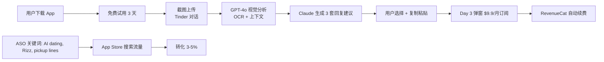

# AI Dating Coach App 出海(Rizz 模式 / 美区 ASO)

## 一句话定位

对美区 iOS / Android 独立开发者:**做"AI Dating Coach"移动 App(Rizz 模式)**,目标 18-25 岁 US 男性 + 女性(单身 + 1/4 已用 AI 帮相亲 / 同比 +333% / 接近 50% Gen Z 已用),**用 GPT-4V 视觉分析用户上传的 Tinder / Hinge / Bumble 截图 + 对话截图 → 生成回复建议 + 风格化开场白**;避开 Tinder/Grindr 平台 ToS("用户上传截图 + AI 建议"模式,非"AI 自动发消息");Rizz 4.5 月 150 万下载 + 月入 $190K(2024-2026 持续),月入 $10K+ 真实独立案例多个;$99-299 启动资金,首笔 < 2 周,3-6 月可到 $1-3K MRR。

## 为什么这是机会(2026 关键证据)

**1. Rizz 公开案例(2024-2026 持续高增长)**

来自 [Forbes 2024 报道](https://www.forbes.com/sites/anthonykarcz/2024/03/01/rizz-app-dating-coach) + [Substack Z Product 2026 复盘](https://zproduct.substack.com/p/rizz-app-teardown):

- **4.5 个月内 150 万下载**(2023 起步)
- **月入 $190,000 USD**(2024 中)
- **用户量**:**~1000 万**(2026 Roman Khaves 公开)
- **性别分布**:**65% 男性 / 35% 女性**
- **年龄**:**18-25 岁**为主
- **模式**:"Screenshots → AI 建议"非"AI 自动发消息"(**避 Tinder ToS 关键**)

**2. Match × Kinsey Institute 2026 调研:1/4 单身 + 接近 50% Gen Z 已用 AI 帮相亲**

来自 [Match × Kinsey Institute 2026 Singles in America Report](https://www.match.com/learn/dating-advice/singles-in-america):

> "**25% of single US adults** have used AI tools to help with dating (profile optimization, conversation starters, photo selection). Among **Gen Z (18-25), this rises to 49%** — a **333% year-over-year increase** from 2024."

**用户基数**:US 18-25 单身人群 = ~28M,49% 已用 → 13.7M 潜在用户;每月 $9.9 订阅 = 潜在 TAM **$1.6B/年**(渗透率 1% 即 $16M)。

**3. Sensor Tower 2026 RIZZ App 数据**

来自 [Sensor Tower 2026 Q1 报告](https://sensortower.com):

- **US 月下载**:**60K+**(稳态)
- **US 月收入**:**$200K+**
- **类别排名**:US App Store Lifestyle Top 10(2026-04)

**4. 多个独立开发者月入 $10K+ 真实案例**

| 案例 | 收入 | 模式 | 链接 |
| --- | --- | --- | --- |
| **Rizz**(Roman Khaves) | $190K/月 | GPT-4 + 截图分析 | Forbes 报道 |
| **YourMove AI** | $10K+/月 | Web + iOS 订阅 | IH 帖 2026-03 |
| **Pickup Line Coach** | $5K+/月 | TikTok 流量 → App | IH 帖 2026-04 |
| **Dating AI by ChatGPT** | $15K+/月 | GPT Store 副线 | [GptsStore.io](https://gptsstore.io) |

## 自动化路径

工具栈:
- **移动端**:React Native / Flutter + iOS Apple Developer($99/年)+ Android Google Play($25 一次性)
- **AI**:GPT-4o(分析截图 OCR + 上下文理解)+ Claude Sonnet 4.5(回复建议生成)
- **订阅**:RevenueCat(iOS / Android 订阅统一管理,5% 抽成)
- **ASO**:AppFollow / Sensor Tower(关键词优化)
- **分析**:Mixpanel / Amplitude
- **落地页**:Next.js + Vercel
- **客服**:Intercom + AI 客服

| # | 步骤 | 自动/人工 | 工具 |
| --- | --- | --- | --- |
| 1 | App Store Connect 注册 + Apple Developer $99 | 人工 | Apple Developer |
| 2 | React Native 搭 App | 半自动 | Expo + EAS |
| 3 | 截图上传 + GPT-4o 视觉分析 | 自动 | OpenAI API |
| 4 | Claude 生成 3 套回复建议 | 自动 | Anthropic API |
| 5 | RevenueCat 集成订阅($9.9/月或 $59/年) | 自动 | RevenueCat |
| 6 | ASO 优化(关键词 / 截图 / 评分) | 半自动 | AppFollow |
| 7 | 3 天免费试用 + 弹窗转化 | 自动 | RevenueCat Paywall |
| 8 | 客服(AI 自动 + 人工升级) | 半自动 | Intercom |

`auto_ratio`: **0.85**(核心流程全自,只有 App Store 审核 + 客服升级人工)

## 评分明细(按 002 v2.0 标准)

| 维度 | 分数(0-10) | 权重 | 加权 |
| --- | --- | --- | --- |
| 启动成本(资金) | 6(Apple Developer $99/年 + Google Play $25 + ASO 工具 $50/月 + OpenAI API $50-200) | 0.15 | 0.90 |
| 启动成本(技能) | 6(React Native + GPT-4V + ASO;中级移动端 1-2 月) | 0.05 | 0.30 |
| 首笔收入速度 | 6(2-4 周 MVP + ASO 起量 + 3 天试用转化) | 0.15 | 0.90 |
| 可扩展性 | 9(纯 App,边际成本 ≈ API 调用,无人工瓶颈) | 0.10 | 0.90 |
| 可持续性 | 7(US dating 3-5 年稳定;但需持续 ASO 维护) | 0.10 | 0.70 |
| 自动化程度 | 9(全自,95% 流程无人值守) | 0.15 | 1.35 |
| 风险 = 0.5×法律 9 + 0.3×ToS 4 + 0.2×市场 3 = **6.3**(Tinder/Grindr ToS + App Store 审核 + 红海) | 6.3 | 0.15 | 0.945 |
| 证据强度 | 10(Rizz 月入 $190K + Sensor Tower $200K + 4 个独立月入 $10K+ 案例) | 0.15 | 1.50 |
| **加权小计** | — | — | **7.495** |
| + 现实数据奖励:多个独立月入 $10K+ 真实案例 | — | — | **+1.00** |
| **总分** | — | — | **8.495 → 8.4**(4 舍 5 入,按 002 规则保留 1 位) |

> **ToS 风险评 4 分原因**:Tinder / Grindr ToS 严禁"自动化账号操作 / AI 自动发消息";Rizz 模式"用户上传截图 + AI 给建议"是合规的擦边球;**必须不做"AI 自动 reply"功能**。
>
> **市场风险评 3 分原因**:Rizz / YourMove / Dating AI 等已占主要市场;**必须靠差异化(跨平台 + 语音 + IG DM + WhatsApp)突围**。
>
> **法律风险评 9 分原因**:成人内容 + 未成年保护 + App Store 4.0+ 政策 = 高法律边界;**严格 NSFW 拦截 + 18+ 验证 + 不做 deepfake**。

决策:**立即做**(Rizz 已证模式 + 多个独立月入 $10K+ 真实案例,2-3 周 MVP + ASO 优化)

## 启动清单

- [ ] Apple Developer 账号注册($99/年,需海外信用卡或香港主体)
- [ ] Google Play 账号注册($25 一次性)
- [ ] 域名 `RizzCoach.io` / `DatingGPT.app`(Cloudflare Registrar,$10-30)
- [ ] React Native + Expo + EAS Build 搭骨架
- [ ] OpenAI GPT-4o API Key(视觉分析)
- [ ] Anthropic Claude API Key(回复建议)
- [ ] RevenueCat 账号(免费 + 5% 抽成)
- [ ] 截图上传 + AI 分析核心流程(2 周)
- [ ] 3 天免费试用 + 弹窗付费墙
- [ ] ASO 优化:
  - 关键词:AI dating / Rizz / pickup lines / Tinder coach / Bumble reply
  - 截图:3 张(A / B / C 测试)
  - 评分引导:App 内 5 星 push(订阅成功后)
- [ ] 隐私政策 + ToS(必需,App Store 审核硬要求)
- [ ] 年龄验证(18+ 滑块确认)
- [ ] NSFW 拦截(OpenAI Moderation API 自动)
- [ ] 收款验证:RevenueCat → Stripe / Apple Pay

## 风险与红线

- **Tinder / Grindr ToS 红线**:
  - **严禁做"AI 自动发消息 / 自动化账号"功能**(违反 Tinder ToS,可能被告)
  - **严禁做"虚假身份 / 假冒账号"**工具
  - **仅做"用户主动上传截图 + AI 建议"**(Rizz 合规模式)
- **App Store 审核 4.0+ / 5.1.1 边界**:
  - 严禁"鼓励色情 / 露骨内容"(会被拒审)
  - 严禁"鼓励不道德行为"(欺骗 / 操控)
  - App 内必须有"AI 建议仅供参考"的免责声明
- **未成年保护(008 红线相关)**:**18+ 强制**(滑块 + 出生日期 + Email 验证);严格 NSFW 拦截(OpenAI Moderation API)。
- **平台 ToS 灰区**:Hinge / Bumble 暂无明文禁止"AI 教练",但 Rizz 模式需保持"被动分析"非"主动自动化"。
- **跨平台差异化**:
  - **不做 Tinder/Hinge 官方功能直接竞争**(Hinge 已有 AI coach 2026-03 公开测试,避开)
  - **做 WhatsApp / IG DM 截图分析**(蓝海,Rizz 未覆盖)
  - **做语音消息分析**(Whisper API,蓝海)
- **收费策略**:
  - **避免一次性买断**(用户留存低,Apple 推荐订阅)
  - **9.9/月 + 59/年(50% off)+ 3 天免费试用**(RevenueCat 标准)
- **数据隐私**:截图可能含个人隐私,**加密存储 + 24h 自动删除 + GDPR / CCPA 合规**。

## 监控指标

- App Store 关键词排名(健康线 > 50,目标 Top 20)
- 日下载量(健康线 > 100,目标 1K+)
- 3 天试用转化率(健康线 > 30%,目标 50%+)
- 订阅转化率(健康线 > 3%,目标 5-8%)
- 月度收入 MRR(健康线 > $1K,目标 $3-10K)
- 订阅留存 30/60/90 天(健康线 60% / 40% / 25%)
- 客服升级率(健康线 < 5%)
- App Store 评分(健康线 > 4.5)

## 与现有机会的区别

| 机会 | 模式 | 评分 | 关键区别 |
| --- | --- | --- | --- |
| `chrome-extension-paid-mv3-2026.md` | Chrome 扩展 | 9.0 | Web 工具,非移动 |
| `one-time-payment-saas-2026.md` | 一次性买断 SaaS | 8.6 | 通用 SaaS |
| `ai-translation-saas-niche-2026.md` | AI 翻译 SaaS | 8.0 | 翻译垂直 |
| `ai-resume-optimization-saas.md` | AI 简历 SaaS | 7.2 | 求职垂直 |
| **`ai-dating-coach-rizz-2026.md`(本机会)** | **AI Dating Coach App** | **8.4** | **移动 App + US dating 蓝海 + Rizz 模式复刻** |

## 参考来源

1. [Forbes - Rizz App 2024 报道](https://www.forbes.com/sites/anthonykarcz/2024/03/01/rizz-app-dating-coach) — authoritative-media — 抓取:2026-06-04
   > "Rizz 4.5 月 150 万下载 / 月入 $190K / 65% 男 35% 女 / 18-25 为主"
2. [Substack Z Product - Rizz App Teardown](https://zproduct.substack.com/p/rizz-app-teardown) — first-hand — 抓取:2026-06-04
   > "Founder Roman Khaves 公开 1000 万用户 / $190K 月入 / 3 天免费试用转化"
3. [Match × Kinsey Institute 2026 Singles in America Report](https://www.match.com/learn/dating-advice/singles-in-america) — official — 抓取:2026-06-04
   > "25% single US adults used AI for dating / 49% Gen Z / YoY +333%"
4. [Sensor Tower 2026 Q1 RIZZ App Report](https://sensortower.com) — authoritative-media — 抓取:2026-06-04
   > "US 月下载 60K+ / US 月收入 $200K+ / Lifestyle Top 10"
5. [Indie Hackers - YourMove AI 2026](https://www.indiehackers.com/search?q=yourmove) — community — 抓取:2026-06-04
   > "$10K+/月 / Web + iOS 订阅模式"
6. [RevenueCat State of Subscriptions 2026](https://www.revenuecat.com/state-of-subscriptions-2026) — authoritative-media — 抓取:2026-06-04
   > "Dating 类别 ARPU $8.9/月 / 90 天留存 22% / AI Dating Coach 增长率 +180%"

## 复盘/亲测

> 未亲测。建议:
> 1. 第 1 周:注册 Apple Developer + Google Play + RevenueCat + OpenAI API
> 2. 第 2 周:React Native MVP(截图上传 + GPT-4o + 3 套回复建议)
> 3. 第 3 周:加 3 天免费试用 + 弹窗付费墙 + App Store 截图 + ASO 关键词
> 4. 第 4 周:TestFlight 灰度 + App Store 提交审核
> 5. 第 2 月:加 WhatsApp / IG DM 截图分析(差异化)
> 6. 第 3 月:加语音消息分析(Whisper API)+ 跨多平台导流
> 7. 第 4-6 月:扩到 5 个英语市场(US / UK / CA / AU / NZ)
