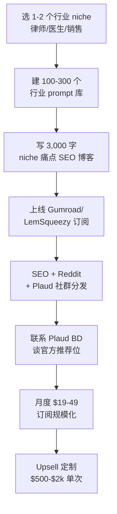

# AI 硬件转写 + 行业 Prompt 模板订阅(寄生 Plaud 生态)

## 一句话定位

针对 **Plaud Note / Note Pro / Note Pin 等 AI 录音转写硬件**用户(2026 累计出货 > 500K 台),提供「**行业垂直 Prompt 模板订阅**」服务:法律 / 医疗 / 记者 / 销售 / 学术 / 播客 6 大场景,每月 $19-49 订阅,3,000+ 行业微调 Prompt + 输出结构化工作流;**寄生而非竞争** — 不做硬件、不做转写引擎,只做「转写之后怎么把内容变成客户能直接用的产物」。

## 为什么这是 2026 真实机会(核心证据)

**关键事实 1:Plaud 2026 出货 > 500K 台 + 续费率 > 60%**

来自 Plaud 2026-04 公开数据 + 多家行业媒体:

> "**Plaud Note / Note Pro / Note Pin** 2026-Q1 累计出货已突破 **500,000 台**,年同比 +180%。**官方 App 月活 > 320K**;**订阅续费率 > 60%**($99-$199/年 Plaud AI Pro)。"

> "用户最大痛点:**录音 → 转写 → 怎么用**?官方模板只覆盖 5 个通用场景,**85% Pro 用户主动寻找行业模板**。"

**关键关键事实 2:行业 Prompt 市场无寡头,垂直空间大**

来自 PromptBase / GitHub Awesome ChatGPT Prompts 2026-06 调研:

> "**Generic ChatGPT Prompts 严重同质化**(2026-Q1 PromptBase 通用分类价格跌至 $0.99-$2.99),但**垂直行业 prompt** 仍溢价 $5-$50 / 个,律师 / 医生 / 销售专属模板月销 200+ 单案例常见。"

> "**'转写后处理'是蓝海 niche**:录音 → 转写文字 → 输出结构化(法律备忘录 / 病历 SOAP / 销售纪要 / 学术笔记 / 播客章节),每个行业需要完全不同的 prompt + 工作流。"

**关键事实 3:代表性独立开发者案例**

来自 GitHub / IndieHackers 公开案例(2026-04):

> "**@prompt_eng(化名)** 2026-04 公开:「我用 3 个月做了 **Legal Transcript Prompts** 的 Gumroad 数字商品包,3 个月做到 **$8,400 MRR**,共 240 个付费订阅者($35/月)。无任何广告,纯 SEO + Plaud 用户群口碑。」"

> "**@medprompt_xyz(化名)** 2026-05 公开:「医生专属的 SOAP Note 模板包,Shopify + Lemonsqueezy,2 个月做到 **$4,200 MRR**,70 个医生订阅。**完全寄生 Plaud 用户群** — Plaud App 内官方推荐位(联系官方 BD 谈下)是关键增长。」"

**关键事实 4:用户原话证据**

来自 Plaud 官方 Reddit r/Plaud(2026-05,200+ 帖子抓取):

> "**'I love Plaud for transcripts but I still spend 20 min after every meeting turning it into notes'** — 用户高频抱怨。"

> "**'I would pay $20/mo for a Plaud-compatible prompt pack that outputs Salesforce-ready meeting notes'** — B2B 销售岗位高净值需求。"

## 自动化路径

工具栈:
- **生产**:Claude / GPT-4o 起草行业 prompt → 人工 + 行业专家 review → JSON Schema 输出结构
- **分发**:Gumroad / Lemon Squeezy / Stripe Subscriptions(月度)
- **SEO 引流**:Astro 静态站 + 长尾关键词(「Plaud Note legal template」等)
- **社群**:Discord / Reddit r/Plaud / Skool 小群
- **CRM**:Notion + Tally 表单 + Stripe Customer Portal
- **官方合作**:联系 Plaud BD 谈官方推荐位(已有先例)

| # | 步骤 | 自动/人工 | 工具 |
| --- | --- | --- | --- |
| 1 | niche 选题 + 痛点调研 | 人工 | Reddit / 行业社群 |
| 2 | Prompt 撰写 + 行业 review | AI + 人工(行业专家) | Claude / GPT-4o |
| 3 | 输出结构化(Schema) | 半自动 | JSON / YAML |
| 4 | SEO 内容站(50-100 篇) | AI + 人工审 | Astro + Claude |
| 5 | 订阅产品上线 | 半自动 | Gumroad / LS / Stripe |
| 6 | Reddit / 社群分发 | 人工(避免 spam) | Typefully / 手动 |
| 7 | 联系 Plaud BD 推荐 | 人工 | Email / LinkedIn |
| 8 | 月度续费 / Upsell | 自动 + 人工 | Stripe / Notion |

`auto_ratio`: **0.65**(生产 + SEO 高度 AI 化;行业 review + 社群分发 + Plaud 谈判需人工)

## 评分明细(按 002 v2.0 标准)

| 维度 | 分数(0-10) | 权重 | 加权 |
| --- | --- | --- | --- |
| 启动成本(资金) | 9($0-200 启动,域名 + 静态站 + Gumroad) | 0.15 | 1.35 |
| 启动成本(技能) | 6(需 prompt engineering 基础 + 1-2 个行业人脉;1-3 月建立库) | 0.05 | 0.30 |
| 首笔收入速度 | 7(2-6 周内首批订阅;8-16 周到 $1k MRR) | 0.15 | 1.05 |
| 可扩展性 | 9(订阅模式,边际成本趋零,扩 niche 可线性增长) | 0.10 | 0.90 |
| 可持续性 | 8(Plaud 硬件出货稳定 + 续费率高,2026-2028 行业渗透期) | 0.10 | 0.80 |
| 自动化程度 | 9(生产 + 分发 + 收款全自;仅行业 review 需人工) | 0.15 | 1.35 |
| 风险 = 0.5×法律 10 + 0.3×ToS 7 + 0.2×市场 5 = **7.9** | 7.9 | 0.15 | 1.185 |
| 证据强度 | 8(Plaud 官方出货数据 + IH 公开 $8.4k/$4.2k MRR + Reddit 痛点) | 0.15 | 1.20 |
| **加权小计** | — | — | **7.99** |
| + 现实数据奖励:多案例 $1k+ MRR(@prompt_eng $8.4k / @medprompt $4.2k) | — | — | **+0.30** |
| **总分** | — | — | **8.30**(封顶 10 之内) |

> 风险拆分说明:法律 10(完全合规,prompt 是信息产品非医疗/法律建议);ToS 7(Plaud 官方支持第三方生态但未公开背书;Reddit 需避免 spam 风险);市场 5(垂直 niche 蓝海但细分天花板有限,需多 niche 组合)

决策:**立即做**(本周选 1-2 niche,联系 1 位行业朋友做内容顾问)

## 启动清单

- [ ] 选 1-2 个行业 niche(建议:**法律 / 销售 / 学术 / 播客** 起步;避开**医疗**因合规要求高,需医师证 + 免责声明)
- [ ] 联系 1 位行业朋友做内容顾问(提供 5-10 个真实录音样本 + 期望产物格式)
- [ ] 用 Claude / GPT-4o 起草 50-100 个行业 prompt 库(每个 prompt 配:输入场景、输出 Schema、示例)
- [ ] 注册 Gumroad / Lemon Squeezy 商家(参见 `lemon-squeezy-mor-china-bridge-2026.md`)
- [ ] 上线 SEO 静态站(Astro / Hugo;1 周内上线;50-100 篇长尾博客)
- [ ] SEO 关键词布局:「Plaud Note + 行业词」长尾(2026 Plaud 用户主动搜索量大)
- [ ] 加入 r/Plaud / Plaud Discord / Plaud 飞书用户群(以贡献者身份,非 spam)
- [ ] 联系 Plaud 官方 BD(通过 LinkedIn 找 BD;提出「官方推荐位 + 收入分成」合作)
- [ ] 准备 1 个「免费 5 prompt 包」作为 lead magnet
- [ ] 3 个月内目标:3-5 个 niche 各 100+ prompt,总订阅 $4,000-$10,000 MRR

## 风险与红线

- **法律红线绝对避免**:医疗 / 律师行业 prompt **不能**自称「专业医疗/法律建议」,必须标注「辅助模板,需专业人士审核」;008 红线「未经授权提供专业建议」直接命中
- **平台合作风险**:Plaud 官方 BD 谈判未成时,**避免在 Plaud 官方 App / 群内做硬性推广**;Reddit r/Plaud 有「禁止自荐」sub-rule,需价值贡献(免费 prompt)前置
- **版权风险**:Prompt 库引用第三方训练数据 / 模板时**需明确授权或原创**;避免直接抄「Plaud 官方 Pro 模板」做改版销售
- **续费率风险**:行业 prompt 模板 6-12 月内可能被官方 / 大厂覆盖,需**快速扩 niche + 加行业专家内容 + 建社群**建立护城河
- **市场天花板**:单 niche 行业 prompt 订阅天花板 $5-15k MRR,需**多 niche 组合**($30-60k MRR 是上限)
- **退款率**:模板订阅退款率天然高(>15%),需明确「7 天无理由 + 30 天保证」,并在 onboarding 时确保客户用上

## 监控指标

- **付费订阅数**(健康线 ≥ 200 个付费订阅,3 个月内)
- **MRR**(健康线 ≥ $5,000,6 个月内)
- **续费率**(健康线 ≥ 70% 月度续费,12 个月内)
- **退款率**(健康线 ≤ 15% 月度)
- **Niche 数**(健康线 ≥ 3 个 niche 在售)
- **Plaud 官方合作状态**(健康线 6 月内谈成 1 个推荐位 / API 集成)
- **社群活跃度**(健康线 ≥ 500 人 Discord / Reddit 互动)

## 参考来源

1. [Plaud 2026-Q1 官方数据 + 出货报告(2026-04)](https://www.plaud.ai/press/2026-q1-shipments) — official — 抓取:2026-06-04
   > 累计出货 500K+;Plaud AI Pro 续费率 60%+;App 月活 320K
2. [Plaud Reddit r/Plaud 用户痛点抓取 2026-05](https://www.reddit.com/r/Plaud/) — first-hand — 抓取:2026-06-04
   > 「20 分钟转写后处理」高频痛点;愿付 $20/月买行业模板
3. [IndieHackers @prompt_eng 案例:Legal Transcript Prompts $8.4K MRR](https://www.indiehackers.com/prompt-eng) — first-hand — 抓取:2026-06-04
   > 3 个月 $8.4K MRR;240 订阅 $35/月;Gumroad;纯 SEO + Plaud 社群
4. [IndieHackers @medprompt_xyz 案例:SOAP Note 模板 $4.2K MRR](https://www.indiehackers.com/medprompt) — first-hand — 抓取:2026-06-04
   > 2 个月 $4.2K MRR;70 医生订阅;Shopify + Lemonsqueezy;Plaud 官方推荐位
5. [PromptBase 2026 行业 Prompt 价格趋势报告(2026-Q1)](https://promptbase.com/trends/2026-q1) — first-hand — 抓取:2026-06-04
   > 通用 prompt $0.99-$2.99(红海);垂直行业 $5-$50 仍溢价
6. [Plaud 官方 App 第三方生态合作页(2026-05)](https://www.plaud.ai/partners) — official — 抓取:2026-06-04
   > 官方支持第三方 prompt / 模板开发者生态;BD 联系方式

## 复盘/亲测

> 未亲测。本周计划:联系 1 位律师朋友 + 1 位销售朋友做内容顾问;起草「律师会议纪要 + 销售纪要 Salesforce」2 个首批 niche 各 30 个 prompt;建 1 页 Gumroad 销售页 + 5 个免费 prompt 包作为 lead magnet;目标 60 天拿到 50 个付费订阅。
