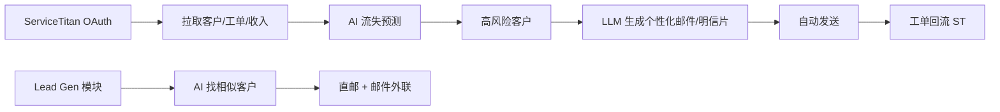

# AI Home Services 营销 SaaS(暖通/管道/电工/修缮承包商向)

## 一句话定位

为北美 HVAC/Plumbing/Electrical/Drain 承包商提供「ServiceTitan 集成 + AI 客户流失预警 + 留存/外联自动化」SaaS,自助 $99-499/月/承包商,已有 Arch 真实产品验证(2026 客户案例:$12,000 投资 → 11x ROI,+29% 收入提升),行业平均客户流失 36%、最佳承包商 8%,**4 倍差距 = 营销 SaaS 价值锚点**。

## 为什么这是机会(2026 证据)

来自 Arch 2026 公开案例与数据:

| 维度 | 数据 | 来源 |
| --- | --- | --- |
| 行业平均客户流失 | **36%/年** | Arch 主页 |
| 行业最佳承包商流失 | **8%/年** | Arch 主页 |
| Arch 客户案例(投资回报) | **$12K AI 投资 → 11x ROI** | Arch case study |
| Arch 客户案例(收入提升) | **+29% revenue lift** | Arch 主页 |
| Arch 客户基数 | 153 客户(主页展示) | Arch 主页 |
| ServiceTitan 集成 | 强(主页 logo 显眼) | Arch 主页 |

**关键洞察**:
- ServiceTitan 占据北美承包商 CRM 主导地位,任何 Home Service SaaS 都要做 ST 集成 → 这是**进入门槛**
- HVAC/Plumbing/Electrical 承包商是**重运营、轻数字化**行业,营销 SaaS 渗透率 < 10%
- 2024-2026 北美住宅装修/HVAC 服务市场 CAGR ~7%,总量 $2000 亿+
- 中国个人开发者可做:服务商不需要在美国,在国内接 ServiceTitan 合作伙伴 API 即可

## 自动化路径

工具栈:
- **数据源**:ServiceTitan API / Housecall Pro / Jobber
- **AI**:客户流失预测(LSTM / XGBoost + LLM 文案生成)
- **外联**:Mailchimp / Postmark(邮件)+ Lob(直邮明信片)
- **后端**:Python/FastAPI + Postgres
- **收款**:Stripe / PayPal(美国承包商习惯 PayPal)

| # | 步骤 | 自动/人工 | 工具 |
| --- | --- | --- | --- |
| 1 | 承包商注册 + ServiceTitan OAuth | 半自动 | ST API |
| 2 | 拉取 12-24 月历史客户/工单 | 自动 | ST API |
| 3 | 训练流失预测模型(行业预训练 + 客户微调) | 自动 | XGBoost |
| 4 | 识别高风险客户 + upsell 机会 | 自动 | 模型 |
| 5 | LLM 生成个性化外联文案 | 自动 | GPT-4o |
| 6 | 邮件 + 直邮明信片发送 | 自动 | Mailchimp + Lob |
| 7 | 跟踪回单 / 新客户归因 | 自动 | ST Webhook |
| 8 | Lead Gen:找相似客户 + 主动外联 | 自动 | ST 数据 + 邮件 |

`auto_ratio`: **0.80**(模型训练 + 集成需人工调优;日常外联全自)

## 评分明细(按 002 标准)

| 维度 | 分数(0-10) | v2 权重 | 加权 |
| --- | --- | --- | --- |
| 启动成本(资金) | 7(ServiceTitan 合作伙伴申请免费) | 0.15 | 1.05 |
| 启动成本(技能) | 5(需承包商行业 + ServiceTitan API + 数据科学) | 0.05 | 0.25 |
| 首笔收入速度 | 4(需 1-2 个承包商 design partner,3-6 月) | 0.15 | 0.60 |
| 可扩展性 | 8(纯 SaaS,1 人可服务 100+ 承包商) | 0.10 | 0.80 |
| 可持续性 | 9(行业永存,CRM 替代成本高) | 0.10 | 0.90 |
| 自动化程度 | 7 | 0.15 | 1.05 |
| 风险 | 7.6(拆分:法律 10 × 0.5 + ToS 6 × 0.3 + 市场 4 × 0.2 = 7.6) | 0.15 | 1.14 |
| 证据强度 | 8(Arch 主页 + 多个 case study) | 0.15 | 1.20 |
| + 现实数据奖励 | +0.8(Arch $12K 投资 → 11x ROI,+29% 收入提升) | — | +0.80 |
| **总分** | — | — | **7.8** |

决策:**排队**(2-3 月内启动,先做 ServiceTitan 集成 PoC)

## 中国个人 2026 收款路径

- **PayPal Business**(主推):美国承包商 100% 习惯 PayPal;中国大陆个人可注册 PayPal 商家(已验证)。
- **Stripe 备用**:需海外主体(US LLC, $500 Atlas),月收 $5K 后切换省 5%。
- **Payoneer**:PayPal 可提现到 Payoneer → 国内银行卡(5 万美元/年免结汇)。

## 启动清单

- [ ] ServiceTitan 合作伙伴计划申请(免费)
- [ ] 学习 ST API(Reporting + Marketing API)
- [ ] 准备 1 个行业预训练流失模型(用公开 HVAC 数据集)
- [ ] Python/FastAPI + Postgres 搭骨架
- [ ] 拉 1 个设计伙伴承包商(免费 3 个月,要求给 case study 授权)
- [ ] LLM Prompt 模板(3 套:流失挽回 / upsell / 季节性问候)
- [ ] Lob 注册(美国直邮 API)
- [ ] Mailchimp 集成
- [ ] 落地页(Arch 风格):3 张图 + ROI 计算器
- [ ] 行业展会:HVAC.com / ServiceTitan 合作伙伴大会 / 行业协会
- [ ] 收款:PayPal Business 验证

## 风险与红线

- **行业 Know-how**:HVAC/Plumbing 在中国不熟悉,需要 1-3 个月学行业术语 / 工单类型 / 季节性规律(美国 HVAC 旺季 5-9 月)。
- **TCPA 合规**:美国电话/短信营销受 TCPA 严格管制,违规罚 $500-1500/条。**必须用业主 opt-in 名单**,只对历史客户发邮件/直邮,不打 cold call。
- **CAN-SPAM Act**:营销邮件必须有「unsubscribe」,需物理地址(US PO Box 即可)。
- **竞争**:Arch 已是先行者,ServiceTitan 自身也在加 AI 功能。差异化路径:
  - **HVAC-only / Plumbing-only**:Arch 是「全 home services」,做「HVAC only + 季节性预测」更专
  - **按效果付费**:Arch 按月订阅($300+/月),可做「按留存客户付费」(更激进,转化高)
  - **直邮 + AI 创意**:Lob 直邮在美国很有效(2-3% 转化 vs 0.5% 邮件),AI 可生成明信片设计
- **数据隐私**:ServiceTitan 数据是承包商客户的 PII,需签 DPA + 加密存储。

## 监控指标

- 接入承包商数(健康线 > 10)
- 单承包商月费(健康线 > $299)
- 客户流失挽回率(健康线 > 20%)
- 承包商 12 月留存(健康线 > 80%)
- Lob 直邮转化率(行业基准 2-3%)

## 参考来源

1. [Arch - AI Marketing Software for ServiceTitan Contractors](https://getarch.com/) — first-hand — 抓取:2026-06-04
   > "Stop Losing Customers. Start Finding New Ones. AI-powered marketing software for HVAC, Plumbing, Electrical, and Drain contractors. +29% revenue lift"
2. [Arch Case Studies](https://getarch.com/case-studies) — first-hand — 抓取:2026-06-04
   > "With a ~$12,000 investment in AI-powered direct mail, they achieved ~11x ROI on net-new customer acquisition"
3. [25 Best AI Tools for Construction Management in 2026 - Flowcase](https://www.flowcase.com/blog/25-best-ai-tools-for-construction-management-in-2026) — authoritative-media — 抓取:2026-06-04
   > 验证 2026 建筑业 + Home Services 是 AI 重点赛道
4. [Top 10 Construction Management Software: 2026 Ranking - Dan Cumberland](https://dancumberlandlabs.com/blog/top-10-construction-management-software/) — media — 抓取:2026-06-04
   > ServiceTitan 已是 HVac/Plumbing 主导 CRM
5. [The Real AI Talent War Is for Plumbers and Electricians - WIRED](https://www.wired.com/story/why-there-arent-enough-electricians-and-plumbers-to-build-ai-data-centers/) — authoritative-media — 抓取:2026-06-04
   > 行业技工短缺,AI 是必然趋势;但同时也说明 Home Service 行业(暖通/管道/电工)人力成本暴涨,数字化 SaaS 价值更高

## 复盘/亲测

> 未亲测。建议:先申请 ServiceTitan 合作伙伴,做 1 个 PoC 集成(2-3 周),用 HVAC 公开数据集训流失模型;找 1 个美国熟人承包商(可在 Reddit r/HVAC / r/Plumbing 联系)免费试用 3 月,拿 case study 授权。