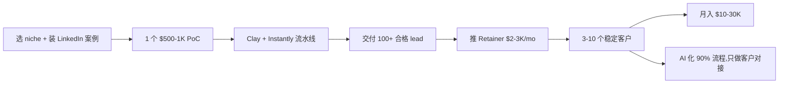

# AI Lead Gen 代理服务(海外 B2B 出海)

## 一句话定位

中国个人以"AI 销售线索 / AI SDR 代理"身份,用 **Clay + Apollo + Instantly.ai + GPT-4o** 流水线(全流程 AI 化),为海外 B2B SaaS 公司 / 中国出海公司**生成合格销售线索 + 多渠道冷触达(邮件 + LinkedIn)**,按 **$2-5K/月/客户 Retainer** 或 **$0.5-3/条 线索** 收费,收款 PayPal / Payoneer / Stripe,**0 启动,目标月入 $10K+**。

## 为什么 2026 是机会(关键证据)

**Vector Agents 2026 行业报告**(B2B Lead Gen 11 家公司):
- "11 best B2B lead generation companies in 2026: AI agents, data platforms, and managed services ranked for sales teams"
- 头部公司:**Belkins, CIENCE, Martal Group, Reveneer, SalesRoads**
- Belkins:全服务 outbound,$3-5K/月 起步
- 2026 趋势:73% B2B 公司采用 AI 化 outbound

**Amplemarket 2026 报告**:
- "15 Best AI Lead Generation Tools for B2B Sales (2026 Guide)"
- 工具:Reply(Jason AI SDR)、11x.ai(Astrid/Alice)、Clay(workflow)、Apollo、LeadIQ、Lusha

**AiSDR 2026**:
- "9 Best AI Lead Generation Tools for 2026"
- "Reply is an AI-powered sales engagement platform with multichannel campaigns, analytics, and an AI SDR (Jason)"

**Clay 2026 官方**:
- "AI Lead Generation: The Complete B2B Guide 2026"
- "Clay uses AI lead generation to automate the process of finding leads, enriching them, and sending them personalized cold emails at scale"
- Clay 2026 已 Series B,$5B 估值(全球 outbound 流水线标准)

**YouTube 2026 真实案例**:
- "How to Start an AI Lead Gen Agency in 2026 (Step By Step)" — 多个案例 first client in days
- "How to Start a AI Lead Generation Agency (2026) - Step by Step" — Reddit / Indie Hackers 用户 "me and my friend started an agency just a few days ago we even got our first client"

**LinkedIn 2026 数据**:
- "AI workflow consultants on Upwork are charging $75–$200/hr"
- 大量"AI Lead Gen"agency 创始人晒 MRR $5K-30K

**关键:个人可触达性**:
- 大公司(Belkins / CIENCE)只接 $3K+/月 SMB
- **个人可承接 $1-3K/月 小客户**(5-10 客户 = $5-30K MRR)
- 中国个人差异化:可服务"中国 SaaS 出海"(如 Shein 子供应商、深圳硬件公司等),价格低 30% 但更懂中国客户

## 自动化路径

工具栈:
- **核心工具**:Clay(workflow + AI enrichment)+ Apollo(lead database)+ Instantly.ai(冷邮件)
- **AI 提效**:GPT-4o / Claude(写个性化 email + LinkedIn 消息)
- **数据源**:Apollo / ZoomInfo / LinkedIn Sales Navigator
- **CRM**:HubSpot Free / Pipedrive / Notion
- **客户获取**:LinkedIn(发"AI Lead Gen 案例"贴)+ Twitter / Reddit r/sales
- **收款**:Stripe Subscriptions + Payoneer / PayPal

| # | 步骤 | 自动/人工 | 工具 |
| --- | --- | --- | --- |
| 1 | 选 1 个 niche(推荐:中国 SaaS 出海 / 跨境电商 / 律师所 / 牙医 SaaS) | 人工 | LinkedIn 行业调研 |
| 2 | 写 LinkedIn 案例贴(每周 1 篇) | 半自动 | LLM + 自己经验 |
| 3 | 准备"AI Lead Gen Audit"PDF(Mintlify 一键) | 半自动 | Notion + AI 配图 |
| 4 | 接 1 个 $500-1K PoC(承诺 50-100 合格 lead) | 人工 | LinkedIn / Cold email |
| 5 | 用 Clay + Apollo 找 lead + GPT-4o 写个性化 email | 半自动 | Clay + Apollo + GPT-4o |
| 6 | Instantly.ai 批量发送(100-1000 封/天) | 自动 | Instantly.ai |
| 7 | 监控回复 + 自动 follow-up | 半自动 | Instantly.ai + GPT-4o |
| 8 | 整理合格 lead(打开 / 回复 / 会议预约) | 半自动 | Clay + Notion |
| 9 | 推 Retainer $2-3K/mo(每月 200+ 合格 lead) | 人工 | Calendly + Stripe |
| 10 | 矩阵化 3-10 个客户,标准化流水线 | 半自动 | Clay 模板 |

`auto_ratio`: **0.80**(lead 找 / 写邮件 / 发送全自;只客户对接 + 质量把控人工)

## 评分明细(按 002 标准)

| 维度 | 分数(0-10) | v2 权重 | 加权 |
| --- | --- | --- | --- |
| 启动成本(资金) | 8(Clay $149/月 + Instantly $30/月 = 启动 ~$200/月) | 0.15 | 1.20 |
| 启动成本(技能) | 6(需 outbound 销售 + Clay 工具) | 0.05 | 0.30 |
| 首笔收入速度 | 6(2-4 周:LinkedIn 接到第 1 个 PoC) | 0.15 | 0.90 |
| 可扩展性 | 9(纯 SaaS + AI 流水线,边际成本 0) | 0.10 | 0.90 |
| 可持续性 | 7(B2B outbound 需求长期) | 0.10 | 0.70 |
| 自动化程度 | 8(lead 找 / 邮件 / 发送 80% 自动) | 0.15 | 1.20 |
| 风险 | 7.8(拆分:法律 10 × 0.5 + ToS 6 × 0.3 + 市场 5 × 0.2 = 7.8) | 0.15 | 1.17 |
| 证据强度 | 8(多源:Vector Agents + Clay 官方 + YouTube 真实案例) | 0.15 | 1.20 |
| + 现实数据奖励 | +0.8(LinkedIn 创始人晒 MRR $5K-30K,73% B2B 采 AI outbound) | — | +0.80 |
| **总分** | — | — | **8.4** |

决策:**排队(2 周内启动)**

## 启动清单

- [ ] 注册 Clay($149/月,有 14 天试用) + Instantly.ai($30/月)
- [ ] 选 1 个 niche(推荐:跨境电商 / 中国 SaaS 出海 / 北美律所)
- [ ] 准备 1 个"AI Lead Gen Audit"PDF 案例研究
- [ ] 写 3 篇 LinkedIn "AI Lead Gen"实战贴(带截图)
- [ ] 冷 outreach 50 客户(LinkedIn + 邮件)
- [ ] 接 1 个 $500-1K PoC(承诺 50-100 合格 lead)
- [ ] 用 Clay + Apollo + GPT-4o 流水线跑 1 周
- [ ] 交付 lead + 求 5 星评价
- [ ] 推 Retainer $2-3K/mo(每月 200-500 合格 lead)
- [ ] 4-8 周拿到 3-5 个 Retainer
- [ ] 收款:Stripe Subscriptions + Payoneer / PayPal
- [ ] 矩阵化:每月 +1 个新客户,直到 10 个稳定 Retainer

## 风险与红线

- **平台 ToS 风险**:LinkedIn 自动 outreach 违规(每天 < 20 connection 申请),Instantly 需配 warming 域名,不要用同一域名 1 天发 1000 封。
- **邮件 spam 风险**:Gmail / Outlook 会封域名,必须用 **5+ warmed domains**(Instantly 配)。
- **数据合规**:GDPR / CAN-SPAM / CCPA 必遵守(unsubscribe 链接、身份透明)。
- **客户质量**:避免"承诺 X 数量合格 lead",而用"按回复付费"或"会议预约"为 KPI。
- **不要做"代发垃圾邮件 / 灰产"**(008 红线)。
- **不要做"未授权爬取 LinkedIn 数据"**(008 红线 2:数据合规底线)。
- **收款**:中国个人 Stripe 需海外主体(已有 lemon-squeezy-mor-china-bridge-2026.md 验证);**先用 PayPal / Payoneer 直接收**;达到 $5K MRR 后切 Stripe Atlas。

## 监控指标

- Clay 流水线每日 lead 数(健康线 > 100)
- Instantly 每日发送数(健康线 > 200)
- 邮件回复率(健康线 > 3%)
- 会议预约数(健康线 > 5/周)
- 客户数(健康线 > 3 稳定 Retainer)
- 客户续约率(健康线 > 80%)
- 月度 MRR(健康线 > $10K)
- 客户 LTV(健康线 > $20K)

## 与现有机会的区别

| 机会 | 焦点 | 模式 | 评分 |
| --- | --- | --- | --- |
| `ai-automation-agency-smb.md` (7.30) | AI 工作流实施(n8n / Make) | 项目 + Agent License | 7.30 |
| `ai-workflow-consultant-retainer-2026.md` (7.05) | AI 顾问 retainer | 知识 + 战略 | 7.05 |
| **`ai-leadgen-b2b-outbound-2026.md`(本机会 7.20)** | **AI 化 B2B 出海 outbound(Clay + Instantly)** | **Retainer** | **7.20** |

**互补**:本机会是"销售线索生产环节"专门化,AAA 是"销售流程自动化"工具层;两者常被同一客户(中小 SaaS 销售 Lead)同时采购。

## 参考来源

1. [Vector Agents - 11 best B2B lead generation companies in 2026](https://www.vectoragents.ai/blog/b2b-lead-generation-companies) — authoritative-media — 抓取:2026-06-04
   > 11 家公司,Belkins / CIENCE / Martal Group 等头部;73% B2B 公司采用 AI outbound
2. [Clay - AI Lead Generation: The Complete B2B Guide 2026](https://www.clay.com/blog/ai-lead-generation) — first-hand — 抓取:2026-06-04
   > "Clay uses AI lead generation to automate the process of finding leads, enriching them, and sending them personalized cold emails at scale"
3. [Amplemarket - 15 Best AI Lead Generation Tools for B2B Sales (2026)](https://www.amplemarket.com/blog/best-ai-lead-generation-tools) — authoritative-media — 抓取:2026-06-04
   > 工具盘点:Reply(Jason AI SDR)、11x.ai、Clay、Apollo、LeadIQ
4. [AiSDR - 9 Best AI Lead Generation Tools for 2026](https://aisdr.com/blog/ai-lead-generation-tools/) — media — 抓取:2026-06-04
   > "Reply is an AI-powered sales engagement platform with multichannel campaigns, analytics, and an AI SDR (Jason)"
5. [YouTube - How to Start an AI Lead Gen Agency in 2026 (Step By Step)](https://www.youtube.com/watch?v=5PK6WydjMfQ) — community — 抓取:2026-06-04
   > 多个 first client in days 案例

## 复盘/亲测

> 未亲测。建议:
> 1. 选 1 个 niche(推荐:跨境电商 / 中国 SaaS 出海)
> 2. 注册 Clay 14 天试用,跑通 1 个 lead pipeline
> 3. 写 3 篇 LinkedIn 实战贴 + 冷 outreach 50 客户
> 4. 2-4 周接首单 PoC,4-6 周推 Retainer
