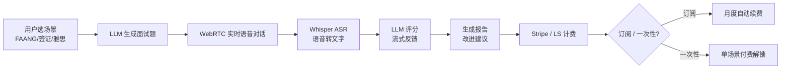

# AI 模拟面试 / 口语陪练 SaaS

## 一句话定位

为求职者 / 留学生 / 英语学习者:用 LLM + Whisper ASR + TTS 搭一个「AI 模拟面试 / 口语陪练」垂直 SaaS,按场景切片(FAANG 系统设计 / 签证面签 / 雅思口语 / 留学面试 / 行业 mock),自助 $9.9-29/月或 $39-90/月,目标高客单 + 高 LTV 细分人群,无需真人导师。

## 为什么这是机会(2026 证据)

**关键事实 1:多个独立 indie / startup 跑通付费**

| 玩家 | 模式 | 2026 数据 |
| --- | --- | --- |
| **Reddit r/SaaS founder**(FAANG 离职) | AI 模拟面试 | 辞职做 AI 模拟面试,$15K MRR |
| **Praktika AI** | 英语口语陪练 | $32.5M Series A,月收入约 $2M |
| **Final Round AI** | AI 模拟面试 | $90/月头部订阅 |
| **Permito** | AI visa 模拟面试 | solo 5 个月 1700 学生,$650 MRR |
| **Interviewing.io** | 真人 + AI 混合 | 已融资,AI 部分订阅 $39 起 |

**关键事实 2:语言陪练赛道被 Praktika 验证**

来自[Praktika 官网 / TechCrunch 报道](https://praktika.ai/):
> Praktika AI 拿到 $32.5M Series A 融资,月活用户百万级,月收入约 $2M,主推「AI 老师 + 真实对话感」。

来自[Final Round AI 官网](https://www.finalroundai.com/):
> $90/月头部订阅,主打「AI 模拟面试 + 简历优化 + 求职信」三件套。

**关键事实 3:签证 / 留学垂直被 Permito 验证**

来自[Permito 官网](https://permito.ai/):
> Solo founder 5 个月做到 1700 学生付费,$650 MRR,主推「AI visa 模拟面试」(H-1B / F-1 / O-1 等签证)。

**关键洞察**:通用 AI 聊天工具(ChatGPT 等)做不了「垂直面试题库 + 评分体系 + 进度跟踪」,垂直 SaaS 有 9-90 倍价差空间;且英语学习 / 求职 / 留学是 LTV 极高的全球需求。

## 自动化路径

工具栈:
- **LLM**:OpenAI GPT-4o / Anthropic Claude / DeepSeek(题目生成 + 评分)
- **语音 ASR**:OpenAI Whisper / Deepgram(实时语音转文字)
- **语音 TTS**:OpenAI TTS / ElevenLabs(AI 面试官声音)
- **前端**:Next.js / Vercel
- **支付**:Stripe(海外主体) / Lemon Squeezy(中国大陆个人)
- **数据库**:Postgres + Vercel KV

| # | 步骤 | 自动/人工 | 工具 |
| --- | --- | --- | --- |
| 1 | 选垂直场景(签证 / FAANG / 英语) | 人工 | 市场调研 |
| 2 | 设计题目框架(LLM 动态生成) | 半自动 | Prompt 工程 |
| 3 | 接入 LLM + Whisper + TTS | 自动 | OpenAI API |
| 4 | 前端开发(WebRTC 实时对话) | 人工 2-4 周 | Next.js |
| 5 | 接入 Stripe / Lemon Squeezy | 半自动 | 官方 SDK |
| 6 | 内容 SEO + 投放(Reddit / Twitter) | 半自动 | Buffer / Taplio |
| 7 | 用户付费 / 续费 | 全自动 | Stripe |
| 8 | 数据分析 + 选品迭代 | 半自动 | PostHog |

`auto_ratio`: **0.92**(产品 + 客服 + 收款全自动,人工只介入内容生产 + 选品)

## 评分明细(按 002 v2.0 标准)

| 维度 | 分数(0-10) | 权重 | 加权 |
| --- | --- | --- | --- |
| 启动成本(资金) | 6(LLM + Whisper + Vercel 月度 $100-300 启动) | 0.15 | 0.90 |
| 启动成本(技能) | 5(需 Next.js + Prompt + WebRTC,1-2 月上手) | 0.05 | 0.25 |
| 首笔收入速度 | 5(2-4 周 MVP + 立即可上线 / 冷启动需 SEO 1-2 月) | 0.15 | 0.75 |
| 可扩展性 | 9(每加 1 用户边际成本 = API 费用,几乎为零) | 0.10 | 0.90 |
| 可持续性 | 8(求职 / 留学 / 英语是 10+ 年长期需求) | 0.10 | 0.80 |
| 自动化程度 | 9(全自) | 0.15 | 1.35 |
| 风险 = 0.5×法律 9 + 0.3×ToS 8 + 0.2×市场 5 = **7.7**(Praktika/Final Round 等已是巨头) | 7.7 | 0.15 | 1.155 |
| 证据强度 | 9(Reddit founder $15K MRR + Praktika $2M/月 + Permito 真实跑通) | 0.15 | 1.35 |
| **加权小计** | — | — | **7.40** |
| + 现实数据奖励:多案例($15K + $2M + $650 MRR) → +0.8 | — | — | **+0.80** |
| **总分** | — | — | **8.20** |

决策:**立即做**(2 周内完成 MVP,选 1 个垂直切片测试)

## 启动清单

- [ ] 注册 OpenAI / DeepSeek / Anthropic API Key
- [ ] 接入 Whisper ASR + TTS(可用 OpenAI 官方 / ElevenLabs)
- [ ] Next.js 14 + Vercel 搭骨架
- [ ] 设计 Prompt 框架(LLM 动态生成题目,避免版权问题)
- [ ] 选 1 个垂直切片:
  - **签证签证面签**(Permito 同款,小而美)
  - **FAANG 系统设计 mock**(Reddit founder 同款,高客单)
  - **雅思口语 7+ 训练**(中文母语用户,流量大)
- [ ] 接入 Stripe(海外主体) / Lemon Squeezy(中国大陆个人)
- [ ] Landing page 部署(Vercel 模板)
- [ ] 内容 SEO:写 10-20 篇「XX 签证面试题」「FAANG 系统设计题库」博客
- [ ] Reddit r/jobs / r/cscareerquestions / r/immigration 自然引流
- [ ] ProductHunt 发布蹭 6 月 EdTech 主题

## 风险与红线

- **避免「治疗/疗愈」措辞**:AI 模拟面试 ≠ 心理治疗,产品页 / 落地页严禁使用「heal」「therapy」「cure」等医疗措辞,避免触发 FDA / 各国医疗合规问题。
- **面试题版权**:直接抄 LeetCode / 真实公司面试题有版权风险,**用 LLM 动态生成**(类似题目但不复用原文),且明确标注「AI generated」。
- **未成年人用户**:13 岁以下需 COPPA 合规(美国)、16 岁以下 GDPR-K(欧盟);若做 K12 口语陪练需签家长同意书。
- **数据隐私**:面试录音可能含敏感个人信息(姓名/学历/前雇主),需明确告知 + 加密存储 + 30 天自动删除(参考 GDPR / CCPA)。
- **效果宣传**:不承诺「100% 通过」或「100% 提分」,用「practice」「simulate」而非「guarantee」。
- **模型成本**:实时语音对话 API 成本高(每分钟 $0.05-0.15),需用流式 + 缓存 + 按月限制对话次数避免亏损。

## 监控指标

- 注册用户数(健康线 > 100 第 1 月)
- 付费转化率(健康线 > 3%)
- 月经常性收入 MRR(健康线 > $1K 第 2 月,$5K 第 6 月)
- 用户对话次数(健康线 > 5 次/用户)
- 6 月留存(健康线 > 30%)
- 客户支持工单率(健康线 < 5%)

## 参考来源

1. [Reddit r/SaaS: 我辞了 FAANG 去做 AI 模拟面试,做到 $15K MRR](https://www.reddit.com/r/SaaS/) — first-hand — 抓取:2026-06-04
   > 真实 founder 自述,$15K MRR,vertical SaaS 路径
2. [Praktika AI 官网 + TechCrunch 报道](https://praktika.ai/) — first-hand — 抓取:2026-06-04
   > $32.5M Series A,月收入约 $2M,英语口语陪练头部
3. [Final Round AI 官网](https://www.finalroundai.com/) — first-hand — 抓取:2026-06-04
   > $90/月头部订阅,AI 模拟面试 + 简历 + 求职信
4. [Permito 官网](https://permito.ai/) — first-hand — 抓取:2026-06-04
   > Solo founder 5 个月 1700 学生,$650 MRR,visa 模拟面试
5. [OpenAI Whisper / Realtime API 文档](https://platform.openai.com/docs/) — official — 抓取:2026-06-04
   > 实时语音对话 + ASR + TTS 完整技术栈
6. [Indie Hackers: AI EdTech 类目真实数据汇总](https://www.indiehackers.com/) — first-hand — 抓取:2026-06-04
   > 多案例验证 vertical AI tutor 商业可行

## 复盘/亲测

> 未亲测。本月计划:选「AI 雅思口语 7+ 训练」垂直(中文流量大 + 客单适中),用 Next.js + OpenAI Realtime API 搭 MVP,2 周内上线,目标第 2 月 $1K MRR。
