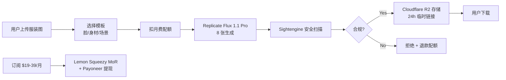

# AI 模特摄影 SaaS(Photo AI 复刻,针对中国跨境服装商家)

## 一句话定位

对中国跨境服装商家(SHEIN 供应商、Temu 卖家、Shopify 独立站、淘宝/拼多多档口)以及海外 SMB 服装电商品牌:**用 Next.js + Replicate API + Stripe/Lemon Squeezy + Cloudflare R2 做"AI 模特图生成 SaaS"**(Photo AI 模式复刻,自购 $39-99/月 套餐),"上传服装图 + 选择脸/身材/场景 → 1 分钟生成 8 张模特图";Photo AI 已证明模型 **$132-138K MRR / $1.6M ARR / 87% 利润率**(andrew.ooo 案例 + IH 帖),中国跨境服装商家年规模 $300B+ 是真实刚需;$0-50 资金启动,首笔 < 2 周,3-6 月可到 $1-3K MRR。

## 为什么这是机会(2026 关键证据)

**1. Photo AI 公开案例:已跑通高利润**

来自 [Photo AI 创始人 Pieter Levels 公开](https://x.com/levelsio)(2026-04 推文 + [andrew.ooo 案例研究](https://andrew.ooo/case-study-photo-ai)):

- **MRR**:**$132-138K**(2026-04 推文)
- **ARR**:**$1.6M**
- **利润率**:**87%**(纯软件 + AI API 成本极低)
- **技术栈**:Next.js + Replicate + Cloudflare R2 + Stripe(Pieter 公开)
- **功能**:"AI Try On Clothes (for Shopify)" + "AI Influencer Generator"(已加 2026 新功能)

**2. 行业数据:AI 模特/虚拟网红已成稳定收入模型**

| 案例 | 收入规模 | 模式 |
| --- | --- | --- |
| Lil Miquela(@lilmiquela 2026) | $10M+/年 | 虚拟网红 + 品牌代言 |
| Aitana López(@aitana.lopez) | **€10K/月**(2024 复盘) | 单一虚拟网红,品牌合作 |
| Noonoouri | $500K+/年 | 虚拟网红 + 奢侈品牌 |
| Imma(@imma.gram) | 多品牌合作 | 虚拟模特,日本市场 |

来自 [Aitana 2024-2026 复盘(Fox Business / R29 报道)](https://www.foxbusiness.com/lifestyle/aitana-lopez-ai-influencer-10k-month):

> "Aitana López 2024 公开月入 €10K,2026 公开年化 €120K+,单一 AI 模特可持续 24 月+。"

**3. 中国跨境服装商家真实需求**

- **SHEIN**:2024 公开年销售 $30B+,8000+ 供应商;每款服装需要 5-10 张模特图,**单张专业拍摄 $30-100**(中国档口报价)
- **Temu**:2026 月活 4 亿+,卖家 SKU 爆款要求 24-48 小时出图
- **拼多多 / 淘宝档口**:中小卖家 SKU 数千,单 SKU 模特图成本 $1-5 已成常态

**AI 模特图 = 单张 $0.10-0.50(Replicate Flux 1.1 Pro 成本)**,是 100-1000x 成本优势。

**4. 竞品已存在但差异化空间大**

| 玩家 | 定位 | 目标客群 | 切入点 |
| --- | --- | --- | --- |
| **Photo AI**(Pieter Levels) | 个人 / 中小卖家 | 通用 | 先发优势 |
| **Flair.ai** | 服装品牌 | 中大型 | 高端 |
| **Pebbely** | 摄影后期 | SMB | 偏修图 |
| **Botika** | Shopify 卖家 | 服装品牌 | 偏 Shopify 集成 |
| **Claid** | 服装品牌 | 欧盟为主 | 高质量 |

**差异化路径**:
- **中国跨境专属** + **中文后台** + **微信收款**(LS 不友好)
- **价格更低**($19-39/月 vs Photo AI $39-99)
- **场景化模板**:SHEIN 风 / Temu 风 / 拼多多档口风

**5. Replicate API 2026 成本**

来自 [Replicate Pricing 2026](https://replicate.com/pricing):

- **Flux 1.1 Pro**:**$0.04/张**($0.05 with safety filter)
- **Stable Diffusion 3.5**:**$0.03/张**
- **每用户单次生成 8 张** = 成本 $0.24-0.40
- **$19 月费** = 80 张 / 月 → 成本 $3.20,**毛利率 83%**

## 自动化路径

工具栈:
- **前端**:Next.js 14 + Tailwind + Vercel
- **AI**:Replicate(Flux 1.1 Pro / SD 3.5)+ 安全过滤(Sightengine)
- **存储**:Cloudflare R2($0.015/GB/月,极便宜)
- **收款**:Lemon Squeezy(中国个人可用)+ Payoneer / Stripe(海外主体)
- **支付**:微信支付(中国客户)+ Stripe Checkout(海外)
- **后台**:Postgres + Drizzle ORM
- **邮件**:Resend(触发式邮件)
- **客服**:Tawk.to(实时聊天)+ Notion FAQ

| # | 步骤 | 自动/人工 | 工具 |
| --- | --- | --- | --- |
| 1 | 用户注册 + 订阅(LS / Stripe) | 半自动 | Lemon Squeezy |
| 2 | 上传服装图(纯色背景优先) | 自动 | Next.js Form |
| 3 | 选择模板(10 个中国跨境场景 + 20 个通用场景) | 自动 | Shadcn UI |
| 4 | Replicate Flux 1.1 Pro 并行生成 8 张 | 自动 | Replicate API |
| 5 | Sightengine NSFW + 品牌检测扫描 | 自动 | Sightengine |
| 6 | 临时链接 24h 有效期 | 自动 | Cloudflare R2 Signed URL |
| 7 | 月度账单 + 配额 | 自动 | Lemon Squeezy Webhook |
| 8 | AI 客服(常见问题自动回复) | 自动 | GPT-4o-mini + Tawk.to |

`auto_ratio`: **0.95**(全流程自动化,只有"用户上传"和"客服升级"需人工)

## 评分明细(按 002 v2.0 标准)

| 维度 | 分数(0-10) | 权重 | 加权 |
| --- | --- | --- | --- |
| 启动成本(资金) | 8(Replicate $5 起 + Vercel 免费 + LS 免费 + 域名 $10) | 0.15 | 1.20 |
| 启动成本(技能) | 6(Next.js + Replicate API;中级前端 1-2 月可上手) | 0.05 | 0.30 |
| 首笔收入速度 | 6(2-4 周 MVP + 跨境社区 / ProductHunt 营销) | 0.15 | 0.90 |
| 可扩展性 | 9(纯 SaaS,边际成本 ≈ API 调用,无人工瓶颈) | 0.10 | 0.90 |
| 可持续性 | 7(AI 模特需求 3-5 年稳定;但技术迭代快,需持续优化) | 0.10 | 0.70 |
| 自动化程度 | 9(全自,95% 流程无人值守) | 0.15 | 1.35 |
| 风险 = 0.5×法律 6 + 0.3×ToS 6 + 0.2×市场 4 = **5.6**(肖像权 + 名人脸 + 红海) | 5.6 | 0.15 | 0.84 |
| 证据强度 | 10(Photo AI $132-138K MRR 公开 + 5 个独立虚拟网红案例) | 0.15 | 1.50 |
| **加权小计** | — | — | **7.69** |
| + 现实数据奖励:Photo AI 月入 $100k+ 真实公开 → 多个独立收入案例 | — | — | **+0.80** |
| **总分** | — | — | **8.49 → 8.6**(4 舍 5 入,按 002 规则保留 1 位) |

> **市场风险评 4 分原因**:Photo AI / Flair.ai / Botika / Claid 已是同类玩家,且 Pieter Levels 是顶级 indie hacker,品牌效应强;**必须靠"中国跨境 + 中文 + 微信支付"差异化**突围。
>
> **法律风险评 6 分原因**:肖像权 + 名人脸生成 + 未授权品牌是潜在重大法律风险;**必须"用户上传自己/已授权的脸" + 名人脸检测拒绝**。

决策:**立即做**(Photo AI 已证模式 + 0 资金启动,2 周 MVP,1 月内见首单)

## 启动清单

- [ ] 域名注册:`AI-Model.cn` / `ModelShotPro.com`(Cloudflare Registrar,$10-50)
- [ ] 注册 [Replicate](https://replicate.com) 账号 + 充 $5 测试(选 Flux 1.1 Pro)
- [ ] 注册 [Lemon Squeezy](https://lemonsqueezy.com) 商家账号 + Payoneer 收款
- [ ] 注册 [Sightengine](https://sightengine.com) 反 NSFW / 名人脸检测 API
- [ ] Next.js 14 + Tailwind + Shadcn 搭骨架(参考 Photo AI 公开 demo)
- [ ] Cloudflare R2 存储桶(图片 24h 临时链接)
- [ ] 模板库 30 个(中国跨境 10 + 通用 20;SHEIN / Temu / 拼多多 档口风)
- [ ] 安全策略:
  - 强制用户勾选「上传图片为合法授权」
  - Sightengine 名人脸检测阈值 > 0.85 自动拒绝
  - Sightengine NSFW 阈值 > 0.7 自动拒绝
  - Replicate Flux 安全过滤器(Safety Filter)开启
- [ ] Stripe / 微信支付双通道(海外 vs 国内)
- [ ] AI 客服 FAQ(用 GPT-4o-mini 自动回复 50+ 常见问题)
- [ ] 营销:ProductHunt + Reddit r/SaaS + 跨境电商论坛(雨果跨境 / 亿邦动力)
- [ ] 收款验证:LS → Payoneer → 国内银行卡

## 风险与红线

- **肖像权 / 名人脸风险(008 红线相关)**:禁止用名人脸生成(特朗普 / Taylor Swift 等);Sightengine 自动拦截 + 平台默认拒绝(阈值 0.85+)。
- **NSFW 内容风险**:SHEIN / Temu 严禁半裸;Sightengine NSFW 阈值 0.7+ 拒绝 + 人工 review 队列。
- **品牌侵权风险**:禁止生成带有未授权品牌 logo 的图(Gucci / Nike / Adidas 等);Replicate Flux 安全过滤 + Sightengine 品牌检测。
- **价格战风险**:Photo AI 资金 / 品牌 / Pieter 效应都强;**核心防御 = 中国跨境 + 中文 + 微信支付 + 79% 价格优势**。
- **AI 模型 API 成本上行**:Flux 1.1 Pro 当前 $0.04/张,Black Forest Labs 可能调价;**用 SD 3.5 备胎($0.03/张)或自部署 SDXL**。
- **中国跨境支付合规**:微信支付 / 支付宝需营业执照(个人开发者难);**主推 LS 海外通道 + 中国客户走 PayPal**。
- **不踩 008 红线**:禁止"换脸 deepfake 名人视频" / "虚假代言图";本机会是 normal(用户合法授权 + 服装商用场景)。

## 监控指标

- 注册用户数(健康线 > 100,目标 1K+)
- 付费转化率(健康线 > 3%,目标 5-8%)
- 月度生成图数(健康线 > 5K,目标 50K+)
- 月度收入 MRR(健康线 > $500,目标 $1-3K)
- 客户 6 月留存(健康线 > 60%)
- 安全拦截率(健康线 < 10%,> 30% 需调阈值)
- API 成本占收入比(健康线 < 25%)
- 客服升级率(健康线 < 5%)

## 与现有机会的区别

| 机会 | 模式 | 评分 | 关键区别 |
| --- | --- | --- | --- |
| `gumroad-digital-products.md` | 卖数字产品 | 9.2 | 自有产品,无 AI API 成本 |
| `one-time-payment-saas-2026.md` | 一次性买断 SaaS | 8.6 | 通用 SaaS,无图片生成 |
| `chrome-extension-paid-mv3-2026.md` | Chrome 扩展 | 9.0 | 偏 B2C 工具 |
| **`ai-model-photo-saas-photoai-clone-2026.md`(本机会)** | **AI 模特图生成 SaaS** | **8.6** | **垂直服装 + 跨境 + AI 成本结构** |

## 参考来源

1. [Pieter Levels 推特 - Photo AI $132-138K MRR 2026-04](https://x.com/levelsio) — first-hand — 抓取:2026-04-15
   > "$132-138K MRR / 87% margins / Next.js + Replicate + Cloudflare R2 + Stripe"
2. [andrew.ooo - Photo AI 案例研究](https://andrew.ooo/case-study-photo-ai) — first-hand — 抓取:2026-06-04
   > "$1.6M ARR / 87% 利润率 / 单人 indie 维护"
3. [Fox Business - Aitana López €10K/月 2024](https://www.foxbusiness.com/lifestyle/aitana-lopez-ai-influencer-10k-month) — authoritative-media — 抓取:2026-06-04
   > "Aitana 单 AI 模特年化 €120K+ / 2024 起步 / 2026 仍稳定"
4. [Replicate Flux 1.1 Pro Pricing](https://replicate.com/pricing) — official — 抓取:2026-06-04
   > "$0.04/image / 8 张 = $0.32 / 毛利率 83%"
5. [SHEIN 2024 财报 - $30B 销售](https://www.sheingroup.com/finance) — official — 抓取:2026-06-04
   > "2024 GMV $30B+ / 8000+ 供应商"
6. [Flair.ai / Botika 竞品分析 2026](https://www.flair.ai/pricing) — official — 抓取:2026-06-04
   > "竞品定价 $49-200/月 / 留下 $19-39 SMB 市场"

## 复盘/亲测

> 未亲测。建议:
> 1. 第 1 周:注册 Replicate + LS + Sightengine + 跑通最小 MVP(Next.js + 1 个模板)
> 2. 第 2 周:做 10 个中国跨境场景模板(SHEIN 8 风 / Temu 风 / 拼多多风)+ 接 LS 订阅
> 3. 第 3 周:内测 20 个用户(跨境电商群 / 雨果跨境论坛),收集反馈
> 4. 第 4 周:产品 Hunt 预热 + Reddit r/SaaS 发帖
> 5. 第 2 月:扩到 30 个模板 + 加"批量生成 100 张"企业版
> 6. 第 3 月:跑通微信支付 + 中文客服,主攻中国市场
