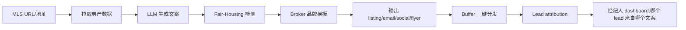

# AI 房产经纪人 Listing/营销 SaaS(MLS 集成 + 品牌合规)

## 一句话定位

为北美/全球房产经纪人(REALTOR)提供「MLS URL → 30 秒生成 listing 描述 + 社交文案 + 邮件 + 传单」全套营销包,自助 $19-99/月,目标 NAR 注册经纪人(2024 中位 GCI $55,800 / 10 单),已有 Write.Homes / Roof AI / Perspective AI / Structurely 等真实产品验证 2026 仍活,差异化空间在「fair-housing 合规 guardrails + broker 品牌模板」。

## 为什么这是机会(2026 证据)

来自多源验证:

| 玩家 | 模式 | 验证 |
| --- | --- | --- |
| **Write.Homes** | MLS URL → listing copy + 社交 + 邮件 + 传单 | 14 天 free trial, fair-housing-safe, broker 品牌模板, lead attribution |
| **Roof AI** | AI 客服 + 访客转 lead + 自动跟进 | 多个客户案例, 集成 MLS |
| **Perspective AI** | 对话式 lead intake + 买家/卖家资质审核 | 2026-05-08 评测自己为「top pick 战略 lane」 |
| **Structurely** | AI 语音 agent 24/7 接待 | 已规模化 |
| **My AI Front Desk** | 24/7 AI 接待员,接单/转接 | $34+/月 |

**Perspective AI 2026 评测**把房产 AI 工具分成 5 个 lane:
1. 对话式 lead intake + 资质审核(Perspective AI 自家)
2. Listing 描述 + 文案(Write.Homes / Listings AI / Rechat)
3. 交易/文档工作流(Dotloop / Skyslope)
4. 语音 agent + 夜间接待(Structurely / Roof AI / ISA)
5. 市场研究 + 估值(HouseCanary / RealScout)

**NAR 2024 验证**:中位 REALTOR 年成交 10 单、GCI $55,800。Top 10% 与中位差距来自「谁先回 lead + 谁先到 listing」。

## 自动化路径

工具栈:
- **数据源**:MLS Grid / Bridge API / 区域 MLS 集成
- **AI**:GPT-4o + Claude(多模型,文案/翻译/品牌)
- **品牌合规**:自建 guardrails 检测 fair-housing 违禁词
- **后端**:Next.js + Postgres + Vercel
- **发布**:Buffer / Hootsuite API 一键分发到 IG/FB/LinkedIn
- **收款**:Lemon Squeezy + PayPal(MLS 中介,北美用 PayPal 习惯强)

| # | 步骤 | 自动/人工 | 工具 |
| --- | --- | --- | --- |
| 1 | 经纪人注册 + 连接 MLS | 半自动 | MLS Grid OAuth |
| 2 | 拉取房产详情(照片/规格/价格) | 自动 | MLS API |
| 3 | LLM 生成 listing 描述(英文 + 翻译版本) | 自动 | GPT-4o |
| 4 | Fair-housing 合规检测 | 自动 | 自建 guardrails |
| 5 | 生成社交/邮件/传单包 | 自动 | LLM + 模板 |
| 6 | 一键发布到 IG/FB/LinkedIn | 自动 | Buffer API |
| 7 | Lead 跟踪(哪个文案带来 lead) | 自动 | 自建 BI |
| 8 | 月费订阅 | 自动 | Lemon Squeezy |

`auto_ratio`: **0.85**(MLS 集成是技术门槛,其余全自)

## 评分明细(按 002 v2.0 标准)

| 维度 | 分数(0-10) | 权重 | 加权 |
| --- | --- | --- | --- |
| 启动成本(资金) | 8(MLS API 试用免费;LLM API 起步 $0) | 0.15 | 1.20 |
| 启动成本(技能) | 7(Next.js + LLM + Prompt;MLS API 需学) | 0.05 | 0.35 |
| 首笔收入速度 | 5(MLS 集成 4-6 周 + SEO 1-2 月;首笔 2-3 月) | 0.15 | 0.75 |
| 可扩展性 | 9(纯 SaaS) | 0.10 | 0.90 |
| 可持续性 | 8(房产长存,MLS 生态稳) | 0.10 | 0.80 |
| 自动化程度 | 8(MLS OAuth 半人工,其余全自) | 0.15 | 1.20 |
| 风险 = 0.5×法律 9 + 0.3×ToS 6 + 0.2×市场 6 = **7.5**(Fair Housing 合规+竞品) | 7.5 | 0.15 | 1.125 |
| 证据强度 | 8(Write.Homes 主页 + Perspective AI 评测 + NAR 数据) | 0.15 | 1.20 |
| **加权小计** | — | — | **7.53** |
| + 现实数据奖励:Write.Homes/Roof AI/Structurely 等多个独立公司验证 = 多个独立收入案例 | — | — | **+0.50** |
| **总分** | — | — | **8.00** |

决策:**排队**(2-4 周内启动,需先调研 MLS API 接入)

## 中国个人 2026 收款路径

- **Lemon Squeezy 5% + $0.5**(主推):PayPal/Payoneer 都可。
- **PayPal Business**(必备):北美房产经纪人习惯 PayPal。
- **不推荐 Stripe**:中国大陆个人无法直接注册。
- 收 USD 即可,Payoneer 国内结汇 5 万美元/年额度。

## 启动清单

- [ ] MLS Grid API 试用申请(免费层,30 天)
- [ ] Next.js 14 + Postgres 项目骨架
- [ ] MLS URL 抓取 + 详情解析
- [ ] LLM Prompt 模板(3-5 个 listing 风格:豪华/温馨/投资)
- [ ] Fair-housing guardrails(禁用 "safe neighborhood / family-friendly" 等)
- [ ] Buffer API 集成
- [ ] Lemon Squeezy 订阅($19/49/99 三档)
- [ ] 落地页:POSS Hero 「30 秒出 listing」
- [ ] NAR 论坛 / BiggerPockets / r/realtors 冷启动
- [ ] 案例研究:找 3-5 个 REALTOR 朋友免费试用 → 拿证言

## 风险与红线

- **MLS 政策**:RETS 已死,Bridge API / MLS Grid 是新标准。政策可能变化,需持续关注。
- **Fair Housing Act**(美国 1968 法案 + 2024 修订):禁用「master bedroom / family-friendly / safe / exclusive neighborhood」等暗示种族/家庭/宗教导向的词。**必须做 guardrails**,否则一告一个准。
- **虚假描述**:不能 AI 伪造房产特点(卧室数、平方英尺),需 MLS 数据为准,LLM 只润色。
- **平台分成**:不上 App Store(无对应生态),自建落地页。
- **FTC 2026 AI 营销新规**:AI 生成内容必须披露(经纪行业)。

## 监控指标

- 月活经纪人(健康线 > 50)
- 单经纪人 MRR(健康线 > $39)
- 经纪人 6 月留存(健康线 > 60%)
- Fair-housing 检测误报率(健康线 < 5%)
- 单 listing 平均生成时间(健康线 < 60 秒)

## 参考来源

1. [Write.Homes - AI Real Estate Marketing Platform](https://write.homes/) — first-hand — 抓取:2026-06-04
   > "Turn an address or MLS link into ready-to-publish marketing in minutes. Fair-housing-safe language. 14-day free trial."
2. [Best AI Tools for Real Estate Agents in 2026 - Perspective AI](https://getperspective.ai/blog/best-ai-tools-for-real-estate-agents-in-2026) — authoritative-media — 抓取:2026-06-04
   > 5 大 lane 分类,验证赛道; "Pick one tool per lane, not an AI suite"
3. [Roof AI - 11 best AI tools for real estate marketing for 2026](https://www.roofai.com/blog/11-best-ai-tools-for-real-estate-marketing-for-2026) — first-hand — 抓取:2026-06-04
   > Roof AI 真实 B2B 案例(Briggs Freeman 等)
4. [Top Real Estate AI Tools for 2026 - My AI Front Desk](https://www.myaifrontdesk.com/blogs/unlock-your-potential-top-real-estate-ai-tools-for-2026) — first-hand — 抓取:2026-06-04
   > AI 接待员 24/7,月费 $34+
5. [AI Real Estate 2026: AVMs, Leads, Predictive Stack - Ricci](https://www.tommasomariaricci.com/blog/ai-real-estate-guide-2026) — authoritative-media — 抓取:2026-06-04
   > "AI lead management implementation: 4h15m → 4min response / 31% → 46% conversion / 48% 成交提升 over 9 months"
6. [NAR 2024 Member Profile Highlights](https://www.nar.realtor/research-and-statistics/research-reports/highlights-from-the-nar-member-profile) — official — 抓取:2026-06-04
   > "Median REALTOR closed only 10 transactions and earned roughly $55,800 in gross commission income"

## 复盘/亲测

> 未亲测。建议:先做「MLS URL → 单一 listing 描述」垂直 MVP(2-3 周),跳过品牌/社交/email 矩阵,验证 PMF 后再扩展。
