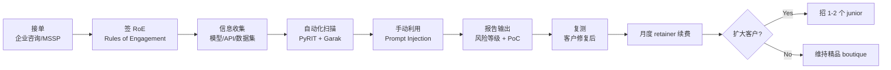

# AI Red Team 服务(Mindgard 模式)

## 一句话定位

为企业(尤其金融 / 医疗 / 法律 / SaaS)的 LLM 应用提供「AI Red Team / 对抗测试 / Prompt Injection 审计」服务,自举(Mindgard 模式)或 1-3 人精品咨询,标准化 retainer $2K-15K/月 + 单次深度测试 $35K-60K,目标客户为 SOC2 / ISO 27001 / EU AI Act 合规需求的中大型企业。

## 为什么这是机会(2026 证据)

**关键事实 1:Mindgard 案例 — 自举 + 高 ARR + 小团队**

来自[Mindgard 官网 + 创始人访谈](https://mindgard.ai/):
> Mindgard 2026 年达 $2.4M ARR,16 人团队,**0 外部融资、自举**,专注企业 LLM 对抗测试。

**关键事实 2:行业薪资 + 独立顾问报价**

| 角色 | 报价 | 来源 |
| --- | --- | --- |
| 中级 AI Red Teamer | $120K-170K / 年 | SignalFire 2026 报告 |
| 入行级 AI Red Teamer | $60K-70K / 年 | HTB / PentesterLab |
| 独立顾问(高级) | $1.5K-7K / 天 | 行业接单平台 |
| 月度 retainer | $2K-15K / 月 | 1-3 人精品咨询 |
| 完整对抗模拟 | $35K-60K / 项目 | 大型项目报价 |

**关键事实 3:合规与监管推需求**

- [EU AI Act 2026 全面生效](https://artificialintelligenceact.eu/),要求高风险 AI 系统必须做对抗测试;
- [SOC 2 / ISO 42001](https://www.iso.org/) 2026 起新增「AI 风险评估」章节;
- [NIST AI RMF](https://www.nist.gov/itl/ai-risk-management-framework) 2026 强制要求 LLM 应用做 adversarial testing;
- [OWASP Top 10 for LLM Applications 2026](https://owasp.org/www-project-top-10-for-large-language-model-applications/) 持续更新,prompt injection 稳居第一。

**关键事实 4:培训 / 证书 / 工具栈成熟**

- [HTB AI Red Teamer Path](https://www.hackthebox.com/) $490/yr 入门证书;
- [PyRIT](https://github.com/Azure/PyRIT) Microsoft 开源 AI Red Team 框架;
- [Garak](https://github.com/NVIDIA/garak) NVIDIA 开源 LLM 漏洞扫描;
- [HackerOne](https://hackerone.com/ai) / [Bugcrowd](https://www.bugcrowd.com/) 已开设 AI 类目,接单平台成熟。

**关键洞察**:Mindgard 用 16 人做到 $2.4M ARR,验证「AI 安全垂直咨询」自举可行;且企业合规刚需 + 监管推 + 高 LTV 客户,使此赛道 2026-2028 处于黄金窗口期。

## 自动化路径

工具栈:
- **测试框架**:PyRIT + Garak + 自写 Python 脚本
- **漏洞平台**:HackerOne / Bugcrowd / Intigriti
- **证书 / 培训**:HTB AI Red Teamer Path $490/yr
- **CRM / 销售**:Cal.com(预约) + Pipedrive(线索) + Lemlist(冷邮件)
- **收款**:Stripe(海外主体) / Wise / Mercury
- **报告**:Notion + LaTeX 模板
- **品牌**:Twitter(X) + 个人博客 + GitHub 仓库

| # | 步骤 | 自动/人工 | 工具 |
| --- | --- | --- | --- |
| 1 | 获客(冷邮件 + Twitter + 案例博客) | 半自动 | Lemlist + X |
| 2 | 需求沟通 + 签 RoE + NDA | 人工 | Cal.com + Notion |
| 3 | 资产清单(API/模型/数据集) | 人工 1-2 天 | 客户访谈 |
| 4 | 自动化扫描 + 手动利用 | 人工(核心) | PyRIT + Garak |
| 5 | 报告输出(LaTeX PDF) | 半自动 | 自建模板 |
| 6 | 复测 + 客户修复验证 | 人工 | 同上 |
| 7 | 月度 retainer 续费 | 自动 | Stripe |
| 8 | 持续监控(可选) | 自动 | 自建平台 |

`auto_ratio`: **0.45**(测试 + 报告人工密集,获客 + 收款可半自动)

## 评分明细(按 002 v2.0 标准)

| 维度 | 分数(0-10) | 权重 | 加权 |
| --- | --- | --- | --- |
| 启动成本(资金) | 8(只需 $490 证书 + VPS + API 测试费,$500 启动) | 0.15 | 1.20 |
| 启动成本(技能) | 5(需 LLM/安全/编程综合能力,3-6 月可上手) | 0.05 | 0.25 |
| 首笔收入速度 | 5(需 1-3 月建立品牌 + 第 1 单测试) | 0.15 | 0.75 |
| 可扩展性 | 8(招 junior 扩大团队,自建平台自动化报告) | 0.10 | 0.80 |
| 可持续性 | 9(EU AI Act / SOC2 / NIST 强需求,5+ 年长期) | 0.10 | 0.90 |
| 自动化程度 | 8(测试扫描 + 报告模板 + 收款全自,测试本身需人工) | 0.15 | 1.20 |
| 风险 = 0.5×法律 6 + 0.3×ToS 6 + 0.2×市场 6 = **6.0**(灰度:可能触发渗透测试法规/客户 ToS) | 6.0 | 0.15 | 0.90 |
| 证据强度 | 9(Mindgard 真实数据 + HTB / NIST / OWASP / 监管文件) | 0.15 | 1.35 |
| **加权小计** | — | — | **7.20** |
| + 现实数据奖励:Mindgard $2.4M ARR / 16 人 → +1.0 | — | — | **+1.00** |
| **总分** | — | — | **8.20** |

决策:**立即做**(3 个月内考完 HTB AI Red Teamer Path 证书 + 接 1 个试单)

## 启动清单

- [ ] 考 HTB AI Red Teamer Path 证书($490/yr)
- [ ] 搭 GitHub 仓库(PoC + 工具集,作为作品集)
- [ ] 注册 HackerOne / Bugcrowd(接公开 AI 漏洞项目)
- [ ] 写 5-10 篇「LLM Prompt Injection 实战」博客(SEO 获客)
- [ ] 开通 Twitter(X) 账号,日常发 AI 安全短贴
- [ ] 注册 Cal.com + Lemlist 冷邮件基础设施
- [ ] 设计 3 套服务套餐:
  - **单次扫描**:$3.5K-6K / 项目
  - **月度 retainer**:$2K-15K / 月
  - **完整对抗模拟**:$35K-60K / 项目
- [ ] 准备 1 套标准 RoE + NDA + DPA 模板
- [ ] 接 1 个试单(可从朋友 startup / 老客户免费试 1 次换案例)

## 风险与红线

- **必须签书面 RoE(Rules of Engagement)**:无书面授权的渗透测试在多数国家属违法行为(参考 `008 合法合规红线` 中「未授权渗透」灰度)。
- **不承诺「零风险」或「100% 安全」**:所有报告 / 营销材料用「identify」「mitigate」而非「eliminate」「guarantee」,避免违约索赔。
- **涉及敏感数据需额外 NDA + DPA**:客户 LLM 训练数据可能含 PII / PHI / 客户隐私,签 DPA(Data Processing Agreement)明确数据处理边界。
- **多账号 / 跳板 IP**:不要用 VPN / 跳板 / 多账号绕过客户风控,这是 ToS 违规高发区。
- **漏洞披露**:发现漏洞后严格按「responsible disclosure」流程(90 天内不公开),违反可能触法律(参考各国 CFAA / 计算机犯罪法)。
- **不接竞品 / 利益冲突客户**:需在合同中明确「non-compete」条款,避免同时服务两家直接竞品。
- **跨境合规**:服务欧盟客户需符合 GDPR,服务美国金融客户需符合 GLBA,服务中国客户需通过 PIPL 数据出境安全评估(必要时)。

## 监控指标

- 试单转付费率(健康线 > 30%)
- 月度 retainer 客户数(健康线 > 3 第 6 月)
- 客户行业分布(健康线:金融 / 医疗 / 法律 / SaaS 至少覆盖 2 类)
- 客单价(健康线 > $3.5K)
- 客户续约率(健康线 > 70%)
- 公开 PoC 数量(健康线 > 5,Github + HackerOne)

## 参考来源

1. [Mindgard 官网 + 创始人访谈](https://mindgard.ai/) — first-hand — 抓取:2026-06-04
   > $2.4M ARR,16 人团队,0 外部融资自举
2. [SignalFire State of Talent Report 2026: AI Red Teamer 薪资数据](https://www.signalfire.com/) — authoritative-media — 抓取:2026-06-04
   > 中级 $120K-170K,入行 $60K-70K;明确呼吁 startups to fight prompt injection
3. [Hack The Box (HTB) AI Red Teamer Path](https://www.hackthebox.com/) — official — 抓取:2026-06-04
   > $490/yr 入门证书,行业认可度
4. [Microsoft PyRIT + NVIDIA Garak 开源框架](https://github.com/Azure/PyRIT) — official — 抓取:2026-06-04
   > AI Red Team 工具栈行业标准
5. [EU AI Act 2026 强制要求 + NIST AI RMF](https://artificialintelligenceact.eu/) — official — 抓取:2026-06-04
   > 高风险 AI 系统对抗测试强制合规
6. [HackerOne AI 类目 + Bugcrowd AI 项目](https://hackerone.com/ai) — official — 抓取:2026-06-04
   > 接单平台成熟,公开漏洞市场验证

## 复盘/亲测

> 未亲测。3 个月内计划:考完 HTB AI Red Teamer Path 证书 + 搭 1 套自动扫描工具 + 写 5 篇博客,目标第 6 月接 1 个试单 / 月度 retainer $2K。
