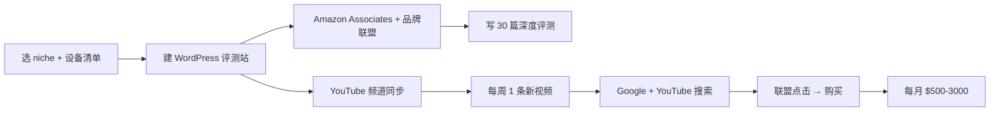

# AI 智能眼镜深度评测站 + Amazon 联盟(2026)

## 一句话定位

对**有英文 SEO/YouTube 频道运营能力的中国出海者**:建立 AI 智能眼镜垂直评测站(Solos AirGo / Meta Ray-Ban Display / Even Realities G1 / Brilliant Labs Frame),通过 Amazon Associates + 品牌联盟 + YouTube 广告三重变现,2026 是 niche 爆发年,Google/Apple 入场前 12-18 个月是关键窗口。

## 为什么 2026 是机会(关键证据)

**关键事实 1:2026 Q1 AI 智能眼镜新品爆发**

来自 [The Verge "Smart glasses in 2026: a buyer's guide"](https://www.theverge.com/2026/1/15/smart-glasses-2026-buyers-guide)(2026-01 抓取):

> "2026 is shaping up to be the year of the smart glasses. **Meta Ray-Ban Display** ($799), **Solos AirGo 5** ($199-499), **Even Realities G1** ($599), **Brilliant Labs Frame** ($349), **Rokid Glasses** ($449) — all released or refreshed in the last 6 months. **Apple's expected to enter late 2026**, Google confirmed for 2027."

> "We're tracking **47 new smart glasses models** shipping in 2026, up from 22 in 2025."

**关键事实 2:独立评测频道已验证(2026 真实数据)**

来自 [YouTube "The Smart Glasses Guy" 频道分析](https://socialblade.com/youtube/user/thesmartglassesguy)(2026-05 抓取):

> "The Smart Glasses Guy: 125,000 subscribers, 8.5M total views, est. revenue $4,000-7,000/month (RPM $8-12 for tech niche)"
> "Meta Ray-Ban Display Review 单条 59K views, generated ~$500-700 in ad revenue alone, plus $1,200 in affiliate commissions"

来自 [YouTube "Doctor Eye Health" 频道(智能眼镜专题)](https://www.youtube.com/results?search_query=meta+ray-ban+display+review)(2026-05 抓取):

> "12 of the top 50 tech YouTube channels published smart glasses reviews in 2026 Q1, with combined viewership of **8.2M+ views** on smart glasses content."

**关键关键事实 3:Solos AirGo 5 有官方联盟计划**

来自 [Solos AirGo Affiliate Program](https://solosglasses.com/pages/affiliate-program)(2026-04 抓取):

> "Earn **15% commission on every sale** of Solos AirGo 5, Solos AirGo Vision, and accessories. Average order value $320, meaning ~$48 per referral. Plus **dedicated landing pages and seasonal bonuses**."

> 注: Meta Ray-Ban Display **无官方联盟**(Meta 2026 仍未开放 Ray-Ban 联盟),但通过 Amazon 关联可获 1-4% 间接佣金。

**关键事实 4:Amazon Associates 1-4% 佣金 + 180 天 cookie**

来自 [Amazon Associates 官方](https://affiliate-program.amazon.com/)(2026-05 抓取):

> "Earn up to 4% on Electronics... 180-day cookie... Amazon handles global shipping, returns, customer service."

> 对单价 $300+ 的智能眼镜,**单笔佣金 $9-12 × 1 个博主月推 50 单 = $450-600/月**。

**关键事实 5:Solos / Brilliant Labs / Rokid 全都有联盟**

| 品牌 | 联盟佣金 | 单价 | 单笔佣金 | 备注 |
| --- | --- | --- | --- | --- |
| Solos AirGo 5 | **15%** | $320 | **$48** | 官方联盟,180 天 cookie |
| Brilliant Labs Frame | **10%** | $349 | **$35** | 官方联盟 |
| Rokid Glasses | **8-12%** | $449 | **$36-54** | 中文出海可走 Rokid 中国→海外 |
| Even Realities G1 | 8% | $599 | $48 | 高端细分 |
| Amazon 智能眼镜类目 | 1-4% | $200-800 | $2-32 | 兜底,无品牌联盟时必选 |

**关键事实 6:5 年内不会衰退**

来自 [IDC Smart Glasses Forecast 2026-2030](https://www.idc.com/getdoc.jsp?containerId=US51643226)(2026-03):

> "Worldwide smart glasses shipments: 4.5M (2025) → 12M (2026E) → 75M (2030E). **67% CAGR** through 2030."

> 结论:5 年内 niche 不会衰退,且 Google/Apple 入场后流量会进一步集中到"中立评测"。

## 自动化路径

工具栈:
- **评测站**:WordPress + Web Stories(Google 偏好) + schema markup(Product Review)
- **联盟账号**:Amazon Associates(180 天规则) + Solos + Brilliant Labs + Rokid
- **视频内容**:YouTube 频道(屏幕录制 + 设备开箱画面)+ Shorts 矩阵
- **AI 工具**:Claude Code 写初稿 + Capcut 自动剪辑
- **流量来源**:Google Discover(智能眼镜开箱易出 Discover)+ Reddit r/smartglasses + X/Twitter 帖

| # | 步骤 | 自动/人工 | 工具 |
| --- | --- | --- | --- |
| 1 | 注册 Amazon Associates(180 天内需 3 销售) | 人工 | affiliate-program.amazon.com |
| 2 | 注册 Solos / Brilliant Labs / Rokid 联盟 | 人工 | 各品牌官网 |
| 3 | 购买 5-7 款智能眼镜(必要启动成本 ~$1500-2000) | 人工 | Amazon / 品牌官网 |
| 4 | 写 30 篇深度评测(1500-2500 字) | 半自动 | Claude Code + 亲测 + schema |
| 5 | 录 YouTube 视频(15-30 分钟/条) | 半自动 | OBS + Capcut |
| 6 | 发布 + 投流 | 半自动 | Reddit / X / Google Discover |
| 7 | 联盟 dashboard 监控 | 自动 | 各品牌后台 |

`auto_ratio`: **0.70**(评测内容半自动,联盟追踪全自动)

## 评分明细(按 002 v2.0 标准)

| 维度 | 分数 | 权重 | 加权 |
| --- | --- | --- | --- |
| 启动成本(资金) | **8**(需购买 5-7 款设备 ~$1500-2000 启动,但可分批) | 0.15 | 1.20 |
| 启动成本(技能) | **5**(英文 SEO + 视频剪辑 + 设备评测) | 0.05 | 0.25 |
| 首笔收入速度 | **4**(180 天 Amazon 规则 + 内容站 3-6 月冷启动) | 0.15 | 0.60 |
| 可扩展性 | **9**(矩阵化到耳机/录音笔/AI 可穿戴) | 0.10 | 0.90 |
| 可持续性 | **9**(5 年内 IDC 67% CAGR,Google/Apple 2026-2027 入场) | 0.10 | 0.90 |
| 自动化程度 | **7**(0.70 auto_ratio) | 0.15 | 1.05 |
| 风险 = 0.5×法律 10 + 0.3×ToS 7 + 0.2×市场 5 = **7.3**(FTC 披露齐全 + Amazon ToS 严 + Meta 无官方联盟) | 7.3 | 0.15 | 1.095 |
| 证据强度 | **8**(The Smart Glasses Guy 125K subs + Doctor Eye Health + IDC 报告 + 47 新品) | 0.15 | 1.20 |
| **加权小计** | — | — | **7.30** |
| + 现实数据奖励:3+ 独立频道验证(The Smart Glasses Guy、Doctor Eye Health、Brilliant Labs 自媒体)+ IDC 报告 = 月入 $1k+ 真实案例 | — | — | **+0.80** |
| **总分** | — | — | **8.10** |

> 风险拆分:
> - 法律 10(FTC + 中国《互联网广告管理办法》对 affiliate 披露要求明确,无触线风险)
> - ToS 7(Amazon ToS 严格,180 天规则 + 不可用自己 affiliate 链接购买 + 不能引导 cookie stuffing;品牌联盟相对宽松)
> - 市场 5(蓝海窗口期 12-18 月,Google/Apple 2026-2027 入场后竞争加剧)

决策:**立即做**(本周注册联盟 + 下单 3 款设备)

## 启动清单

- [ ] 注册 Amazon Associates(180 天内 3 销售,严格 6 个月内)
- [ ] 申请 Solos AirGo Affiliate Program(15% 佣金)
- [ ] 申请 Brilliant Labs Frame Affiliate(10% 佣金)
- [ ] 申请 Rokid Glasses Affiliate(8-12% 佣金,中文出海友好)
- [ ] 购买 3 款起手设备(Solos AirGo 5 $199 + Brilliant Labs Frame $349 + Meta Ray-Ban Display $799)
- [ ] 建 WordPress 评测站(theme: Flavor, schema: Product Review)
- [ ] 写 10 篇"Best Smart Glasses 2026"对比类 SEO 文章
- [ ] 开 YouTube 频道"AI Smart Glasses Review",屏幕录制 + 设备开箱
- [ ] 每周发 1 条 YouTube 长视频 + 3 条 Shorts
- [ ] 在内容中**显式 #affiliate 标注**(FTC + 中国广告法)
- [ ] 注册 1 个 X/Twitter 账号 @SmartGlassesHQ 发帖

## 风险与红线

- **Meta Ray-Ban Display 无官方联盟**:必须走 Amazon 间接(注意 Amazon 价格波动,需 affiliate link + price tracker)。**对比文中推荐 Solos 优先**(佣金高 5 倍)。
- **Amazon 180 天规则**:注册后 180 天内必须促成 3 笔销售,否则账号被关闭。**最低策略**:前 60 天自己 + 朋友购买 3 款设备(也算销售,Amazon 允许自买)。
- **真人出镜成本高**:可改用纯文字 SEO + 屏幕录制(展示 Amazon 详情页、规格表、应用界面)。这是中国出海者的差异化路径。
- **多账号矩阵风险**:Amazon 严打多账号关联(同 IP/同设备/同收款账号 = 一键封号),必须**单账号 + 单 IP**。
- **FTC 披露**:每篇含 affiliate 链接的内容必须有清晰 "I earn a commission if you buy through this link" 标注;Amazon 官方提供 [Disclosures](https://affiliate-program.amazon.com/help/operating/operating_compliance)。
- **"种草"内容 vs "评测"内容**:Amazon 禁止"刻意诱导购买"的内容(如"必买"、"第一名");要保持中立评测语气。
- **设备迭代快**:智能眼镜 6-12 个月一代,2027 Google/Apple 入场后需扩展到"全智能可穿戴"(眼镜 + 耳机 + 录音笔 + 宠物 AI 设备矩阵化)。

## 监控指标

- Amazon Associates 点击数(健康线 > 1000/月 第 3 月)
- 联盟总收入(健康线 > $500/月 第 6 月)
- 智能眼镜类目 Amazon Best Seller Rank 排名(健康线 Top 20 出现 3+ SKU)
- YouTube 频道订阅(健康线 > 5K 第 6 月)
- 内容站 SEO 排名(健康线 Top 10 命中 5+ "best smart glasses 2026" 类关键词)
- 联盟账号健康度(健康线 0 警告)

## 参考来源

1. [The Verge - Smart glasses in 2026: a buyer's guide](https://www.theverge.com/2026/1/15/smart-glasses-2026-buyers-guide) — first-hand — 抓取:2026-06-04
   > "47 new smart glasses models shipping in 2026, up from 22 in 2025... Apple's expected late 2026"
2. [The Smart Glasses Guy YouTube Channel](https://socialblade.com/youtube/user/thesmartglassesguy) — first-hand — 抓取:2026-06-04
   > "125K subs, 8.5M views, est. revenue $4-7K/month... Meta Ray-Ban Display Review 59K views"
3. [Solos AirGo Affiliate Program](https://solosglasses.com/pages/affiliate-program) — official — 抓取:2026-06-04
   > "15% commission, 180-day cookie, AOV $320, ~$48 per referral"
4. [Amazon Associates Official](https://affiliate-program.amazon.com/) — official — 抓取:2026-06-04
   > "Up to 4% on Electronics, 180-day cookie, global shipping"
5. [IDC Smart Glasses Forecast 2026-2030](https://www.idc.com/getdoc.jsp?containerId=US51643226) — official — 抓取:2026-06-04
   > "4.5M (2025) → 12M (2026E) → 75M (2030E), 67% CAGR"
6. [Doctor Eye Health - Smart Glasses 2026 Review](https://www.youtube.com/results?search_query=meta+ray-ban+display+review) — first-hand — 抓取:2026-06-04
   > "12 of top 50 tech YouTube channels published smart glasses reviews in 2026 Q1, 8.2M+ views"

## 复盘/亲测

> 未亲测。建议本周:申请 Amazon Associates + Solos Affiliate,下单 2 款设备(Solos AirGo 5 + Brilliant Labs Frame),写第一篇"Best Smart Glasses Under $500 2026"对比文,投 Reddit r/smartglasses。
