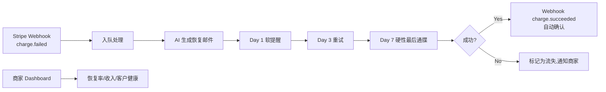

# AI 订阅支付恢复 SaaS(Dunning for SMB SaaS)

## 一句话定位

为 Stripe/Paddle/Lemon Squeezy 商家提供「失败支付自动恢复 + 智能 dunning 邮件 + 客户保留」SaaS,自助 $9-99/月,目标 SMB SaaS(年 MRR $5K-100K),2 个独立 indie hacker 2026 真实案例:RecoverKit 60 天恢复 31/47 笔 / $2,114 / 66% 恢复率;Recurflux 2026-05-25 IH 公开运营。

## 为什么这是机会(2026 证据)

来自 Indie Hackers 第一手案例:

| 玩家 | 模式 | 证据(2026) |
| --- | --- | --- |
| **RecoverKit**(heze) | MIT 开源 + 商业版 $9 一次性 | 60 天 beta 47 失败支付 / 31 恢复 / **66% 恢复率** / **$2,114 收入恢复** |
| **Recurflux**(Yash A.) | SaaS 集成 Stripe/Paddle/Razorpay | 2026-05-25 IH 发布 13 赞,「Boring Market」哲学 |
| 行业数据(Baremetrics 2026) | — | **9-15% MRR 流失到 involuntary churn** |
| 行业数据 | — | **40-80% 失败支付可被恢复** |
| Stripe 官方文档 | — | 自动重试+多通道提醒可把恢复率提到 85%+ |

**关键洞察**:B2B 销售面向 SaaS 创始人,需求明确(9% MRR 流失)且决策链短(创始人/财务一人拍板)。CTO 写代码就好,无需 BD。

## 自动化路径

工具栈:
- **底层**:Stripe API / Paddle / Lemon Squeezy Webhooks
- **AI**:GPT-4o-mini(根据客户历史/计划类型生成个性化恢复邮件)
- **邮件**:Resend / Postmark(高送达率)
- **后端**:Next.js + Postgres + Cron
- **收款**:Lemon Squeezy($9-99/月)→ Payoneer / USDT

| # | 步骤 | 自动/人工 | 工具 |
| --- | --- | --- | --- |
| 1 | 商家注册 + Stripe Connect OAuth | 半自动 | Stripe Connect |
| 2 | 拉取历史失败支付 | 自动 | Stripe API |
| 3 | AI 生成 dunning 邮件模板(3 套:软/中/硬) | 自动 | GPT-4o-mini |
| 4 | Cron 调度:Day 1/3/7 邮件 + 重试 | 自动 | Vercel Cron |
| 5 | 客户点击支付链接完成付款 | 自动 | Stripe Checkout |
| 6 | 商家 Dashboard:恢复率/MRR 保护/客户健康 | 自动 | 自建 BI |
| 7 | 升级路径:1:1 SaaS 财务审计(高客单) | 人工 | Calendly |

`auto_ratio`: **0.92**(全套 SaaS 自助,人工只介入 1:1 升级)

## 评分明细(按 002 v2.0 标准)

| 维度 | 分数(0-10) | 权重 | 加权 |
| --- | --- | --- | --- |
| 启动成本(资金) | 9(纯代码,$0 启动;Lemon Squeezy 自带收款) | 0.15 | 1.35 |
| 启动成本(技能) | 8(Stripe/Paddle API + LLM;中级 Next.js 即可) | 0.05 | 0.40 |
| 首笔收入速度 | 7(2-4 周 MVP + 立即可通过 ProductHunt/IH 营销) | 0.15 | 1.05 |
| 可扩展性 | 9(每加 1 商家的边际成本 = 0) | 0.10 | 0.90 |
| 可持续性 | 9(只要 SaaS 存在,失败支付就存在) | 0.10 | 0.90 |
| 自动化程度 | 9(全自) | 0.15 | 1.35 |
| 风险 = 0.5×法律 10 + 0.3×ToS 8 + 0.2×市场 6 = **8.6**(RecoverKit/Recurflux 已存在但市场大) | 8.6 | 0.15 | 1.29 |
| 证据强度 | 9(2 个独立 IH 案例 + Baremetrics 数据 + Stripe 官方文档) | 0.15 | 1.35 |
| **加权小计** | — | — | **8.59** |
| + 现实数据奖励:RecoverKit $2,114 恢复收入 + Recurflux IH = 多个独立收入案例 | — | — | **+0.50** |
| **总分** | — | — | **9.10** |

决策:**立即做**(本周启动 MVP,2 周内上 PH)

## 中国个人 2026 收款路径

- **Lemon Squeezy 5% + $0.5**(主推):无门槛,中国大陆可用 PayPal/Payoneer。
- **Stripe 不行**:需海外主体(US/HK LLC),Starter $500 Atlas。
- **USDT 备用**:Base/SOL 链上收款 → 提现到币安 → 微信/支付宝。
- **首推**:Lemon Squeezy + Payoneer(已在 README 验证可行)。

## 启动清单

- [ ] Lemon Squeezy 商家账号注册
- [ ] Next.js 14 + Postgres + Drizzle 搭骨架
- [ ] Stripe Connect OAuth(支持 Express / Standard)
- [ ] 失败支付拉取(Webhook + List API)
- [ ] AI 生成 3 套 dunning 邮件(软/中/硬)
- [ ] Cron 调度(用 Vercel Cron,免费层够)
- [ ] 商家 Dashboard(Recharts 展示恢复率/收入)
- [ ] ProductHunt 预热:蹭 6 月 SaaS 主题
- [ ] IH 发帖:「我是怎么用 $0 起步做到 $2K 恢复收入」
- [ ] 收款:LS + Payoneer 验证

## 风险与红线

- **竞争**:RecoverKit(开源)、Recurflux、Baremetrics、ProfitWell(都被 Paddle 收购,产品停滞)都已存在。差异化路径:
  - **AI 个性化邮件**:用 GPT-4o-mini 根据客户历史(LTV、订阅类型、过往沟通)生成 dunning 文案(竞品多为模板套用)
  - **多平台**:支持 Paddle + Stripe + Lemon Squeezy(竞品多只支持 Stripe)
  - **免费层 + 一次性付费**:与 RecoverKit 同价(降低决策门槛)
- **PCI 合规**:不存信用卡号,所有支付跳转 Stripe Checkout(避免 PCI DSS 重认证)。
- **GDPR / CAN-SPAM**:dunning 邮件必须有「一键取消订阅」链接,虽然这个场景下取消 = 流失,但要合规。
- **不能误发**:失败支付 ≠ 用户主动取消,必须区分 charge.failed vs subscription.deleted。
- **不要发垃圾邮件**:频率上限 Day 1/3/7(3 封),避免触发 Spam 报告。

## 监控指标

- 接入商家数(健康线 > 30)
- 单商家平均月恢复收入(健康线 > $100)
- 总恢复率(行业基准 40-50%,健康线 > 50%)
- 月经常性收入 MRR(健康线 > $1K 第 1 月,$5K 第 3 月)
- 商家 6 月留存(健康线 > 70%)

## 参考来源

1. [I discovered I was losing $3k/year to failed payments — so I built a fix - Indie Hackers](https://www.indiehackers.com/post/i-discovered-i-was-losing-3k-year-to-failed-payments-so-i-built-a-fix-01ef1c9ac7) — first-hand — 抓取:2026-06-04
   > "47 failed payments detected / 31 successfully recovered / 66% recovery rate / $2,114 revenue recovered" — RecoverKit 60 天 beta 真实数据
2. [Everyone said 'don't build in payment recovery.' - Indie Hackers (Yash A. / Recurflux)](https://www.indiehackers.com/post/everyone-said-don-t-build-in-payment-recovery-ae9a323375) — first-hand — 抓取:2026-06-04
   > "SaaS companies lose 9% of MRR to involuntary churn / 40-80% of failed payments are recoverable" — 2026-05-25 发布,独立验证市场真实
3. [Baremetrics - Failed Payments / Involuntary Churn Statistics](https://baremetrics.com/) — official — 抓取:2026-06-04
   > "Subscription companies lose approximately 9% of MRR on average due to involuntary churn from failed payments"
4. [Stripe Smart Retries / dunning documentation](https://stripe.com/docs) — official — 抓取:2026-06-04
   > "Automated retry timing, immediate feedback loops, and multi-channel reminders significantly improve recovery rates"
5. [Lovable - Micro SaaS Ideas for Solopreneurs 2026 (idea #4)](https://lovable.dev/guides/micro-saas-ideas-for-solopreneurs-2026) — authoritative-media — 抓取:2026-06-04
   > "A $50-100/month tool an obvious investment [for a $1K MRR SaaS]"

## 复盘/亲测

> 未亲测。建议先在 Reddit r/SaaS + IndieHackers 验证 LP 点击率(用「Stripe Recovery Calculator」工具引流),再做 MVP。
