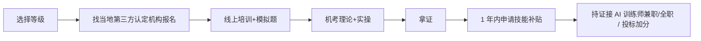

# AI 训练师国家职业资格 + 广东政府技能补贴(2026)

## 一句话定位

> 中国人社部备案的「人工智能训练师」职业技能等级证书(职业编码 4-04-05-05),持证 1 年内可向广东人社申领 **1000-4680 元**政府职业技能提升补贴(紧缺工种上浮 30%),五级到一级逐级可考。

## 背景与政策(2026 真实证据)

- **国家职业标准**:2020 年 3 月人社部将「人工智能训练师」纳入国家职业分类目录(编码 4-04-05-05),分五级(初级工)到一级(高级技师)。
- **广东 2026 补贴标准**:
  - 五级/初级 1000 元、四级/中级 1500 元、三级/高级 2400 元
  - 广州/深圳/佛山列为**紧缺工种**,补贴**上浮 30%** → 三级最高 **3120 元**
  - 二级/技师 3900 元、一级/高级技师 4680 元(广州紧缺上浮 30% 后约 6084 元,部分地市有调整)
- **证书性质**:人社第三方评价机构颁发,OSTA(`osta.org.cn`)全国联网可查,终身有效,无需年审。
- **2026-2026 广东考期**(已确认):
  - 广州 5 月 12 日 - 6 月 5 日报名,6 月 27-28 日考试
  - 5 月起每月均有批次,「随报随学」
- **缺口数据**:2025 年底 AI 训练师及相关技术人才缺口 500 万人。
- **广州政策叠加**(2026):《2026 广州市政务和数据工作高质量发展大会》提出「2026 年打造 100 个高质量数据集 + 50 个政务智能体」,广州将建「政务数据智能工厂」,对持证者形成地方需求拉动。

## 自动化路径

工具栈:
- 报名/培训:`gz.bendibao.com` 培训频道 / 各市人社局合作的第三方认定机构
- 题库:OSTA 官网(理论 + 实操机考)
- 补贴申领:广东省人力资源和社会保障厅网上服务平台 / 「广东人社」APP

关键步骤:

| # | 步骤 | 自动/人工 | 工具 |
| --- | --- | --- | --- |
| 1 | 选等级(初中高) | 人工 | OSTA 官网 |
| 2 | 找认定机构 | 人工(中介性质强) | 百度/本地宝/培训机构 |
| 3 | 报名 | 人工 | 第三方机构 |
| 4 | 线上培训(题库) | 半自动 | 视频课 + 题库 APP |
| 5 | 模考自测 | 自动 | OSTA 题库 |
| 6 | 机考(理论+实操) | 人工+监考 | OSTA 监考系统 |
| 7 | 拿证(电子+纸质) | 自动 | OSTA 短信/EMS |
| 8 | 申领技能补贴 | 人工 | 广东人社 APP / 网上服务大厅 |
| 9 | 持证接单(可选) | 半自动 | xAI / Outlier / 智联 / BOSS |

`auto_ratio`: 0.5(报名、申领补贴、刷题半自动;培训、考试、接单主要靠人工)

## 评分明细(按 002 标准)

| 维度 | 分数(0-10) | v2 权重 | 加权 |
| --- | --- | --- | --- |
| 启动成本(资金) | 9(0 启动) | 0.15 | 1.35 |
| 启动成本(技能) | 7(初中学历可报五级) | 0.05 | 0.35 |
| 首笔收入速度 | 6(考证 1-2 月,补贴到账 +1-2 月) | 0.15 | 0.90 |
| 可扩展性 | 4(线性:1 人 1 证) | 0.10 | 0.40 |
| 可持续性 | 7(国家职业,政策长期) | 0.10 | 0.70 |
| 自动化程度 | 5(半自动) | 0.15 | 0.75 |
| 风险 | 9.4(拆分:法律 10 × 0.5 + ToS 10 × 0.3 + 市场 7 × 0.2 = 9.4) | 0.15 | 1.41 |
| 证据强度 | 8(政府文件 + 多媒体来源) | 0.15 | 1.20 |
| + 现实数据奖励 | 0(无个人月入案例,补贴 1000-4680 元为一次性) | — | 0.00 |
| **总分** | — | — | **7.1** |

决策:**排队**(两周内启动报名;非主营业务,但 ROI 高)

## 启动清单

- [ ] 选等级:无学历/初中 → 五级;高中/中专 → 四级;大专以上 → 三级
- [ ] 查当地人社局公布的「职业技能等级认定机构目录」
- [ ] 联系第三方机构报名(广州/深圳/佛山/汕头/河源等均有 2026 考期)
- [ ] 完成线上培训(随报随学)+ 模拟题
- [ ] 机考(理论 60 分及格,实操 60 分及格)
- [ ] 拿证后 1 年内,通过「广东人社」APP 或网上大厅申领技能补贴
- [ ] (可选)持证接 xAI/Outlier AI 训练师兼职(详见 [xAI AI Tutor 中文远程兼职档案](xai-ai-tutor-cn-2026.md))

## 风险与红线

- **风险 1:机构跑路/乱收费**:认准人社局备案的「职业技能等级认定机构」,不要被「包过班」割韭菜。
- **风险 2:补贴申领条件**:
  - 需本市户籍 / 正常缴纳社保 / 失业登记 / 高校毕业生离校 2 年内(满足任一)
  - 同一职业高等级已领补贴,低等级不可再领
  - **退休人员、公务员、事业单位在编、全日制在读不可领**
- **风险 3:补贴金额波动**:广东省基础标准 + 紧缺工种上浮,各地市有差异,以领证时人社局公布为准。
- **风险 4:工种退出紧缺目录**:2026 上半年广东明确列入紧缺;后续若退出目录,补贴可能降回基础标准。

## 监控指标

- 指标 1:报名后 60 天内通过考试(目标)
- 指标 2:补贴到账金额(目标:五级 ≥1000,三级 ≥3120)
- 指标 3:补贴申领周期(目标:≤90 天)

## 配套机会(同方向已落档)

- [xAI AI Tutor 中文远程兼职 2026](xai-ai-tutor-cn-2026.md) — 持证后可优先接单,时薪 35-45 美元
- [AI 卖课(国内向)](ai-course-cn-micro-tutor.md) — 持证后可在小红书/抖音开「AI 训练师考证辅导」课,1 证变 2 收入

## 参考来源

1. https://gz.bendibao.com/peixun/2026325/peixun366591.shtml — 类型:`media` — 抓取:`2026-06-04`
   > 在广东考人工智能训练师,拿证后 1 年内,符合要求可领 1000-4680 元职业技能提升补贴
2. https://www.zhiyepeixun.net/Newblog/post-632.html — 类型:`media` — 抓取:`2026-06-04`
   > 2026 年广州将建 50 个政务智能体 + 100 个高质量数据集;广东 AI 训练师三级最高补贴 3120 元
3. http://www.osta.org.cn — 类型:`official` — 抓取:`2026-06-04`
   > 国家职业技能等级证书查询系统(全国联网,一证一码)
4. https://m12333.cn/qa?tag=203 — 类型:`aggregator` — 抓取:`2026-06-04`
   > 2026 各地人社政策问答(广东、内蒙古、四川等省 AI 训练师补贴动态)
5. https://www.ilo.org/sites/default/files/2026-04/社会保障政策季度快报第二十四期.pdf — 类型:`official`(ILO 转人社部) — 抓取:`2026-06-04`
   > 2026.3 月人社部等九部门发布《工伤预防五年行动计划(2026—2030)》,将新就业形态劳动者纳入保障

## 复盘/亲测

> 待报名后填写
