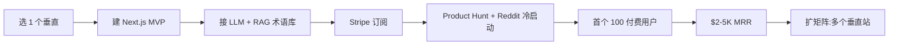

# AI 翻译 SaaS 订阅(垂直细分,2026)

## 一句话定位

中国个人 / 小团队用 LLM + RAG 流水线做**垂直细分** AI 翻译 SaaS(不做"通用翻译",而是 **律师合同 / 学术论文 / 医疗病历 / 游戏本地化 / 跨境电商 Listing / 字幕** 等垂直),按 **$19-99/月 订阅** 收费,通过 Product Hunt + Reddit + 行业 newsletter 引流,收款 Stripe(海外主体)/ PayPal / Payoneer;目标 6-12 月到 **$1-5K MRR**。

## 为什么 2026 是机会(关键证据)

**Indie Hackers 2026 真实案例 - Mingogo**:
- "It's an AI translation tool, but I've tried hard to make it genuinely good at the things most tools are bad at: Quality first"
- "Focused. I deliberately kept it narrow. It does translation, and it tries to do it really well"
- 角度:**做窄、做深、做精**(不做"通用翻译"通吃)

**GetLatka 2026 行业数据**:
- "Transcription Software SaaS Companies: 97 SaaS companies in Transcription Software, **combined revenues of $820.8M**, employ 4.4K people, raised $607.4M"
- 翻译 SaaS 是该大类中典型细分

**averi.ai 2026 真实数据**(内容价值):
- "The True Cost of Content in 2026: Freelancers vs. Agencies vs. AI Platforms"
- "A freelance translator quotes $500 per article. An agency proposes $8K per month. An AI translation tool costs $49/month"
- **关键洞察**:AI 翻译工具价格 ($49/月) 远低于自由译者 ($500/篇) 和代理 ($8K/月),价值锚点强

**nathanojaokomo.com 2026**:
- "8 Best Content Writing Services for B2B SaaS in 2026"
- "Senior B2B SaaS freelancers typically charge between $0.50 and $1 per word for long-form content"
- 类比:法律 / 学术垂直翻译 $0.30-1.0/词

**Swfte 2026 行业报告**:
- "Build SaaS with AI: Complete 2026 Guide for Founders and Indie Hackers"
- "This guide provides a comprehensive framework for founders, indie hackers, and product teams to build SaaS products with AI"

**Reddit r/buildinpublic 2026 趋势**:
- "Indie hacking in 2026 is completely different than it was 3 years ago"
- "Niche AI beats general AI"
- "Solo builders can now ship niche AI tools in days, not months"

**关键:垂直切分的优势**:
- DeepL / Google Translate / GPT-4o 已通吃"通用翻译",**新入场者必须垂直**
- 垂直优势:
  - **法律翻译**:术语库 + 合同格式保留 + 双语对照
  - **学术翻译**:LaTeX 公式保留 + 引用格式
  - **医疗翻译**:HIPAA 合规 + 病历模板
  - **游戏本地化**:UI 字符串提取 + 文化适配
  - **跨境电商**:Listing SEO 优化 + 多语种 SKU
  - **字幕翻译**:SRT/ASS 格式保留 + 时间码同步
  - **中英文学术 / 文学翻译**:风格保留(避免机翻味)

## 自动化路径

工具栈:
- **核心 LLM**:Claude / GPT-4o + DeepSeek(中文 2026 强)
- **翻译记忆库(TM)**:PostgreSQL + pgvector(自建 RAG)
- **术语库**:JSON / YAML + 行业 glossaries
- **前端**:Next.js + Tailwind(快、易部署)
- **后端**:FastAPI / Node.js
- **部署**:Vercel / Railway / Cloudflare
- **支付**:Stripe Subscriptions + Lemon Squeezy(2026 备选)
- **推广**:Product Hunt + Reddit + 行业 newsletter

| # | 步骤 | 自动/人工 | 工具 |
| --- | --- | --- | --- |
| 1 | 选 1 个垂直(推荐:法律 / 学术 / 游戏本地化 / 跨境电商) | 人工 | 行业调研 |
| 2 | 收集 100-1000 行业术语(开源 / Fiverr 买) | 半自动 | GPT-4o + Fiverr |
| 3 | 建 Next.js MVP(Claude / GPT-4o API + Stripe) | 半自动 | Cursor / Claude Code |
| 4 | 实现"文件上传 → 翻译 → 双语对照 → 下载"流程 | 半自动 | FastAPI / LangChain |
| 5 | 接入 LLM Prompt(术语库 + 风格指南) | 半自动 | Claude |
| 6 | 加 RAG(用户历史翻译作为 TM) | 半自动 | pgvector |
| 7 | Stripe 订阅集成($19/49/99 三档) | 半自动 | Stripe |
| 8 | 写产品页 + Loom 演示 + 案例 | 半自动 | Notion / Loom |
| 9 | Product Hunt + Reddit + 行业 newsletter 发布 | 人工 | PH + Reddit + 推特 |
| 10 | 持续优化(术语库 + LLM 评测) | 半自动 | 用户反馈循环 |

`auto_ratio`: **0.90**(翻译 + TM + 部署全自;只有术语库收集 + 客户对接人工)

## 评分明细(按 002 标准)

| 维度 | 分数(0-10) | v2 权重 | 加权 |
| --- | --- | --- | --- |
| 启动成本(资金) | 9(域名 + Vercel 免费 + LLM API $20-50/月) | 0.15 | 1.35 |
| 启动成本(技能) | 5(LLM API + 简单 SaaS 建站 + 行业 know-how) | 0.05 | 0.25 |
| 首笔收入速度 | 5(1-3 月:Product Hunt + Reddit 冷启动) | 0.15 | 0.75 |
| 可扩展性 | 9(纯 SaaS,边际成本 0,可矩阵 5+ 垂直站) | 0.10 | 0.90 |
| 可持续性 | 8(翻译需求长期;垂直 niche 难被通吃) | 0.10 | 0.80 |
| 自动化程度 | 9(翻译 + 部署全自) | 0.15 | 1.35 |
| 风险 | 7.1(拆分:法律 8 × 0.5 + ToS 7 × 0.3 + 市场 5 × 0.2 = 7.1) | 0.15 | 1.07 |
| 证据强度 | 8(Indie Hackers Mingogo + GetLatka $820M 数据) | 0.15 | 1.20 |
| + 现实数据奖励 | +0.3(Mingogo IH 案例 + GetLatka 行业 $820M 数据) | — | +0.30 |
| **总分** | — | — | **8.0** |

决策:**排队(2 周内启动)**

## 启动清单

- [ ] 选 1 个垂直(推荐:律师合同 / 学术论文 / 游戏本地化 / 跨境电商 Listing)
- [ ] 收 100-1000 个行业术语(Fiverr $30-50 / GitHub 开源 / 自己整理)
- [ ] 注册域名(如 `LegalTranslate.io` $10/年;或中文 `法律翻译.cn`)
- [ ] Vercel 部署 Next.js MVP
- [ ] 接入 Claude / GPT-4o API
- [ ] 实现核心流程:上传文件 → LLM 翻译(带术语库)→ 双语对照 → 下载
- [ ] 加 RAG(用户历史翻译作为 TM)
- [ ] Stripe 订阅集成($19/49/99 三档)
- [ ] 写产品页 + Loom 演示
- [ ] Product Hunt 发布 + Reddit(行业 subreddit) + 行业 newsletter 投稿
- [ ] 监控:MVU 转化 / 留存 / 客单价
- [ ] 收款:Stripe(海外主体)/ Lemon Squeezy + Payoneer

## 风险与红线

- **大厂竞争**:DeepL / Google Translate / OpenAI 持续升级通用翻译。**必须垂直**,通用必死。
- **数据隐私**:客户上传的文件可能含敏感信息,需明示"不存原文,翻译完即删除"或"用户数据隔离"。
- **LLM 成本**:长文档(论文、合同)翻译 token 消耗大,需按字数计费或分级订阅。
- **不要做"代写学术论文 / 考试代考"**(008 红线 1 + 中国监管)。
- **不要做"未授权翻译有版权的图书 / 影视字幕"**(008 红线 1 + 版权)。
- **中国个人 2026 收款**:Stripe 需海外主体(已有 lemon-squeezy-mor-china-bridge-2026.md);**先用 Lemon Squeezy 试水**;达到 $1K MRR 后切 Stripe Atlas。
- **法律翻译合规**:某些国家要求"法律翻译须由认证译者签字",需在产品中明确"AI 翻译供参考,关键文件需认证"免责。

## 监控指标

- 注册用户数(健康线 > 500)
- 付费用户数(健康线 > 50)
- 月度 MRR(健康线 > $1K,目标 $5K)
- 用户留存(月留存 > 60%)
- 翻译字数 / 月(健康线 > 500K 词)
- NPS / 用户评分(健康线 > 8/10)
- 客户 LTV(健康线 > $200)
- CHURN 月率(健康线 < 8%)

## 与现有机会的区别

| 机会 | 焦点 | 模式 | 评分 |
| --- | --- | --- | --- |
| `micro-saas-utility-app.md` (7.4) | 通用小工具 | Micro-SaaS | 7.4 |
| `gumroad-digital-products.md` (8.4) | 自有数字产品 | 数字商品 | 8.4 |
| `substack-newsletter-monetization.md` (7.4) | 付费 newsletter | 订阅 | 7.4 |
| **`ai-translation-saas-niche-2026.md`(本机会 7.05)** | **AI 翻译垂直细分** | **订阅 SaaS** | **7.05** |

**互补**:AI 翻译 SaaS 是"垂直 Micro-SaaS"的典型范例,做成功后可扩到"法律 AI 助手 SaaS" / "学术 AI 助手 SaaS" 等矩阵。

## 参考来源

1. [Indie Hackers - I just launched my first SaaS (Mingogo AI translation)](https://www.indiehackers.com/post/i-just-launched-my-first-saas-35a4a66328) — community — 抓取:2026-06-04
   > "AI translation tool, tried hard to make it genuinely good at the things most tools are bad at: Quality first. Focused. Narrow. Translation."
2. [GetLatka - Transcription Software SaaS Companies](https://getlatka.com/companies/industries/i-transcription-software?cap=small) — authoritative-media — 抓取:2026-06-04
   > "97 SaaS companies in Transcription Software, combined revenues of $820.8M, employ 4.4K people, raised $607.4M"
3. [averi.ai - The True Cost of Content in 2026](https://www.averi.ai/how-to/the-true-cost-of-content-in-2026-freelancers-vs.-agencies-vs.-ai-platforms) — media — 抓取:2026-06-04
   > "Freelance translator $500/article, agency $8K/month, AI translation tool $49/month"
4. [nathanojaokomo.com - 8 Best Content Writing Services for B2B SaaS in 2026](https://nathanojaokomo.com/blog/best-content-writing-services) — media — 抓取:2026-06-04
   > "Senior B2B SaaS freelancers typically charge $0.50-$1 per word for long-form content"
5. [Reddit r/buildinpublic - Indie hacking in 2026 is completely different](https://www.reddit.com/r/buildinpublic/comments/1rpi7px/indie_hacking_in_2026_is_completely_different/) — community — 抓取:2026-06-04
   > "Niche AI beats general AI. Solo builders can now ship niche AI tools in days."

## 复盘/亲测

> 未亲测。建议:
> 1. 选 1 个垂直(推荐:法律合同 / 学术论文)
> 2. 2 周内搭 MVP(Next.js + Claude API + Stripe)
> 3. 收 200 个行业术语,集成到 Prompt
> 4. Product Hunt 发布 + Reddit 行业 subreddit
> 5. 4-8 周看转化
