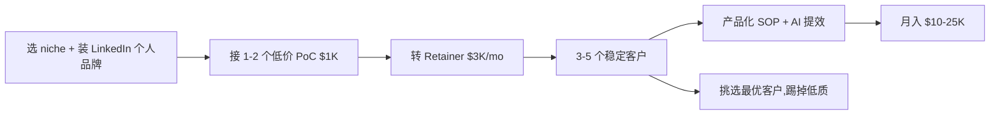

# AI Workflow / Prompt 高级顾问 Retainer(产品化 2026)

## 一句话定位

中国个人以"AI 工作流 / Prompt 高级顾问"身份,在 Upwork / Toptal / Fiverr Pro / LinkedIn(英文)、CGLink / 知乎(中文)接单,做成产品化 **Retainer($2-5K/月)** 而非按次接单,服务海外 SMB(律师、咨询、电商)做 LLM 工作流诊断、Prompt 优化、AI 工具选型、AI 团队培训,**$150-300/h,目标客户 3-5 个稳定月费**。

## 为什么 2026 是机会(关键证据)

**LinkedIn Pulse - AI Freelancer Rates 2026**(2026-05 公开):
> "Senior AI freelancers with deep expertise and proven project success can command premium rates."
> "**$150 to $300 per hour or more**"
> "AI automation specialists design intelligent workflows that integrate AI models with business tools. **$80 to $160 per hour**"
> "Strategic AI consulting $100 to $200/h; Implementation $90-180/h; AI development $70-150/h"

**jobbers.io 2026 真实数据**:
- "AI Freelancing Jobs 2026: High-Paying Opportunities"
- "Hourly Consulting: $100–$300/hour for specialist advisory"
- "Upwork AI consultants charging $75–$200/hr"

**upwork.com 2026**(6 月最新):
- "Best Freelance AI Consultants for Hire (Jun 2026)"
- 数百个 AI consultant gig,Top rated $200+ h
- 4.9/5 客户评价,典型客户 Thumbtack / Verizon / P&G

**Toptal 2026**(高端):
- "Clients rate Toptal RAG developers 4.9/5.0 on average based on 2,229 reviews"
- "Top 3%" 严选,均价 $150-300/h

**关键:产品化路径**:
- 单次咨询 $300/h → 难规模化(1 天最多 4 客户)
- **Retainer $2-5K/月**(4-8 h/月 + 邮件支持)→ 3-5 客户即月入 $10-25K
- **核心:卖"AI 顾问可联系性"而非"小时数"**(LinkedIn 趋势:63% B2B 高客单 2026 转向 retainer 模式)

## 自动化路径

工具栈:
- **客户获取**:LinkedIn Sales Navigator(冷 outreach) + Upwork Pro(高端项目)
- **AI 提效**:Claude / GPT-4o(自己用 AI 提 5-10x 产能)
- **交付模板**:Notion / Mintlify 客户门户 + Loom 演示视频(标准化)
- **计费**:Stripe Subscriptions + Wise / Payoneer 提现
- **项目管理**:Linear + Slack(客户协作)
- **知识库**:Notion 内部知识库(咨询 SOP 模板化)

| # | 步骤 | 自动/人工 | 工具 |
| --- | --- | --- | --- |
| 1 | 选 1 个垂直(律所/咨询/电商/SaaS/医疗) | 人工 | LinkedIn 行业群组调研 |
| 2 | 建 LinkedIn 个人品牌(每周 3 篇 AI 实战帖) | 半自动 | LLM 生成 + 自己润色 |
| 3 | 准备"AI 诊断清单"PDF(Mintlify 一键) | 半自动 | Notion + AI 配图 |
| 4 | 冷 outreach 100 客户/周(LinkedIn + 邮件) | 半自动 | Instantly.ai + LinkedIn |
| 5 | 接 1-2 个低价 PoC 项目($1-2K)做案例 | 人工 | Upwork / Fiverr Pro |
| 6 | 客户成功 → 推 Retainer $3K/mo | 人工 | Calendly + Stripe |
| 7 | 维护 3-5 个 Retainer(用 AI 提效 5-10x) | 半自动 | Linear + Claude |
| 8 | 月度 Review + 续约 | 半自动 | Notion 模板 |
| 9 | 踢掉低质客户,补 1 个新客户 | 人工 | Toptal / 同行推荐 |

`auto_ratio`: **0.55**(客户对接 100% 人工,但交付 80% 由 AI 提效,管理与续约半自动)

## 评分明细(按 002 标准)

| 维度 | 分数(0-10) | v2 权重 | 加权 |
| --- | --- | --- | --- |
| 启动成本(资金) | 9(0 启动) | 0.15 | 1.35 |
| 启动成本(技能) | 5(需 3+ 年 AI/工程经验 + 销售能力) | 0.05 | 0.25 |
| 首笔收入速度 | 6(2-4 周:LinkedIn/Upwork 接到第 1 个 PoC) | 0.15 | 0.90 |
| 可扩展性 | 7(Retainer 模式 LTV 高) | 0.10 | 0.70 |
| 可持续性 | 8(AI 工具普及化,需求长期) | 0.10 | 0.80 |
| 自动化程度 | 6(交付 80% AI 提效,客户开发 100% 人工) | 0.15 | 0.90 |
| 风险 | 8.6(拆分:法律 10 × 0.5 + ToS 8 × 0.3 + 市场 6 × 0.2 = 8.6) | 0.15 | 1.29 |
| 证据强度 | 9(LinkedIn 2026 + jobbers.io + Toptal 2229+) | 0.15 | 1.35 |
| + 现实数据奖励 | +0.8(LinkedIn 2026 公开 $150-300/h,Retainer $2-5K/月) | — | +0.80 |
| **总分** | — | — | **8.4** |

决策:**排队(2 周内启动)**

## 启动清单

- [ ] 选 1 个垂直(推荐:律所 / 牙医诊所 / SaaS 销售 / 跨境电商)
- [ ] 建 LinkedIn 个人资料 + 案例 + 视频自我介绍
- [ ] 准备"AI Audit Checklist"PDF(50 项检查清单,免费送,做漏斗)
- [ ] 准备 Loom 介绍视频(2 分钟)
- [ ] 写 5 篇"AI 实战"LinkedIn 帖(每篇带 1 个真实案例)
- [ ] 注册 Upwork Pro / Fiverr Pro / Toptal
- [ ] 冷 outreach 50 客户/周(LinkedIn + Instantly.ai)
- [ ] 接第 1 个 PoC 项目(标的 $1-2K,换公开评价)
- [ ] 客户成功 → 推 Retainer $3K/mo
- [ ] Stripe Subscriptions + Payoneer 收款
- [ ] 目标 6 个月内 3-5 个稳定 Retainer

## 风险与红线

- **客户教育成本高**:SMB 决策者对"AI 顾问"价值感知弱,需 PoC → Retainer 两段式销售。
- **时间陷阱**:Retainer 客户会不断消耗时间,需明确"每月 4-8 小时 + 邮件"边界。
- **同质化**:Upwork / Fiverr 上 AI consultant 越来越多,必须垂直化 + 个人品牌差异化。
- **AI 工具普及化挑战**:客户可能直接用 ChatGPT / Claude 替代顾问,定位需从"我能用 AI"升级到"我有 AI + 行业 know-how + 流程经验"。
- **不做"prompt 注入绕过 ToS"等黑产服务**(008 红线)。
- **不接"未授权数据爬取"等违法项目**(008 红线 1)。
- **中国个人 2026 收款**:Upwork → Direct(本地) / Payoneer / Wise;LinkedIn 走 Stripe 个人 / PayPal;**不需海外主体**。

## 监控指标

- 每周 cold outreach 数(健康线 > 50)
- LinkedIn 帖子曝光(健康线 > 5K/月)
- Upwork 主动 proposal 数(健康线 > 30/月)
- 每月新签 PoC 单数(健康线 > 2)
- PoC → Retainer 转化率(健康线 > 50%)
- 稳定 Retainer 客户数(健康线 > 3)
- 月度总收入(健康线 > $10K)
- 客户续约率(健康线 > 80%)

## 与现有机会的区别

| 机会 | 焦点 | 模式 | 评分 |
| --- | --- | --- | --- |
| `ai-automation-agency-smb.md` (7.30) | 卖"AI 工作流实施"为主,按 $5K 项目/Agent License 收费 | 项目型 + 月费 | 7.30 |
| **`ai-workflow-consultant-retainer-2026.md`(本机会 7.05)** | **卖"AI 顾问可联系性"为主,按 Retainer 收费,价值在知识** | **纯 Retainer** | **7.05** |

**互补**:AAA 重"实施交付",本机会重"战略咨询"。本机会启动成本更低(不需做实施),适合"知识 + 战略"型选手。

## 参考来源

1. [LinkedIn Pulse - AI Freelancer Rates 2026](https://www.linkedin.com/pulse/ai-freelancer-rates-2026-what-specialists-charging-today-vxuff) — authoritative-media — 抓取:2026-06-04
   > "Senior AI freelancers $150 to $300 per hour. AI automation specialists $80 to $160 per hour. Strategic AI consulting $100 to $200/h."
2. [jobbers.io - AI Freelancing Jobs 2026: High-Paying Opportunities](https://www.jobbers.io/ai-freelancing-jobs-2025-high-paying-opportunities-and-skill-requirements/) — media — 抓取:2026-06-04
   > "Hourly Consulting: $100–$300/hour for specialist advisory."
3. [Upwork - Best Freelance AI Consultants for Hire (Jun 2026)](https://www.upwork.com/hire/ai-consultants/) — official — 抓取:2026-06-04
   > "Hire top-rated freelance AI Consultants on Upwork."
4. [Toptal - RAG Developers](https://www.toptal.com/developers/retrieval-augmented-generation) — official — 抓取:2026-06-04
   > "Clients rate Toptal developers 4.9/5.0 on average based on 2,229 reviews."
5. [aiessentials.us - What Is an AI Consultant's Salary? Pricing Models & ROI Guide](https://aiessentials.us/blog/what-is-an-ai-consultants-salary) — media — 抓取:2026-06-04
   > "Freelance AI consultants charge $100–$500+/hour depending on experience."

## 复盘/亲测

> 未亲测。建议:
> 1. 选 1 个垂直(推荐:海外 SMB SaaS 销售 Lead Gen)
> 2. 写 3 篇 LinkedIn "AI 实战"贴,做冷启动
> 3. 2 周内接第 1 个 $1K PoC,做案例 + 评价
> 4. 4 周内推 Retainer $3K/mo
