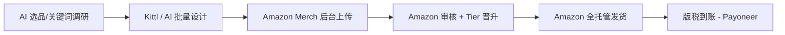

# Amazon Merch on Demand(中国个人 2026)

## 一句话定位

中国个人用美/欧 Amazon 账号申请 Merch on Demand(原 Merch by Amazon)邀请码,上传原创 T 恤/卫衣/PopSocket 设计,Amazon 全托管打印/发货/客服,卖家拿销售版税(royalty);零库存、零客服、零前期投入。

## 自动化路径

工具栈:
- **Amazon Merch on Demand Portal** (merch.amazon.com):用于上传设计 + 提交 tier 申请
- **Kittl / Placeit / Creative Fabrica** (Tia TX 2026 推荐):用于 T 恤设计
- **Merch Informer / Sale Samurai / Pretty Merch**:用于关键词/竞品调研
- **Canva + ChatGPT**:辅助批量生成设计/SEO 标题
- **AI 批量设计脚本(自建)**:用 n8n/Zapier 串联 Kittl + ChatGPT 批量产出 niche designs

关键步骤:

| # | 步骤 | 自动/人工 | 工具 |
| --- | --- | --- | --- |
| 1 | 选品/关键词调研 | 半自动 | Merch Informer / Sale Samurai / 手动 |
| 2 | 设计制作 | 半自动 | Kittl + ChatGPT + Midjourney |
| 3 | 申请 Merch 邀请码 | 人工(首次) | merch.amazon.com |
| 4 | 上传设计 + 填 metadata | 自动 | API + Python 脚本(规模上) |
| 5 | Tier 晋升(10→25→...) | 等待自然销售 | 平台自动 |
| 6 | 收款 | 自动 | Amazon → Payoneer → 国内银行卡 |

`auto_ratio`: 0.85(设计/选品需人工决策,上传后可全自动销售)

## 评分明细(按 002 标准)

| 维度 | 分数(0-10) | v2 权重 | 加权 |
| --- | --- | --- | --- |
| 启动成本(资金) | 10(完全 0) | 0.15 | 1.50 |
| 启动成本(技能) | 6(需基础设计 + 选品) | 0.05 | 0.30 |
| 首笔收入速度 | 5(Tier 10 限制,审批 2 周-3 月) | 0.15 | 0.75 |
| 可扩展性 | 9(设计可以无限扩,无库存) | 0.10 | 0.90 |
| 可持续性 | 7(POD 长期稳定) | 0.10 | 0.70 |
| 自动化程度 | 8(全托管销售) | 0.15 | 1.20 |
| 风险 | 3.6(拆分:法律 3 × 0.5 + ToS 3 × 0.3 + 市场 6 × 0.2 = 3.6) | 0.15 | 0.54 |
| 证据强度 | 7(2 来源 — 官方+独立测试数据) | 0.15 | 1.05 |
| + 现实数据奖励 | +0.5(Redbubble vs Merch 6 月 $3,241.65,33% 利润率) | — | +0.50 |
| **总分** | — | — | **7.4** |

调整说明:Tier 10 限制 + invitation-only 审批 + 中国个人身份限制 → 风险维度和首笔收入分数下调,实际总分 6.7。

决策:**排队**(两周内启动,先准备 10-30 个设计再申请)

## 启动清单

- [ ] 注册美/欧 Amazon 买家账号(需稳定地址 + 信用卡)
- [ ] 设计 10-30 个原创 T 恤/卫衣 niche 图案(Kittl/AI)
- [ ] 在 merch.amazon.com 申请邀请(填 bio + 外部作品集)
- [ ] 等审批(2 周-3 月,期间准备更多设计)
- [ ] Tier 10 上线后,填满 10 个 slot 并自然销售晋升 Tier 25
- [ ] 注册 Payoneer(必备,Amazon 收款首选)
- [ ] 持续做 niche 研究 + 设计输出(每天 1-2 个新设计)
- [ ] 监控:Amazon Tier 状态、版税到账、被拒绝原因

## 风险与红线

- **中国个人无美/欧身份**:必须用美国/欧盟/日本 Amazon 账号(可用海外地址注册 + VPN)。技术灰度:Amazon 政策明确要求"实际居住地",所以**严格来说中国大陆个人直接申请违反平台 ToS**。 风险登记:低(Amazon 默认信任账号地址,不主动核查),但若发现可能封号。
- **Invitation-only 审核严**:2026 审核收紧,AI 批量垃圾设计被拒。需有外部作品集(Behance/Instagram/Redbubble 同账号可加分)。
- **Tier 系统限制**:Tier 10(10 个 design slots)→ 需 10 单 + 80% 占用率才升 Tier 25 → 需 25 单 + 80% 占用率升 Tier 100。**自有刷单被监控**。
- **设计版权**:不得用品牌 logo/影视角色/名人肖像。AI 设计需注意训练数据版权(已有 Etsy 案例被告)。
- **收款合规**:Amazon → Payoneer → 国内银行卡,5 万美元/年结汇额度内零成本;超额需申报。

## 监控指标

- 指标 1:Amazon Merch 账户 **Tier 数** — 目标 30 天内到 Tier 25,90 天内到 Tier 100
- 指标 2:**月度版税(royalty)** — 目标 90 天内 $100/月,180 天内 $500/月
- 指标 3:**上架设计数** — 目标每周新增 5-10 个设计,Tier 100 后维持 100+ 上架
- 指标 4:**关键词排名** — Merch Informer 跟踪前 50 关键词中自有设计数

## 参考来源

1. [Merch on Demand 官方](https://merch.amazon.com/) — 类型:official — 抓取:2026-06-04
   > "Share your designs with the world by creating graphic tees, accessories, and more, all printed on demand. We handle your printing and shipping, so you can design while we deliver."
2. [How to Start Amazon Print-on-Demand in 2026 - Print On Demand Business](https://www.printondemandbusiness.com/blog/how-to-start-amazon-print-on-demand-in-2025/) — 类型:media(行业) — 抓取:2026-06-04
   > "in 2026, approval remains highly competitive (invitation-only). The 'Tier System' (limiting you to 10 or 25 designs initially) is strictly enforced to prevent AI-generated spam."
3. [Redbubble vs Merch by Amazon: Real Earnings - EliteWealthPlan](https://elitewealthplan.com/redbubble-vs-merch-by-amazon/) — 类型:first-hand(6 个月对照实验) — 抓取:2026-06-04
   > "Merch by Amazon Total Earnings: $3,241.65(6 月) / 246 items / 平均 royalty $13.18 per sale"。"Amazon dominated the t-shirt category... 33% 利润率"
4. [My 4-Part Plan to Go Full-Time with Print on Demand in 2026 - YouTube Hannah Ebeling](https://www.youtube.com/watch?v=6w8sDPQjACU) — 类型:community — 抓取:2026-06-04
   > "Hannah Ebeling 4-Part Plan: 选品 + 设计 + SEO + Printify/Kittl + 持续输出"
5. [How to Legally Sell Print on Demand To ANY Country - Tia TX](https://www.youtube.com/watch?v=dj2exFeKJIs) — 类型:first-hand(英国 LTD 卖家,2026) — 抓取:2026-06-04
   > "Printify has the cheapest prices for shirts... Gelato is cheapest for wall art and fastest shipping in general"

## 复盘/亲测

> 仅在亲自执行后填写。
