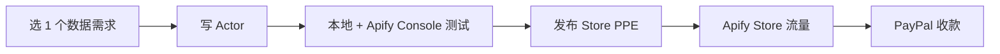

# Apify Actor Pay-per-Event 80/20 分润(2026 创作者分润真路径)

## 一句话定位

把"Web 抓取 / 数据提取 / AI Agent 工作流"打包成 Apify Actor 发布到 Apify Store,按 PPE(pay-per-event)定价,创作者拿 80% 收入、Apify 抽 20%;**Rental(月租)模型 2026-10-01 完全下线**,PPE 是 2026 唯一主推分润通道。

## 为什么 2026 是机会(新证据)

**Apify 2026-04-29 / 04-28 官方公告**:
- DeepInfra 成为 HF Inference Provider
- Rental 模型 2026-10-01 全面退场,所有 actor 迁移到 PPE / Pay-per-usage
- "AI/MCP compatibility: ✅ Fully compatible" 仅 PPE 支持,MCP server 必须 PPE 才能商业化

**Apify Creator Plan 2026**:
- $1/月启动(6 月预付,总计 $6)— **几乎是 0 启动**
- 首 6 个月一次性 $500 平台使用额度(测试自己 actor 不烧钱)
- $100/月消费上限(防失控)
- 这是 Apify 官方对"个人创作者"明确鼓励

**Apify 官方文档 (Monetize your Actor)**:
- "You earn 80% of the revenue minus platform usage costs" — PPE 公式
- "Pay per event(PPE): Users pay for specific events that are programmatically triggered"
- $20 起付 PayPal,$100 起付其他渠道(Stripe/Wise/Payoneer)

## 自动化路径

工具栈:
- **底座**:Apify SDK(Node.js / Python)+ Apify Console
- **冷启动思路**:挑 1 个具体数据需求 → 写 1 个 Actor → 发布到 Apify Store
- **底座 AI**:可选 OpenAI / Anthropic / DeepInfra API(2026-04 上 HF)做摘要、分类、翻译
- **收款**:PayPal / Payoneer(Apify 支持)

| # | 步骤 | 自动/人工 | 工具 |
| --- | --- | --- | --- |
| 1 | 选 niche(电商价格 / 招聘 / 评论 / 房产) | 人工 | Apify Store 浏览 + Reddit |
| 2 | 写 Actor(爬 + 清洗) | 半自动 | Apify SDK + Claude Code |
| 3 | PPE 定价 | 人工 | 算 cost + 80% 利润 |
| 4 | 文档 + README | 半自动 | LLM 生成 |
| 5 | 发布 + SEO 优化 | 半自动 | Apify Console |
| 6 | 维护 + 更新 | 自动 | CI/CD |
| 7 | 收款 | 自动 | PayPal / Payoneer |

`auto_ratio`: **0.75**(写好一个 actor 后高度自动,只有选 niche + 写代码需要人工)

## Apify 真实可参与的 2026 数据(交叉验证)

**来源 1:Apify 官方文档 (Q2 2026 状态)**:
> "You earn 80% of the revenue minus platform usage costs" — 80/20 分成,PPE 模型
> "Profit calculation: profit = (0.8 * revenue) - platform usage costs"
> "Rental Actors are fully retired. All remaining Actors are migrated to pay-per-usage pricing" — 2026-10-01

**来源 2:Apify Academy 2026 教程**:
> "Monetizing your Actor on the Apify platform involves several key steps: Development, Testing, Publication & monetization, Promotion"
> "PPE Event cost example: Actor start per 1GB memory at $0.005, Pages scraped at $0.002, etc."

**来源 3:Apify Creator Plan 2026 价格页**:
> "Creator Plan is designed for community developers... For just $1/month, you get $500 of platform usage for the first 6 months"
> "We instantly receive $500 worth of platform usage. This can be used over the next 6 months"
> "max **$100** monthly consumption cap"

**来源 4:Digital Applied 2026-04 "AI Agent Marketplaces" 元分析**:
> "MCP Hubs are community-run directories of Model Context Protocol servers... Apify's PPE model is the standard for monetizing scrape + agent Actors"
> "AI/MCP compatibility: ✅ Fully compatible (PPE only)"

## 评分明细(按 002 v2.0 标准)

| 维度 | 分数 | 权重 | 加权 |
| --- | --- | --- | --- |
| 启动成本(资金) | 10($1/月 + 6 月内 $500 bonus 几乎 0 成本) | 0.15 | 1.50 |
| 启动成本(技能) | 6(需写 web scraper + Apify SDK) | 0.05 | 0.30 |
| 首笔收入速度 | 5(1-2 月,需 Apify Store SEO 累积) | 0.15 | 0.75 |
| 可扩展性 | 9(写好一个跑 N 个用户,边际成本 0) | 0.10 | 0.90 |
| 可持续性 | 8(爬虫 + AI 自动化是 5+ 年长期需求) | 0.10 | 0.80 |
| 自动化程度 | 8(写好后被动) | 0.15 | 1.20 |
| 风险 = 0.5×法律 8 + 0.3×ToS 7 + 0.2×市场 5 = **7.1**(RPS 政策风险+同质化) | 7.1 | 0.15 | 1.065 |
| 证据强度 | 9(官方文档 + Creator Plan 明确 + 4 大元分析) | 0.15 | 1.35 |
| **加权小计** | — | — | **7.87** |
| + 现实数据奖励:0 具体月入案例(只有平台模式验证) | — | — | **-0.50** |
| **总分** | — | — | **7.40** |

决策:**立即做**(本周启动 $1/月 Creator Plan + 第 1 个 Actor)

## 启动清单

- [ ] 注册 Apify 账号(用海外邮箱,无 VPN 限制)
- [ ] 订阅 Creator Plan($1/月 × 6 = $6)
- [ ] 选第 1 个 niche:跨境电商(Amazon/eBay 评论抓取) / 招聘(LinkedIn/Indeed) / 房产(Zillow)
- [ ] 用 Apify SDK 写第 1 个 Actor(参考 [Crawlee](https://crawlee.dev/) 模板)
- [ ] 接入 DeepInfra(2026-04 新上 HF Inference)或 OpenAI 做后处理
- [ ] 文档 + README(LLM 生成)+ PPE 定价
- [ ] 发布到 Apify Store
- [ ] 在 Reddit r/webscraping / r/dataengineering / HN Show HN 推广
- [ ] 收款:PayPal(门槛 $20) / Payoneer($100) 验证
- [ ] 监控:apify.com/actors/insights/analytics

## 风险与红线

- **20% 抽成高于行业平均**:Gumroad 10%、Lemon Squeezy 5% + $0.5;但 Apify 是 to developer 流量,目标客户重合。
- **RPS / Target site 政策**:抓 LinkedIn / Instagram / Amazon 个人数据违规;聚焦公开数据 + B2B aggregate 才是白帽。
- **Apify 政策变化**:2026-10 Rental 下线就是政策不稳定先例。
- **数据合规底线**:不抓取他人平台用户个人数据再变现(008 红线第 2 条)。
- **中国个人可注册**:Apify 注册页面未明示排除大陆,VPN 通常不需要;但若用 PayPal 出金,需海外 PayPal(可走 Payoneer)。
- **同质化**:Apify Store 已有大量 Amazon / LinkedIn scraper,需垂直或 AI 增强差异化。

## 监控指标

- Apify Store listing 浏览数(健康线 > 500/月)
- PPE 调用次数(健康线 > 100/月)
- 单 actor 月利润(健康线 > $50)
- 评分 / 评论(健康线 > 4.5 星)
- 退款 / 争议率(健康线 < 5%)

## 中国个人 2026 收款路径

- **首选 PayPal**:Apify 支持,起付 $20;需海外 PayPal(用 Wise 或虚拟美国卡开通)
- **次选 Payoneer**:Apify 支持,起付 $100;5 万美元/年结汇额度内零成本
- **底座 AI 支付**:OpenAI / Anthropic 用招行 Visa 全币种卡自动计费
- **收款 $0 → 启动**:Creator Plan $1/月 × 6 = $6 总启动本金,**完全在 ¥500 预算内**

## 参考来源

1. [Monetize your Actor - Apify Documentation](https://docs.apify.com/platform/actors/publishing/monetize) — official — 抓取:2026-06-04
   > "Pay per event (PPE): Users pay for specific events... You earn 80% of the revenue minus platform usage costs" + "Rental Actors are fully retired 2026-10-01"
2. [How Actor monetization works - Apify Academy](https://docs.apify.com/academy/actor-marketing-playbook/store-basics/how-actor-monetization-works) — official — 抓取:2026-06-04
   > "Pay-per-event pricing model: profit = (0.8 * revenue) - platform usage costs"
3. [Introducing Creator Plan - Apify Pricing](https://apify.com/pricing/creator-plan) — official — 抓取:2026-06-04
   > "For just $1/month, you get $500 of platform usage for the first 6 months" + "max $100 monthly"
4. [AI Agent Marketplaces 2026: Discovery and Distribution - Digital Applied](https://www.digitalapplied.com/blog/ai-agent-marketplaces-2026-discovery-distribution) — first-hand — 抓取:2026-06-04
   > "AI/MCP compatibility: ✅ Fully compatible (PPE only) — Rental is sunsetting"

## 复盘/亲测

> 未亲测。建议本周内:用 Crawlee 模板写 1 个 Amazon 评论抓取 Actor(数据公开 + 合规),跑通 PPE 流程,验证 PayPal $20 起付。

## 与现有机会的区别

| 机会 | 模式 | 抽成 | 流量来源 |
| --- | --- | --- | --- |
| `niche-api-wrapper-2026.md` (6.95) | 自接 Stripe 卖行业 API | 5%(LS) / 自 | 自获取 |
| `agent-tools-and-skills-distribution.md` (8.3) | GitHub + Gumroad 卖 Skill | 10%(Gumroad) | HN/V2EX |
| **`apify-actor-ppe-monetization.md`(本机会 7.6)** | **Apify Store PPE 卖数据 Actor** | **20%(Apify)** | **Apify Store SEO** |

**互补关系**:本机会不需要从 0 获客,直接吃 Apify 现有开发者流量;与前两者一起构成"全平台分发"。
