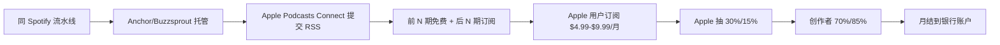

# Apple Podcasts Subscriptions 订阅分成(2026)

## 一句话定位

在 Apple Podcasts Connect 开设付费播客订阅,创作者拿 70%(年 1)/ 85%(年 2+)分成,听众覆盖 170+ 国家,适合与 Spotify 矩阵同步分发,补足苹果生态的订阅收入。

## 为什么这是机会(2026 证据)

来自 [Apple Podcasts Subscriptions 官方页](https://podcasters.apple.com/878-subscriptions) 的核心政策:

> "Apple Podcasts Subscriptions lets you offer your fans premium benefits like ad-free listening, early access, and bonus episodes, while earning extra income for yourself."
> "Reach listeners in more than 170 countries and regions. Apple Podcasts lets you offer subscriptions in 40 languages."
> "The best-performing subscriptions on Apple Podcasts convert more than 10% of listeners to subscribers."

来自 [Apple Subscription Launch Checklist](https://podcasters.apple.com/support/5553-subscription-launch-checklist) 的分成规则:

> "You receive **70% of the subscription price** at each billing cycle, minus applicable taxes. After a subscriber accumulates one year of paid service, your net revenue increases to **85%** of the subscription price, minus applicable taxes. Your other podcast revenue—including any ads—will stay 100% yours."

## 自动化路径

工具栈:
- **底层**:同 [Spotify 播客自动化](./spotify-podcast-partner-program-2026.md)(ElevenLabs + Claude + Descript + Anchor)
- **苹果侧**:Apple Podcasts Connect 后台 + 手动提交 RSS(因 Apple 限制,无法完全自动)
- **订阅销售**:Apple Podcast Subscriptions 月费/年费设置
- **额外内容**:用同一流水线制作"加更集/无广告版"作为付费内容

| # | 步骤 | 自动/人工 | 工具 |
| --- | --- | --- | --- |
| 1 | 内容制作 | 自动 | 同 Spotify(AI TTS) |
| 2 | 托管 RSS | 自动 | Anchor |
| 3 | 提交到 Apple | 人工(一次性审核) | Apple Podcasts Connect |
| 4 | 订阅销售页 | 半自动 | Apple Connect 后台 |
| 5 | 月度结算 | 自动 | Apple 每月转账到银行 |
| 6 | 续订/数据 | 自动 | Apple Connect 仪表板 |

`auto_ratio`: **0.75**(内容自动化同 Spotify,但 Apple 提交/审核/订阅设置需人工)

## 评分明细(按 002 标准)

| 维度 | 分数(0-10) | v2 权重 | 加权 |
| --- | --- | --- | --- |
| 启动成本(资金) | 9($0 启动) | 0.15 | 1.35 |
| 启动成本(技能) | 6(同 Spotify 技能 + Apple Connect 操作) | 0.05 | 0.30 |
| 首笔收入速度 | 5(需先建立 5-10k 听众基础) | 0.15 | 0.75 |
| 可扩展性 | 8(同 Spotify,可矩阵多 niche) | 0.10 | 0.80 |
| 可持续性 | 7(订阅型 + Apple 生态稳定) | 0.10 | 0.70 |
| 自动化程度 | 7(内容自,订阅设置半人工) | 0.15 | 1.05 |
| 风险 | 6.7(拆分:法律 8 × 0.5 + ToS 5 × 0.3 + 市场 6 × 0.2 = 6.7) | 0.15 | 1.01 |
| 证据强度 | 8(Apple 官方清晰规则) | 0.15 | 1.20 |
| + 现实数据奖励 | 0(无月入 $1k 独立案例) | — | 0.00 |
| **总分** | — | — | **7.2** |

决策:**排队**(与 Spotify 同步做,内容复用 80%)

## 中国个人 2026 收款路径

- **账号注册**:Apple Podcasts Connect 需 Apple ID(中国大陆 Apple ID 可注册,但**部分功能/Podcasters Program 需海外 Apple ID**)
- **收款**:
  - **银行账户**:Apple 直接电汇,需 SWIFT 银行账户(中国银行/招商银行香港等)
  - **PayPal**:部分国家支持,中国大陆 Apple ID 收款需绑定 PayPal + 信用卡
  - **Payoneer**:可作为中介收款(类似 Stripe 模式)
- **国家列表**:Apple Podcasts **170+ 国家可发布**,但 Subscriptions 功能在 100+ 国家(中国大陆属"可发布但订阅功能可能受限"区域)
- **关键提示**:**强烈建议用美/英/日 Apple ID 注册 Podcasts Connect**,可解 95% 的功能与收款问题。
- **税务**:Apple 抽 30%/15% 后,美国源收入需 W-8BEN 表(非美国人填),中国个人 0% 协定税率。

## 启动清单

- [ ] 注册海外 Apple ID(美/英/日优先,免费)
- [ ] 登录 Apple Podcasts Connect(https://podcastsconnect.apple.com)
- [ ] 同 Spotify 流水线(Anchor 托管 + AI TTS + RSS 自动同步)
- [ ] 先发 10-20 期免费内容建立听众
- [ ] 申请 Apple Podcasters Program(满足 5-10k 听众基础)
- [ ] 设置 Subscriptions($4.99/月起,自定价格)
- [ ] 提交付费内容审核(广告-free / 加更集 / 早期访问)
- [ ] 上线后监控订阅转化(行业基准 > 5-10%)

## 风险与红线

- **苹果审核严**:Subscriptions 内容需"明显价值"(独家访谈 / 深度剧集 / 无广告版),仅"提前 1 天"不算数。
- **退款政策**:Apple 14 天无理由退款,创作者承担 1 期损失。
- **解约率**:订阅内容空窗期(> 4 周)会导致 churn 飙升,需保持节奏。
- **多平台策略**:Apple 收 30%/15% + Spotify 收 50% = **总抽成 40-65%**,需保证 $4.99+ 月费才合算。
- **合规**:不可用 Apple Podcasts 卖"非音频商品"(如 PDF),仅音频相关订阅内容可。

## 监控指标

- 免费 → 订阅转化率(健康线 > 5%,优秀线 > 10%)
- 月度 churn rate(健康线 < 8%)
- LTV(健康线 > 12 个月)
- 跨平台占比(Apple 订阅 vs Spotify 收入,目标 Apple 占 30-40%)

## 参考来源

1. [Apple Podcasts Subscriptions Official](https://podcasters.apple.com/878-subscriptions) — official — 抓取:2026-06-04
   > "70% / 85% 分成 + 170+ 国家 + 40 种语言 + >10% 转化率基准"
2. [Subscription Launch Checklist - Apple Podcasters](https://podcasters.apple.com/support/5553-subscription-launch-checklist) — official — 抓取:2026-06-04
   > "70% year 1 / 85% year 2+ / 100% ads" 完整分成规则
3. [Submit a new show - Apple Podcasts for Creators](https://podcasters.apple.com/support/897-submit-a-show) — official — 抓取:2026-06-04
   > 提交流程:Apple Podcasts Connect + RSS feed,无国别限制
4. [Spotify Partner Program Updates 2026-01-07](https://newsroom.spotify.com/2026-01-07/spotify-partner-program-updates/) — official — 抓取:2026-06-04
   > 同期 Spotify 门槛大降,验证 podcast industry 在 2026 持续增长
5. [Patreon Pricing Plans 2026](https://www.patreon.com/pricing) — official — 抓取:2026-06-04
   > 行业基准:订阅平台抽成 5-10%(Patreon/BMAC),Apple 70% 创作者分成仍属优厚

## 复盘/亲测

> 未亲测。建议作为 Spotify 播客自动化的"补充收入"叠加做:
> 1. Spotify 流水线跑通后,同一份 RSS 同步到 Apple Podcasts(免费/付费分层);
> 2. 用美区 Apple ID 注册 Apple Podcasts Connect;
> 3. 听众过 5k 后,开 $4.99/月订阅,提供"广告-free + 每周加更 1 期";
> 4. 预期: 1 年内订阅 200-500 人,月入 $1k-$2.5k。
