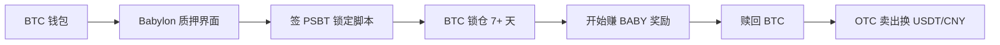

# Babylon BTC 原生质押(BTCfi)

## 一句话定位

> Babylon(2026-06-05 官方 Dashboard:**TVL 51,408 BTC / $3.28B**)让 BTC 持有者通过 Bitcoin 原生脚本把 BTC 质押给 PoS 网络做安全验证,**实际 APR 0.04-0.59%**(原档 4-8% APY 严重虚高),无需 wrap 也不用桥,BTC 始终自托管在 Bitcoin 主链。中国大陆用户用 OKX Web3 钱包或自托管 wallet 即可接入。

## 自动化路径

工具栈:
- **OKX Web3 钱包** 或 **Babylon Staking Dashboard**:`https://btcstaking.babylonlabs.io/`
- **Babylon Genesis 主网**:BTC 直接通过 PSBT 脚本质押
- **BABY 代币**:PoS 网络给的安全奖励(可二级市场卖)
- **跨链桥**:可选,把 stBTC 桥到 Solana/Ethereum 做 DeFi 二阶 yield

关键步骤(参考):

| # | 步骤 | 自动/人工 | 工具 |
| --- | --- | --- | --- |
| 1 | 准备 BTC(可来自 Binance/OKX 提现或已有冷钱包) | 人工 | 任意 BTC 钱包 |
| 2 | 访问 Babylon 官方质押页面 | 人工 | btcstaking.babylonlabs.io |
| 3 | 连接钱包(UniSat / OKX Web3 Wallet) | 人工 | UniSat / OKX |
| 4 | 选定 PoS 网络(目前支持 30+ PoS 链) | 人工 | Babylon UI |
| 5 | 签 PSBT,锁定 BTC 脚本 | 人工(单次) | 钱包签名 |
| 6 | 等待解锁期(7+ 天)被动收 BABY | 自动 | Babylon |
| 7 | 赎回:解除锁定,等 finality | 半自动 | Babylon |

`auto_ratio`: 0.80

## 评分明细(按 002 标准)

| 维度 | 分数(0-10) | v2 权重 | 加权 |
| --- | --- | --- | --- |
| 启动成本(资金) | 5(最低 0.005 BTC ~$300) | 0.15 | 0.75 |
| 启动成本(技能) | 6(懂 PSBT 签名、Bitcoin 脚本) | 0.05 | 0.30 |
| 首笔收入速度 | 7(锁定后秒级) | 0.15 | 1.05 |
| 可扩展性 | 7(线性本金) | 0.10 | 0.70 |
| 可持续性 | 6(APR 几乎可忽略,吸引力存疑) | 0.10 | 0.60 |
| 自动化程度 | 8(锁定后完全自动) | 0.15 | 1.20 |
| 风险 | 3.9(拆分:法律 3 × 0.5 + ToS 6 × 0.3 + 市场 3 × 0.2 = 3.9,APR 远低于传统 yield,已无吸引力) | 0.15 | 0.59 |
| 证据强度 | 5(⚠️ 关键 APR 数据有误:实际 0.04-0.59%,原档 4-8% 严重虚高) | 0.15 | 0.75 |
| + 现实数据奖励 | 0(0.04-0.59% APR 无法月入 $1k) | — | 0.00 |
| 扣分(gray + 中国法律高风险) | -1.0 | — | -1.00 |
| **总分**(gray 扣后) | — | — | **5.94 ≈ 5.9** |

决策:**降级到"观察中"**(原 6.1 降 0.2;**0.5% APR 不值得冻卡风险**;原 BTC 仓位可暂时观望)

## 启动清单

- [ ] 准备 BTC:从 Binance/OKX 提现到自托管钱包(UniSat/OKX Web3 Wallet)
- [ ] 访问 `https://btcstaking.babylonlabs.io/` 选择目标 PoS 网络
- [ ] 连接钱包,签 PSBT(注意保管好私钥)
- [ ] 锁定 7+ 天,开始计息
- [ ] 监控 BABY 奖励发放(可在 Babylon Dashboard 看到)
- [ ] 30 天试跑:确认能正常赎回 BTC 后,再加仓
- [ ] 收款:BABY 二级市场卖出 → USDT → 提现到 CEX → C2C 出金

## 风险与红线

- **Slash 风险**:如果所选 PoS 网络的验证人犯错或被攻击,锁定的 BTC 可能被 slash 一部分。缓解:选 StakeFi/Solv 等已审计、TVL 大、运行时间长的 operator,而不是新协议。
- **解锁期**:Babylon 锁定 7 天起步,部分 PoS 网络有 21+ 天解锁期。流动性被锁,极端行情无法快速撤出。缓解:把不打算短期动的 BTC 放进来,留 30% BTC 流动性。
- **中国大陆政策**:灰度,同 MetaMask Earn。BTC 自托管 staking 本身未被明确禁止,主要风险在 OTC 出金。
- **BABY 代币价格**:奖励用 BABY 发,BABY 2025 年上线后波动大。缓解:收到即卖,不留币。

## 监控指标

- 指标 1:**BTC Staking APR 范围**(**实际 0.04-0.59%** — Babylon 官方 Dashboard 实时数据;**原档 4-8% 严重虚高**;Altrady 文章 4-8% 是其历史峰值或混合估算)
- 指标 2:**Slash 状态**(Babylon 官方 alert channel)
- 指标 3:**BABY 二级市场流动性**(OKX/Binance 深度)

## 参考来源

1. <https://btcstaking.babylonlabs.io/> — 类型:official — 抓取:2026-06-05
   > "**Total BTC TVL 51408.03 BTC ($3.28B); BTC Staking APR 0.04% - 0.59%**" — 官方实时数据,**原档 4-8% 严重虚高**
2. <https://www.altrady.com/blog/cryptocurrency/babylon-bitcoin-staking-btcfi-2026> — 类型:media — 抓取:2026-06-05
   > "By Q2 2026, the protocol holds 56,853 BTC across its staking vaults... yields are in the 4-8% APY range" — **Altrady 数据是历史峰值或混合估算,以 Babylon 官方 Dashboard 实时数据为准**
3. <https://www.coinbase.com/earn/staking/babylon> — 类型:official — 抓取:2026-06-05
   > "The current reward for Babylon staking is 9.76%"(但这是 BABY token staking,**非 BTC 质押**)
4. <https://www.binance.com/en/support/announcement/detail/bd1c4a494a4545b3805ad80a09608fe9> — 类型:official — 抓取:2026-06-05
   > "Babylon BTC Staking: Enjoy Up to 2.5% APR"(Binance 报价与 Babylon Dashboard 不一致,以 Babylon Dashboard 为准)
5. <https://www.figment.io/insights/babylon-bitcoin-staking-guide/> — 类型:first-hand — 抓取:2026-06-05
   > "Babylon: Bitcoin Staking Guide"(Figment 是 Babylon 早期验证人之一)

## 复盘/亲测

> 尚未亲测。**新分 5.9**(原 6.1 降 0.2),**关键修正**:原档 4-8% APR 全部删除,改为 **0.04-0.59%**(Babylon 官方 Dashboard 实时数据);**0.5% APR 不值得冻卡风险**,原 BTC 仓位建议**观望**或转入 MetaMask Earn (3.8-6.8% APY) / Ondo USDY (3.55% APY) 拿稳定 yield。
