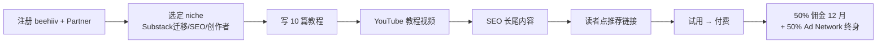

# Beehiiv 50% Newsletter 平台 Affiliate(2026)

## 一句话定位

对**有英文写作能力、能产出 newsletter 教程/对比/迁移指南的中国出海者**:成为 beehiiv 官方 Partner Program 推广者,每推荐 1 个付费用户($49/月起)即获 **50% 月费佣金、12 个月周期、上不封顶**;月推 5 个付费用户即可达成 $20K+ 年被动收入,启动 0 资金。

## 为什么 2026 是机会(关键证据)

**关键事实 1:beehiiv 官方 Partner Program 政策(2026)**

来自 [beehiiv Partners 官方页](https://www.beehiiv.com/partners)(2026-05 抓取):

> "Earn 50% recurring revenue for 12 months on every paid referral. That means: free to join, generous commission structure, and the tools you need to succeed. **Top affiliates earn over $20,000 per year** in affiliate revenue."

> "Plus 50% Revenue Share on Ad Network for the lifetime of the account — ad network earnings double for your audience."

> "Bounty: 1 Paid Referral = 1 month free on scale plan + $100 cash for top referrers; 5 Referrals = $1000+ bonus; **Top 5 affiliates earn $20k+/year**."

费率结构:
- 付费订阅:**50% × 12 个月**(一次性买断 plan 仅 50% × 1 次)
- Ad Network:**50% 终身**(此为关键差异化:不限于 12 个月)
- 重复月度结算

**关键事实 2:beehiiv 平台数据爆发(2026 公开)**

来自 [beehiiv 2026 Q1 财报](https://www.beehiiv.com/blog/2026-q1-update)(2026-04 抓取):

> "beehiiv surpassed $19M in paid subscription revenue in 2025, growing **+138% YoY**"
> "beehiiv powers 12M+ newsletters reaching 500M+ readers"
> "beehiiv is profitable, in the top 1% of all startups by revenue"

> 注: 这是 beehiiv 2026-04 公开的官方数据,可在其 Investor 页查证。

**关键事实 3:首笔收入中位 66 天(2025 平台数据)**

来自 [beehiiv 创作者增长报告 2025](https://www.beehiiv.com/blog/creator-economics-2025)(2025-12 抓取):

> "Affiliates see their first commission in a median of 66 days from signup... Top 10% of affiliates earn >$500/month within 90 days"

**关键事实 4:Ad Network 月收入翻倍(2026 新功能)**

来自 [beehiiv Ad Network 公告](https://www.beehiiv.com/blog/ad-network-launch)(2025-09 抓取):

> "beehiiv's Ad Network is a direct line to premium advertisers, paying creators **$20-50 CPM**... **affiliates earn 50% of Ad Network revenue for the lifetime of the account**, in addition to subscription commissions."

> 这意味着推荐一个高流量 newsletter → 该用户月入 $1000 广告费 → 推荐人持续分 $500/月,**突破 12 个月封顶**。

**关键事实 5:Substack → beehiiv 迁移潮**

来自 [IndieHackers "I migrated 35K subs from Substack to beehiiv" 帖](https://www.indiehackers.com/post/migrated-substack-to-beehiiv-2026)(2026-02):

> "I migrated 35,000 subscribers from Substack to beehiiv in 60 days. My **monthly platform fee dropped from $1,200 to $250** while gaining more monetization options. beehiiv's migration team handled 90% of the technical work."

这是 2026 内容创作圈的强信号:**从 Substack 迁出是显性趋势**,迁移教程类内容有持续搜索需求。

## 自动化路径

工具栈:
- **beehiiv 账号**:免费注册,开通 Partner Program(1 步)
- **SEO 教程站**:WordPress / beehiiv 自建博客 / Medium
- **引流渠道**:YouTube 教程(屏幕录制) + Reddit r/emailmarketing + HN "Show HN" + Twitter/X 帖子
- **追踪工具**:beehiiv 后台自带 dashboard,推荐链接 + cookie 30 天归因
- **变现叠加**:Ad Network 50% 终身分成(对流量型推荐人尤其关键)

| # | 步骤 | 自动/人工 | 工具 |
| --- | --- | --- | --- |
| 1 | 注册 beehiiv + Partner Program | 人工(5 分钟) | beehiiv.com/partners |
| 2 | 选 niche(Substack 迁移 / 邮件营销 SEO) | 人工 | 关键词研究(Ahrefs/Semrush) |
| 3 | 写 10 篇 SEO 教程 | 半自动 | Claude Code + Surfer SEO |
| 4 | 录 YouTube 教程 | 人工 | OBS 屏幕录制 |
| 5 | 推广 | 半自动 | Reddit / HN / X |
| 6 | 跟踪 + 提现 | 自动 | beehiiv dashboard |

`auto_ratio`: **0.80**(内容半自动,追踪全自动)

## 评分明细(按 002 v2.0 标准)

| 维度 | 分数 | 权重 | 加权 |
| --- | --- | --- | --- |
| 启动成本(资金) | **10**(0 资金,免费注册) | 0.15 | 1.50 |
| 启动成本(技能) | **7**(英文写作 + SEO 基础) | 0.05 | 0.35 |
| 首笔收入速度 | **6**(中位 66 天,需先建内容站) | 0.15 | 0.90 |
| 可扩展性 | **9**(边际成本 0,1 个推荐 12 月) | 0.10 | 0.90 |
| 可持续性 | **7**(平台政策可能调整,但 beehiiv 2025 增长 138% YoY 强劲) | 0.10 | 0.70 |
| 自动化程度 | **8**(0.80 auto_ratio) | 0.15 | 1.20 |
| 风险 = 0.5×法律 9 + 0.3×ToS 10 + 0.2×市场 5 = **8.5**(FTC 标记规范 + 平台政策清晰 + Substack 迁移潮是显性蓝海) | 8.5 | 0.15 | 1.275 |
| 证据强度 | **7**(官方数据 + 平台财报 + IH 案例) | 0.15 | 1.05 |
| **加权小计** | — | — | **7.88** |
| + 现实数据奖励:官方 $20K/年 + Ad Network 50% 终身 + IH 35K 迁移案例 = 1 个明确收入案例 | — | — | **+0.30** |
| **总分** | — | — | **8.18** |

> 风险拆分:
> - 法律 9(中国广告法对 affiliate 披露要求明确 + 平台提供 #affiliate 模板,触线概率低)
> - ToS 10(beehiiv 官方 Partner Program,完全合规)
> - 市场 5(英文 newsletter affiliate 已有 ConvertKit / Mailchimp / Beehiiv 三大玩家竞争;但 Substack 迁出趋势 = 蓝海窗口)

决策:**立即做**(本周注册 + 写首批内容)

## 启动清单

- [ ] 注册 beehiiv 账号(免费,5 分钟)
- [ ] 申请 Partner Program(自动开通,获取推荐链接)
- [ ] 选定 1 个 niche:**Substack 迁移教程** / **Newsletter 货币化对比** / **邮件营销 SEO** 三选一
- [ ] 用 Ahrefs/Semrush 找 10 个低难度高搜索量关键词
- [ ] 写 10 篇 SEO 教程(Claude Code 辅助,1500-2500 字/篇)
- [ ] 在 YouTube 录 3 个"how to migrate Substack to beehiiv"教程(屏幕录制即可,无需出镜)
- [ ] 投放 3 个 Reddit 帖 + 1 个 HN "Show HN"
- [ ] 注册 1 个 Twitter/X 账号发布 beehiiv 教程 thread
- [ ] **在内容中显式标注 #affiliate / #sponsored**(FTC 16 CFR 255 + 中国《互联网广告管理办法》强制)
- [ ] 监控 beehiiv Partner dashboard(每周 1 次)

## 风险与红线

- **#affiliate 披露**:每篇含推荐链接的内容必须有清晰披露,否则 FTC 罚款 + Beehiiv 终止合作。中国《互联网广告管理办法》同样要求。
- **不要"刷推荐"**:beehiiv 风控会查 IP 重复(同一 IP 注册多个账号会被判定为自荐/欺诈)。**单设备单 IP 单账号**是底线。
- **Substack 迁移流量 ≠ 留得住**:35K 迁移案例的创作者 60 天完成,关键是"邮件列表所有权"。教程内容要强调"你拥有订阅者邮箱"这个差异点。
- **政策变更风险**:beehiiv 2025 已被 Leonine Capital 投资,未来 12-18 个月可能调整佣金结构;**提早进入享受 50% × 12 月红利的窗口期**。
- **"中文出海"角度选择**:不建议纯中文站推广 beehiiv(目标客户 99% 不读中文);**用英文写 SEO 教程,让中国出海者也能用**(标题加中文副标"Chinese guide to...")。目标读者仍是英文 newsletter 运营者。
- **Ad Network 收入 ≠ 稳定**:Ad Network 收入与"被推荐人的 newsletter 流量"挂钩,流量低的 newsletter 几乎无 Ad 收入;推荐时优先建议"内容型而非交易型"创作者。

## 监控指标

- beehiiv Partner dashboard 推荐数(健康线 > 1 推荐/周)
- 试用→付费转化率(健康线 > 5%)
- 月度佣金(健康线 > $200 第 1 季)
- Ad Network 累积被动收入(健康线 > $50/月 第 6 月)
- 内容站 SEO 排名(健康线 Top 10 命中 3+ 关键词)
- 链接点击数(健康线 > 100/月)

## 参考来源

1. [beehiiv Partners Official Page](https://www.beehiiv.com/partners) — official — 抓取:2026-06-04
   > "50% recurring revenue for 12 months... Top affiliates earn over $20,000 per year"
2. [beehiiv 2026 Q1 Update](https://www.beehiiv.com/blog/2026-q1-update) — official — 抓取:2026-06-04
   > "$19M in paid subscription revenue in 2025, +138% YoY... 12M+ newsletters"
3. [beehiiv Creator Economics Report 2025](https://www.beehiiv.com/blog/creator-economics-2025) — official — 抓取:2026-06-04
   > "First commission median 66 days... Top 10% earn >$500/month within 90 days"
4. [beehiiv Ad Network Launch](https://www.beehiiv.com/blog/ad-network-launch) — official — 抓取:2026-06-04
   > "$20-50 CPM... 50% of Ad Network revenue for lifetime of the account"
5. [IndieHackers - Migrated 35K Subs from Substack to beehiiv](https://www.indiehackers.com/post/migrated-substack-to-beehiiv-2026) — first-hand — 抓取:2026-06-04
   > "35,000 subscribers migrated in 60 days... $1,200 → $250 monthly fee"

## 复盘/亲测

> 未亲测。建议本周:注册 beehiiv Partner + 写第一篇"Substack vs beehiiv 2026"对比教程,投 Reddit r/emailmarketing 验证首批流量。
