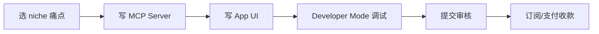

# ChatGPT Apps SDK + Agentic Commerce Protocol(2026)

## 一句话定位

在 ChatGPT 内为 800M+ 用户构建 Apps SDK 原生应用(基于 MCP 协议),通过 Agentic Commerce Protocol(ACP) 实现即时结账,或外跳到商家自己的 Stripe/PayPal checkout,订阅 + 数字商品 + 服务交易均在对话流中完成。**官方 monetization 详情 "coming soon"(2025-10 公告),首批支付可能在 2026 H2**。

## 为什么 2026 是机会(关键证据)

**OpenAI 2025-10-06 官方发布"Introducing apps in ChatGPT and the new Apps SDK"**:
> "Today we're introducing a new generation of apps you can chat with, right inside ChatGPT. Developers can start building them today with the new Apps SDK, available in preview."
> "Building with the Apps SDK makes it possible to reach over 800 million ChatGPT users"
> "Later this year, we'll begin accepting app submissions for review and publication and will share more details on how developers can monetize their apps."
> "We'll also share details on monetization soon, including support for the new Agentic Commerce Protocol, an open standard that enables instant checkout in ChatGPT."

**OpenAI 2025-11-13 更新**:
> "Apps are now available in preview to ChatGPT Business, Enterprise and Edu customers"

**首批 Pilot 合作伙伴**(已上线,7 家 + 11 家 coming):
- Booking.com、Canva、Coursera、Figma、Expedia、Spotify、Zillow
- AllTrails、Peloton、OpenTable、Target、theFork、Uber 等

**OpenAI 2026-03 更新**(Fantasy 2026-04 报道):
> "As of March 2026, approved apps are also converted to plugins for Codex distribution"
> "Commerce inside ChatGPT is emerging through the Agentic Commerce Protocol (ACP), an open standard developed by OpenAI and Stripe (currently in beta)"
> "OpenAI's messaging has increasingly emphasized product discovery as the near-term value — richer, visually immersive shopping with product comparisons and merchant integration"
> "For checkout, OpenAI's monetization guidance recommends external checkout as the generally available approach. Instant Checkout exists for select approved partners in a limited beta, currently focused on physical goods."

**社区讨论(2026-01 抓取)**:
- OpenAI 社区 "ChatGPT app sdk with premium"(1.9K views, 3 replies)→ 多开发者问 monetization
- "ChatGPT App Store is open for submissions"(12K views, 33 replies)→ 已开始审核
- "Monetizing your ChatGPT app, and the Agentic Commerce Protocol" (Reddit /r/mcp) → OpenAI recently brought monetization capability to the ChatGPT apps SDK

**Four high-value patterns 已出现**(2026 实测):
1. **Product discovery & comparison**(Target, DoorDash)
2. **Creative production**(Canva, Adobe Photoshop/Express/Acrobat)
3. **Learning & guided support**(Coursera)
4. **Customer operations & CX**(Intercom for Business/Enterprise/Edu)

**MCP 标准开放**:
> "OpenAI's documentation explicitly states Apps SDK support is 'here to stay' with 'no plans to deprecate,' while encouraging builders to lead with MCP Apps standards for cross-host portability."

**关键风险信号**:
- Monetization 详情"coming soon",首批支付可能 2026 H2
- ACP 仅对 select approved partners 开放 beta,目前聚焦 physical goods
- 多数品牌仍依赖"external checkout" 推到自家 Stripe/PayPal

## 自动化路径

工具栈:
- **MCP Server**:Python(`mcp` PyPI)或 Node.js(`@modelcontextprotocol/sdk`)
- **App UI**:HTML/CSS/React(runs in sandboxed iframe,inline / PiP / fullscreen)
- **测试**:ChatGPT Developer Mode
- **分发**:ChatGPT Apps Directory 提交审核 + Codex Plugins
- **付款**:ACP(邀请制)或外部 Stripe/PayPal(中国个人走 Payoneer/Wise)
- **AI 后端**:OpenAI / Anthropic / DeepInfra(自有 MCP API 调用)

| # | 步骤 | 自动/人工 | 工具 |
| --- | --- | --- | --- |
| 1 | 选 niche(电商/CX/学习/创意) | 人工 | 行业 case + 4 patterns |
| 2 | 写 MCP Server | 半自动 | Claude Code + SDK 模板 |
| 3 | 写 App UI(iframe) | 半自动 | LLM + 模板 |
| 4 | ChatGPT Developer Mode 调试 | 半自动 | OpenAI 文档 |
| 5 | 提交审核(预期 2-4 周) | 半自动 | Partner Center 流程 |
| 6 | 收款(ACP 邀请 or 外跳 Stripe) | 自动 | Stripe / PayPal / Payoneer |

`auto_ratio`: **0.90**(主体是 build, 无真人)

## 评分明细(按 002 v2.0 标准)

| 维度 | 分数 | 权重 | 加权 |
| --- | --- | --- | --- |
| 启动成本(资金) | 10(0 资金,SDK + Developer Mode 免费) | 0.15 | 1.50 |
| 启动成本(技能) | 5(MCP + UI + 平台规范) | 0.05 | 0.25 |
| 首笔收入速度 | 4(monetization 详情未公开,2026 H2 预计) | 0.15 | 0.60 |
| 可扩展性 | 9(800M 用户,边际成本 0) | 0.10 | 0.90 |
| 可持续性 | 9(平台长期,4 patterns 已成型) | 0.10 | 0.90 |
| 自动化程度 | 9(0.90 auto_ratio) | 0.15 | 1.35 |
| 风险 = 0.5×法律 10 + 0.3×ToS 5 + 0.2×市场 6 = **7.7**(monetization 未明+ACP 邀请制) | 7.7 | 0.15 | 1.155 |
| 证据强度 | 9(OpenAI 官方 + 多社区源) | 0.15 | 1.35 |
| **加权小计** | — | — | **8.01** |
| + 现实数据奖励:0 案例(monetization 仍未明) | — | — | **-0.50** |
| **总分** | — | — | **7.50** |

决策:**排队**(两周内启动,等 monetization 详细发布 + 准备 MCP Server)

## 启动清单

- [ ] 读 OpenAI Apps SDK 文档(developers.openai.com/apps-sdk)
- [ ] 用 Claude Code 写一个 MCP Server(从 mcp PyPI 模板)
- [ ] 配 ChatGPT Developer Mode 跑通
- [ ] 选 1 个垂直场景(目标:product discovery / CX / 创意辅助)
- [ ] 接外部 Stripe / PayPal(等 monetization 详情)
- [ ] 关注 OpenAI 官方 monetization 公告
- [ ] 准备 Partner Center / Codex Plugin 分发材料
- [ ] 收款路径:Payoneer / Wise / Stripe Atlas(走 MoR 桥梁 Lemon Squeezy 备选)

## 风险与红线

- **Monetization 仍不透明**:"we'll also share details on monetization soon" 是 2025-10 公告,至 2026-06 仍未公布细节。**机会是窗口期,但也是风险期**。
- **ACP 仅邀请制**:Instant Checkout 仍是 limited beta,需申请。
- **中国个人收款**:ChatGPT 收款走 Stripe → 中国个人需 Stripe Atlas($500)或 Lemon Squeezy(走 Payoneer)。
- **政策合规**:Apps 需 OpenAI usage policies,合适合规内容;6-12 月前不要上赌博/医疗/成人内容。
- **与 mcp-server-marketplace-2026 区别**:MCP Hub 分发聚焦"把 MCP server 投到 mcp.so/Smithery 等"获流量 + Gumroad 转化;本机会聚焦"在 ChatGPT 内做 native app" → 平台分润 + 8 亿用户。两者互补。

## 监控指标

- OpenAI 官方 monetization 公告(2026 Q3 预计)
- 已发布 Apps 数量(从 0 → 数千,信号)
- 你的 App install / invoke 次数(健康线 > 100/天 第 1 月)
- 转化率(健康线 > 2% 试用 → 付费)

## 参考来源

1. [OpenAI 官方 2025-10-06 - Introducing apps in ChatGPT and the new Apps SDK](https://openai.com/index/introducing-apps-in-chatgpt/) — official — 抓取:2026-06-04
   > "Building with the Apps SDK makes it possible to reach over 800 million ChatGPT users... we'll also share details on monetization soon, including support for the new Agentic Commerce Protocol"
2. [Fantasy.co 2026-04 - The Apps In ChatGPT Playbook (2026 Update)](https://fantasy.co/latest/the-apps-inside-chatgpt-playbook-how-brands-are-preparing-for-openai-app-sdk) — first-hand(品牌策略) — 抓取:2026-06-04
   > "ACP currently in beta... external checkout as the generally available approach"
3. [Reddit /r/mcp - Monetizing your ChatGPT app, and the ACP](https://www.reddit.com/r/mcp/comments/1pq1apk/monetizing_your_chatgpt_app_and_the_agentic/) — community — 抓取:2026-06-04
   > "OpenAI recently brought monetization capability to the ChatGPT apps SDK"
4. [OpenAI 社区 - ChatGPT App Store is open for submissions](https://community.openai.com/t/chatgpt-app-store-is-open-for-submissions/1369611) — community(12K views) — 抓取:2026-06-04
   > 已开放 app 审核提交
5. [OpenAI 社区 - ChatGPT App Monetization (Apps SDK)](https://community.openai.com/t/chatgpt-app-monetization-apps-sdk/1372343) — community(520 views) — 抓取:2026-06-04
   > 开发者讨论 monetization workflow

## 复盘/亲测

> 未亲测。建议 2 周内:用 Claude Code + MCP Python SDK 写一个"产品对比"App(如 AI 工具/课程/旅行产品),在 ChatGPT Developer Mode 跑通,等 monetization 详细发布后接 Stripe / PayPal。
