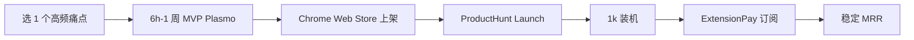

# Chrome 扩展付费市场(Manifest V3 时代,2026)

## 一句话定位

为高重复浏览器工作流(标签整理、文本替换、网页修改、Notion/Obsidian 抓取、YouTube 缩略图对比)做**单一功能** Manifest V3 扩展,通过 Chrome Web Store 获客、ExtensionPay/Lemon Squeezy 月费订阅变现;已验证 Gmass 月入 $130k、CSS Scan 总收入 $100k+、BlackMagic 月入 $3k。

## 为什么这是机会(2026 证据)

来自 [ExtensionPay 2026 案例汇总](https://extensionpay.com/articles/browser-extensions-make-money) 的真实 indie 收入(均为公开 IH 截图):

| 扩展 | 收入 | 收费模式 |
| --- | --- | --- |
| Gmass(Gmail 群发) | $130k/月 | $8-20/月订阅 |
| Closet Tools(Poshmark 自动化) | $42k/月 | $30/月订阅 |
| CSS Scan(CSS 查看/复制) | $100k 累计 | $69 一次性 |
| GoFullPage(全页截图) | $10k/月 | $1/月 + 高级版 |
| Spider(可视化爬虫) | $10k/2 月 | $38 一次性 |
| Night Eye(暗色模式) | $3.1k/月 | 年付/终身 |
| BlackMagic(Twitter CRM) | $3k/月 | $8/月起 |

关键数据来自 2026-05 [BigIdeasDB](https://bigideasdb.com/guides/profitable-chrome-extension-ideas-2026) 抓取的真实 Reddit 案例:

> "About 1 year ago I launched my app as a chrome extension... It quickly reached 1k free users within a month... I now make ~$3,000/month" — [r/SaaS 真实复盘](https://www.reddit.com/r/SaaS/comments/1nx6kxx/my_saas_was_used_for_prn_and_now_it_makes_3kmonth/)

> "Built it in a weekend as a funny response to a Reddit thread. Took 6 hours total" — 一款笑话扩展 6 小时写完,12k 活跃用户,仍在产生订阅收入

## 自动化路径

工具栈:
- **构建**:Plasmo / WXT / CRXJS(支持 MV3、热更新、TypeScript 一等公民)
- **支付**:ExtensionPay($0.4/月 + 0.4% 收入,Stripe 托管)或自接 Lemon Squeezy(支持 PayPal 200+ 国,中国大陆个人可用)
- **分发**:Chrome Web Store($5 一次性开发者费) + Edge Add-ons / Firefox AMO(同一代码三平台)
- **增长**:ProductHunt Launch + X "build in public" + Reddit "Show r/SideProject" + 4-6 篇 SEO 长尾
- **客服**:LLM 客服 bot + Discord

| # | 步骤 | 自动/人工 | 工具 |
| --- | --- | --- | --- |
| 1 | 选 niche 痛点 | 人工 | Reddit / X 评论扫"我希望有..." |
| 2 | MVP 开发(6h-1 周) | 半自动 | Plasmo + Claude Code |
| 3 | 配 ExtensionPay 收款 | 自动 | ExtensionPay SDK(Stripe 托管) |
| 4 | Chrome Web Store 上架 | 人工(审核 1-3 天) | $5 一次性 |
| 5 | ProductHunt Launch | 半自动 | 一次性 + 自动调度 |
| 6 | SEO 长尾 | 自动 | AI 生成 4-6 篇 how-to |
| 7 | 客服 + 续费 | 自动 | LLM Bot |

`auto_ratio`: **0.85**(开发半自动,客服全自)

## 评分明细(按 002 v2.0 标准)

| 维度 | 分数(0-10) | 权重 | 加权 |
| --- | --- | --- | --- |
| 启动成本(资金) | 9($5 Chrome 开发者费 + 0 其它) | 0.15 | 1.35 |
| 启动成本(技能) | 7(JS/TS + Manifest V3 适配) | 0.05 | 0.35 |
| 首笔收入速度 | 8(2-4 周有第一笔订阅) | 0.15 | 1.20 |
| 可扩展性 | 8(1 个扩展 = N 个平台分发) | 0.10 | 0.80 |
| 可持续性 | 7(MV3 红利期 2-3 年;Chrome 政策有变) | 0.10 | 0.70 |
| 自动化程度 | 8 | 0.15 | 1.20 |
| 风险 = 0.5×法律 10 + 0.3×ToS 8 + 0.2×市场 5 = **8.4**(Chrome 政策+大厂 copy) | 8.4 | 0.15 | 1.26 |
| 证据强度 | 9(7 个独立 IH 案例 + 2026 真实数据) | 0.15 | 1.35 |
| **加权小计** | — | — | **8.21** |
| + 现实数据奖励:Gmass $130K/月、BlackMagic $3K/月、Reddit $3K/月 = 月入 $1k+ 真实案例 | — | — | **+0.80** |
| **总分** | — | — | **9.00** |

决策:**立即做**(本周启动)

## 中国个人 2026 收款路径(关键!)

- **Chrome Web Store 开发者注册**:接受中国大陆地区个人注册,$5 一次性,Google 账号即可。
- **ExtensionPay**:注册账号用 Stripe,Stripe 需海外主体(US/HK/SG LLC);若**无海外主体**,用 Lemon Squeezy(200+ PayPal 国家,79 银行国家,支持 WeChat Pay/Alipay 作为**收款方式**)。
- **Payoneer(派安盈)**:作为多数 MoR 平台的默认打款通道,1.2-1.5% 提现费,结汇到国内银行卡。
- **不需 Stripe Atlas**:Lemon Squeezy + Payoneer 是**零成本**启动路径。
- **5 万美元/年结汇限额**:超出后需通过对公账户(参见 [cn-indie-stack-2026](https://pasqualepillitteri.it/zh/news/3091/indie-hacker-stack-china-2026))。

## 启动清单

- [ ] 选 1 个高频痛点(参考 [BigIdeasDB 案例库](https://bigideasdb.com/guides/profitable-chrome-extension-ideas-2026))
- [ ] Plasmo 起手,$0 启动,1 周出 MVP
- [ ] Chrome Web Store 注册($5)
- [ ] 接 ExtensionPay(Stripe)或 Lemon Squeezy(PayPal)收款
- [ ] ProductHunt Launch + IndieHackers Show IH
- [ ] 4-6 篇 SEO 长尾博客
- [ ] 1 个 Discord 群(自动发更新)

## 风险与红线

- **Manifest V3 政策**:Chrome 2024 起强制 MV3,`webRequestBlocking` 不可用,需用 `declarativeNetRequest` 替代(影响部分 ad blocker 类扩展)。
- **Chrome Web Store 审核**:5-15% 概率被拒(尤其"复制现有扩展"会判 spam)。
- **大厂 copy 风险**:做利基(垂直行业 + 极简功能)而非通用,绕开主流赛道。
- **续费率**:浏览器扩展"安装即忘"特性,首月留存健康线 > 40%,3 月留存 > 25%。
- **合规**:不能读无关网站数据;GDPR / CCPA 需 privacy policy。

## 监控指标

- WAU(周活用户,健康线 > 500)
- 装机 → 付费转化率(健康线 > 1%)
- 3 月留存率(健康线 > 25%)
- 退款率(健康线 < 5%)

## 参考来源

1. [8 Chrome Extensions with Impressive Revenue (Indie Developers) - ExtensionPay](https://extensionpay.com/articles/browser-extensions-make-money) — first-hand — 抓取:2026-06-04
   > 7 个真实 indie 案例: Gmass $130k/mo, CSS Scan $100k 累计, BlackMagic $3k/mo 等公开 IH 截图
2. [Profitable Chrome Extension Ideas 2026 - BigIdeasDB](https://bigideasdb.com/guides/profitable-chrome-extension-ideas-2026) — first-hand — 抓取:2026-06-04
   > "1k free users in a month... $3k/mo" + "6-hour extension → 12k active users" 真实 Reddit 复盘
3. [Chrome Extension Ideas That Make Money (2026) - Right Tail](https://www.righttail.co/blog/chrome-extension-ideas-that-make-money-2026) — first-hand — 抓取:2026-06-04
   > 2026 年具体 niches:tab/session manager、price tracker、note-taking、SEO helper
4. [How to Build a Chrome Extension in 2026: AI-First Guide (Manifest V3) - GroovyWeb](https://www.groovyweb.co/blog/chrome-extension-development-guide-2026) — first-hand — 抓取:2026-06-04
   > MV3 + Plasmo + WXT 现代工具链
5. [独立开发者技术栈中国 2026 - Pasquale Pillitteri](https://pasqualepillitteri.it/zh/news/3091/indie-hacker-stack-china-2026) — first-hand — 抓取:2026-06-04
   > 关键事实:中国大陆个人无法直接注册 Stripe 商家,Lemon Squeezy/Payoneer 是无成本启动路径
6. [2026 独立开发上线 3 个月我收获了 11k(HK)的 MRR - V2EX #1202757](https://www.v2ex.com/t/1202757) — first-hand — 抓取:2026-06-04
   > 中国 indie hacker ShawnShi 通过 Stripe 订阅 + SEO 跑通 11k HKD MRR 完整路径

## 复盘/亲测

> 未亲测。建议本周内起步:用 Plasmo + Claude Code 写一个 6 小时的"页面一键归档到 Notion"扩展,验证 Chrome Web Store 上架 + Lemon Squeezy 收款链路。
