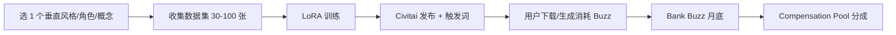

# Civitai Creator Program(2026 Buzz → Cash 模型分成)

## 一句话定位

在 Civitai 平台发布 LoRA / Checkpoint / Textual Inversion 等 AI 图像模型,用户下载/生成图片消耗 Buzz → 创作者把 Yellow Buzz 存入 Bank → 月底按 Civitai Compensation Pool 分成 + 提取费 5%-15%;**Civitai 2025-10-21 升级为"Green Creator Program"**,Creator Score ≥ 40,000 + Bronze/Silver/Gold 会员门槛。

## 为什么 2026 是机会(2025-10 升级 + 2026 仍在跑)

**Civitai Creator Program 2025-10-21 升级(2025-10 / 2025-02 双更新)**:
- 2025-02 第一版,被批"对头部 creator 友好、对中小 creator 不友好"
- 2025-10-21 升级为 **Civitai.green Creator Program** + Bronze/Silver/Gold 会员制
- **2026-06 Compensation Pool 仍在跑**(civitai.com/creator-program 当前页可见 "June 2026" 月池)

**核心机制(从 civitai.com 抓取)**:
- 每月 Civitai 从收入中分一块到 Creator Compensation Pool
- Banking Phase(月初 → 月末前 3 天):Yellow Buzz 存 Bank,Bank 上限按会员等级:Bronze 100k / Silver 125% peak with 1m cap / Gold 150% peak with no cap
- Extraction Phase(月末前 3 天 → 月末前 1 小时):Keep banked(收现金)或 Extract(留 platform 用)
- 提取费:< 100k Buzz 0% / 100k-1M 5% / 1M-5M 10% / >5M 15%(防刷)
- **入门门槛:Creator Score ≥ 40,000**(早期 10k 提升)+ Bronze/Silver/Gold 会员

**Smithery MCP 数据类比(同类"创作者分润"平台)**:
- Civitai 不是直接分润,是**间接 Compensation Pool 模式**
- 类比:Lindy / Relevance / Pickaxe 这类"无 agent marketplace 但订阅分成"模式

## 自动化路径

工具栈:
- **模型训练**:Stable Diffusion 3 / Flux Dev / SDXL Lightning(2026 主流)
- **LoRA 训练**:`kohya_ss` / `ai-toolkit` / Replicate LoRA trainer
- **底座算力**:Replicate / fal.ai / RunPod / 自有 GPU
- **发布**:Civitai 模型卡 + 触发词 + 示例图
- **引流**:Civitai 文章 + Image Posts

| # | 步骤 | 自动/人工 | 工具 |
| --- | --- | --- | --- |
| 1 | 选 niche(动漫角色 / 摄影风格 / 商品图) | 人工 | 调研 Civitai 缺啥 |
| 2 | 数据集收集(30-100 张 + caption) | 半自动 | LLM 自动 caption |
| 3 | LoRA 训练 | 半自动 | Replicate trainer API |
| 4 | 模型卡撰写 + 触发词 | 半自动 | LLM 生成 |
| 5 | Civitai 发布 | 半自动 | Civitai API |
| 6 | 持续发布(2-4 周/模型) | 半自动 | 流水线 |
| 7 | Bank Buzz → 收现金 | 自动 | Civitai dashboard |

`auto_ratio`: **0.7**(模型训练 + 发布半自动,选 niche 必须人工)

## 真实可参与性 2026 评估

**Pros**:
- Civitai 月活百万级,LoRA 真实有需求
- Green Member 起步低($10/月估),比 Patreon 等便宜
- Compensation Pool 模型 — 不依赖单用户订阅,稳定
- Buzz → Cash 提现机制已跑通

**Cons**:
- **Creator Score 40,000 门槛** — 需 1-2 月活跃(下载、评论、发布图片)才能达标
- **Bronze 100k Buzz/月 Bank 上限** — 月收入封顶(粗估 < $50/月)
- **Civitai 政策风险** — 平台涉成人内容,中国 IP 访问可能受限
- **国内合规风险** — LoRA 涉及版权角色(动漫角色)可能涉侵权(008 红线第 1 条)
- **2025-10 升级,模式仍在调整**:Compensation Pool 月度规模不稳定

## 评分明细(按 002 标准)

| 维度 | 分数(0-10) | v2 权重 | 加权 |
| --- | --- | --- | --- |
| 启动成本(资金) | 8($10/月 Green Member + 训练 $20-50/月) | 0.15 | 1.20 |
| 启动成本(技能) | 7(LoRA 训练 + 提示词工程) | 0.05 | 0.35 |
| 首笔收入速度 | 4(需 1-2 月 Creator Score 累积) | 0.15 | 0.60 |
| 可扩展性 | 8(1 个 LoRA 跑 N 个用户) | 0.10 | 0.80 |
| 可持续性 | 6(平台 2025-10 刚升级,模式仍在演进) | 0.10 | 0.60 |
| 自动化程度 | 6(发布半自动,模型训练人工) | 0.15 | 0.90 |
| 风险 | 4.7(拆分:法律 4 × 0.5 + ToS 5 × 0.3 + 市场 6 × 0.2 = 4.7) | 0.15 | 0.71 |
| 证据强度 | 9(官方 Creator Program 页 + 教育站) | 0.15 | 1.35 |
| + 现实数据奖励 | 0(Compensation Pool 模式无月入 $1k 案例) | — | 0.00 |
| **总分** | — | — | **6.5** |

决策:**排队**(1 月内启动,在"AI 图像创作者"画像前提下)

## 启动清单

- [ ] 注册 Civitai 账号(用海外邮箱)
- [ ] 订阅 Green Member Bronze($10/月,估)
- [ ] 选 1 个垂直:摄影风格 / 商品白底图 / 品牌字体 LoRA(避版权)
- [ ] 训练 1 个 LoRA(Replicate / RunPod 算力)
- [ ] 写模型卡 + 触发词 + 5-10 张示例图
- [ ] 活跃 2-3 周:发布图片 + 评论 + 收藏,达 Creator Score 40,000
- [ ] 加入 Creator Program
- [ ] 月底 Bank Yellow Buzz
- [ ] 监控:Creator Score 增速 / Buzz Bank 数 / Compensation Pool 规模

## 风险与红线

- **008 红线第 1 条 — 版权/商标/肖像**:不做动漫角色 LoRA(版权)、不做名人 LoRA(肖像)、不做品牌 logo LoRA(商标)。聚焦"通用风格"或自创 IP。
- **国内 IP 政策**:Civitai 涉成人内容,国内 IP 访问受限;需海外网络环境。
- **平台依赖**:Civitai 单平台分成,无第二收入通道。
- **Compensation Pool 波动**:月规模受 Civitai 总收入影响,可能波动 50%+
- **模式仍在调整**:2025-10 才升级,2026 H2 可能再调整(走 parking-lot 观察)

## 监控指标

- Creator Score(健康线 ≥ 40,000 才能加入)
- 单 LoRA 月下载数(健康线 > 100)
- 月 Bank Buzz 数(健康线 > 100k Bronze 上限)
- 月收入(健康线 > $50,Gold tier 后 > $500)
- 平台 Compensation Pool 月度规模(观察)
- 月发布 LoRA 数(健康线 ≥ 2-4)

## 中国个人 2026 收款路径

- **Civitai 出金方式**:PayPal / 银行转账(具体 Civitai dashboard 验证)
- **国内可用性**:需海外 PayPal(可走 Payoneer)
- **训练算力**:Replicate / fal.ai 招行 Visa 全币种卡
- **会员付费**:需海外信用卡
- **风险**:Civitai 政策变化 + 国内 IP 限制,**不推荐作为第一优先**

## 参考来源

1. [Civitai Creator Program - Official](https://civitai.com/creator-program) — official — 抓取:2026-06-04
   > "Each month Civitai allocates a Creator Compensation Pool from a portion of our revenue based off of Buzz purchased"
   > "Have a Creator Score higher than 10k" (官方页 10k,教育站 40k — 2025-10 升级后可能 40k)
2. [Civitai's Guide to Earning with the Creator Program](https://education.civitai.com/civitais-guide-to-earning-with-the-creator-program/) — official — 抓取:2026-06-04
   > "2025-10-21: Civitai.green Creator Program" + "Creator Score ≥ 40,000 + Membership"
   > "Banking Phase + Extraction Phase" 机制
3. [Smithery MCP Marketplace](https://smithery.ai/) — first-hand — 抓取:2026-06-04
   > 类比:同类"创作者间接分润"平台流量数据(20k+ uses)
4. [Pickaxe Monetize AI Agents 2026](https://pickaxe.co/post/monetize-ai-agents-2026) — first-hand — 抓取:2026-06-04
   > "70-85% creator revenue share on agent marketplaces" — 行业分润比例参考

## 复盘/亲测

> 未亲测。建议先做 1 个"通用摄影风格 LoRA"(如 80s film grain / 4K product shot),验证 Creator Score 累积 + Bank Buzz 流程。**不推荐作为第一优先**(合规风险 + 国内 IP 受限),仅在已有"AI 图像创作者"画像时启动。

## 与现有机会的区别

| 机会 | 模式 | 平台 | 抽成 |
| --- | --- | --- | --- |
| `niche-api-wrapper-2026.md` (6.95) | 行业 API 包装(LLM 增值) | 自接 Stripe / LS | 5-10% |
| `agent-tools-and-skills-distribution.md` (8.3) | Skill/Plugin 分发 | GitHub + Gumroad | 10% |
| **`civitai-creator-program-2026.md`(本机会 6.5)** | **AI 模型(LoRA/Checkpoint)分发** | **Civitai Compensation Pool** | **5-15% Extraction Fee** |

**互补关系**:Civitai 适合"AI 图像创作者"画像,与其他开发者向机会画像不同,可作为子集收入。

## 决策建议(给老板)

**优先级:不立即做**,理由:
1. 国内 IP 合规风险高(Civitai 涉成人内容)
2. Creator Score 40k 门槛高,首笔慢
3. 已被 `niche-api-wrapper-2026.md` (6.95) + `agent-tools-and-skills-distribution.md` (8.3) 覆盖"行业 know-how + 通用 API 增值"主线

**仅当**:老板/团队有"AI 图像创作者"画像 + 海外网络环境时启动。
