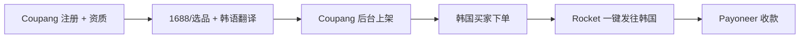

# Coupang Rocket Growth(中国卖家跨境 2026)

## 一句话定位

中国个人/小微企业通过 Coupang Rocket Growth 项目入驻韩国最大电商(2024-2025 上市后市值 $50B+),无韩国法人实体即可 listing,Rocket 物流 + Rocket Growth 一站式代发,触达韩国 5,200 万 Coupang 会员,收款走 Payoneer/银行。

## 自动化路径

工具栈:
- **Coupang Seller Central**(英文/中文):入驻入口
- **Rocket Growth**:仓储 + 包装 + 库存 + 退货
- **Rocket Jikgu / Rocket Delivery**:物流网络
- **Naver Papago + DeepL**:韩语翻译
- **Coupang Open API**:商品/订单/库存自动化
- **Payoneer / 银行收款**:海外结算
- **n8n**:数据回采

关键步骤:

| # | 步骤 | 自动/人工 | 工具 |
| --- | --- | --- | --- |
| 1 | Coupang 注册 + 类目审核 | 人工(首次) | Coupang Seller Central |
| 2 | 选品 + 韩语翻译 | 半自动 | Naver + DeepL |
| 3 | 上架 | 半自动 | Coupang 后台 |
| 4 | 订单履约 | 全自动 | Rocket Growth 网络 |
| 5 | 收款 | 半自动 | Payoneer / 银行 |

`auto_ratio`: 0.75(物流/收款自动,韩语选品需人工)

## 评分明细(按 002 标准)

| 维度 | 分数(0-10) | v2 权重 | 加权 |
| --- | --- | --- | --- |
| 启动成本(资金) | 6(需备货) | 0.15 | 0.90 |
| 启动成本(技能) | 5(韩语能力 + 跨境经验) | 0.05 | 0.25 |
| 首笔收入速度 | 5(冷启动 1-3 月) | 0.15 | 0.75 |
| 可扩展性 | 8(韩国 5,200 万 Coupang 用户) | 0.10 | 0.80 |
| 可持续性 | 7(Coupang 上市后长期投入) | 0.10 | 0.70 |
| 自动化程度 | 6(选品 + 韩语需人工) | 0.15 | 0.90 |
| 风险 | 5.2(拆分:法律 5 × 0.5 + ToS 5 × 0.3 + 市场 6 × 0.2 = 5.2) | 0.15 | 0.78 |
| 证据强度 | 7(官方 Rocket Growth 文档) | 0.15 | 1.05 |
| + 现实数据奖励 | 0(无月入 $1k 案例) | — | 0.00 |
| **总分** | — | — | **6.1** |

决策:**排队**(2 周内启动,需先验证中国个人注册)

## 启动清单

- [ ] 注册 Coupang Seller Central(中国跨境项目)
- [ ] 准备身份证 + 银行账户(中国个人可,但需查 2026 现状)
- [ ] 1688 选品(韩国热销:3C/美妆/家居/服饰)
- [ ] 用 DeepL/Naver Papago 翻译韩语商品标题/描述
- [ ] Coupang 后台上架,设置韩元定价
- [ ] 选择 Rocket Growth 仓储服务(可选,也可自发货)
- [ ] 绑定 Payoneer 收款
- [ ] 监控销售,迭代选品

## 风险与红线

- **Coupang 中国个人入驻**:需查 2026 现状,部分项目仅接受企业。Rocket Growth 原为 SME 项目,门槛可能较高。
- **韩国 KYC**:需要本地代表或韩国实体法人(部分场景);2026 跨境项目可能放宽。
- **数据本地化要求**:韩国《个人信息保护法》严格,需用 Coupang 提供的云服务(韩国本地),不能直接用海外服务器。
- **韩语商品页**:商品标题/描述必须韩语,需 DeepL + 人工校对,直译质量影响转化。
- **物流时效**:Rocket Delivery 标准 1-3 天(本土仓);跨境直邮 7-15 天,转化率低。
- **VAT**:韩国 VAT 阈值 ₩1 亿/年(约 $75k),超限需注册。
- **关税**:跨境商品适用韩国关税 + 消费税 10%,影响定价。

## 监控指标

- 指标 1:**月度 GMV** — 目标 90 天 $500,180 天 $2500
- 指标 2:**毛利率** — 目标 ≥ 25%(扣物流 + 平台费 + 韩语成本)
- 指标 3:**Rocket 物流时效** — 目标 95% 订单 7 天内签收
- 指标 4:**韩语转化率** — 监控 listing 转化,迭代翻译
- 指标 5:**退货率** — 韩国电商退货率 5-10%

## 参考来源

1. [Coupang opens Rocket Growth seller website - KED Global 2024-07-09](https://www.kedglobal.com/retail/newsView/ked202407090009) — 类型:media(行业) — 抓取:2026-06-04
   > "Coupang Inc., South Korea's largest e-commerce platform, announced on Tuesday that it opened a dedicated website for sellers (sell.coupang.com) interested in Rocket Growth. Rocket Growth, which Coupang launched in March last year, is a one-stop service that provides comprehensive fulfillment services, including storage, packaging, inventory management, shipping, and returns."
2. [Korea E-commerce A Complete Guide 2026 - Anchanto 2026-05-26](https://anchanto.com/korea-e-commerce-industry/) — 类型:media(行业) — 抓取:2026-06-04
   > "Cross-border programs on Coupang, Naver Shopping, Gmarket, and SSG.com allow listing without Korean legal entities, handling payment, logistics. Korea e-commerce market $623.7B. Coupang has faced regulatory scrutiny around data handling practices."
3. [Indonesia B2C Ecommerce 2025 - BusinessWire](https://www.businesswire.com/news/home/20260129537865/en/) — 类型:media(行业) — 抓取:2026-06-04
   > "Temu entered the Korean market with aggressive pricing and gamification strategies. This competitive pressure prompted Korean platforms to accelerate private label sourcing, recruit cross-border sellers."

## 复盘/亲测

> 仅在亲自执行后填写。
