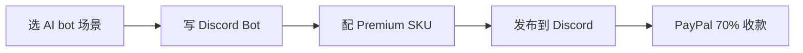

# Discord Premium Apps / Activities 70/30 创作者分润(2026)

## 一句话定位

在 Discord 上开发"Premium App"(Bot、Activity、mini-game、AI 工具),通过 Discord 内置订阅商店销售,**创作者拿 70% / Discord 拿 30%**,无 MoR 费;Discord 当前 750K+ 第三方应用、月度 45M 用户,中国大陆个人开发者需用海外公司主体或代理注册 → 走 PayPal/Payoneer/Wise 收款。

## 为什么 2026 是机会(关键证据)

**Discord 官方 - 2023-10 Premium Apps Policy**(抓取 2026-06-04,持续有效):
> "Developers who make apps on Discord — which range from mini-games, to generative AI tools, to moderation bots — earn a **70% cut of sales**, with the other 30% going toward Discord platform fees."
> "The platform hosts over **750,000 third-party apps**, which are used by more than **45 million people each month**."
> "Right now, eligible developers can monetize by selling app subscriptions, but in the future, the platform plans to offer tipping and one-time purchases."

**Discord 官方 - Developer Monetization Overview**(抓取 2026-06-04):
> "eligible developers can monetize by selling app subscriptions" - Premium Apps policy

**Reddit /r/discordapp - Discord Developer News February 2026**:
> Discord 2026-02 dev newsletter 显示 Premium Apps 持续扩展至更多地区

**Phaser.io - How to Monetize Your Discord Activity Application**:
> "Premium Apps let you sell subscriptions to your Discord activities. Discord takes 30% cut."

**为什么是 2026 红利机会**:
- 平台开放订阅 + 即将开放 tipping + one-time purchases
- AI bot 大量出现(GenAI 工具 / 客服 / 角色扮演)→ 创作者可快速复用 OpenAI/Claude API 套壳
- mini-game / Activity 仍是 Discord 增长引擎(2024 后大量 Activity 接入)
- **2026 关键:750K apps 中 < 5% 货币化**(类比 MCP/Telegram 模式),先发优势明显

## 自动化路径

工具栈:
- **Discord Bot**:Python(`discord.py`/`pycord`)或 Node.js(`discord.js`)
- **Activity**:HTML/JS/Phaser.js(嵌入 iframe)
- **AI 后端**:OpenAI / Anthropic / DeepSeek(套壳 AI bot)
- **数据库**:SQLite / Postgres / Supabase
- **收款**:PayPal Business / Payoneer / Wise(需海外公司主体或代理)

| # | 步骤 | 自动/人工 | 工具 |
| --- | --- | --- | --- |
| 1 | 选 niche(AI 客服/角色陪聊/学习) | 人工 | Discord 服务器观察 |
| 2 | 写 Discord Bot | 半自动 | Claude Code + discord.js 模板 |
| 3 | 配置 Premium SKU(订阅价格) | 自动 | Discord Developer Portal |
| 4 | 通过 Discord 验证 | 人工(审核) | Discord 团队(成长到一定规模) |
| 5 | 推广到 Discord 服务器 | 半自动 | Discord 服务器目录 + KOL |
| 6 | 客服 / 续费 | 自动 | LLM Bot |

`auto_ratio`: **0.95**(几乎全自动化)

## 评分明细(按 002 v2.0 标准)

| 维度 | 分数 | 权重 | 加权 |
| --- | --- | --- | --- |
| 启动成本(资金) | 10(0 资金,API + hosting $5/月) | 0.15 | 1.50 |
| 启动成本(技能) | 6(Discord API + Bot 开发) | 0.05 | 0.30 |
| 首笔收入速度 | 7(2-4 周上线) | 0.15 | 1.05 |
| 可扩展性 | 9(边际成本 0,45M 月活用户) | 0.10 | 0.90 |
| 可持续性 | 8(70/30 分成稳定,平台长期) | 0.10 | 0.80 |
| 自动化程度 | 9(0.95 auto_ratio) | 0.15 | 1.35 |
| 风险 = 0.5×法律 7 + 0.3×ToS 7 + 0.2×市场 6 = **6.8**(中国个人注册受限) | 6.8 | 0.15 | 1.02 |
| 证据强度 | 7(Discord 官方 750K/45M 数据 + Reddit/Phaser 二手) | 0.15 | 1.05 |
| **加权小计** | — | — | **7.95** |
| + 现实数据奖励:0 真实月入案例(只有平台数据) | — | — | **-0.50** |
| **总分** | — | — | **7.50** |

决策:**排队**(中国个人需先解决海外公司主体,两路径:① 找海外代理 ② Stripe Atlas $500 注册)

## 启动清单

- [ ] 注册 Discord Developer Portal,创建 Application
- [ ] 解决海外公司主体(Stripe Atlas $500 或找代理)
- [ ] 用 Claude Code 写一个 AI 套壳 Bot(AI 角色陪聊 / 客服 / 学习)
- [ ] 在 Developer Portal 配置 Premium SKU
- [ ] 通过 Discord 验证(需 Discord 团队审核)
- [ ] 推广到 5-10 个相关 Discord 服务器(免费试用 → 转化)
- [ ] 收款:PayPal Business(走海外公司主体)→ Payoneer/Wise → 国内

## 风险与红线

- **中国个人注册受限**:Discord Premium Apps 需 US/EU 公司主体 + 银行账户。**中国个人直接注册难**;需用 Stripe Atlas / 找代理。
- **Discord 验证流程**:App 成长到一定规模(MAU/收入)Discord 会审核,需真实使用记录。
- **30% 抽成 vs 100% 自卖**:对比 Gumroad 100% 自定价(扣 MoR),Discord 70/30 更适合"平台流量"用户;Gumroad 更适合"私域流量"用户。
- **政策合规**:Discord 严禁成人/赌博/违规 AI 内容,套壳 AI 需加 moderation。

## 监控指标

- Bot 安装数(健康线 > 1,000 服务器 第 1 季)
- Premium 订阅数(健康线 > 50 订阅 × $5/月 = $250 MRR 第 1 季)
- 续费率(健康线 > 70% 月续费)
- Discord API 配额(健康线 < 80%)

## 参考来源

1. [Discord 官方 - Developer Monetization Overview](https://docs.discord.com/developers/monetization/overview) — official — 抓取:2026-06-04
   > "eligible developers can monetize by selling app subscriptions"
2. [TechCrunch 2023-10-19 - Discord is growing its developer monetization efforts](https://techcrunch.com/2023/10/19/discord-is-growing-its-developer-monetization-efforts/) — media — 抓取:2026-06-04
   > "Developers who make apps on Discord earn a 70% cut of sales... 750,000 third-party apps... 45 million people each month"
3. [Discord - Premium Apps Policy](https://support-dev.discord.com/hc/en-us/articles/17442400631959-Premium-Apps-Policy) — official — 抓取:2026-06-04
   > 70/30 政策详情
4. [Reddit /r/discordapp - Discord Developer News February 2026](https://www.reddit.com/r/discordapp/comments/1r23t7b/discord_developer_news_february_2026/) — community — 抓取:2026-06-04
   > 2026-02 dev newsletter
5. [Phaser.io - How to Monetize Your Discord Activity Application](https://phaser.io/tutorials/how-to-monetize-your-discord-activity-application) — community — 抓取:2026-06-04
   > "Premium Apps let you sell subscriptions to your Discord activities. Discord takes 30% cut."

## 复盘/亲测

> 未亲测。建议先解决海外主体(Stripe Atlas 或代理),然后用 Claude Code + discord.js 写一个"AI 学习陪练"Bot,3-4 周内上线订阅。
