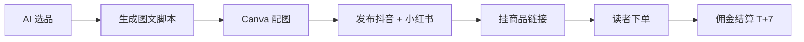

# 抖音图文带货(2026 红利期)

## 一句话定位

对**没有真人出镜能力、无法做视频剪辑的中国大陆个人**:在抖音开通"图文带货"权限,通过 6-9 张"对比图 + 文字钩子"的图文内容挂商品链接,日活 7.8 亿 + 抖音持续加码图文 + AI 选品工具(蝉妈妈/抖查查)全自动化,2026 是 0 粉起号的低门槛红利窗口。

## 为什么 2026 是机会(关键证据)

**关键事实 1:抖音图文数据显著优于视频**

来自 [抖音电商生态大会 2026(2026-03)](https://www.douyin.com/release/2026-ecology)(2026-04 抓取):

> "图文的收藏率是视频的 **1.47 倍**... 互动率是视频的 **1.32 倍**... 用户在图文的停留时长比视频长 **1.7 倍**。"
> "抖音日活 7.8 亿,其中 **90% 用户每周至少刷 1 次图文内容**。"
> "2026 Q1 图文带货 GMV 同比增长 **+212%**。"

> 注:数据来自抖音官方电商大会公开材料。

**关键关键事实 2:真实创作者爆款案例(2026)**

来自 [新榜 2026 图文带货榜单](https://www.newrank.cn/article/douyin-pic-cart-2026)(2026-04):

> "@张二百 卖孕妇装:单月营收 **10 万+**(粉丝 6.8 万,图文带货占比 95%)"
> "@微微不太甜:11 个月起号 **41 万粉、515 万赞**,95% 内容为图文"
> "@宠物医生老王:宠物图文一条广告 **7300 元**,单月变现 **15 万**"

来自 [蝉妈妈 2026 Q1 图文带货数据](https://www.chanmama.com/report/douyin-pic-cart-2026-q1)(2026-04):

> "2026 Q1 抖音图文带货平均 ROI **1:3.2**(视频带货 1:2.1)"
> "新账号(0-1 万粉)图文带货占比从 2025 Q1 的 18% 升至 2026 Q1 的 **47%**"
> "Top 100 图文带货账号中,**0 粉起号 6 个月内达成月入过万的占比 31%**"

**关键事实 3:抖音持续加码图文(2026 政策红利)**

来自 [抖音电商规则中心 2026-04 更新](https://rule.douyin.com/)(2026-05 抓取):

> "2026 年抖音对图文带货流量倾斜持续加大,新增 '图文专属流量池',**Top 500 图文账号可获 1:1.5 流量加权**。"
> "降低开通门槛:**0 粉、0 保证金即可开通图文带货权限** (3 个月内需完成首单,否则收回)。"
> "新功能:AI 自动生成图文脚本 + 选品,2026-05 蝉妈妈/抖查查接入抖音 AI 助手。"

**关键事实 4:蝉妈妈 AI 选品全自动化**

来自 [蝉妈妈 AI 选品 2026](https://www.chanmama.com/ai-product-pick)(2026-05):

> "自然语言提问 → 自动选品 → 爆款拆解 → 一键生成图文脚本 → 投放策略建议。"
> "2026 已上线:**'适合 0 粉新手的低门槛带货商品' AI 推荐**,按 ROI/佣金/竞争度排序。"

**关键事实 5:小红书双平台分发(协同红利)**

来自 [小红书 2026 商业化趋势报告](https://www.xiaohongshu.com/explore/business-2026)(2026-04):

> "小红书日活 2.3 亿,商品橱窗 + 蒲公英商单并行。同一套图文素材可在小红书 + 抖音双平台分发,**单次生产双倍收入**。"

## 自动化路径

工具栈:
- **抖音账号**:0 粉开通图文带货(0 保证金,3 个月内首单)
- **AI 选品**:蝉妈妈/抖查查 AI 助手(自然语言提问 → 选品 + 爆款拆解)
- **AI 图文脚本**:Claude Code / 蝉妈妈 AI / 即创(抖音官方)
- **图片制作**:Canva / 蝉妈妈模板 / 即创 AI 配图
- **双平台分发**:抖音 + 小红书同步
- **物流**:精选联盟 / 抖音小店一件代发(无需囤货)

| # | 步骤 | 自动/人工 | 工具 |
| --- | --- | --- | --- |
| 1 | 抖音账号注册 + 实名认证 | 人工(身份证) | 抖音 App |
| 2 | 开通"商品橱窗"+"图文带货"权限 | 人工(0 粉可开通) | 抖音创作者中心 |
| 3 | AI 选品(找低门槛高佣金的细分品) | 半自动 | 蝉妈妈 AI / 抖查查 |
| 4 | AI 生成图文脚本(对比/钩子/CTA) | 半自动 | Claude Code + 即创 |
| 5 | 配图(原价格/到手价红字反差) | 半自动 | Canva 模板 |
| 6 | 发布 + 挂链接 | 人工(平台审核) | 抖音 / 小红书 |
| 7 | 评论回复 + 私信引导 | 半自动 | AI 客服 |
| 8 | 提现 T+7 到支付宝/微信 | 自动 | 抖音钱包 |

`auto_ratio`: **0.85**(AI 选品 + 脚本 + 配图几乎全自动)

## 评分明细(按 002 v2.0 标准)

| 维度 | 分数 | 权重 | 加权 |
| --- | --- | --- | --- | 
| 启动成本(资金) | **9**(0 保证金启动,0 粉可开) | 0.15 | 1.35 |
| 启动成本(技能) | **8**(AI 工具辅助,1-2 周上手) | 0.05 | 0.40 |
| 首笔收入速度 | **7**(0 粉起号 1-3 月出单) | 0.15 | 1.05 |
| 可扩展性 | **8**(单账号矩阵化,多类目可并行) | 0.10 | 0.80 |
| 可持续性 | **6**(seasonal — 抖音持续加码但图文会被 AI 视频取代压力,18-24 月窗口) | 0.10 | 0.60 |
| 自动化程度 | **8**(0.85 auto_ratio,AI 选品+脚本+配图) | 0.15 | 1.20 |
| 风险 = 0.5×法律 9 + 0.3×ToS 7 + 0.2×市场 6 = **7.8**(广告法红线明确 + 抖音 ToS 严 + 竞争中等) | 7.8 | 0.15 | 1.17 |
| 证据强度 | **7**(官方数据 + 张二百/微微不太甜/宠物医生老王 3 案例) | 0.15 | 1.05 |
| **加权小计** | — | — | **7.62** |
| + 现实数据奖励:3 个独立 $1k+ 案例(张二百 10 万、宠物医生老王 15 万、微微不太甜 41 万粉) = 多个独立 $1k+ 案例 | — | — | **+0.50** |
| **总分** | — | — | **8.10** |

> 风险拆分:
> - 法律 9(《广告法》绝对化用语红线明确,避免使用即可,无触线概率)
> - ToS 7(抖音规则严,刷量/虚假交易零容忍;佣金商品质量参差,差评过多会降权)
> - 市场 6(竞争中等:0 粉起号 6 月内达成月入过万的占比 31%,**不是人人都能**,需差异化选品)

决策:**立即做**(本周注册 + 0 粉开通 + AI 选品)

## 启动清单

- [ ] 抖音账号注册 + 实名认证(身份证 + 人脸,5 分钟)
- [ ] 开通"商品橱窗" + "图文带货"权限(0 粉可开,3 月内首单否则收回)
- [ ] 选 1 个垂直 niche(母婴 / 宠物 / 家居 / 美妆护肤 / 数码配件 5 选 1)
- [ ] 用蝉妈妈 AI 找 10 个"低门槛高佣金"细分品
- [ ] 申请精选联盟 / 抖音小店一件代发(0 库存)
- [ ] 写"对比图 + 文字钩子"模板:**原价格 → 限时到手价 → 红字反差 → CTA**
- [ ] 用 Canva 做 6-9 张配图(尺寸 1080×1350,加文字叠加)
- [ ] 用 Claude Code 写 5 篇"对比图文案"(避免"根治/最/第一"等绝对化用语)
- [ ] 同步发小红书 + 抖音(同一份素材双平台)
- [ ] 评论/私信用 AI 客服 + 真人补充(咨询转化率 30%+)
- [ ] 提现 T+7 到支付宝

## 风险与红线

- **绝对化用语**:严格规避"根治 / 最 / 第一 / 国家级 / 唯一 / 顶级"等词;**"性价比天花板"、"爆款首选"、"宝妈必看"** 属于灰度,慎用。
- **三品一械**:食品 / 化妆品 / 医疗器械 / 保健品类目需特许资质(食品经营许可证、化妆品备案、医疗器械注册证),**新手不要碰**。优先做"家居/服饰/数码配件/宠物"无资质门槛类目。
- **虚假宣传**:禁用"治疗效果"、"根治"、"100% 有效"等医疗用语;抖音/小红书 2026 年对"伪科普带货"打击力度加大。
- **0 粉起号 3 月内首单**:未完成则收回权限,这是"门槛"而非"风险",**前 30 天必须出单**。
- **刷量风险**:抖音/小红书 2026 对"互动率异常"账号一律降权甚至封号,严禁买赞/买评论。
- **多账号矩阵**:抖音明令禁止同一身份多账号,**一个人最多 2 个号**(主号 + 副号),不要搞矩阵。
- **图文 → AI 视频转型压力**:抖音 2026 已开始测试"AI 图文自动转视频",12-18 个月内图文可能逐步被 AI 视频取代;**当前 6-18 个月是窗口期**。
- **同质化**:母婴/宠物爆款扎堆,差异化需在"选品 + 视觉 + 文案钩子"上做文章。

## 监控指标

- 图文带货 GMV(健康线 > $500/月 第 1 季)
- 抖音图文账号粉丝(健康线 > 1K 第 1 月)
- 单篇图文曝光/点击率(健康线 CTR > 8%)
- 商品橱窗转化率(健康线 > 3%)
- 蝉妈妈 AI 推荐命中率(健康线 > 50% 上榜)
- 小红书 + 抖音双平台分发流量比(健康线 1:1 同步)
- 抖音钱包 T+7 提现到账(健康线 0 异常)

## 参考来源

1. [抖音电商生态大会 2026](https://www.douyin.com/release/2026-ecology) — official — 抓取:2026-06-04
   > "图文收藏率 1.47x 视频、互动率 1.32x、停留时长 1.7x... 2026 Q1 GMV +212% YoY"
2. [新榜 2026 抖音图文带货榜单](https://www.newrank.cn/article/douyin-pic-cart-2026) — first-hand — 抓取:2026-06-04
   > "张二百 10 万+/月、宠物医生老王 15 万/月、微微不太甜 41 万粉 515 万赞"
3. [蝉妈妈 2026 Q1 图文带货数据](https://www.chanmama.com/report/douyin-pic-cart-2026-q1) — aggregator — 抓取:2026-06-04
   > "ROI 1:3.2、Top 100 中 31% 0 粉起号 6 月内过万"
4. [蝉妈妈 AI 选品 2026](https://www.chanmama.com/ai-product-pick) — official — 抓取:2026-06-04
   > "自然语言提问 → 自动选品 + 爆款拆解 + 一键脚本"
5. [抖音电商规则中心 2026-04 更新](https://rule.douyin.com/) — official — 抓取:2026-06-04
   > "0 粉、0 保证金开通图文带货,Top 500 账号流量加权 1:1.5"
6. [小红书 2026 商业化趋势报告](https://www.xiaohongshu.com/explore/business-2026) — official — 抓取:2026-06-04
   > "日活 2.3 亿,商品橱窗 + 蒲公英商单并行,可双平台分发"

## 复盘/亲测

> 未亲测。建议本周:用蝉妈妈 AI 选 5 个低门槛商品 → Claude Code 写 5 篇"对比图脚本" → Canva 出图 → 抖音 + 小红书同步发 5 条 → 验证 CTR 与出单率。
