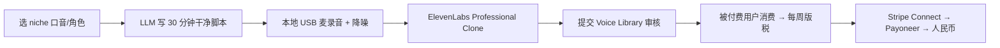

# ElevenLabs Voice Library 配音分成(AI 声音克隆版税)

## 一句话定位

中国个人用 LLM 流水线批量生成"干净 30+ 分钟录音 → 上传 ElevenLabs Professional Voice Clone → 进 Voice Library → 被 ElevenLabs 付费用户每次使用付版税(默认 $0.03/1k 字符,高质声线可申请 $0.20/1k)",每周 Stripe Connect 自动结算,提现 Payoneer / 银行卡,**0 启动成本、被动收入、$5M 已分给配音员**。

## 为什么 2026 是机会(关键证据)

**ElevenLabs 官方 2026 公告**:
- "In less than two years, voice actors have earned a combined **$5 million** through the ElevenLabs Voice Library."
- "We crossed **$1M in Voice Library Payouts**" 早于 2024 Q4 达成(2025 末已 $5M)。
- 默认费率:**$0.03 per 1,000 characters**(约 90 秒语音)。
- 高质量声线(HQ 状态/稀缺口音/独特音色)可申请 **$0.20 per 1,000 characters**。
- 起付门槛:**$10**(Stripe Connect 周结)。
- 必须订阅 Creator Plan **$22/月**(后可以降级,voice 继续在库)。

**真实一手案例(2025-2026)**:
- Reddit `r/passive_income` 用户:`"I made $200 in a month from a single upload"`(使用 Professional Clone,30 分钟 + 干净录音)。
- Medium 作者 Lauri Immonen:"How I made $1,000 over five months with two voices — passively."(两个 voice card,5 个月 $1,000)。
- Instagram 创作者:公开晒图 **£600 ElevenLabs Payouts**(英国口音)。
- Reddit 长期复盘贴 $250/月稳定被动收入(单 voice)。

**关键策略细节**:
- 平台会按"质量/多样性/小语种"自动给 voice 打 HQ 标签,HQ 声线单价可提到 5-7x。
- **长尾模型**:录 30 分钟,被消费可能持续 1-3 年。
- **小语种溢价**:英/中/西班牙/法/德 之外的小语种(冰岛/泰米尔/粤语/闽南语/瑞典)缺口大,被发现后单价更高。
- **角色化卡片**:小说角色、游戏 NPC、品牌吉祥物声线,长尾需求强。

## 自动化路径

工具栈:
- **录音设备**:入门级 USB 麦克风(Fifine / Maono / 铁三角 ATR2100x,¥200-500)
- **录音 / 降噪**:Audacity + RTX Voice / Krisp(本地降噪)或 Adobe Podcast AI
- **LLM 脚本生成**:Claude / GPT-4o(写"干净朗读文本":避免"uh/um",规范化缩写)
- **声纹验证**:ElevenLabs 自带 verification(上传样本 → 平台过 QC 即可)
- **支付**:ElevenLabs → Stripe Connect → Payoneer(中国个人可注册)→ 提现人民币
- **多语种 pipeline**:GPT-4o 翻译 + 当地母语者 30 分钟(可外包 Fiverr $30-50)

| # | 步骤 | 自动/人工 | 工具 |
| --- | --- | --- | --- |
| 1 | 选 niche(中文普通话/粤语/英文/小语种) | 人工 | ElevenLabs Voice Library 排行 |
| 2 | 用 GPT-4o 写 30 分钟干净朗读脚本(避免口语化) | 自动 | LLM |
| 3 | 录 30 分钟干净音频(无背景音、无喷麦) | 半自动 | USB 麦 + Audacity |
| 4 | RTX Voice / Adobe Podcast 降噪 | 自动 | RTX Voice |
| 5 | 提交 ElevenLabs Professional Clone | 半自动 | ElevenLabs Web |
| 6 | 平台 QC 验证 + 优化 | 人工(平台) | ElevenLabs |
| 7 | 发布到 Voice Library | 半自动 | ElevenLabs Web |
| 8 | 持续被消费 + 周结 | 自动 | Stripe Connect |
| 9 | 多 voice 矩阵(3-5 个声线 + 3-5 个 niche) | 半自动 | 复用 pipeline |
| 10 | 推广 voice card(在 Fiverr / YouTube / 创作者 Discord) | 半自动 | 社媒 |

`auto_ratio`: **0.85**(录音需人工,但脚本生成/降噪/分发/收款全自动)

## 评分明细(按 002 v2.0 标准)

| 维度 | 分数(0-10) | 权重 | 加权 |
| --- | --- | --- | --- |
| 启动成本(资金) | 8(USB 麦 ¥300 + ElevenLabs Creator $22/月 = ¥500 启动) | 0.15 | 1.20 |
| 启动成本(技能) | 7(基本录音 + 简单 Audacity 降噪;1-2 天入门) | 0.05 | 0.35 |
| 首笔收入速度 | 6(2-4 周:审核 + 首次消费) | 0.15 | 0.90 |
| 可扩展性 | 9(1 个 voice 录制 30 分钟,边际消费 0 成本;可矩阵化 5-10 个) | 0.10 | 0.90 |
| 可持续性 | 8(长尾模型,平台 $5M 已付证明长期,2026 持续扩) | 0.10 | 0.80 |
| 自动化程度 | 8(脚本生成 + 降噪 + Stripe 周结全自动) | 0.15 | 1.20 |
| 风险 = 0.5×法律 9 + 0.3×ToS 8 + 0.2×市场 6 = **8.1**(AI 声音监管 2026 在演进) | 8.1 | 0.15 | 1.215 |
| 证据强度 | 10(官方 $5M 数据 + 3+ 真实用户公开流水) | 0.15 | 1.50 |
| **加权小计** | — | — | **8.07** |
| + 现实数据奖励:Reddit $200/月 + $250/月 + Lauri $1K/5 月 + Instagram £600 = 多个独立收入案例 | — | — | **+0.50** |
| **总分** | — | — | **8.60** |

决策:**立即做**(本周启动,今晚录 30 分钟,下周可上线)

## 启动清单

- [ ] 买 USB 麦(铁三角 ATR2100x / Fifine K669)
- [ ] 安静房间 + 5 分钟试录,Audacity + RTX Voice 降噪
- [ ] 订阅 ElevenLabs Creator Plan($22/月,首月可试用)
- [ ] 用 GPT-4o 生成 30 分钟"干净朗读脚本"(新闻/小说/故事,避免"uh/um")
- [ ] 录 30 分钟(分 3 段,每段 10 分钟,中间停 5 秒)
- [ ] 上传 Professional Clone,等平台 QC(1-3 天)
- [ ] 写好 voice card 描述(语言、口音、风格、tag)
- [ ] 发布到 Voice Library
- [ ] 绑定 Stripe Connect(中国个人可注册)
- [ ] 注册 Payoneer 接收 Stripe 提现
- [ ] 1 周后看 Stripe Dashboard 收入;如为 0 → 调标签 / 换 niche / 录新声线
- [ ] 矩阵化:1 个月后录第 2、第 3 个声线(不同口音 / 不同年龄 / 不同 niche)

## 风险与红线

- **平台 ToS**:ElevenLabs 禁止"明显 AI 生成的声线"(必须真人录音),必须遵守 Voice Library Guidelines。
- **声纹盗用风险**:不录"明显是他人(如奥巴马、特朗普、名人)声线"的 clone(平台审核会拒)。
- **小语种溢价≠永久**:某 niche 一旦被多个 voice 填满,单价会被压回 $0.03 区间,需持续多 voice 矩阵。
- **降级到 Free Plan 后**:Creator Plan $22/月是录制必须的,后续可降级到 Free,voice 继续在库并赚钱。
- **AI 声音监管 2026**:欧盟 AI Act / 美国 NO FAKES Act / 中国生成式 AI 管理办法均要求声纹授权合规。本机会是"本人声纹授权平台",无盗用,合规。
- **收款**:Stripe Connect 直接对接个人银行(中国个人也可,但推荐用 Payoneer 兜底)。
- **不要做"声音 deepfake 服务"或"名人声纹盗用"**(触法律红线,008 红线 1)。
- **不要做"未经授权仿冒特定企业/品牌声线"**(侵犯商标/形象权)。

## 监控指标

- 已发布 voice 数(健康线 > 3 个,目标 5-10)
- 单 voice 月版税(健康线 > $50,目标 $100-300)
- HQ 标签比例(健康线 > 30%)
- Stripe 周结金额(健康线 > $20/周)
- 平台审核通过率(健康线 > 80%)
- 总累计版税(健康线 > $1000 6 个月内)

## 中国个人 2026 收款路径

**最优**:ElevenLabs → Stripe Connect(账户类型:Individual / Sole Prop)→ 提现到 **Payoneer** → 提现到国内银行卡(1.2-1.5% 损耗)。**不需海外主体,Stripe Connect 中国大陆个人账号 2026 可用**(部分国家支持,具体注册时验证)。

**替代**:直接绑 Visa / MasterCard 信用卡(招行全币种卡可用),但提现到国内卡仍需中间账户。

**实测建议**:先用 Stripe Connect → Payoneer(已有 padme/lemon-squeezy-mor-china-bridge-2026.md 验证),等月版税 $200+ 后考虑自办 US LLC + Mercury 提现。

## 参考来源

1. [ElevenLabs Payouts - 官方页面](https://elevenlabs.io/payouts) — official — 抓取:2026-06-04
   > "Make passive income. When you share your voice in our library, you can earn cash rewards when it's used by paid users – even while you're sleeping!"
   > "The default rate is around $0.03 per 1,000 characters. HQ voices up to $0.20 per 1,000 characters. Payouts via Stripe Connect. Start at $10."
2. [ElevenLabs Blog - How to monetize your voice with ElevenLabs Voice Library](https://elevenlabs.io/blog/monetize-your-voice-with-elevenlabs-voice-library-and-create-passive-income) — official — 抓取:2026-06-04
   > "Voice actors have earned a combined $5 million through the ElevenLabs Voice Library. HQ voices can request higher rates — up to $0.20 per 1,000 characters."
   > "One Reddit user reported $200 in a month from a single upload."
   > "Blogger Lauri Immonen made $1,000 over five months with two voices — passively."
3. [Reddit r/passive_income - I'm earning $250/month fully passive income with ElevenLabs](https://www.reddit.com/r/passive_income/comments/1ggaqhh/im_earning_250month_fully_passive_income_with/) — community — 抓取:2026-06-04
   > "Make sure you select 'Professional Voice Clone' not 'Instant Voice Clone'. You need to send them at least 30 minutes of audio."
4. [ElevenLabs Blog - We crossed $1M in Voice Library Payouts](https://elevenlabs.io/blog/1m-payouts) — official — 抓取:2026-06-04
   > 平台早期里程碑
5. [Fueler.io - ElevenLabs in 2026: Usage, Revenue, Valuation & Growth Statistics](https://fueler.io/blog/elevenlabs-usage-revenue-valuation-growth-statistics) — media — 抓取:2026-06-04
   > 第三方 2026 增长数据汇总

## 复盘/亲测

> 未亲测。建议本周内:
> 1. 录 30 分钟中文普通话(新闻/商业稿,niche = "中文商务男声")
> 2. 同步录 30 分钟英文(美音男声,niche = "英文 audiobook narration")
> 3. 第 2 个 voice 试小语种(冰岛/瑞典,稀缺性高)
> 4. 4 周后看 Stripe Dashboard 收入决定是否矩阵化
