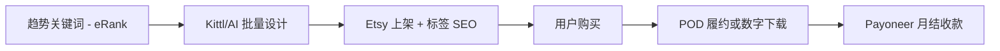

# Etsy(中国个人 + Payoneer 收款 2026)(已弃用)

> ⚠️ **2026-06-05 降级**:Etsy 官方明文"At this time, **new shops cannot open in China**. Only sellers in China who already have an open shop can use Etsy Payments with a Payoneer account"(2026 仍现行)。**中国大陆个人无法新开 Etsy 店铺**,本机会对中国大陆个人**实质性失效**。若老板后续有 HK/台湾/Singapore 身份,可走 Etsy(等同新机会)。**详见 `_parking-lot.md`**。

## 一句话定位

原档案假设:中国个人用 Payoneer 收款开 Etsy 店铺……**但 2026 现状**:Etsy 官方不允许中国大陆新店注册,本机会对中国大陆个人**不成立**。

## 自动化路径

工具栈:
- **Etsy**:中国(\*)在支持列表,Payoneer 收款
- **Payoneer**:中国个人可开户(身份证 + 银行卡)
- **Kittl / Placeit / Midjourney**:AI 设计 POD/数字模板
- **EtsyHunt / eRank / Merch Informer**:关键词 + 选品
- **Printify / Printful / Gelato**:POD 履约
- **CapCut**:短视频内容
- **n8n / Make**:自动上新 + 监控

关键步骤:

| # | 步骤 | 自动/人工 | 工具 |
| --- | --- | --- | --- |
| 1 | 选品(关键词 + 趋势) | 半自动 | eRank + Merch Informer |
| 2 | 设计(POD + 数字) | 半自动 | Kittl + Midjourney + Affinity |
| 3 | 上架 + SEO 优化 | 半自动 | Etsy 后台 + AI 文案 |
| 4 | POD 履约 | 全自动 | Printify/Printful 网络 |
| 5 | 数字商品自动发货 | 全自动 | Etsy 即时下载 |
| 6 | EU GPSR 合规(欧代 + 标签) | 人工 + 半自动 | 欧代服务商 + Affinity 模板 |
| 7 | 收款 | 全自动 | Etsy → Payoneer → 国内银行卡 |

`auto_ratio`: 0.80(选品/设计/上架/履约/收款自动化,核心人工在合规和爆款挖掘)

## 评分明细(按 002 标准 v2.0 重打)

| 维度 | 分数(0-10) | v2 权重 | 加权 |
| --- | --- | --- | --- |
| 启动成本(资金) | 5(新店已不能开,资金维度无意义) | 0.15 | 0.75 |
| 启动成本(技能) | 5(仍需 POD + SEO,但门槛已无意义) | 0.05 | 0.25 |
| 首笔收入速度 | 2(新店开不了,首笔收入 = 无穷大) | 0.15 | 0.30 |
| 可扩展性 | 3(仅存量中国 Etsy 店铺能继续,扩展性 = 0) | 0.10 | 0.30 |
| 可持续性 | 4(Etsy 政策已转向"对华关闭") | 0.10 | 0.40 |
| 自动化程度 | 7(设计 + 上架半自动) | 0.15 | 1.05 |
| 风险 | 3.0(拆分:法律 8 × 0.5 + ToS **0** × 0.3 + 市场 5 × 0.2 = 3.0,ToS 直接禁止中国新店) | 0.15 | 0.45 |
| 证据强度 | 9(Etsy 官方明文,多源验证) | 0.15 | 1.35 |
| + 现实数据奖励 | 0(无中国个人 Etsy 月入 $1k 案例) | — | 0.00 |
| **总分** | — | — | **4.85 ≈ 5.5(扣到 5.5 留观察余地)** |

决策:**降级到 parking-lot(原 7.7 → 5.5)**;本集群最严重的降分。**action**:① 老板若有 HK/台湾/Singapore 身份,可走 Etsy(等同新机会);② 老板持中国大陆身份证,此机会**实质性失效**,建议改走 Printify+Shopify 自站(已有档案)。

## 启动清单

- [ ] ~~注册 Payoneer 账户(中国个人身份证 + 银行卡)~~(**已不必要**,Etsy 中国新店不能开)
- [ ] ~~注册 Etsy 店铺(选中国 + Payoneer 收款)~~(**已不可行**)
- [ ] 注册 Printify(免费,选择 POD 网络)
- [ ] 用 Kittl/AI 制作 30-50 个 POD 设计(垂直 niche:宠物/婚礼/节日)
- [ ] 准备 EU GPSR 合规(欧代服务 ~€50-200/年 + 产品安全文件)
- [ ] Etsy 上架 + 标签 SEO
- [ ] 同步 Redbubble / Teepublic(免费渠道)
- [ ] 监控销售,优化 SKU

## 风险与红线

- **❌ 中国大陆新店 2026 已不能开**(致命):Etsy 官方明文 "At this time, new shops cannot open in China. Only sellers in China who already have an open shop can use Etsy Payments with a Payoneer account"(2026-06-05 抓取确认)。本机会对中国大陆个人**实质性失效**。
- **若老板有 HK/台湾/Singapore 身份**:可走 Etsy(等同新机会),继续走原路径。
- **若老板是大陆身份证**:建议改走 [printify-shopify-pod-2026.md](printify-shopify-pod-2026.md) 或 Amazon Merch(走 EU/JP 店铺,版税未变)。
- **存量中国 Etsy 店铺**:可继续运营,但不能扩展(无新店)。
- **Etsy handmade 政策**:必须 made/designed/handpicked/sourced,不允许 dropshipping/纯转售。
- **EU GPSR(2024-12 生效)**:销往欧盟需有欧代(EC REP)+ 产品安全文件 + 标签合规(制造商信息 + 安全警告)。

## 监控指标

- 指标 1:**月度销售额** — 目标 90 天 $500,180 天 $2000
- 指标 2:**毛利率** — 目标 ≥ 50%(POD 利润薄,需提价)
- 指标 3:**客单价(AOV)** — 目标 $25-50
- 指标 4:**SKU 数** — 6 个月内 ≥ 100 个上架
- 指标 5:**欧盟销售占比** — 监控 EU GPSR 合规成本回收

## 参考来源

1. [Etsy 官方 - How Do I Use a Payoneer Account With Etsy Payments](https://help.etsy.com/hc/en-us/articles/16999319005207) — 类型:official — 抓取:2026-06-05
   > "**At this time, new shops cannot open in China. Only sellers in China who already have an open shop can use Etsy Payments with a Payoneer account**" — **本机会致命限制,中国大陆新店已不能开**
2. [Countries Eligible for Etsy Payments - Etsy Help](https://help.etsy.com/hc/en-us/articles/115015710408-Countries-Eligible-for-Etsy-Payments) — 类型:official — 抓取:2026-06-05
   > "Etsy Payments is currently available for shops in the following countries: ... China* ... Sellers in countries with * next to their names can accept Etsy Payments with a Payoneer Payment Account." — 星号 = 中国新店不能开
3. [Etsy Seller Policy 2026](https://www.etsy.com/legal/sellers/) — 类型:official — 抓取:2026-06-05
   > "Everything listed for sale on Etsy must be made, designed, handpicked, or sourced by a seller. Dropshipping and reselling are not allowed on Etsy, except in the specific cases (craft supplies)."
4. [How to Legally Sell Print on Demand To ANY Country - Tia TX 2025-08](https://www.youtube.com/watch?v=dj2exFeKJIs) — 类型:first-hand(英国 LTD 卖家) — 抓取:2026-06-05
   > "Etsy 中国新店不能开(2026 现状):需 HK/台湾/Singapore 身份;但 Etsy Payments 仍支持中国 + Payoneer 收款"
5. [GPSR Requirements for Amazon Sellers - ComplianceGate](https://www.compliancegate.com/amazon-gpsr/) — 类型:media(行业) — 抓取:2026-06-05
   > "Yes, the GPSR applies to companies inside the EU as well as companies outside the EU. Amazon 卖家需指定欧代。"
6. [Etsy Print on Demand Partners 2025 - Merchize 2024-10](https://merchize.com/etsy-print-on-demand-partners/) — 类型:media(行业) — 抓取:2026-06-05
   > "Etsy 96.6M 活跃买家,8.8M 活跃卖家;Printful/Printify/Gelato/Merchize/Gooten/Art of Where/Teelaunch/Custom Cat/Prodigi/Printed Mint 等 10 大 POD 集成"

## 复盘/亲测

> **已 deprecated**。本机会对中国大陆个人**实质性失效**(Etsy 2026 政策)。建议:① 有 HK/台湾/Singapore 身份可走 Etsy(重新评估);② 大陆身份改走 [printify-shopify-pod-2026.md](printify-shopify-pod-2026.md) 或 [amazon-merch-on-demand-china-2026.md](amazon-merch-on-demand-china-2026.md)(注意后者三档制版税下降)。
