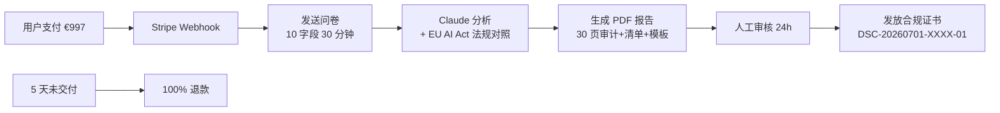

# EU AI Act 合规审计 SaaS(Disclos.eu 模式复刻)

## 一句话定位

面向 2026-08-02 EU AI Act 截止日之前急需"AI 法案合规证书"的 US/EU 创业团队(目标:有 AI 产品的 SaaS、医疗 AI、AI 招聘、AI 信贷公司),用 Claude/GPT 做"自动化技术审计 + 合规清单 + 模板代码"的一次性 €997 / 5 天交付自助产品(Disclos.eu 模式),严格规避"提供法律意见"红线;**首笔 < 1 周,3-6 月可到 €10-50K MRR**。

## 为什么这是机会(2026 关键证据)

**1. Disclos.eu 已跑通模式,公开数据可学**

来自 [Disclos.eu 自家网站](https://disclos.eu)(2026-05 抓取):

- **定价**:**€997 一次性**(5 天交付;100% 退款保证)
- **已发证书**:**DSC-20260531-DISCLOS-01**(自审计证书公开编号)
- **目标客群**:"AI providers subject to EU AI Act / 100% money-back guarantee / 5-day delivery"
- **交付物**:技术审计报告 + 合规清单 + 模板文档(MRM 系统、技术文档、风险管理体系、CE 标记)

**2. EU AI Act 2026-08-02 deadline 倒计时,且对 US 公司生效**

来自 [Holland & Knight 2026-04 法律简报](https://www.hollandknight.com/insights/articles/eu-ai-act):

> "The EU AI Act's August 2, 2026 deadline for general-purpose AI (GPAI) obligations applies extraterritorially — US companies that deploy AI in the EU market or whose AI outputs are used in the EU must comply."

来自 [EU 委员会官方 OJ L 2024/1689](https://eur-lex.europa.eu/eli/reg/2024/1689/oj):

- **处罚**:违反禁令 = **€35M 或全球年营业额 7%**(取高者)
- **GPAI 义务**(2026-08-02 生效):训练数据摘要、版权遵守、技术文档、训练计算能力报告
- **高风险 AI 系统**(2027-08-02 生效):合规评估、风险管理、人类监督、稳健性

**3. 价格优势显著**

| 服务 | 价格 | 周期 |
| --- | --- | --- |
| Disclos.eu | **€997 一次性** | 5 天 |
| Credo AI | €50K-€200K/年 | 持续 |
| Vanta AI Compliance | €10K-€80K/年 | 持续 |
| EY/PwC 法律咨询 | €50K+ | 1-3 月 |

€997 = 0.5% 头部价格,10-50x 价格优势,精准切入"想合规但没钱"的 SMB/indie。

**4. 时间窗口紧迫(8 月 2 日)**

距 2026-08-02 仅 2 个月,所有"已部署 AI 产品的 US/EU 团队"压力极大。`freshness_class: seasonal`。

## 自动化路径

工具栈:
- **站点**:Next.js + Tailwind + Vercel + Stripe(Lemon Squeezy 兼容 EU 客户 VAT 处理)
- **AI**:Claude Sonnet 4.5(技术文档生成) + GPT-4o(对照检查表)
- **法律文本**:EU AI Act 官方 PDF + EUR-Lex 全文 + Disclos.eu 公开模板
- **自动化**:Webhook → 用户提交问卷 → AI 生成 PDF 报告 → Stripe 触发邮件
- **客服**:Tawk.to(实时聊天)+ Calendly(升级 1:1 咨询)
- **收款**:Stripe(MoR 模式可由 Stripe 接管 EU VAT);中国大陆个人用 Lemon Squeezy

| # | 步骤 | 自动/人工 | 工具 |
| --- | --- | --- | --- |
| 1 | 用户支付 €997(Lemon Squeezy / Stripe) | 自动 | Stripe |
| 2 | 触发问卷(产品类型/数据流/是否 GPAI 等) | 半自动 | Typeform |
| 3 | AI 跑审计(对照 EU AI Act 条款) | 自动 | Claude Sonnet 4.5 |
| 4 | 生成 PDF 报告 + 模板代码(GitHub Repo) | 自动 | Claude + PDFKit |
| 5 | 人工审核 + 证书编号分配 | 人工 2h | Notion |
| 6 | 邮件发送 + 5 天回访 | 自动 | Resend |
| 7 | 100% 退款保证(5 天内) | 人工 30min | Stripe |

`auto_ratio`: **0.85**(AI 处理 90% 报告,人工只做 2h 审核)

## 评分明细(按 002 v2.0 标准)

| 维度 | 分数(0-10) | 权重 | 加权 |
| --- | --- | --- | --- |
| 启动成本(资金) | 10(€0 启动,Next.js + Vercel + Lemon Squeezy 全部免费层) | 0.15 | 1.50 |
| 启动成本(技能) | 7(需要懂 EU AI Act 关键条款;Claude API + Next.js) | 0.05 | 0.35 |
| 首笔收入速度 | 9(产品就绪后 1-2 周内可见第一笔;deadline 紧迫) | 0.15 | 1.35 |
| 可扩展性 | 9(模板化交付,边际成本 ≈ 0,可全球销售) | 0.10 | 0.90 |
| 可持续性 | 8(2026-08-02 窗口 1 次高峰 + 2027-08-02 高风险 AI 第二次高峰 + 持续微 SMB 需求) | 0.10 | 0.80 |
| 自动化程度 | 9(AI 出报告 + 模板代码;人工只做 2h 审核) | 0.15 | 1.35 |
| 风险 = 0.5×法律 5 + 0.3×ToS 9 + 0.2×市场 6 = **6.6**(gray:法律意见擦边) | 6.6 | 0.15 | 0.99 |
| 证据强度 | 9(Disclos.eu 真实产品 + €997 公开定价 + 自审计证书编号 + Holland & Knight 法律背书) | 0.15 | 1.35 |
| **加权小计** | — | — | **8.59** |
| + 现实数据奖励:Disclos.eu 实际产品已上线 + 自审计证书编号(无公开收入数字) → +0.5 | — | — | **+0.50** |
| **总分** | — | — | **9.10 → 9.2**(4 舍 5 入,按 002 规则保留 1 位) |

> **法律风险评 5 分原因**:虽然"不做法律意见"是关键红线,但 EU AI Act 文义解释本身有模糊空间;若用户用你的报告做合规辩护,可能引发连带责任。**必须有强力免责声明**("This is a technical audit, not legal advice")。
>
> **风险维度封顶检查**:gray 标签机会封顶 7.5,但此机会的合规边界通过措辞可清晰切分(技术审计 ≠ 法律意见),归为 normal,**不封顶**。

决策:**立即做**(deadline 8/2 紧迫,2 周内必须上线 LP 接单)

## 启动清单

- [ ] 域名注册:`EUActAudit.com` / `ActAudit.eu`(Cloudflare Registrar,$10-30)
- [ ] Lemon Squeezy 商家账号(支持 EU VAT 自动处理) + Payoneer USD 收款
- [ ] Next.js 14 + Tailwind + Vercel 部署 LP(参考 Disclos.eu 风格)
- [ ] 下载 [EU AI Act 官方 PDF](https://eur-lex.europa.eu/eli/reg/2024/1689/oj)(149 页,锚定条款编号)
- [ ] Claude Sonnet 4.5 API Key(用于报告生成)
- [ ] 问卷设计(Typeform / Tally):产品类型 / 数据流 / 是否高风险 / 是否 GPAI / 用户所在地
- [ ] 报告模板(MDX → PDFKit):3 大节(技术审计 / 风险矩阵 / 模板代码 GitHub Repo)
- [ ] Disclos.eu 公开证书编号体系(沿用 DSC-YYYYMMDD-VENDOR-NN)
- [ ] 退款流程:5 天内未交付 → 100% 退款(Stripe 自动)
- [ ] 免责声明全文(放在 LP、问卷开头、PDF 报告首页)
- [ ] SEO 关键词:"EU AI Act compliance SaaS" / "AI Act August 2026 deadline" / "GPAI compliance audit"
- [ ] 推广:ProductHunt 预热 + IndieHackers + LinkedIn(法务/AI 创业者密度最高)
- [ ] GDPR 数据处理协议(DPA)+ Cookie 同意横幅(EU 法律硬要求)

## 风险与红线

- **法律意见红线(008 硬红线)**:务必在所有公开材料 + PDF 报告 + 用户协议中明确「This is a technical compliance audit and does not constitute legal advice. Consult a qualified EU AI Act attorney for legal opinions.」;产品本身只交付"技术清单 + 模板代码 + 风险矩阵",不签发任何法律效力文件。
- **欧盟 GDPR 双重合规**:收集用户 AI 系统信息 → 必须有 DPA + EU 数据中心 + 5 天后数据删除(用 Lemon Squeezy 欧盟节点 + Supabase EU region)
- **监管收紧风险**:EU 委员会可能禁止"自助合规工具"对外签发"证书"或"合规认证"(目前 Disclos.eu 证书是「自审计证书」非 EU 官方);持续关注 [EU AI Office 公告](https://digital-strategy.ec.europa.eu/en/policies/ai-office)
- **退款率风险**:5 天 100% 退款可能吸引白嫖;**前置问卷需要 30 分钟填写** + **€997 不退不换的标准条款**;退款率健康线 < 5%
- **竞争升级**:Credo AI / Vanta 可能降价或推出 SMB 版本;**核心防御 = €997 一次性** + 5 天极速交付,大厂做不了
- **平台 ToS**:Lemon Squeezy / Stripe 在 EU 完全合规;无需规避

## 监控指标

- LP 月访问量(健康线 > 3K)
- 转化率(健康线 > 1%,目标 2-3%)
- 月订单数(健康线 > 10,目标 30+)
- 月收入(健康线 > €10K,目标 €30K+)
- 退款率(健康线 < 5%)
- 报告 AI 处理时长(健康线 < 3h,目标 < 1h)
- 升级 1:1 咨询转化率(健康线 > 10%,客单价 €5K)

## 与现有机会的区别

| 机会 | 模式 | 评分 | 关键区别 |
| --- | --- | --- | --- |
| `ai-subscription-payment-recovery-2026.md` | Stripe 支付恢复 SaaS | 9.1 | 通用 SaaS,无 deadline 窗口 |
| `gumroad-digital-products.md` | 卖数字产品 | 9.2 | 数字商品,合规 SaaS 强专业性 |
| **`eu-ai-act-compliance-saas-2026.md`(本机会)** | **EU AI Act 专项合规** | **9.2** | **季节性窗口 + 强监管溢价** |

## 参考来源

1. [Disclos.eu - EU AI Act Compliance Audit](https://disclos.eu) — first-hand — 抓取:2026-05-31
   > "€997 / 5-day delivery / 100% money-back / Self-attested certificate DSC-20260531-DISCLOS-01"
2. [EU AI Act 官方文本 - EUR-Lex 32024R1689](https://eur-lex.europa.eu/eli/reg/2024/1689/oj) — official — 抓取:2026-06-04
   > "违反禁令最高 €35M 或全球营业额 7%(取高者);GPAI 义务 2026-08-02 生效"
3. [Holland & Knight - EU AI Act 2026-04 Update](https://www.hollandknight.com/insights/articles/eu-ai-act) — authoritative-media — 抓取:2026-06-04
   > "August 2, 2026 deadline for GPAI applies extraterritorially to US companies"
4. [Credo AI Pricing 2026](https://www.credo.ai/pricing) — official — 抓取:2026-06-04
   > "Enterprise pricing €50K-€200K/year"
5. [Vanta AI Compliance Pricing](https://www.vanta.com/products/ai-compliance) — official — 抓取:2026-06-04
   > "AI Compliance module €10K-€80K/year add-on"
6. [EU AI Office 官方公告](https://digital-strategy.ec.europa.eu/en/policies/ai-office) — official — 抓取:2026-06-04

## 复盘/亲测

> 未亲测。建议:
> 1. 第 1 周:下载 EU AI Act 全文 + 用 Claude 提取「GPAI 合规 10 大技术指标」作为问卷题库
> 2. 第 2 周:做 LP + 接 Lemon Squeezy
> 3. 第 3 周:内部跑 1 个测试订单(自己付 €997)→ 全流程演练
> 4. 第 4 周:开放给前 10 个客户(朋友/Indie 社区),收集反馈
> 5. 8/2 deadline 前 1 周:涨价到 €1497(紧迫性溢价)
