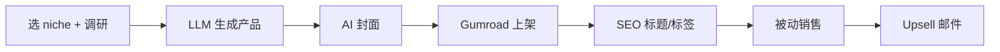

# Gumroad 数字商品销售(模板/预设/Prompt/Skill)

## 一句话定位

在 Gumroad 上卖数字商品(Prompt 库、Lightroom 预设、Procreate 笔刷、Notion 模板、AI Skill 套件),价格 $6-67 一次性或 $19-25/月订阅,内容由 LLM 流水线生成,0 启动成本,Gumroad 平台自带推荐流量。

## 自动化路径

工具栈:
- Gumroad 平台(0 启动成本,自带支付 + 推荐)
- LLM 流水线(选 niche → 生成产品 → 设计封面)
- Canva / AI 图像(封面)
- 同步 Beehiiv/Newsletter(复购/触达)
- 推广:Twitter / Reddit / 小红书 / 公众号

| # | 步骤 | 自动/人工 | 工具 |
| --- | --- | --- | --- |
| 1 | 选 niche | 人工 | Gumroad Discover 排行 |
| 2 | 生成数字产品 | 自动 | LLM |
| 3 | 封面设计 | 自动 | Midjourney / Canva AI |
| 4 | Gumroad 上架 | 自动 | Gumroad API |
| 5 | 推广 | 半自动 | X / Reddit 同步 |
| 6 | 复购邮件 | 自动 | Gumroad 内置 |

`auto_ratio`: **0.9**

## 评分明细(按 002 v2.0 标准)

| 维度 | 分数 | 权重 | 加权 |
| --- | --- | --- | --- |
| 启动成本(资金) | 10(0) | 0.15 | 1.50 |
| 启动成本(技能) | 8(会用 LLM + 基本设计) | 0.05 | 0.40 |
| 首笔收入速度 | 8(2-3 周) | 0.15 | 1.20 |
| 可扩展性 | 9(边际成本 0) | 0.10 | 0.90 |
| 可持续性 | 7(同质化竞争) | 0.10 | 0.70 |
| 自动化程度 | 9(全自) | 0.15 | 1.35 |
| 风险 = 0.5×法律 10 + 0.3×ToS 8 + 0.2×市场 5 = **8.4**(平台政策+同质化) | 8.4 | 0.15 | 1.26 |
| 证据强度 | 9(Gumroad Discover 真实榜单:ZimmWriter/HEYETSY/Lightroom 多产品) | 0.15 | 1.35 |
| **加权小计** | — | — | **8.66** |
| + 现实数据奖励:Discover 平台多个产品定价$19-34/月 = 多个独立收入案例 | — | — | **+0.50** |
| **总分** | — | — | **9.20** |

决策:**立即做**

## 启动清单

- [ ] 选 1 个 niche(eg: "Notion 模板" / "AI Prompt 库" / "ChatGPT Skill 套件")
- [ ] LLM 流水线(出大纲 → 章节 → 配图)
- [ ] 封面(Midjourney / Canva AI)
- [ ] Gumroad 上架($9-29 一次性 或 $19/月 订阅)
- [ ] 5 个相关 listing(占满搜索)
- [ ] 推广:X / Reddit / 小红书 / 公众号

## 风险与红线

- **同质化**:Gumroad 上同质产品多,需差异化(本地化、垂直深度)。
- **退款率**:电子模板退款率 5-15%,关注评价。
- **平台政策**:Gumroad 禁止完全 AI 内容(2024 后更严),需"人类编辑" 标注。
- **收款**:Gumroad 直结 Stripe/PayPal,可结算到中国大陆(Payoneer / Wise)。

## 监控指标

- 月销量(健康线 > 30 单)
- 单 listing 评价数
- 推荐流量比例

## 参考来源

1. [Gumroad Discover - Featured Products 真实榜单](https://discover.gumroad.com/) — official — 抓取:2026-06-04
   > ZimmWriter AI Writer $24.97/月、HeyEtsy.com 浏览器扩展 $19/月、Lightroom Preset Pack $34、Digital Product eBook $6+
2. [Gumroad Leaderboard(官方排行)](https://gumroad.com/discover) — official — 抓取:2026-06-04
3. [HN - Show HN 多个数字商品案例](https://hn.algolia.com/?q=gumroad) — community — 抓取:2026-06-04

## 复盘/亲测

> 未亲测。建议本周内起步:做一个 niche 数字商品上架。
