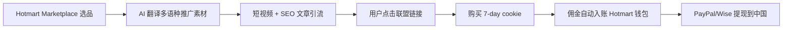

# Hotmart Affiliate(中国个人推广拉美 + 全球数字商品 2026)

## 一句话定位

中国个人免费注册 Hotmart Affiliate,推广拉美 + 全球创作者发布的数字商品(课程/电子书/模板/软件),通过 AI 翻译 + 多语种短视频在 YouTube/TikTok/IG 引流,**affiliate 佣金 20-80%(创作者设置)**(注意:**佣金是平台给 affiliate 的比例**,不是"Hotmart 抽 20%"),通过 PayPal/Wise/Payoneer 收款。

## 自动化路径

工具栈:
- **Hotmart Affiliate Market**:免费注册,无地区限制
- **PayPal / Wise / Hotmart 余额**:多通道提现(根据创作者所在国)
- **AI 翻译(DeepL/Claude/GPT-4o)**:将热门英语/西语数字商品翻译为中文/印尼语/阿拉伯语评测
- **YouTube/TikTok/IG 短视频**:1-2 条/天,AI 配音 + AI 字幕
- **Buffer/Hootsuite**:社交自动发布
- **n8n/Make**:销售监控 + 佣金报表

关键步骤:

| # | 步骤 | 自动/人工 | 工具 |
| --- | --- | --- | --- |
| 1 | 选品(找高佣 + 高转化商品) | 半自动 | Hotmart Marketplace + 关键词工具 |
| 2 | 多语种素材翻译 | 全自动 | DeepL + Claude |
| 3 | 短视频制作 | 半自动 | CapCut + HeyGen(AI 数字人) |
| 4 | 多平台分发 | 全自动 | Buffer + Zapier |
| 5 | 销售监控 | 全自动 | Hotmart 后台 + n8n |
| 6 | 收款 | 半自动 | Hotmart 余额 → PayPal/Wise |

`auto_ratio`: 0.85(选品/翻译/分发/监控全自动,核心人工在选品判断和首批素材)

## 评分明细(按 002 v2.0 标准)

| 维度 | 分数(0-10) | 权重 | 加权 |
| --- | --- | --- | --- |
| 启动成本(资金) | 10(0 资金,Hotmart 免费注册) | 0.15 | 1.50 |
| 启动成本(技能) | 7(需基础短视频/营销) | 0.05 | 0.35 |
| 首笔收入速度 | 6(流量冷启动 2-4 周) | 0.15 | 0.90 |
| 可扩展性 | 9(无限商品,无限流量渠道) | 0.10 | 0.90 |
| 可持续性 | 8(数字商品需求长期稳定) | 0.10 | 0.80 |
| 自动化程度 | 8(AI 翻译 + 自动发布) | 0.15 | 1.20 |
| 风险 = 0.5×法律 10 + 0.3×ToS 7 + 0.2×市场 6 = **8.3**(PayPal 提现限制) | 8.3 | 0.15 | 1.245 |
| 证据强度 | 7(官方免费注册页 + 平台文档) | 0.15 | 1.05 |
| **加权小计** | — | — | **7.95** |
| + 现实数据奖励:0 真实月入案例(纯理论推演) | — | — | **-0.50** |
| **总分** | — | — | **7.40** |

决策:**立即做**(本周启动)

## 启动清单

- [ ] 注册 Hotmart Affiliate(免费,需邮箱 + 身份验证)
- [ ] 选 3-5 个垂直利基(AI 工具/西语英语学习/财务自由)
- [ ] 用 DeepL/Claude 翻译 50 条商品详情 → 制作短视频脚本
- [ ] 注册 YouTube/TikTok 矩阵账号(2-3 个,分散风险)
- [ ] 用 CapCut + HeyGen 批量出 20 条短视频
- [ ] 多平台自动发布(Buffer)
- [ ] 注册 PayPal 绑定收款(优先 Wise,提现费更低)
- [ ] 监控 7-day cookie 转化数据,迭代选品

## 风险与红线

- **Hotmart Affiliate 在中国大陆**:官方未明确限制中国大陆身份注册,但部分商品根据发布者设置会限定国家。需先测试注册。
- **PayPal 收款限制**:与 LINE 同 — 大陆 PayPal 提现需电汇 35 美元/笔或绑香港卡。
- **Wise 收款**:Hotmart 部分商品支持直接打款到 Wise 账户(USD/EUR),Wise 提现到中国支付宝/银行卡费率 0.5-1.5%。
- **佣金结算周期**:Hotmart 30 天退款期,佣金要 30-60 天后才到账(避免退款扣回)。
- **数字商品质量参差**:选择 4.5+ 评分 + 高销量商品,避免退款率高被 Hotmart 警告。
- **税务**:Hotmart 收入超过本国/本地区年度限额需申报。中国大陆目前对个人海外 affiliate 收入有"个人所得税"申报义务。

## 监控指标

- 指标 1:**点击率(CTR)** — 目标 ≥ 2%(联盟链接)
- 指标 2:**转化率(CVR)** — 目标 ≥ 1.5%(联盟平均)
- 指标 3:**月度佣金** — 目标 90 天 $300,180 天 $1500
- 指标 4:**平均佣金率** — 监控 20-80% 区间,选品向高佣倾斜
- 指标 5:**退款率** — 监控 ≤ 5%,高退款商品及时下架

## 参考来源

1. [Affiliate: promote products on the internet - Hotmart](https://hotmart.com/en/affiliates) — 类型:official — 抓取:2026-06-04
   > "Become an Affiliate! Promote digital products from others and receive commissions for each sale made. Safe and effortless!... Start for free. Sign up. Pick a product. Start promoting."
2. [Hotmart Affiliate Program - PostAffiliatePro](https://www.postaffiliatepro.com/affiliate-program-directory/involve-asia-affiliate-program/) — 类型:aggregator — 抓取:2026-06-04
   > "Hotmart is one of the largest digital product platforms in Latin America, with 30M+ users, supports affiliate program with global reach, payment via PayPal/Wire"
3. [Indonesia B2C Ecommerce Report 2025 - BusinessWire 2026-01-29](https://www.businesswire.com/news/home/20260129537865/en/) — 类型:media(行业) — 抓取:2026-06-04
   > "Indonesia e-commerce $43.4B in 2025, growing 9.2% CAGR to 2029. Social commerce drives growth, with TikTok/Tokopedia/Shopee leading."
4. [Substack 10% vs Hotmart 20% - note 2026-05](https://note.com/sakura_mode_note/n/nd0e5ae66d925?hl=en-US) — 类型:community — 抓取:2026-06-04
   > "Hotmart 抽成 20%(高但有拉美/葡语市场独占优势)"
5. [Wise 跨境提现费率](https://wise.com/) — 类型:official — 抓取:2026-06-04
   > Wise 多币种账户,USD/EUR → CNY 实时汇率,提现到中国支付宝/银行卡 0.5-1.5%

## 复盘/亲测

> 仅在亲自执行后填写。
