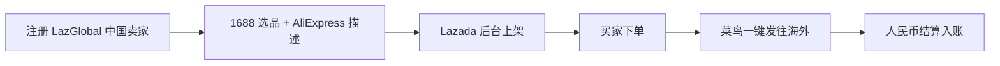

# Lazada LazGlobal 跨境开店(中国卖家 2026)

## 一句话定位

中国个人/小微企业通过 Lazada LazGlobal 项目入驻,享受阿里系生态(中文卖家工具 + 菜鸟物流 + 1688 货源),直接 1688 选品 + AliExpress 工具箱,直邮中国发往 6 国(印尼/泰国/越南/菲律宾/马来/新加坡)150M+ 买家,**人民币结算**无需换汇。

## 自动化路径

工具栈:
- **Lazada Seller Center**(中文):LazGlobal 专属入口
- **1688 选品 / 阿里巴巴**:货源(同集团)
- **菜鸟物流 Cainiao**:一键发货 + 全球履约
- **AliExpress 工具箱**:翻译/商品描述模板
- **Lazada Open Platform API**:商品/订单/库存自动化
- **支付宝 / 银行收款**(Lazada RMB 结算)
- **n8n + 1688 API**:选品 + 库存监控

关键步骤:

| # | 步骤 | 自动/人工 | 工具 |
| --- | --- | --- | --- |
| 1 | LazGlobal 注册 + 资质 | 人工(首次) | Lazada 中文 Seller Center |
| 2 | 1688 选品 | 半自动 | 1688 + 1688 API |
| 3 | 商品上架 + 翻译 | 半自动 | Lazada 后台 + AliExpress 工具 |
| 4 | 买家下单 | 全自动 | Lazada 平台 |
| 5 | 菜鸟发货 | 全自动 | 菜鸟跨境物流 |
| 6 | 收款 | 全自动 | 支付宝/银行 RMB 结算 |

`auto_ratio`: 0.80(选品/上架/物流/收款自动化,核心人工在选品判断)

## 评分明细(按 002 标准)

| 维度 | 分数(0-10) | v2 权重 | 加权 |
| --- | --- | --- | --- |
| 启动成本(资金) | 6(需备货或 1688 一件代发) | 0.15 | 0.90 |
| 启动成本(技能) | 6(跨境电商基础) | 0.05 | 0.30 |
| 首笔收入速度 | 5(冷启动 1-3 月) | 0.15 | 0.75 |
| 可扩展性 | 9(6 国 × 150M+ 买家) | 0.10 | 0.90 |
| 可持续性 | 7(阿里支持 + 长期 SEA 增长) | 0.10 | 0.70 |
| 自动化程度 | 6(物流/收款自动,选品需判断) | 0.15 | 0.90 |
| 风险 | 6.8(拆分:法律 7 × 0.5 + ToS 7 × 0.3 + 市场 6 × 0.2 = 6.8) | 0.15 | 1.02 |
| 证据强度 | 8(官方 LazGlobal 中文工具 + 菜鸟物流) | 0.15 | 1.20 |
| + 现实数据奖励 | 0(无中国个人卖家月入 $1k 案例) | — | 0.00 |
| **总分** | — | — | **6.7** |

决策:**排队**(2 周内启动,可与 Etsy/Shopee Affiliate 同步)

## 启动清单

- [ ] 注册 Lazada Seller Center 中国 LazGlobal 入口
- [ ] 准备身份证 + 营业执照(部分品类可个人入驻,部分需企业)
- [ ] 1688 选品(3-5 个 SKU 试水,选有海外需求的爆款)
- [ ] 用 AliExpress 工具箱翻译商品标题/描述
- [ ] Lazada 后台上架,设置价格(注意 6 国差异定价)
- [ ] 配置菜鸟物流(发货地址 + 海外仓可选)
- [ ] 支付宝/银行绑定收款(RMB 结算)
- [ ] 监控 6 国销售数据,迭代选品

## 风险与红线

- **LazGlobal 入驻资质**:部分品类接受个人(身份证),部分需要企业(营业执照)。需查具体类目。
- **结算汇率**:Lazada RMB 结算有内部汇率,可能比中间价差 0.5-1%。需评估。
- **跨境退货**:海外退货成本高(国际物流),部分品类(服装/3C)退货率 10-20%。定价需预留。
- **平台佣金**:Lazada 各品类佣金 1-6%,加支付处理费 2%。
- **VAT/GST**:6 国各有 VAT 阈值(印尼/泰国 60 万 IDR/THB 免),超限需注册。
- **菜鸟物流时效**:直邮中国 7-15 天,海外仓 3-7 天;不同国家关税不同。
- **印尼语/泰语**:部分买家沟通需要当地语言,Lazada 后台提供翻译工具。

## 监控指标

- 指标 1:**月度 GMV** — 目标 90 天 $1000,180 天 $5000
- 指标 2:**毛利率** — 目标 ≥ 30%(扣平台费 + 物流 + 退货)
- 指标 3:**退货率** — 监控 ≤ 10%
- 指标 4:**6 国销售分布** — 避免单点依赖,目标 ≥ 3 个国家
- 指标 5:**菜鸟物流时效** — 监控 < 15 天签收率

## 参考来源

1. [How to Sell on Lazada from China (2026) - UNIMALL](https://unimall.ai/guides/sell-on-lazada) — 类型:media(行业) — 抓取:2026-06-04
   > "The LazGlobal cross-border program is purpose-built for Chinese merchants, with Chinese-language seller tools, direct shipping from China, and RMB settlement. $25B+ Total GMV, 150M+ Active Buyers, 1M+ Active Sellers, +15% YoY Growth"
2. [Indonesia B2C Ecommerce 2025 - BusinessWire](https://www.businesswire.com/news/home/20260129537865/en/) — 类型:media(行业) — 抓取:2026-06-04
   > "Indonesia ecommerce $43.4B 2025, +10.6% YoY, CAGR 9.2% to 2029 → $61.6B"
3. [Lazada Affiliate Program Review 2026 - Reacheffect](https://reacheffect.com/blog/lazada-affiliate-program-review/) — 类型:media(行业) — 抓取:2026-06-04
   > "Lazada Alibaba-backed with deep Chinese seller infrastructure. LazGlobal RMB settlement."
4. [Korea E-commerce Guide 2026 - Anchanto 2026-05-26](https://anchanto.com/korea-e-commerce-industry/) — 类型:media(行业) — 抓取:2026-06-04
   > "Alibaba/Lazada/Temu cross-border strategy in SEA/Korea. Cross-border programs allow listing without local legal entities."

## 复盘/亲测

> 仅在亲自执行后填写。
