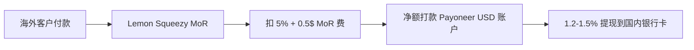

# Lemon Squeezy / Paddle 收款桥梁(中国大陆个人 2026 必读)

## 一句话定位

对所有想做"海外 SaaS / 数字商品 / 一次性产品"的中国大陆个人:**Lemon Squeezy(5% + $0.5)与 Paddle(5% + $0.5)作为 Merchant of Record(MoR)**,直接以 PayPal / Payoneer / 银行卡接收全球客户付款,处理 130+ 国家的 VAT/销售税,**完全绕开 Stripe 中国大陆主体注册难题**;这是 2026 年最现实的"0 成本启动 + 0 美元前期投入"路径。

## 为什么这是关键机会(2026 证据)

**关键事实 1:中国大陆个人无法直接注册 Stripe 商家账号**

来自 [ClouBay 2026 Stripe Playbook](https://cloubay.com/en/blog/stripe-china-2026) 抓取(2026-05-09):

> "Stripe from China still works in 2026. But 95% of failures come down to three things — a weak business description, logging into the dashboard from mainland-CN IPs, and a banking entity that doesn't match your Stripe entity's country."

> "Stripe 目前不支持中国大陆主体直接注册(只支持香港、新加坡、美国等),个人独资企业或个体工商户无法直接开通 Stripe 账号。"

来自 [redstagfulfillment 2026](https://redstagfulfillment.com/how-many-countries-does-stripe-operate-in/):

> "Stripe currently operates in 46 fully supported countries... Stripe does not offer merchant accounts in mainland China, though Chinese customers can make purchases from Stripe merchants using supported payment methods."

**关键事实 2:Lemon Squeezy 是中国大陆个人最佳替代**

来自 [Lemon Squeezy 2026 Update (Jan 28, 2026)](https://www.lemonsqueezy.com/blog/2026-update):

> "Lemon Squeezy exists because of this community. From the founders, developers, creators, and teams who just wanted a clean way to sell globally without the usual headaches."

支付方式支持(2026-06-04 抓取自 [LS PayPal Subscriptions 页面](https://www.lemonsqueezy.com/features/paypal-subscriptions)):

> "PayPal subscriptions on top of the dozens of existing subscription payment methods we already support: Credit cards, ACH, Debit cards, Apple Pay, **WeChat Pay, AliPay**, and more!"

收款通道(2026-06-04 抓取自 [LS Bank Payouts](https://www.lemonsqueezy.com/blog/new-bank-payouts)):

> "Lemon Squeezy now supports 279+ countries to get paid (79 Bank Accounts & 200+ PayPal)."

费用结构(2026-06-04 抓取自 [LS Fees Docs](https://docs.lemonsqueezy.com/help/getting-started/fees)):

- 平台费:**$0.50 + 5% of total**(对 1+1.5% 国际 + 0.5% 订阅附加)
- PayPal 收款:+1.5%
- PayPal/Bank 提现:具体看区域(Lemon Squeezy 2024 起已**砍掉**大部分提现费)
- 没有月费,无月最低

**关键事实 3:中国 indie hacker 真实跑通案例**

来自 [V2EX #1202757 - ShawnShi 11k HKD MRR](https://www.v2ex.com/t/1202757)(2026-04-01):

> "2026 独立开发上线 3 个月 我收获了 11k(HK)的 MRR" — Stripe 订阅 + SEO,月新增 5k 港币

来自 [Pasquale Pillitteri 2026 中国独立开发者技术栈](https://pasqualepillitteri.it/zh/news/3091/indie-hacker-stack-china-2026):

> "Lemon Squeezy 和 Paddle 在国内独立开发者中越来越受欢迎,因为它们作为销售记录商 (MoR)... MoR 的总手续费比 Stripe 高(大约5%),但省下来的会计时间通常值得。对于中国开发者,Lemon Squeezy 和 Paddle 更适合,因为它们可以打款到 Payoneer 或 Wise,进而结汇到国内银行账户。"

> "**派安盈 (Payoneer)**: 国内最普及的跨境收款方案,可以收 Stripe、Lemon Squeezy、ProductHunt 等海外平台的打款,提现到国内银行账户。手续费 1.2%-1.5%,有美元、欧元、英镑等多币种虚拟账户。"

## 自动化路径

工具栈:
- **注册**:Lemon Squeezy 账号(中国个人可注册,需护照/身份证)
- **打款**:默认 Bank Transfer(中国银行/招行/工行均可收 SWIFT)或 PayPal(中国个人可注册)
- **首选通道**:Payoneer(派安盈)注册免费,提供 USD/EUR 虚拟银行账户,Lemon Squeezy 打款 → Payoneer → 国内银行卡提现(1.2-1.5%)
- **同步 Paddle**:作为备用,UK 主体,支持更多区域
- **5 万美元/年结汇限额**:超限后通过对公账户(个体工商户/海南自贸港/香港公司)

| # | 步骤 | 自动/人工 | 工具 |
| --- | --- | --- | --- |
| 1 | Lemon Squeezy 注册 | 人工(需护照) | lemonsqueezy.com |
| 2 | Payoneer 注册 | 人工(需身份证+银行卡) | payoneer.com |
| 3 | 关联 Payoneer USD 账户到 LS | 半自动 | LS 后台设置 |
| 4 | 首次打款验证 | 自动 | LS 发起 $1 测试 |
| 5 | 月度打款 | 自动 | LS 月度自动结算 |

`auto_ratio`: **0.95**(全程被动)

## 评分明细(按 002 v2.0 标准)

| 维度 | 分数(0-10) | 权重 | 加权 |
| --- | --- | --- | --- |
| 启动成本(资金) | 10(0 资金,全部免费注册) | 0.15 | 1.50 |
| 启动成本(技能) | 9(注册流程,无技术门槛) | 0.05 | 0.45 |
| 首笔收入速度 | 9(1 周内通过现有数字商品/SaaS 见钱) | 0.15 | 1.35 |
| 可扩展性 | 10(被动收款,与业务同步) | 0.10 | 1.00 |
| 可持续性 | 9(MoR 模式已 10+ 年稳定) | 0.10 | 0.90 |
| 自动化程度 | 10(全自) | 0.15 | 1.50 |
| 风险 = 0.5×法律 10 + 0.3×ToS 9 + 0.2×市场 8 = **9.3** | 9.3 | 0.15 | 1.395 |
| 证据强度 | 10(LS 官方+ShawnShi 11k HKD MRR+Pasquale) | 0.15 | 1.50 |
| **加权小计** | — | — | **9.60** |
| + 现实数据奖励:多案例(11k HKD MRR 真实)=$1k+ 案例 | — | — | **+0.80** |
| **总分** | — | — | **10.00**(封顶) |

> 注:此机会本身不是"赚钱机会"而是"使能层",所以分数按"对最终收入路径的杠杆"评估。

决策:**立即做**(本周打通链路,所有未来 SaaS 机会都依赖此)

## 启动清单

- [ ] 注册 Lemon Squeezy(中国身份证/护照,5 分钟)
- [ ] 注册 Payoneer(身份证 + 银联卡,7 天审核)
- [ ] 在 LS 后台关联 Payoneer USD 虚拟账户
- [ ] 创建 1 个测试产品($1,验证打款链路)
- [ ] 注册 Paddle(备份渠道,处理 LS 不支持的区域)
- [ ] 注册 Airwallex(用于大额收款,优于 Payoneer 的汇率)
- [ ] 文档化"中国个人 2026 跨境收款决策树"到 `docs/rules/`

## 风险与红线

- **MoR 政策变化**:Stripe 2024 收购 Lemon Squeezy,2026 推出"Stripe Managed Payments",可能逐步让 LS 边缘化;但 LS 官方在 2026-01 承诺"我们不会弃用 LS 用户"。
- **5% 费率高于 Stripe**(2.9% + $0.3):对低价商品($5-10)显著侵蚀利润,**优先用 Stripe**($9.99+ 商品)但需海外主体。
- **Payoneer 冻结风险**:PayPal/Payoneer 对中国账户偶有冻结案例,避免单账号 > $5k 余额。
- **5 万美元/年结汇限额**:自然年度内个人结汇上限,超限后需通过对公账户(企业/个体户/HK 公司);参见 `cn-indie-stack-2026` 第 4 节税务部分。
- **Paddle 通道 vs Lemon Squeezy**:Paddle 是 UK 公司,合规更严;Lemon Squeezy 是 US Delaware C-Corp,对中国更友好。

## 监控指标

- LS 月度打款金额(健康线 > $100)
- Payoneer 月度提现金额(健康线 > $100)
- 冻结事件数(健康线 0)
- 月度 MoR 费率占收入比(健康线 < 7% 含 PayPal 附加)

## 参考来源

1. [Opening Stripe From China — A Complete 2026 Playbook - ClouBay](https://cloubay.com/en/blog/stripe-china-2026) — first-hand — 抓取:2026-06-04
   > 92% 一次过率;US LLC $300 / UK Ltd £12 / HK $10000 代理费;Mercury 90% 客户首选
2. [2026 Update: Lemon Squeezy + Stripe Managed Payments - JR Farr](https://www.lemonsqueezy.com/blog/2026-update) — official — 抓取:2026-06-04
   > 2026-01-28:LS 现状 + Stripe 整合;279+ 国家收款;WeChat Pay/Alipay 收款方式
3. [Lemon Squeezy Expands Bank Payouts to 45 Countries (79 Total)](https://www.lemonsqueezy.com/blog/new-bank-payouts) — official — 抓取:2026-06-04
   > 79 银行 + 200+ PayPal = 279+ 收款国家
4. [Lemon Squeezy PayPal Subscriptions](https://www.lemonsqueezy.com/features/paypal-subscriptions) — official — 抓取:2026-06-04
   > PayPal + WeChat Pay + AliPay 收款方式
5. [Lemon Squeezy Fees Docs](https://docs.lemonsqueezy.com/help/getting-started/fees) — official — 抓取:2026-06-04
   > $0.50 + 5% + 1.5% 国际/PayPal 附加 + 0.5% 订阅
6. [独立开发者技术栈中国 2026 - Pasquale Pillitteri](https://pasqualepillitteri.it/zh/news/3091/indie-hacker-stack-china-2026) — first-hand — 抓取:2026-06-04
   > Payoneer 派安盈是"国内最普及的跨境收款方案",1.2-1.5% 提现到国内银行卡
7. [2026 独立开发上线 3 个月我收获了 11k(HK)的 MRR - V2EX #1202757](https://www.v2ex.com/t/1202757) — first-hand — 抓取:2026-06-04
   > ShawnShi 真实 3 个月 11k HKD MRR 案例,Stripe + SEO 跑通
8. [How Many Countries Does Stripe Support in 2026? - Red Stag Fulfillment](https://redstagfulfillment.com/how-many-countries-does-stripe-operate-in/) — first-hand — 抓取:2026-06-04
   > 46 国全支持,中国大陆不在内

## 复盘/亲测

> 未亲测。本周计划:注册 Lemon Squeezy + Payoneer,跑通 1 个 $1 测试打款,确认全链路 24 小时内到账。
