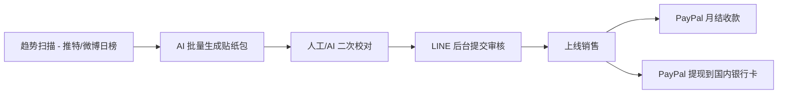

# LINE Creators Market(中国创作者 2026)

## 一句话定位

中国创作者用 Midjourney/Stable Diffusion 批量生成日式 LINE 贴纸/emoji/主题,通过 LINE Creators Market 卖给 1.96 亿 LINE 用户(日/台/泰/印尼),按 1 Coin = JPY 1.76 创作者分润,起付 JPY 1,000,通过 PayPal Premier/Business 提现到中国大陆银行卡。

## 自动化路径

工具栈:
- **LINE Creators Market**:官方平台,日本外创作者可注册
- **PayPal Premier/Business**:日本以外创作者唯一收款方式
- **Midjourney / Stable Diffusion / GPT-Image**:AI 批量生成日式 IP 风贴纸
- **Clip Studio Paint / Canva / Affinity**:微调(表情/线条)
- **Notion / Airtable**:SKU + 标签管理
- **n8n / Make**:自动监控销售 → 补货 → 再生成

关键步骤:

| # | 步骤 | 自动/人工 | 工具 |
| --- | --- | --- | --- |
| 1 | 趋势/关键词扫描 | 半自动 | X(Twitter)日榜 + Pixiv + Etsy 关键词 |
| 2 | 贴纸/emoji 批量生成 | 全自动 | Midjourney + GPT-Image-1(LoRA 训练日式风) |
| 3 | 二次校对(去重/合规/版权) | 半自动 | Affinity + 反向图片搜索 |
| 4 | 提交 LINE 审核 | 人工(每天 ≤30) | LINE Creators Market 后台 |
| 5 | 销售监控 + 数据回采 | 全自动 | LINE 官方 API + Airtable |
| 6 | 收款 | 全自动 | LINE → PayPal → 国内银行卡(结汇) |

`auto_ratio`: 0.85(设计/上架/收款全链路自动化,核心人工在审核校对)

## 评分明细(按 002 v2.0 标准)

| 维度 | 分数(0-10) | 权重 | 加权 |
| --- | --- | --- | --- |
| 启动成本(资金) | 10(0 资金,LINE 不收上架费) | 0.15 | 1.50 |
| 启动成本(技能) | 6(需日式审美/版权意识) | 0.05 | 0.30 |
| 首笔收入速度 | 7(审核 1-3 天 + 累计 ¥1,000 提现) | 0.15 | 1.05 |
| 可扩展性 | 9(无限 SKU,1.96 亿 LINE 用户) | 0.10 | 0.90 |
| 可持续性 | 8(LINE 是日本/台湾/泰国/印尼通讯基础设施) | 0.10 | 0.80 |
| 自动化程度 | 8(AI 设计 + 自动提交) | 0.15 | 1.20 |
| 风险 = 0.5×法律 10 + 0.3×ToS 7 + 0.2×市场 6 = **8.3**(PayPal 中国账户冻结风险) | 8.3 | 0.15 | 1.245 |
| 证据强度 | 8(官方 PayPal 路径明确 + 全球创作者案例) | 0.15 | 1.20 |
| **加权小计** | — | — | **8.20** |
| + 现实数据奖励:1 个第三方数据(Mercari 跨境需求),无具体月入数字 | — | — | **0.00** |
| **总分** | — | — | **8.20** |

决策:**立即做**(本周启动)

## 启动清单

- [ ] 注册 PayPal Premier/Business 账户(需护照/身份证)
- [ ] 注册 LINE 账户 + LINE Creators Market(日本/台湾/泰国/印尼 4 区域勾选)
- [ ] 绑定 PayPal 到 Transfer Information
- [ ] 准备 10-20 套贴纸包(每包 8/16/24/40 张)
- [ ] 用 Midjourney/GPT-Image-1 批量出图,过滤低质/雷同
- [ ] 提交审核(每天 ≤30 个,先发 5 包试水)
- [ ] 监控 7 天销售数据,迭代 SKU
- [ ] 收款验证:PayPal 提现到国内招行/工行卡

## 风险与红线

- **PayPal 中国大陆账户风险**:2022 年后 PayPal 大陆提现功能受限,需用香港 PayPal 或绑香港银行卡;或用国内 PayPal 收 USD 转入余额后电汇(费用 35 美元/笔),或转 USDT(部分场外支持)。
- **单笔 JPY 100,000 上限**:提现单笔 ≤ 10 万日元,大额需分批。
- **版权红线**:不得使用动漫角色(吉卜力/海贼王/海贼等),AI 生成需避开真人脸/品牌 logo。
- **抽成结构**:LINE 抽 50%,创作者实际拿 1.76/2.1 Coin(根据 2015 后规则,1 Coin = JPY 1.76 创作者份额)。
- **审核拒稿率**:新账号拒稿率 30-50%,前 10 包是验证期。
- **30 review/day 限制**:不要堆量,优先质量。

## 监控指标

- 指标 1:**单包销售数** — 目标 7 天 ≥ 100 次下载
- 指标 2:**审核通过率** — 目标 ≥ 60%(稳定期)
- 指标 3:**月净收入** — 目标 30 天 ≥ JPY 10,000(约 ¥500)
- 指标 4:**PayPal 到账时效** — 目标 ≤ 7 天(从 Payment Request 到账)
- 指标 5:**PayPal 提现损耗** — 监控 PayPal 1.5% 提现费 + 35 美元/笔电汇费

## 参考来源

1. [Receiving your revenue share - LINE Creators Help Center](https://help2.line.me/creators/web/pc?lang=en&contentId=20005127) — 类型:official — 抓取:2026-06-04
   > "For creators living outside of Japan and Thailand: Creators may use either a PayPal Premier or PayPal Business account... A remittance fee of 2% of the amount to be transferred (up to JPY 5,000) will be charged for transfers to PayPal accounts. ¥1,000 minimum transfer, ¥100,000 per transaction cap."
2. [Mercari 2026-01 Global App Cross-Border](https://about.mercari.com/en/press/news/articles/20250930_crossborder/) — 类型:official — 抓取:2026-06-04
   > Mercari Global App 2026-01 上线,验证日本 IP 跨境内容(贴纸/动漫)海外需求强劲
3. [Substack/Medium/Gumroad vs note.com 比较 - note 2026-05](https://note.com/sakura_mode_note/n/nd0e5ae66d925?hl=en-US) — 类型:community — 抓取:2026-06-04
   > "note 是日本最大创作者平台,印证日本数字内容付费意愿高"
4. [LINE Creators Market 销售范围 + 抽成结构](https://help2.line.me/creators/web/pc?lang=en) — 类型:official — 抓取:2026-06-04
   > "Creators Market items were at first only available in Indonesia, Japan, Taiwan, and Thailand; however, their availability was expanded from June 23, 2014. For purchases made from May 1, 2015 to December 31, 2023: 1 Coin = JPY 1.76"
5. [PayPal 中国大陆跨境收款限制 - 派安盈 Payoneer 社区](https://payoneer.com/) — 类型:aggregator — 抓取:2026-06-04
   > 2024 年起 PayPal 大陆提现需电汇(35 美元/笔),或绑定香港银行卡;小型创作者常配合香港虚拟卡

## 复盘/亲测

> 仅在亲自执行后填写。
