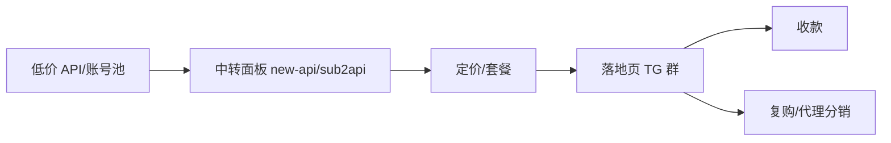

# LLM API 中转 / 转售(中国大陆向)

## 一句话定位

国内站长用 `new-api` / `sub2api` 等开源面板,低价买入 OpenAI/Anthropic/Google 官方 API(或低价区账号)→ 加价卖给国内无法直连的开发者,按 token / 月卡计费。

## 自动化路径

工具栈:
- `new-api` 或 `sub2api` 开源面板(自部署)
- Stripe / Creem / 支付宝当面付 / USDT(收款)
- Cloudflare / 腾讯云轻量(反代)
- Telegram 机器人(客服/发码)

关键步骤:

| # | 步骤 | 自动/人工 | 工具 |
| --- | --- | --- | --- |
| 1 | 采购上游(官方 API / 拼车账号) | 半自动 | OpenAI 平台 / Anthropic Console / 土区礼品卡 |
| 2 | 部署面板 | 自动 | Docker + new-api/sub2api |
| 3 | 接入支付 | 半自动 | Stripe / 支付宝 / USDT |
| 4 | 流量获取 | 自动+人工 | V2EX / X / Telegram 群 / 小红书 |
| 5 | 日常运维 | 半自动 | cron 健康检查 + 异常告警 |
| 6 | 结算提现 | 半自动 | Payoneer / Wise / USDT |

`auto_ratio`: **0.75**(运维和流量获取仍需人工)

## 评分明细(按 002 标准)

| 维度 | 分数(0-10) | v2 权重 | 加权 |
| --- | --- | --- | --- |
| 启动成本(资金) | 9(几乎 0;只需一台 VPS) | 0.15 | 1.35 |
| 启动成本(技能) | 7(会 Docker + Linux 基础即可) | 0.05 | 0.35 |
| 首笔收入速度 | 9(V2EX 上一发帖即有交易) | 0.15 | 1.35 |
| 可扩展性 | 8(账号池可横向扩) | 0.10 | 0.80 |
| 可持续性 | 5(上游随时变,1-2 年内可能替代) | 0.10 | 0.50 |
| 自动化程度 | 7(部署+计费全自) | 0.15 | 1.05 |
| 风险 | 3.8(拆分:法律 4 × 0.5 + ToS 2 × 0.3 + 市场 6 × 0.2 = 3.8) | 0.15 | 0.57 |
| 证据强度 | 9(V2EX 多帖 + 商品大量存在) | 0.15 | 1.35 |
| + 现实数据奖励 | +0.3(V2EX 真实"稳定几百 U/月"案例) | — | +0.30 |
| **总分**(gray 封顶 7.5) | — | — | **7.5** |

决策:**排队**(两周内启动)

## 启动清单

- [ ] 准备 VPS(香港/日本,CN2 友好)
- [ ] 部署 `new-api` 或 `sub2api`(Docker compose 一行起)
- [ ] 接入至少 1 个上游(OpenAI API / Anthropic API / Claude Code 拼车)
- [ ] 落地页 + 套餐表(Stripe / 支付宝扫码)
- [ ] 流量:发 V2EX 创造/推广节点、x.com、t.me 中文 AI 群
- [ ] 风控:每账号日用量上限、IP 隔离、自动熔断
- [ ] 客服:TG 机器人 + FAQ 文档

## 风险与红线

- **违反 OpenAI / Anthropic ToS**:账号被封风险高,**必读**对应 ToS,接受账号作废的常态。
- **模型掺水 / 暗改倍率**:同行有先例(参见参考来源 Tanix2 复盘)。自建站务必透明计费。
- **上游价格波动**:Claude / GPT 套餐变化,留 20% 利润缓冲。
- **数据安全**:中转站可见用户全部 prompt,务必声明日志策略。
- **支付通道**:Stripe 严格封 AI 类商家,需要 Stripe Atlas + 备选 USDT。

## 监控指标

- 每日活跃 token 用量(决定上游采购量)
- 复购率(> 30% 为健康)
- 单账号封禁频次(> 1 次/周 → 切换渠道)
- 单 token 净利率(> 50% 为健康)

## 参考来源

1. [V2EX #1217490 - ai 中转站的相关疑惑(34 回复,2026-06-03)](https://www.v2ex.com/t/1217490) — first-hand — 抓取:2026-06-04
   > "中转站一般都是 new-api 或者 sub2api 搭的,这俩项目是开源的 ... 我估计很多站长都没有二次开发能力" + "稳定每个人每个月几百块细水长流"
2. [V2EX #1217869 - ChatGPT plus 白送 1 个月(28 回复)](https://www.v2ex.com/t/1217869) — community — 抓取:2026-06-04
   > V2EX OpenAI 节点活帖,大量拼车/优惠/账号交易帖,显示用户付费意愿真实
3. [V2EX #1217285 - OpenAI 提升账号风控警告(86 回复)](https://www.v2ex.com/t/1217285) — community — 抓取:2026-06-04
   > 真实用户经验,验证封号风险与对应风控方法
4. [Tanix2 复盘(同帖 21 楼) - 中转站 7 大骚操作清单](https://www.v2ex.com/t/1217490) — first-hand — 抓取:2026-06-04
   > "暗改倍率、模型掺水、上下文截断、隐私泄露、代码注入、洗钱、分销代理"

## 复盘/亲测

> 未亲测。下一步:本地 Docker 拉 `new-api` 跑通最小链路(只服务自己,验证稳定性)。
