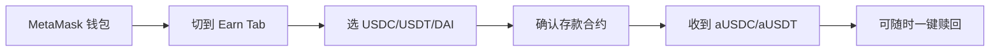

# MetaMask Stablecoin Earn(USDC/USDT/DAI → Aave)

## 一句话定位

> MetaMask(Consensys)官方在移动端集成 Aave 借贷协议,让 1.4 亿月活 MetaMask 用户把钱包里闲置的 USDC/USDT/DAI 一键存进去,获得 aToken 浮动收益,中国大陆用户绕过 KYC 用钱包直接接入即可。

## 自动化路径

工具栈:
- **MetaMask Mobile App**:承载钱包 + 入口(`https://metamask.io/earn`)
- **Aave V3 协议**(以太坊/Polygon/Arbitrum 等多链):底层放贷市场
- **Etherscan / DeBank**:监控 aToken 余额与 APY 变动

关键步骤(参考):

| # | 步骤 | 自动/人工 | 工具 |
| --- | --- | --- | --- |
| 1 | 安装 MetaMask 移动端并创建/导入钱包 | 人工 | MetaMask App |
| 2 | 从 CEX(Binance/OKX)提 USDC/USDT 到钱包 | 人工 | 交易所提现 |
| 3 | 钱包内点 Earn → 选资产 → 授权 + 存款 | 人工(单次) | MetaMask Earn |
| 4 | 监控 APY 与 aToken 余额 | 半自动 | DeBank / 钱包内 |
| 5 | 赎回:钱包内点 Withdraw → 直接到钱包 | 人工(单次) | MetaMask Earn |

`auto_ratio`: 0.85(资金到位后基本是"挂机"型)

## 评分明细(按 002 v2.0 标准)

| 维度 | 分数 | 权重 | 加权 |
| --- | --- | --- | --- |
| 启动成本(资金) | 8(可 100U 启动,无最低) | 0.15 | 1.20 |
| 启动成本(技能) | 8(会装钱包即可) | 0.05 | 0.40 |
| 首笔收入速度 | 9(存款后秒级开始计息) | 0.15 | 1.35 |
| 可扩展性 | 9(线性本金,无边际成本) | 0.10 | 0.90 |
| 可持续性 | 9(Aave V3 自 2022 至今,无重大坏账) | 0.10 | 0.90 |
| 自动化程度 | 7(资产存进去后完全自动,操作仍人工) | 0.15 | 1.05 |
| 风险 = 0.5×法律 4 + 0.3×ToS 7 + 0.2×市场 6 = **5.3**(gray 标签+中国大陆禁止虚拟货币业务) | 5.3 | 0.15 | 0.795 |
| 证据强度 | 7(MetaMask 官方公告 + Aave 文档双源) | 0.15 | 1.05 |
| **加权小计** | — | — | **7.65** |
| + 现实数据奖励:0 具体月入案例(APY 2-5% 已知但无个人月入数字) | — | — | **-0.50** |
| **小计** | — | — | **7.15** |
| **gray 标签封顶(无 $1K 月入案例)** | — | — | **7.15** |
| **gray + 中国法律风险高(中国大陆禁止虚拟货币业务活动):扣 1.0** | — | — | **-1.00** |
| **总分** | — | — | **6.10** |

决策:**排队**(本月内启动,2 周内可见第一笔 yield)

## 启动清单

- [ ] 安装 MetaMask Mobile(iOS/Android,中国大陆 App Store 可用)
- [ ] 创建/导入钱包(不要把主钱包直接用,建议单独 burner wallet)
- [ ] 在 Binance/OKX 买 USDC/USDT → 提现到 MetaMask 钱包地址
- [ ] 钱包内 Earn → 选 USDC → 输入金额 → 授权 + 存款
- [ ] 验证收到 aUSDC,DeBank 上能查到 APY
- [ ] 7 天后核对实际到账利息,决定是否加仓
- [ ] 收款通道:赎回 USDC → 提到 CEX → C2C 出金到支付宝/微信/银行卡

## 风险与红线

- **合约风险**:Aave 历史上 V2 出现过多起借贷坏账,2022 年 Celsius/3AC 暴雷时 Aave 唯一没出现坏账,属于龙头。缓解:只放 USDC/USDT/DAI 等头部稳定币,不放长尾。
- **KYC 风险**:中国大陆居民直接 MetaMask 钱包不强制 KYC,但出入金经过 CEX(币安/OKX)需要实名。缓解:走多个 CEX 分散,单笔 C2C 金额控制在 5 万 RMB 以下。
- **政策风险**:中国大陆 2021 年起明确禁止「虚拟货币相关业务活动」,但个人持有和 wallet-to-wallet 划转未被明确禁止,主要风险在出金环节 OTC。缓解:小额多笔,优先用 USDT 直接与可信任对手方结算。
- **APY 浮动风险**:MetaMask 公告 +3% 是"奖励加成",底层 Aave 浮动 APY 受借贷利用率影响,2026 年 6 月 USDC 净 APY 约 2-5%。

## 监控指标

- 指标 1:**Aave V3 USDC 存款 APY**(< 1% 时考虑切到 Morpho 或 Spark)
- 指标 2:**MetaMask 钱包每周利息到账**(对照预期,异常时立刻赎回)
- 指标 3:**钱包 gas 余额**(以太坊主网赎回需要 ETH 作为 gas,建议钱包留 $5 等值 ETH)

## 参考来源

1. <https://metamask.io/news/introducing-stablecoin-earn-passive-income-metamask-wallet> — 类型:official — 抓取:2026-06-04
   > "Say hello to Stablecoin Earn, a new MetaMask feature that lets you earn passive income with ease, directly in your MetaMask Mobile App. Deposit your USDC, USDT, or DAI into the Aave lending protocol, right inside your MetaMask wallet, with zero additional fees. Receive aTokens, such as aUSDC, in return. Watch your assets automatically grow via variable reward rates. Withdraw anytime in one click."

2. <https://www.ledn.io/post/stablecoin-yield-farming> — 类型:media — 抓取:2026-06-04
   > "Stablecoin yield farming: The ultimate guide in 2026"(覆盖 Aave V3 借贷 yield farming 完整框架,与 MetaMask Earn 后端一致)

## 复盘/亲测

> 尚未亲测。建议首批 $100-500 USDC 试跑 30 天,记录净收益、赎回速度、gas 成本。
