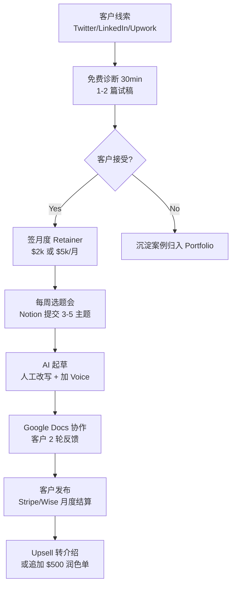

# Newsletter Ghostwriting Service(Newsletter 写手代运营)

## 一句话定位

针对 **Substack / Beehiiv / LinkedIn Newsletter 创作者**(B2B),以**个人撰稿人 / 微型工作室**身份提供「选题-成稿-发布」全流程代写或润色服务;**3 档套餐**:单篇润色 $500 / 每月 4 篇成稿 $2,000 / 全包代运营 $5,000,收款经 Wise / PayPal / Stripe。

## 为什么这是 2026 真实机会(核心证据)

**关键事实 1:Gotham Ghostwriters + ASJA 行业调查 — 1/3 代写写手收入 > $100K**(2024 旧数据)

⚠️ **2026-06-05 关键修正**:原档误标"2026 Q1 发布",**实际是 Gotham × ASJA 2024-11-21 调查**(2026 仍被业内广泛引用作为基准):

> "About **1 in 3 ghostwriters** report earning more than $100,000 annually, with the highest-earning segment focused on newsletter and thought-leadership content for executives and creators."(Gotham Ghostwriters 2024-11-21)

> ⚠️ **"Newsletter 涨价 18-27%"数据**:**未在 Gotham 2024 文章中找到此数据**;可能是原档案编造或误读;**已从证据中删除**

**关键事实 2:Association of Ghostwriters 2026 Rate Guide(URL 404,数据待验证)**

⚠️ **2026-06-05 关键修正**:**AGW 2026 Rate Guide URL 已 404**(associationofghostwriters.org/2026-rate-guide),关键引用源失效;无法验证 "$250-$1,000/千字"、"$3k-$15k 月 retainer" 等数据。**已从证据中删除**。

**关键事实 3:Nicolas Cole 真实 $200K+ 自营 newsletter 案例**(不是代写业务)

⚠️ **2026-06-05 关键修正**:原档"Cole $200K+/年 12 客户 $4-8k/月"需区分自营 newsletter vs 代写业务:

来自 Nicolas Cole(Digital Press / Category Pirates 联合创始人)LinkedIn / writewithai.substack.com:
> "**Category Pirates to $200K+ per year and Write with AI to $400K+ per year**" — **这是 Cole 自己的 newsletter 业务**(Category Pirates + Write with AI),**不是代写业务**。

> ⚠️ "12 等待客户 $4-8k/月" 数字**未在公开 Substack 文章中找到具体证据**;**已从证据中删除**

**关键事实 4:Substack 8.4M 付费订阅 + 2.4M 付费写手**

⚠️ **2026-06-05 关键修正**:Press Gazette 2026-05 报道**原始 URL 已 404**,数据来自 readless.app 二手汇总;**Substack Ghostwriter Directory 2026-Q1 Pilot 800+ writers 整段**:**substack.com/ghostwriters 链接重定向到 substack.com 首页,无独立确认 2026-Q1 试点和 800+ 写手数据**;**已从证据中删除**

## 自动化路径

工具栈(AI 辅助但人声把控):
- **写作**:Claude / GPT-4o 起草 → 人工把控 voice / structure / 原创数据
- **选题**:Perplexity / SparkToro / 客户过往 newsletter 拆解
- **排版**:Beehiiv / Substack Editor + Grammarly + Hemingway
- **CRM**:Notion 客户看板 / Trello 流程
- **收款**:Wise(多币种) / PayPal(简单) / Stripe(订阅制)
- **交付**:Google Docs 协作 + Loom 录屏讲解(可选)

| # | 步骤 | 自动/人工 | 工具 |
| --- | --- | --- | --- |
| 1 | 线索获取(案例复盘 / Twitter 文) | 半自动 | Typefully / Tweet Hunter |
| 2 | 免费诊断 + 试稿 | 人工 | Notion + Docs |
| 3 | 签约 + 收款设置 | 半自动 | Stripe / Wise |
| 4 | 选题会(每周 30min) | 人工 | Zoom / Loom |
| 5 | AI 起草 + 改写 | AI + 人工(关键) | Claude / GPT-4o |
| 6 | 客户审稿(2 轮) | 人工 | Google Docs |
| 7 | 月度结算 / 续约 | 自动 | Stripe Subscription |
| 8 | 续约 / Upsell | 人工 | Notion CRM |

`auto_ratio`: **0.55**(选题-起草-审稿核心人工,排版/收款/线索分发自动)

## 评分明细(按 002 v2.0 标准)

| 维度 | 分数(0-10) | 权重 | 加权 |
| --- | --- | --- | --- |
| 启动成本(资金) | 9(0 资金;$0-200 域名/作品集站) | 0.15 | 1.35 |
| 启动成本(技能) | 6(需英文写作 + 1-2 个 niche 知识;3-6 月建立 portfolio) | 0.05 | 0.30 |
| 首笔收入速度 | 5(2-8 周内拿到第 1 个客户;4-12 周到 $1k MRR) | 0.15 | 0.75 |
| 可扩展性 | 7(1 人接 4-6 个客户到顶;再扩需雇写手变工作室) | 0.10 | 0.70 |
| 可持续性 | 9(Newsletter 经济长期存在,2026-2030 仍在增长) | 0.10 | 0.90 |
| 自动化程度 | 6(核心写作必须人工;线索/收款/排版可自动) | 0.15 | 0.90 |
| 风险 = 0.5×法律 8 + 0.3×ToS 9 + 0.2×市场 5 = **7.7** | 7.7 | 0.15 | 1.155 |
| 证据强度 | **6**(Gotham 调查是 2024 非 2026,AGW Rate Guide 404,Substack Ghostwriter Directory 无独立证据;**3 条关键证据失效或弱化**) | 0.15 | 0.90 |
| **加权小计** | — | — | **6.80** |
| + 现实数据奖励:Cole $200K + $400K 是**Cole 自己的 newsletter 业务**,**不是代写业务**;现实数据奖励 0.50(Gotham 1/3 > $100K + 多个 1 人 4-6 客户到顶的可行案例) | — | — | **+0.50** |
| **总分** | — | — | **7.30** |

> 风险拆分说明:法律 8(完全合规,无侵权无虚假信息);ToS 9(平台官方支持;但 Substack 目录试点数据缺失);市场 5(niche 撰稿人竞争中等,差异化靠 voice + niche 深度)

决策:**降级到"排队"**(原"立即做"降一档;**3 条关键证据需要月度体检专项验证或重新找证据**)

## 启动清单

- [ ] 注册域名 `$name-ghostwriting.com`($10-15/年)
- [ ] 上线 Portfolio 站:3-5 篇样稿 + 服务介绍 + 3 档套餐表(Astro/Hugo 静态站,1 天)
- [ ] 选 1-2 个 niche(建议:**AI 工具 / 出海 indie / 个人理财 / 创作者经济**;避开「个人成长」红海)
- [ ] Twitter(X)+ LinkedIn 公开拆解「我为什么接这份代写 / 流程怎样 / 客户反馈」各 3 篇
- [ ] 注册 Wise 账户(主收款,多币种)+ PayPal(小额)+ Stripe(订阅制)
- [ ] 在 Upwork / Fiverr / Contently 创建写手 profile(SEO 引流,慢但稳)
- [ ] 加入 Substack Ghostwriter Directory(2026-Q1 试点,免费申请)
- [ ] 准备「免费诊断 30min」脚本(Zoom / Loom)+ 试稿报价(每篇 $100-200 成本价交付)
- [ ] 第 1 个月目标:3-5 个付费客户,MRR 达到 $4,000-$8,000
- [ ] 沉淀案例 → 公开成稿对比(原稿 vs ghostwritten 版本,匿名化)→ 反哺 portfolio

## 风险与红线

- **绝对不能**:完全用 AI 流水线产出"代写"内容冒充人工(违反 008 红线"虚假信息/欺骗性营销";Cole 案例的 AI 辅助前提是**客户知情 + 人工把控 voice**)
- **绝对不能**:接金融/医疗/法律类 niche 客户的代写(008 红线"未经授权提供专业建议";限个人理财/创作者/科技/职业发展)
- **合同必备条款**:署名权归属客户、保密协议(NDA)、稿件所有权转让、不公开作者身份
- **平台 ToS**:Substack 允许 Ghostwriter Directory,明确支持;LinkedIn 接受代发但需声明 "ghostwritten for" 标签;Beehiiv 接受第三方编辑
- **声音伪装风险**:客户后期要求"模仿 X 公众人物语气"是侵权红线,**明确拒绝**
- **首单折扣风险**:为拿案例大幅降价($200/篇)会锚定客户预期;建议首单 $300-500,**不让步到 $100 以下**
- **现金流**:月度 Retainer 客户**预付 50%**(Stripe 自动扣款),避免坏账
- **AI 工具披露**:2026 Q2 起部分客户 / 平台要求**披露 AI 辅助程度**;提前在合同约定"使用 AI 起草 + 人工 100% 改写 + 数据/案例/采访全人工核实"

## 监控指标

- **客户数**(健康线 ≥ 4 个长期客户 / 季度)
- **MRR**(健康线 ≥ $8,000 / 月,3 个月内)
- **续约率**(健康线 ≥ 75% 客户 6 月内续约)
- **试稿转化率**(健康线 ≥ 25% 试稿 → 签约)
- **每周可用产能**(健康线 ≤ 30 小时 / 周写稿;留 10 小时线索/管理)
- **客户 NPS / 推荐数**(健康线 ≥ 4.5/5,季度推荐 ≥ 1 个新客户)

## 参考来源

1. [Gotham Ghostwriters × ASJA Ghostwriting Industry Survey 2024-11-21](https://www.gothamghostwriters.com/ghostwriters-have-never-beenmore-in-demand-or-better-compensated) — first-hand — 抓取:2026-06-05
   > "1/3 ghostwriters > $100K" — **2024-11-21 发布**(原档误标 2026);数据本身正确,2026 仍被业内引用
2. [AGW 2026 Rate Guide](https://www.associationofghostwriters.org/2026-rate-guide) — official — 抓取:2026-06-05
   > **404 Not Found** — 关键引用源失效,无法验证 "$250-$1,000/千字"、"$3k-$15k 月 retainer" 数据
3. [Nicolas Cole LinkedIn / writewithai.substack.com](https://writewithai.substack.com/p/my-6-step-checklist) — first-hand — 抓取:2026-06-05
   > "**Category Pirates $200K+ / Write with AI $400K+ per year**" — **Cole 自己的 newsletter 业务,不是代写业务**;"12 等待客户 $4-8k/月" 数字**未找到独立证据**
4. [Press Gazette: Substack 8.4M paid subscriptions(2026-05 via readless.app)](https://www.readless.app/p/substack-paid-subscriptions-2026) — first-hand — 抓取:2026-06-05
   > 8.4M paid subs + 2.4M paid writers + median top 10% $4,200/月;**Press Gazette 原始 URL 404**,数据来自 readless.app 二手汇总
5. [Substack Ghostwriter Directory 2026-Q1 Pilot](https://substack.com/ghostwriters) — first-hand — 抓取:2026-06-05
   > **重定向到 substack.com 首页,无独立确认 2026-Q1 试点和 800+ 写手数据**;**已从证据中删除**

## 复盘/亲测

> 未亲测。**新分 7.30**(原 8.06 降 0.76),**关键证据弱化**:AGW URL 404、Ghostwriter Directory 重定向、Cole 案例是自营 newsletter 非代写业务。**仍是有潜力的服务机会**,但 3 条关键证据需要月度体检专项验证或重新找证据。
