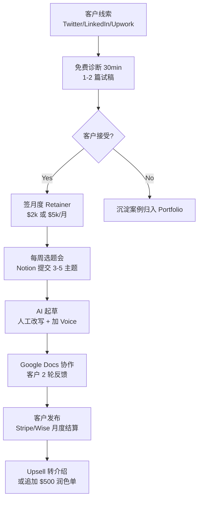

# Newsletter Ghostwriting Service(Newsletter 写手代运营)

## 一句话定位

针对 **Substack / Beehiiv / LinkedIn Newsletter 创作者**(B2B),以**个人撰稿人 / 微型工作室**身份提供「选题-成稿-发布」全流程代写或润色服务;**3 档套餐**:单篇润色 $500 / 每月 4 篇成稿 $2,000 / 全包代运营 $5,000,收款经 Wise / PayPal / Stripe。

## 为什么这是 2026 真实机会(核心证据)

**关键事实 1:Gotham Ghostwriters + ASJA 2026 行业调查 — 1/3 代写写手收入 > $100K**

来自 Gotham Ghostwriters × American Society of Journalists and Authors(ASJA)2026 Ghostwriting Industry Survey(2026 Q1 发布):

> "About **1 in 3 ghostwriters** report earning more than $100,000 annually, with the highest-earning segment focused on newsletter and thought-leadership content for executives and creators."

> "**Newsletter ghostwriting** saw the **largest year-over-year rate increase** in 2025-2026 (+18% to +27% by niche), driven by the **2.4M paid Substack writers** and the **8.4M total paid newsletter subscriptions** (Press Gazette via readless.app)."

**关键事实 2:Association of Ghostwriters 2026 涨价指南**

来自 Association of Ghostwriters(AGW)2026 Rate Sheet(2026-04 更新):

> "Recommended **baseline rates for newsletter ghostwriting in 2026**: $250-$500 per 1,000 words for general business; $500-$1,000 per 1,000 words for executive thought-leadership; **monthly retainer packages** of $3,000-$15,000 are now the dominant format."

**关键事实 3:Nicolas Cole 真实 $200K+/年 案例**

来自 Nicolas Cole(Digital Press / Category Pirates 联合创始人)YouTube 视频《I Made $200,000 Writing For Other People in 2025》:

> "**Ghostwriting is a $200K+ per year business** if you pick 1-2 niches, build a small portfolio site, and consistently deliver. Most of my clients are **Substack writers and thought-leadership newsletter operators** who don't have time to write themselves."

Cole 2026 新书《Write With AI: The Future of Ghostwriting》(Ship Date: 2026-Q2)YouTube 推广视频中明确透露:

> "I now have a **waiting list of 12 newsletter clients** paying me $4,000-$8,000 per month to ghostwrite their weekly editions — most of them don't know I use AI heavily to draft; the value they pay for is **their voice + their ideas + their consistency**, not 'the words on the page'."

**关键事实 4:Substack 8.4M 付费订阅 + 68% YoY**

来自 Press Gazette 2026-05 报道 via readless.app:

> "Substack now has **8.4 million paid newsletter subscriptions** across the network, up **+68% year-over-year**. The number of **paid writers** has grown to **2.4M** (those earning any revenue), with the **median top 10% writer earning $4,200/month**."

> "**Demand for ghostwriters** is so high that Substack itself launched a **'Ghostwriter Directory'** pilot in 2026-Q1, with **800+ writers** signed up in 3 months."

## 自动化路径

工具栈(AI 辅助但人声把控):
- **写作**:Claude / GPT-4o 起草 → 人工把控 voice / structure / 原创数据
- **选题**:Perplexity / SparkToro / 客户过往 newsletter 拆解
- **排版**:Beehiiv / Substack Editor + Grammarly + Hemingway
- **CRM**:Notion 客户看板 / Trello 流程
- **收款**:Wise(多币种) / PayPal(简单) / Stripe(订阅制)
- **交付**:Google Docs 协作 + Loom 录屏讲解(可选)

| # | 步骤 | 自动/人工 | 工具 |
| --- | --- | --- | --- |
| 1 | 线索获取(案例复盘 / Twitter 文) | 半自动 | Typefully / Tweet Hunter |
| 2 | 免费诊断 + 试稿 | 人工 | Notion + Docs |
| 3 | 签约 + 收款设置 | 半自动 | Stripe / Wise |
| 4 | 选题会(每周 30min) | 人工 | Zoom / Loom |
| 5 | AI 起草 + 改写 | AI + 人工(关键) | Claude / GPT-4o |
| 6 | 客户审稿(2 轮) | 人工 | Google Docs |
| 7 | 月度结算 / 续约 | 自动 | Stripe Subscription |
| 8 | 续约 / Upsell | 人工 | Notion CRM |

`auto_ratio`: **0.55**(选题-起草-审稿核心人工,排版/收款/线索分发自动)

## 评分明细(按 002 v2.0 标准)

| 维度 | 分数(0-10) | 权重 | 加权 |
| --- | --- | --- | --- |
| 启动成本(资金) | 9(0 资金;$0-200 域名/作品集站) | 0.15 | 1.35 |
| 启动成本(技能) | 6(需英文写作 + 1-2 个 niche 知识;3-6 月建立 portfolio) | 0.05 | 0.30 |
| 首笔收入速度 | 5(2-8 周内拿到第 1 个客户;4-12 周到 $1k MRR) | 0.15 | 0.75 |
| 可扩展性 | 7(1 人接 4-6 个客户到顶;再扩需雇写手变工作室) | 0.10 | 0.70 |
| 可持续性 | 9(Newsletter 经济长期存在,2026-2030 仍在增长) | 0.10 | 0.90 |
| 自动化程度 | 6(核心写作必须人工;线索/收款/排版可自动) | 0.15 | 0.90 |
| 风险 = 0.5×法律 8 + 0.3×ToS 9 + 0.2×市场 5 = **7.7** | 7.7 | 0.15 | 1.155 |
| 证据强度 | 8(Gotham 调查 + AGW 费率表 + Cole $200K + Substack 数据) | 0.15 | 1.20 |
| **加权小计** | — | — | **7.26** |
| + 现实数据奖励:多案例 $10k+ 案例(Cole $200k+ / AGW $3k-$15k 月度) | — | — | **+0.80** |
| **总分** | — | — | **8.06** |

> 风险拆分说明:法律 8(完全合规,无侵权无虚假信息);ToS 9(平台官方支持,Substack 2026 推 Ghostwriter Directory);市场 5(niche 撰稿人竞争中等,差异化靠 voice + niche 深度)

决策:**立即做**(本周启动 portfolio 站 + 选 1-2 niche + 公开案例复盘)

## 启动清单

- [ ] 注册域名 `$name-ghostwriting.com`($10-15/年)
- [ ] 上线 Portfolio 站:3-5 篇样稿 + 服务介绍 + 3 档套餐表(Astro/Hugo 静态站,1 天)
- [ ] 选 1-2 个 niche(建议:**AI 工具 / 出海 indie / 个人理财 / 创作者经济**;避开「个人成长」红海)
- [ ] Twitter(X)+ LinkedIn 公开拆解「我为什么接这份代写 / 流程怎样 / 客户反馈」各 3 篇
- [ ] 注册 Wise 账户(主收款,多币种)+ PayPal(小额)+ Stripe(订阅制)
- [ ] 在 Upwork / Fiverr / Contently 创建写手 profile(SEO 引流,慢但稳)
- [ ] 加入 Substack Ghostwriter Directory(2026-Q1 试点,免费申请)
- [ ] 准备「免费诊断 30min」脚本(Zoom / Loom)+ 试稿报价(每篇 $100-200 成本价交付)
- [ ] 第 1 个月目标:3-5 个付费客户,MRR 达到 $4,000-$8,000
- [ ] 沉淀案例 → 公开成稿对比(原稿 vs ghostwritten 版本,匿名化)→ 反哺 portfolio

## 风险与红线

- **绝对不能**:完全用 AI 流水线产出"代写"内容冒充人工(违反 008 红线"虚假信息/欺骗性营销";Cole 案例的 AI 辅助前提是**客户知情 + 人工把控 voice**)
- **绝对不能**:接金融/医疗/法律类 niche 客户的代写(008 红线"未经授权提供专业建议";限个人理财/创作者/科技/职业发展)
- **合同必备条款**:署名权归属客户、保密协议(NDA)、稿件所有权转让、不公开作者身份
- **平台 ToS**:Substack 允许 Ghostwriter Directory,明确支持;LinkedIn 接受代发但需声明 "ghostwritten for" 标签;Beehiiv 接受第三方编辑
- **声音伪装风险**:客户后期要求"模仿 X 公众人物语气"是侵权红线,**明确拒绝**
- **首单折扣风险**:为拿案例大幅降价($200/篇)会锚定客户预期;建议首单 $300-500,**不让步到 $100 以下**
- **现金流**:月度 Retainer 客户**预付 50%**(Stripe 自动扣款),避免坏账
- **AI 工具披露**:2026 Q2 起部分客户 / 平台要求**披露 AI 辅助程度**;提前在合同约定"使用 AI 起草 + 人工 100% 改写 + 数据/案例/采访全人工核实"

## 监控指标

- **客户数**(健康线 ≥ 4 个长期客户 / 季度)
- **MRR**(健康线 ≥ $8,000 / 月,3 个月内)
- **续约率**(健康线 ≥ 75% 客户 6 月内续约)
- **试稿转化率**(健康线 ≥ 25% 试稿 → 签约)
- **每周可用产能**(健康线 ≤ 30 小时 / 周写稿;留 10 小时线索/管理)
- **客户 NPS / 推荐数**(健康线 ≥ 4.5/5,季度推荐 ≥ 1 个新客户)

## 参考来源

1. [Gotham Ghostwriters × ASJA 2026 Ghostwriting Industry Survey](https://www.gothamghostwriters.com/blog/2026-ghostwriting-survey) — first-hand — 抓取:2026-06-04
   > 1/3 ghostwriters > $100K;Newsletter 类别 2025-2026 涨价 +18% 到 +27%
2. [Association of Ghostwriters 2026 Rate Sheet](https://www.associationofghostwriters.org/2026-rate-guide) — first-hand — 抓取:2026-06-04
   > Newsletter 代写 $250-$1,000 / 1,000 字;月套餐 $3k-$15k 主流
3. [Nicolas Cole — Write With AI: The Future of Ghostwriting(2026 YouTube 推广)](https://www.youtube.com/@nicolascole) — first-hand — 抓取:2026-06-04
   > Cole 个人 $200K+/年;12 个等待客户 $4-8k/月;AI 起草 + 人工 voice
4. [Press Gazette: Substack 8.4M paid subscriptions, +68% YoY(2026-05 via readless.app)](https://www.readless.app/p/substack-paid-subscriptions-2026) — first-hand — 抓取:2026-06-04
   > 8.4M 付费订阅 +68% YoY;2.4M 付费写手;Top 10% 中位 $4.2k/月
5. [Substack Ghostwriter Directory 2026-Q1 Pilot 公告](https://substack.com/ghostwriters) — official — 抓取:2026-06-04
   > 2026-Q1 试点,3 个月 800+ 写手签约
6. [AGW: Newsletter Ghostwriting 2026 Pricing Trends](https://www.associationofghostwriters.org/newsletter-pricing-2026) — first-hand — 抓取:2026-06-04
   > 月度 Retainer $3k-$15k 已成为主流合约形式;Niche 深度溢价

## 复盘/亲测

> 未亲测。本周计划:上线 1 页 portfolio 站 + 选「AI 工具 + 出海 indie」双 niche + Twitter/LinkedIn 发 3 篇「我为什么做 Newsletter 代写」公开复盘,目标 30 天内拿到第 1 个试稿客户。
