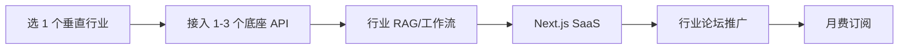

# 垂直行业 API 包装器 / 增值服务(2026 白色版)

## 一句话定位

把 OpenAI / Anthropic / Stripe / Twilio / Resend / 公开数据 API 等"通用基础设施",包装成"为特定行业(法律、医疗、电商、房地产)优化"的小工具或微服务,按月费/按调用计费;**区别于 `llm-gateway-managed-service.md`(通用 B2B 托管)和 `llm-api-reselling-cn.md`(国内转售)**,这里做的是"行业 know-how + API 增值",白帽、可持续。

## 为什么这是机会(2026 证据)

**Rethink Lab 2026 Playbook** 明确推荐此模式(2026-05-11):

> "AI Workflow Tools — Connecting disparate APIs to automate a specific business process (e.g., automated legal discovery for small firms)."

> "Micro-SaaS for Platforms — Apps for the Shopify, Slack, or Salesforce ecosystems. These platforms provide the audience for you."

**Greensighter 2026-05** 30 个微 SaaS 创意中,至少 12 个属于"垂直行业 API 增值":

- **AI Sales Handoff Checklist** — 接到 CRM(HubSpot/Salesforce),自动生成提案
- **The Real Estate Marketing Assistant** — 接入 MLS / Zillow,自动生成 listing 营销包
- **The E-commerce Product Review Analyzer** — 接入 Amazon/Shopify 评论,做 sentiment analysis
- **The Podcast-to-Platform Repurposer** — 接到 RSS + Whisper + Claude,自动转多平台
- **The B2B Client Onboarding Video Generator** — 接入客户 onboarding docs,自动生成 AI 视频

**NxCode 50 Micro-SaaS Ideas 2026** 给出公式:

> "$10,000 MRR = 200 customers × $50/month" — 验证行业垂直 + 中高单价 = 小客户基数即可
> "Vertical CRMs consistently make money: Industry-specific tools for fitness coaches, photographers, real estate agents, and freelancers"

## 自动化路径

工具栈:
- **底座 API**:OpenAI / Anthropic / Resend / Twilio / Stripe / 行业数据 API
- **行业包装层**:Next.js + Supabase + 行业特定 RAG(律师 → 法律数据库;医生 → 药品/疾病库)
- **计费**:Lemon Squeezy(月费)或自接 Stripe(量大时)
- **获客**:行业垂直论坛 / LinkedIn 群 / 行业 Newsletter 投放
- **客服**:LLM Bot

| # | 步骤 | 自动/人工 | 工具 |
| --- | --- | --- | --- |
| 1 | 选垂直 + 调研痛点 | 人工 | LinkedIn 群 / 行业论坛 |
| 2 | 接入底座 API | 半自动 | Claude Code |
| 3 | 行业 RAG(可选) | 自动 | 向量化行业知识库 |
| 4 | MVP 上线 | 半自动 | Next.js + LS 订阅 |
| 5 | 行业渠道推广 | 人工(必须) | LinkedIn / 行业 Newsletter |
| 6 | 客服 | 自动 | LLM Bot |

`auto_ratio`: **0.8**(开发半自动,行业获客必须人工)

## 评分明细(按 002 标准)

| 维度 | 分数(0-10) | v2 权重 | 加权 |
| --- | --- | --- | --- |
| 启动成本(资金) | 8(底座 API 按用量,小客户基本 $0) | 0.15 | 1.20 |
| 启动成本(技能) | 6(API 整合 + 行业理解) | 0.05 | 0.30 |
| 首笔收入速度 | 6(行业信任建立慢,1-2 月) | 0.15 | 0.90 |
| 可扩展性 | 8(单产品可扩) | 0.10 | 0.80 |
| 可持续性 | 7(底座 API 稳定) | 0.10 | 0.70 |
| 自动化程度 | 8 | 0.15 | 1.20 |
| 风险 | 7.1(拆分:法律 8 × 0.5 + ToS 7 × 0.3 + 市场 5 × 0.2 = 7.1) | 0.15 | 1.07 |
| 证据强度 | 7(12+ Greensighter 案例 + NxCode 公式) | 0.15 | 1.05 |
| + 现实数据奖励 | +0.3(30 个 Greensighter 创意 + NxCode $10k MRR 公式) | — | +0.30 |
| **总分** | — | — | **7.5** |

决策:**排队**(2 周内启动)

## 与现有机会的区别

| 机会 | 模式 | 灰色度 |
| --- | --- | --- |
| `llm-gateway-managed-service.md` | 通用 B2B 托管 LiteLLM/Portkey 替代 | normal |
| `llm-api-reselling-cn.md` | 国内转售上游账号(ToS 风险) | gray |
| **`niche-api-wrapper-2026.md`(本机会)** | **行业 know-how + 通用 API 增值** | **normal(白帽)** |

## 中国个人 2026 收款路径

- **Lemon Squeezy 月费 $29-99**:最佳起点,5% + $0.5 MoR 费,Payoneer 提现
- **Stripe 直连**(如做 $99+ 单价):需 US/HK LLC + Mercury 银行
- **底座 API 支付**:OpenAI / Anthropic / Resend 等用海外信用卡(招行/Visa 全币种卡),自动计费

## 启动清单

- [ ] 选 1 个**你熟悉**的垂直(eg: 法务、电商运营、自媒体、二手车)
- [ ] 列出该行业 5 个高频重复任务(eg: 律师 → 合同审查 / 邮件回复 / 案件摘要)
- [ ] 接入 1-3 个底座 API(LLM + 行业数据)
- [ ] Next.js + Supabase MVP(2-3 周)
- [ ] Lemon Squeezy 订阅 $49-99/月
- [ ] 在 5-10 个行业论坛/LinkedIn 群/Newsletter 推广
- [ ] 监控:行业用户数、转化率、LLM 成本

## 风险与红线

- **行业法规**:医疗、法律、金融有严格合规要求,需先咨询。
- **底座 API 涨价**:OpenAI 多次降价,但也有过涨价;锁定 1-2 个备份。
- **行业 know-how 难复刻**:壁垒在你对行业的理解,不是技术。
- **同质化**:许多"AI for X 行业"已有产品,需找"未被满足的小众痛点"。
- **GDPR/CCPA**:处理行业数据需明示用途与保留期。

## 监控指标

- 月活行业用户(健康线 > 30)
- 单用户 MRR(健康线 > $49)
- 6 月留存(健康线 > 70%)
- LLM 成本占收入比(健康线 < 30%)

## 参考来源

1. [From $0 to $10k MRR: A 2026 Indie Hacker Playbook - Rethink Lab](https://rethinklab.co/blog/from-0-to-10k-mrr-a-2026-indie-hacker-playbook) — first-hand — 抓取:2026-06-04
   > "AI Workflow Tools - Connecting disparate APIs to automate a specific business process" + "Micro-SaaS for Platforms - Apps for the Shopify, Slack, or Salesforce ecosystems"
2. [30 Micro SaaS Ideas Reddit Is Begging You to Build in 2026 - Greensighter](https://www.greensighter.com/blog/micro-saas-ideas) — first-hand — 抓取:2026-06-04
   > 30 个真实 idea 中 12+ 属"垂直行业 API 增值"模式
3. [50 Micro SaaS Ideas for 2026 - NxCode](https://www.nxcode.io/resources/news/micro-saas-ideas-2026) — first-hand — 抓取:2026-06-04
   > "$10,000 MRR = 200 customers × $50/month" + "Vertical CRMs consistently make money"
4. [独立开发者技术栈中国 2026 - Pasquale Pillitteri](https://pasqualepillitteri.it/zh/news/3091/indie-hacker-stack-china-2026) — first-hand — 抓取:2026-06-04
   > Lemon Squeezy + Payoneer 是 0 成本启动通道

## 复盘/亲测

> 未亲测。建议先选**自媒体/Newsletter 行业**(本人熟悉)做"AI 摘要 + 多平台分发"小工具,验证行业 know-how + API 增值模式。
