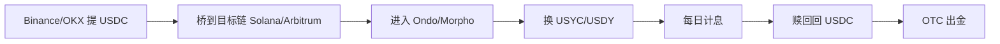

# Ondo USDY / RWA 链上美债(USYC / BUIDL / USDY)

## 一句话定位

> RWA.xyz 显示 2026 年 6 月链上美债(US Treasury)总市值 297 亿美元,头部产品 Ondo USDY 当前 7 日 APY 3.55%、BlackRock BUIDL 3.40%、Circle USYC 3.18%(均为美债真实收益),中国大陆用户可通过钱包直接持有,绕开 CEFII/美区账户。

## 自动化路径

工具栈:
- **Ondo Finance 官网**:`https://ondo.finance`(USYC 入口)
- **Aptos / Solana / Ethereum / Arbitrum / Sui** 等多链钱包(USDC 跨链桥)
- **DeFi 协议集成**:USYC 在 Compound、Morpho、Aave 中作为抵押品可用
- **RWA.xyz Dashboard**:实时监控产品 APY 与 TVL

关键步骤(参考):

| # | 步骤 | 自动/人工 | 工具 |
| --- | --- | --- | --- |
| 1 | 注册/连接钱包(Ethereum/Solana/Arbitrum) | 人工 | MetaMask / Phantom |
| 2 | 从 CEX 提 USDC 到钱包 | 人工 | CEX 提币 |
| 3 | 选定产品(USYC/BUIDL/USDY) | 人工 | RWA.xyz |
| 4 | 在 Ondo 协议或 Morpho 存款 | 人工 | Ondo / Morpho UI |
| 5 | 每天/每周核对 APY 与余额 | 半自动 | DeBank / RWA.xyz |
| 6 | 赎回 → 回到 USDC | 人工 | Ondo / Morpho |

`auto_ratio`: 0.85

## 评分明细(按 002 标准)

| 维度 | 分数(0-10) | v2 权重 | 加权 |
| --- | --- | --- | --- |
| 启动成本(资金) | 6(最低 5K USDC 起) | 0.15 | 0.90 |
| 启动成本(技能) | 7(钱包 + 跨链) | 0.05 | 0.35 |
| 首笔收入速度 | 8(T+1 计息) | 0.15 | 1.20 |
| 可扩展性 | 7(本金线性) | 0.10 | 0.70 |
| 可持续性 | 8(美债真实收益) | 0.10 | 0.80 |
| 自动化程度 | 7(存款后被动) | 0.15 | 1.05 |
| 风险 | 4.1(拆分:法律 2 × 0.5 + ToS 5 × 0.3 + 市场 8 × 0.2 = 4.1) | 0.15 | 0.62 |
| 证据强度 | 8(RWA.xyz + Bitcoin Foundation + Ondo 官方) | 0.15 | 1.20 |
| + 现实数据奖励 | +0.3(USDY 3.55% APY 公开) | — | +0.30 |
| 扣分(gray + 中国法律高风险) | -1.0 | — | -1.00 |
| **总分**(gray 扣后) | — | — | **6.1** |

决策:**排队**(适合有 $5K+ 闲置 USDT/USDC 的人,作为「链上美债低风险仓位」)

## 启动清单

- [ ] 选定产品:建议 USDY(Ondo,3.55% APY,Solana/Arbitrum 链最快)或 USYC(Circle,3.18% APY,多链)
- [ ] 钱包:Solana 用 Phantom,Arbitrum 用 MetaMask
- [ ] 跨链:USDT 提到目标链(Solana/Arbitrum 手续费低)
- [ ] 在 ondo.finance 或 Morpho 上 mint 取得 USDY/USYC
- [ ] 监控 APY 变化(RWA.xyz 7D APY 数据)
- [ ] 每月复利,目标 12 个月 3.5% 总收益
- [ ] 收款:USDC → CEX → C2C(中国 OTC,小额多笔)

## 风险与红线

- **美债真实收益风险**:虽然底层是美债,但 Ondo/Circle 通过 SPV 持有,2023 年 SVB 暴雷时 USDC 短暂脱锚。缓解:分散到 USDY + USYC 两家,不要集中在一家。
- **KYC**:Ondo USDY 需要完成合格投资者 KYC(Min $50K 资产证明),M 轮更新后 USYC 在 Morpho 上对合格地址开放。缓解:小额买 USDY(BigWhale 等分销商)、大额直接上 Ondo。
- **中国大陆政策**:灰度。链上 USDC 持有本身未被禁止,但 RWA 产品对中国地址可能 IP 限制。缓解:使用海外 IP 访问。
- **赎回流动性**:Ondo/USDY/USYC 都有 24-48 小时赎回窗口,极端市场可能拉长。

## 监控指标

- 指标 1:**7D APY**(< 2% 考虑换产品)
- 指标 2:**赎回时间**(> 5 天 立刻减少仓位)
- 指标 3:**链上 RWA 总值变动**(RWA.xyz 30D 趋势)

## 参考来源

1. <https://app.rwa.xyz/> — 类型:official — 抓取:2026-06-04
   > "Ondo U.S. Dollar Yield USDY $2,141,704,223 7D APY 3.55% | Circle USYC $2,957,368,756 7D APY 3.18% | BlackRock BUIDL $2,407,286,651 7D APY 3.40%"(完整美债 APY 实时榜)

2. <https://bitcoinfoundation.org/news/defi/top-rwa-crypto-projects-2026-ondo-maple-centrifuge/> — 类型:media — 抓取:2026-06-04
   > "Top RWA Crypto Projects 2026: Ondo, Maple, Centrifuge"

3. <https://app.rwa.xyz/asset-screener> — 类型:official — 抓取:2026-06-04
   > "Total Stablecoin Value $297.90B | Total RWA Value $24B+ | Ethereum hosts 706 RWA assets worth $16.7B 52.82% market share"

## 复盘/亲测

> 尚未亲测。建议先以 $1K USDC 试跑 USDY 30 天,记录净 APY、赎回时间。
