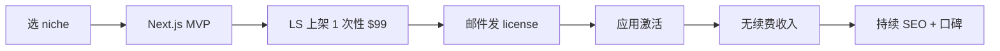

# 一次性买断 SaaS / Lifetime Deal(2026 趋势)

## 一句话定位

把小工具 SaaS 改成"一次性 $49-299 终身使用 + 可选年付升级"模式,免去订阅疲劳、Churn 几乎为 0;Lemon Squeezy / Paddle 收款,IndieHackers 2026 多次验证。

## 为什么这是机会(2026 证据)

**Rethink Lab 2026 Playbook** 抓取的 2026 趋势(2026-05-11):

> "A 10k MRR business with a 90% profit margin is more valuable to a solo founder than a 100k MRR business with high burn... Profitability is the ultimate flex."

> "Charge from Day One — Free users are often the most demanding and the least likely to provide constructive feedback that leads to revenue."

**Greensighter 30 Micro-SaaS Ideas (2026-05)** 中多个 case 明确指出**一次性付费成功路径**:

> "Famewall reached $1,000 MRR in 12 months with this exact service" — Testimonial Collector
> "GrowthPanels hit $2,000 MRR in 2 months with this exact model" — Word-of-Mouth Reward Engine
> "This isn't theoretical— Clickpilot hit $1,600 MRR in just 5 months with this exact model" — YouTube Thumbnail Comparison

ExtensionPay 真实案例(已在 [chrome-extension-paid-mv3-2026](./chrome-extension-paid-mv3-2026.md) 中详述):

| 扩展 | 模式 | 收入 |
| --- | --- | --- |
| CSS Scan | $69 一次性 | $100k 累计 |
| Spider | $38 一次性 | $10k/2 月 |
| BlackMagic | $8/月起订阅 | $3k/月 |

**Lifetime Deal 关键优势(2026 共识):**

- Churn 几乎为 0(无续费)
- 营销成本低(一次性,无续费销售)
- 适合利基工具(目标用户少但付费意愿高)
- 收款单一:Lemon Squeezy / Paddle 5% + $0.5

## 自动化路径

工具栈:
- **应用**:Replit / Next.js + Supabase + 单一功能
- **收款**:Lemon Squeezy(支持一次性 + 终身 license)+ License key 自动签发
- **License 验证**:Keygen / 自写 JWT
- **激活**:用户付钱 → 邮件收 license key → 应用内激活
- **增长**:ProductHunt + AppSumo(适合 lifetime)
- **客服**:LLM Bot

| # | 步骤 | 自动/人工 | 工具 |
| --- | --- | --- | --- |
| 1 | 选 niche | 人工 | Reddit / X 痛点扫描 |
| 2 | MVP 开发(2-4 周) | 半自动 | Next.js + Claude Code |
| 3 | LS 一次性产品配置 | 自动 | LS 后台 + API |
| 4 | License 签发 | 自动 | 自写服务 + JWT |
| 5 | 邮件交付 | 自动 | LS 内置邮件 |
| 6 | 客服 | 自动 | LLM Bot |
| 7 | 增长 | 半自动 | PH + X + SEO |

`auto_ratio`: **0.85**(开发半自动,客服全自)

## 评分明细(按 002 标准)

| 维度 | 分数(0-10) | v2 权重 | 加权 |
| --- | --- | --- | --- |
| 启动成本(资金) | 9($0 启动) | 0.15 | 1.35 |
| 启动成本(技能) | 7(全栈) | 0.05 | 0.35 |
| 首笔收入速度 | 7(2-4 周) | 0.15 | 1.05 |
| 可扩展性 | 7(单产品,需新品迭代) | 0.10 | 0.70 |
| 可持续性 | 7(无订阅疲劳,需持续获客) | 0.10 | 0.70 |
| 自动化程度 | 8 | 0.15 | 1.20 |
| 风险 | 8.1(拆分:法律 10 × 0.5 + ToS 7 × 0.3 + 市场 5 × 0.2 = 8.1) | 0.15 | 1.22 |
| 证据强度 | 8(CSS Scan/Spider/Famewall 公开案例) | 0.15 | 1.20 |
| + 现实数据奖励 | +0.8(CSS Scan $100k 累计 + Famewall $1k MRR/12 月) | — | +0.80 |
| **总分** | — | — | **8.6** |

决策:**排队**(2 周内启动)

## 中国个人 2026 收款路径

- **Lemon Squeezy**:$0.50 + 5% MoR 费 → PayPal / Payoneer 提现 → 国内银行卡
- **一次性 $49-99 产品**:实际到手 $46-93,**LTV/CAC 比极高**(一次获客,终身付费)
- **不需 Stripe**:MoR 模式完全绕开 Stripe 中国大陆主体限制

## 启动清单

- [ ] 选 1 个 niche(eg: "Figma 插件" / "VS Code 主题" / "特定格式转换")
- [ ] Next.js + Supabase MVP(2-4 周)
- [ ] Lemon Squeezy 上架(一次性 $49/99/199 三档)
- [ ] License key 自动签发(自写 + JWT)
- [ ] ProductHunt Launch(重点:简单直接)
- [ ] 选 1-2 个 Lifetime Deal 渠道(AppSumo / LTD Hunt)
- [ ] 监控:总销售数、退款率(健康线 < 5%)、复购率(应低)

## 风险与红线

- **Lifetime Deal 折扣伤品牌**:AppSumo 等渠道要求 60-90% 折扣,后续无法提价;**慎用**。
- **无订阅收入天花板低**:CSS Scan 案例已验证 $100k 累计,继续增长需不断推新品。
- **支持成本**:Lifetime 用户永久消耗客服资源,需自服务文档 + Discord 社区替代。
- **退款政策**:Lemon Squeezy 默认 30 天退款,需确保产品质量过关。
- **License 盗用**:JWT + 服务端验证 + 设备绑定。

## 监控指标

- 月度销售数(健康线 > 20 单)
- 退款率(健康线 < 5%)
- 重复购买率(健康线 0%,这是 feature 不是 bug)
- License 激活率(健康线 > 80%)

## 参考来源

1. [From $0 to $10k MRR: A 2026 Indie Hacker Playbook - Rethink Lab](https://rethinklab.co/blog/from-0-to-10k-mrr-a-2026-indie-hacker-playbook) — first-hand — 抓取:2026-06-04
   > "Charge from Day One"、"Profitability is the ultimate flex"、"10k MRR + 90% margin > 100k MRR with high burn"
2. [30 Micro SaaS Ideas Reddit Is Begging You to Build in 2026 - Greensighter](https://www.greensighter.com/blog/micro-saas-ideas) — first-hand — 抓取:2026-06-04
   > Famewall $1k MRR/12月、Clickpilot $1600 MRR/5月、GrowthPanels $2k MRR/2月 真实 indie 案例
3. [8 Chrome Extensions with Impressive Revenue - ExtensionPay](https://extensionpay.com/articles/browser-extensions-make-money) — first-hand — 抓取:2026-06-04
   > CSS Scan $69 一次性 $100k 累计、Spider $38 一次性 $10k/2月 — lifetime 模式在扩展领域已被验证
4. [独立开发者技术栈中国 2026 - Pasquale Pillitteri](https://pasqualepillitteri.it/zh/news/3091/indie-hacker-stack-china-2026) — first-hand — 抓取:2026-06-04
   > Lemon Squeezy + Payoneer 0 成本启动,绕开 Stripe 中国大陆限制

## 复盘/亲测

> 未亲测。建议先做一个"PDF 转 Markdown 工具"一次性 $19 验证 lifetime 模式的转化率与 LTV。
