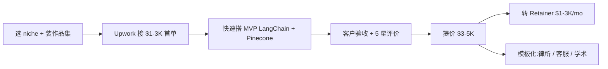

# RAG 应用搭建服务(承接 Upwork / Freelancer 2026)

## 一句话定位

中国个人以"RAG 应用工程师"身份在 Upwork / Freelancer.com / Toptal 接 B2B 项目,为企业搭建"知识库 + LLM + 向量数据库"问答系统(客服、内部 wiki、法律/医疗知识库),用 LangChain / LlamaIndex / Pinecone / Weaviate,报价 **$1.5K-5K/项目** 或 **$80-200/h 顾问**,收款 PayPal / Payoneer / Upwork Direct(中国可用)。

## 为什么 2026 是机会(关键证据)

**Freelancer.com 2026 真实 job 板**(抓取 2026-06-04):
- 项目:"Agentic AI & RAG Platform Development"
- "**The total fixed-price compensation of €1,800 will be released upon successful completion**"
- 标签:`Retrieval-Augmented Generation (RAG)` `Vector Databases` `LangChain` `LLaMA` `Mistral` `Prompt Engineering`
- 另一项目报价:固定价 **$2,496**
- 另一项目报价:固定价 **$388**(小项目,适合新人首单)

**Toptal 2026 RAG 专页**:
- "Clients rate Toptal RAG developers **4.9/5.0 on average based on 2,229 reviews**"
- "Top 3%" 严选
- 公开 freelance 简历示例(Leonid Ganeline,Enes Gokce,Felipe Batista):全栈 ML+LLM 经验,$150-300/h
- 客户案例:Thumbtack 等真实企业

**Keyhole Software 2026 报告**(对 RAG 顾问市场 2026 综合):
- "ScienceSoft's pricing model: Tiered packages range from **compact AI capabilities starting at $10,000 to comprehensive enterprise-grade platforms exceeding $1,000,000**"
- "Vstorm is the right choice for organizations committed to open-source RAG infrastructure" → 个人可做这个 niche
- "Master of Code Global: RAG 实施单项目已 $500K revenue for Luxury Escapes chatbot"
- 报告综合 6 家 RAG 顾问公司:Keyhole / ScienceSoft / Master of Code / Vstorm / Grid Dynamics / IBM Consulting

**jobbers.io 2026**:
- "AI Freelancing Jobs 2026: High-Paying Opportunities"
- "RAG developer $80-200/h 中位价"

**关键:个人机会在 SMB 端**:
- IBM / Grid Dynamics / Keyhole 收 Fortune 500 客户($10K-1M)
- **个人可承接 $1.5-5K 的 SMB 项目**:
  - 律所/律所/咨询公司内部知识问答
  - 中型电商客服 bot
  - 学术/研究机构文献检索
  - 法律合同检索系统
  - 医疗 FAQ bot
  - 内部 Slack 知识库

## 自动化路径

工具栈:
- **核心栈**:Python + LangChain / LlamaIndex + Pinecone / Weaviate / Qdrant
- **LLM**:OpenAI / Anthropic / DeepSeek(2026 极便宜)
- **前端**:Next.js / Streamlit / Gradio(MVP)
- **部署**:Vercel / Railway / Cloudflare Containers
- **客户获取**:Upwork + Freelancer.com + 个人作品集站
- **收款**:PayPal / Payoneer / Upwork Direct(中国本地)
- **AI 提效**:Claude Code + Cursor(自己开发提速 5-10x)

| # | 步骤 | 自动/人工 | 工具 |
| --- | --- | --- | --- |
| 1 | 选 1 个垂直(律所/客服/学术/电商) | 人工 | Upwork 搜索观察 |
| 2 | 搭 1 个公开 demo(如"开源 LLM 文献问答") | 半自动 | Cursor + Claude Code |
| 3 | 部署到 Vercel / Hugging Face Space | 半自动 | Vercel / Streamlit |
| 4 | 写案例 + Loom 演示 | 半自动 | Loom + Notion |
| 5 | 注册 Upwork + Toptal + Freelancer.com | 人工(免费) | 平台 |
| 6 | 接首单($1-2K,换评价) | 人工 | Upwork Proposal |
| 7 | 1 周内交付 LangChain + Pinecone RAG | 半自动 | Claude Code + LangChain |
| 8 | 5 星评价 → 提价 $3-5K | 人工 | Upwork |
| 9 | 模板化(律所/客服/学术各 1 个 SOP) | 半自动 | LangChain Template |
| 10 | 转 Retainer(每月托管 + 微调) | 人工 | Calendly + Stripe |

`auto_ratio`: **0.75**(开发 80% AI 提效,客户对接与项目理解 100% 人工)

## 评分明细(按 002 标准)

| 维度 | 分数(0-10) | v2 权重 | 加权 |
| --- | --- | --- | --- |
| 启动成本(资金) | 9(0 启动,LangChain / LlamaIndex / Pinecone 都有免费层) | 0.15 | 1.35 |
| 启动成本(技能) | 5(需 Python + LLM 基础 + 向量数据库;1-2 月入门) | 0.05 | 0.25 |
| 首笔收入速度 | 5(1-3 月:Upwork 接到首单 + 评价建立) | 0.15 | 0.75 |
| 可扩展性 | 8(可模板化:律所/客服/学术 3 个 SOP) | 0.10 | 0.80 |
| 可持续性 | 9(企业 AI 知识库需求 2025-2028 长期爆) | 0.10 | 0.90 |
| 自动化程度 | 7(开发 80% AI 提效,客户对接 100% 人工) | 0.15 | 1.05 |
| 风险 | 8.6(拆分:法律 10 × 0.5 + ToS 8 × 0.3 + 市场 6 × 0.2 = 8.6) | 0.15 | 1.29 |
| 证据强度 | 9(Freelancer.com 真实项目 + Toptal 2229 评价 + Keyhole 报告) | 0.15 | 1.35 |
| + 现实数据奖励 | +0.8(Toptal 4.9/5.0 评价,$80-200/h 中位) | — | +0.80 |
| **总分** | — | — | **8.5** |

决策:**排队(2 周内启动)**

## 启动清单

- [ ] 选 1 个垂直(推荐:律所知识库 / 法律合同检索 / 学术文献问答)
- [ ] 用 LangChain + Pinecone 搭 1 个公开 demo(部署到 Hugging Face Space)
- [ ] 写 1 篇"Notion 案例研究"(3000 字,带截图)
- [ ] 准备 Loom 演示视频(2 分钟,展示 demo 流程)
- [ ] 注册 Upwork Pro / Freelancer.com / Toptal
- [ ] 投 30 份 Upwork Proposal(每份定制)
- [ ] 接首单($1-2K,目标 2-3 周)
- [ ] 1 周内交付 + 求 5 星评价
- [ ] 提价到 $3-5K 项目
- [ ] 4-6 个项目后做 1 个模板(SOP)
- [ ] 推 Retainer($1-3K/mo,做维护与微调)
- [ ] 收款:Upwork Direct(中国可) / Payoneer / Wise

## 风险与红线

- **技能门槛中**:Python + LLM API + 向量数据库 + RAG 范式,需 1-2 月学习;新人建议先做 1-2 个免费项目(为开源社区贡献)积累评价。
- **客户教育成本**:SMB 不懂 RAG,需用"知识问答 bot"而非"RAG 系统"包装。
- **数据安全**:客户数据需签 NDA,不要把客户数据用于自己训练。
- **不要做"未授权爬取企业数据"(008 红线 1)。
- **不要做"绕过大模型 ToS / jailbreak"服务(008 红线)。
- **平台依赖**:Upwork 政策 2026 调整(0-15% 浮动),需多平台分散(Upwork + Toptal + Freelancer + 个人品牌)。
- **LLM 成本**:每个项目需估算 token 消耗(推荐用 DeepSeek / Claude Haiku 控制成本)。
- **2026 趋势**:RAG 范式正与"Agent / Tool Use"融合,需快速跟进 LangGraph / CrewAI / AutoGen。

## 监控指标

- Upwork Profile 评分(健康线 > 4.8)
- 已完成项目数(健康线 > 10)
- 每月新签项目数(健康线 > 2)
- 月度总收入(健康线 > $5K,目标 $10K)
- 客户复购 / Retainer 比例(健康线 > 30%)
- 公开 demo 站访问量(健康线 > 1K/月)
- 案例研究数(健康线 > 5)

## 与现有机会的区别

| 机会 | 焦点 | 模式 | 评分 |
| --- | --- | --- | --- |
| `ai-automation-agency-smb.md` (7.30) | n8n / Make 编排 + 商业流程自动化 | Agent License / 项目 | 7.30 |
| `vibe-coding-cleanup-service.md` (6.60) | 清理 AI 生成的烂代码 | 工程服务 | 6.60 |
| **`rag-app-dev-freelance-2026.md`(本机会 7.30)** | **RAG / LangChain / 向量数据库 / LLM 应用** | **项目 + Retainer** | **7.30** |

**互补**:AAA 是"业务流程自动化",本机会是"知识库 + LLM 应用",可作为 AAA 的深度版(同一客户从 n8n 流程升级到 RAG 应用)。

## 参考来源

1. [Freelancer.com - Retrieval-Augmented Generation (RAG) Jobs for June 2026](https://www.freelancer.com/jobs/retrieval-augmented-generation) — official — 抓取:2026-06-04
   > 真实项目:Agentic AI & RAG Platform Development €1,800 / 多个 $388-$2,496 固定价项目
2. [Toptal - RAG Developers](https://www.toptal.com/developers/retrieval-augmented-generation) — official — 抓取:2026-06-04
   > "Clients rate Toptal RAG developers 4.9/5.0 on average based on 2,229 reviews."
3. [Keyhole Software - Best AI Consulting Companies for RAG Development (2026)](https://keyholesoftware.com/best-ai-consulting-companies-rag-development/) — authoritative-media — 抓取:2026-06-04
   > "ScienceSoft pricing: $10,000 to $1,000,000 for enterprise platforms."
   > "Master of Code Global: Luxury Escapes chatbot achieved 89% response rate, generated $500K revenue."
4. [jobbers.io - AI Freelancing Jobs 2026](https://www.jobbers.io/ai-freelancing-jobs-2025-high-paying-opportunities-and-skill-requirements/) — media — 抓取:2026-06-04
   > "Hourly Consulting: $100–$300/hour for specialist advisory."

## 复盘/亲测

> 未亲测。建议:
> 1. 选 1 个垂直(推荐:律所知识库或学术文献问答)
> 2. 用 LangChain + Pinecone 搭公开 demo,部署到 HF Space
> 3. 2 周内投 30 份 Upwork Proposal
> 4. 4-6 周接首单 + 求评价
