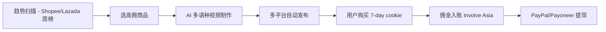

# Shopee/Lazada Affiliate via Involve Asia(中国个人 2026)

## 一句话定位

中国个人通过 Involve Asia 联盟平台免费注册,一次接入 Shopee + Lazada + Tokopedia 三大 SEA 平台的 affiliate program,在 TikTok/YouTube/FB 用 AI 短视频(印尼语/泰语/越南语)推广 6 国(印尼/泰国/越南/菲律宾/马来/新加坡)电商商品,拿 2.5%-40% 佣金 + 大促 36% 加成,通过 PayPal/Payoneer 收款。

## 自动化路径

工具栈:
- **Involve Asia / ACCESSTRADE**:第三方联盟平台,聚合 Shopee/Lazada/Tokopedia
- **Shopee Affiliate Marketing System (AMS)**:Shopee 自营 affiliate
- **Lazada Affiliate**(Lazada 官方):佣金 1-10%(新客 12%)
- **PayPal / Payoneer / Wire**:多通道收款
- **DeepL + HeyGen**:多语种短视频 AI 制作
- **Buffer / Hootsuite**:多平台自动发布
- **n8n**:数据回采

关键步骤:

| # | 步骤 | 自动/人工 | 工具 |
| --- | --- | --- | --- |
| 1 | 选品(平台爆款) | 半自动 | Shopee/Lazada 联盟后台 + 关键词 |
| 2 | AI 翻译多语种推广文案 | 全自动 | DeepL + Claude |
| 3 | 短视频/图文制作 | 半自动 | CapCut + HeyGen + Canva |
| 4 | 多平台发布 | 全自动 | Buffer + Zapier |
| 5 | 销售监控 | 全自动 | Involve Asia dashboard |
| 6 | 收款 | 半自动 | IA → PayPal/Payoneer/Wire |

`auto_ratio`: 0.85(选品/翻译/分发/监控全自动,核心人工在选品判断和爆款挖掘)

## 评分明细(按 002 v2.0 标准)

| 维度 | 分数(0-10) | 权重 | 加权 |
| --- | --- | --- | --- |
| 启动成本(资金) | 10(0 资金) | 0.15 | 1.50 |
| 启动成本(技能) | 7(多语种营销能力可由 AI 弥补) | 0.05 | 0.35 |
| 首笔收入速度 | 6(流量冷启动 2-4 周) | 0.15 | 0.90 |
| 可扩展性 | 9(6 国 × 3 平台 = 18 个流量池) | 0.10 | 0.90 |
| 可持续性 | 8(SEA 电商 2025-2029 CAGR 9-12%) | 0.10 | 0.80 |
| 自动化程度 | 8(AI 多语种内容) | 0.15 | 1.20 |
| 风险 = 0.5×法律 10 + 0.3×ToS 6 + 0.2×市场 6 = **8.0**(Involve Asia 接受国家待查+PayPal 提现) | 8.0 | 0.15 | 1.20 |
| 证据强度 | 7(2026 佣金 36% 大促加成 + 7-day cookie) | 0.15 | 1.05 |
| **加权小计** | — | — | **7.90** |
| + 现实数据奖励:0 真实月入案例(纯理论推演) | — | — | **-0.50** |
| **总分** | — | — | **7.40** |

决策:**排队**(2 周内启动,与 Hotmart 并行)

## 启动清单

- [ ] 注册 Involve Asia(免费,接受全球 affiliate,需邮箱)
- [ ] 同步申请 Shopee Affiliate(每个国家独立注册:affiliate.shopee.com.my 等)
- [ ] 同步申请 Lazada Affiliate
- [ ] 选 3 个垂直品类(美妆/3C/家居)
- [ ] 用 HeyGen + DeepL 制作印尼语/泰语/越南语短视频 10 条
- [ ] 注册 TikTok/YouTube/FB 矩阵账号(目标国 IP)
- [ ] 绑定 PayPal(优先) + Payoneer
- [ ] 大促日历(6.6/7.7/9.9/11.11/12.12)提前 2 周布局
- [ ] 监控 7-day cookie 转化,迭代素材

## 风险与红线

- **Involve Asia 接受中国大陆 affiliate**:官方未明确限制;部分活动可能仅限 SEA 居民,但全球 affiliate 可参与。
- **PayPal 最低提现 MYR 400(约 $100)**:小账户提现门槛高,需累积到 $100 才划算。
- **Payoneer / Wire**:MYR 80(约 $17)Wire 提现门槛低,适合小账户。
- **Shopee Affiliate 必须本地银行**:如果走 IA/ACCESSTRADE 可绕开;直接走 Shopee Affiliate 需要当地银行账户。
- **佣金结算**:Shopee 通常 60 天结算(扣除退款期)。
- **大促期 36% 佣金**:需在大促前 1-2 周布局,临时上 SKU 效果差。
- **2026-01-20 新政**:Shopee 提升社交媒体创作者佣金(具体比例待查官方),新红利期。

## 监控指标

- 指标 1:**联盟 CTR** — 目标 ≥ 1.5%
- 指标 2:**7-day cookie 转化** — 目标 ≥ 1.0%
- 指标 3:**月度佣金** — 目标 90 天 $300,180 天 $1500
- 指标 4:**大促期(11.11 等)单日峰值** — 目标单日 $200+
- 指标 5:**多国/多平台分布** — 避免单点风险,目标 ≥ 3 平台

## 参考来源

1. [Shopee Affiliate Program 2026 - Reacheffect 2026-03-31](https://reacheffect.com/blog/shopee-affiliate-program/) — 类型:media(行业) — 抓取:2026-06-04
   > "Shopee on January 20, 2026, also gave higher commission rates to social media content creators who bring traffic to Shopee from platforms such as TikTok, Instagram, and Facebook. Indirect Order Commission (game-changer in 2026): User clicks your link and buys anything on Shopee within 7 days → you still earn up to 30% of seller's set commission rate."
2. [Lazada Affiliate Program Review 2026 - Reacheffect 2026-04-10](https://reacheffect.com/blog/lazada-affiliate-program-review/) — 类型:media(行业) — 抓取:2026-06-04
   > "Base Commission 1%-10% (up to 12% new customer). Mega Sale Boost up to 36% during 6.6/9.9/11.11/12.12. Cookie 7 days. Network Involve Asia. Min Payout RM80 (Wire) / RM400 PayPal. Approval 1-3 working days."
3. [Involve Asia Affiliate Program](https://www.postaffiliatepro.com/affiliate-program-directory/involve-asia-affiliate-program/) — 类型:aggregator — 抓取:2026-06-04
   > "Involve is a performance marketing company... minimum payout MYR 80 for Wire, MYR 400 for PayPal"
4. [Indonesia B2C Ecommerce 2025 - BusinessWire](https://www.businesswire.com/news/home/20260129537865/en/) — 类型:media(行业) — 抓取:2026-06-04
   > "Indonesia ecommerce $43.4B 2025, +10.6% YoY, CAGR 9.2% to 2029 → $61.6B. Shopee/Tokopedia-TikTok/Lazada leading."
5. [Shopee Affiliate 视频 - All About Affiliate Marketing 2023-05](https://www.youtube.com/watch?v=B-haxRmqF44) — 类型:community — 抓取:2026-06-04
   > "Shopee Affiliate 注册流程演示,需本地 affiliate 账户(每个国家独立)"

## 复盘/亲测

> 仅在亲自执行后填写。
