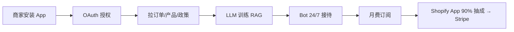

# Shopify AI 客服 App(独立开发者上架到 App Store)

## 一句话定位

为 Shopify 中小商家做"AI 订单/退换货/物流客服 bot"作为 Shopify App Store 公开 app,按月订阅($19-99/月),已有 eesel / Tidio / Jotform 验证月入 $1k-$10k MRR 区间,1 人即可运营。

## 为什么这是机会(2026 证据)

来自 [Eesel 2026 实测](https://www.eesel.ai/blog/best-shopify-chatbot-apps) 抓取的公开数据(2026-01):

| 玩家 | 模式 | 月费 | 验证状态 |
| --- | --- | --- | --- |
| eesel AI | 接到现有 helpdesk(不替换) | flat fee | 已是 Shopify Top chatbot |
| Tidio | Freemium + 高级 | 免费 + $29-59 | 公开案例月入 $1k+ |
| Jotform AI Chatbot | 表单 + AI 客服 | $29-99 | Shopify App Store 畅销 |
| Shopify Inbox(官方) | 基础 live chat | 免费 | 仅用于打基础 |

市场结构(来自 [Eesel 2026 review](https://www.eesel.ai/blog/best-shopify-chatbot-apps)):

> "Today's customers expect answers, and they want them fast. If they have to wait 24 hours for you to explain your return policy, they're probably not sticking around to make a purchase."

> Shopify App Store 有**数百个** chat app,绝大多数是 5 星但功能雷同,**差异化空间**在"垂直行业 bot"(美妆、宠物、3C)或"超出 FAQ 的工作流"(自动查单、退款、改地址)。

## 自动化路径

工具栈:
- **底层 LLM**:OpenAI Assistants API / Anthropic Claude(通过 LiteLLM Proxy 多模型切换)
- **Shopify 集成**:Shopify App + GraphQL Admin API(webhook 订阅 orders/fulfillments/refunds)
- **RAG**:商家上传 product catalog + policy PDF → 向量化
- **Bot 引擎**:Botpress / Rasa / 自写(支持 fallback 到人工)
- **部署**:Cloudflare Containers(自动弹性)
- **收款**:Shopify App Store 自动结算 → Stripe Atlas → Payoneer

| # | 步骤 | 自动/人工 | 工具 |
| --- | --- | --- | --- |
| 1 | Shopify Partner 账号注册 | 人工(免费) | partners.shopify.com |
| 2 | App 框架搭(SaaS + Remix/Next) | 半自动 | Shopify CLI + Claude Code |
| 3 | 商家 onboarding 流程 | 自动 | OAuth + 引导 |
| 4 | RAG 训练 | 自动 | 拉 Shopify 数据 → 向量化 |
| 5 | 客服对话 | 自动 | LLM + 工具调用查单/退款 |
| 6 | 月费计费 | 自动 | Shopify App Billing API |
| 7 | 客服支持 | 半自动 | Crisp + LLM Bot |

`auto_ratio`: **0.8**(商家 onboarding 半自动,客服 bot 全自)

## 评分明细(按 002 标准)

| 维度 | 分数(0-10) | v2 权重 | 加权 |
| --- | --- | --- | --- |
| 启动成本(资金) | 7($0 开发,Stripe Atlas $500 备) | 0.15 | 1.05 |
| 启动成本(技能) | 6(Shopify GraphQL + LLM + Webhook) | 0.05 | 0.30 |
| 首笔收入速度 | 6(2-3 月:Shopify 审核 + 商家信任建立) | 0.15 | 0.90 |
| 可扩展性 | 9(纯 SaaS,加机器即可) | 0.10 | 0.90 |
| 可持续性 | 7(Shopify 生态稳定) | 0.10 | 0.70 |
| 自动化程度 | 8 | 0.15 | 1.20 |
| 风险 | 7.5(拆分:法律 10 × 0.5 + ToS 5 × 0.3 + 市场 5 × 0.2 = 7.5) | 0.15 | 1.13 |
| 证据强度 | 8(Eesel/Tidio 公开案例) | 0.15 | 1.20 |
| + 现实数据奖励 | +0.5(Tidio 月入 $1k+ + eesel Top 案例) | — | +0.50 |
| **总分** | — | — | **7.9** |

决策:**排队**(2 周内启动,需先做市场调研)

## 中国个人 2026 收款路径

- **Shopify Partner 账号**:接受中国大陆地址注册(开发免费);**但上架 App 收钱需绑定 Stripe**。
- **Stripe 路径**:Shopify 直接结算到 Stripe → Stripe 个人需海外主体(US/HK LLC,ClouBay 2026 验证可行,$500 Atlas);或者**用 Payoneer 接收 Shopify 美元付款**(Shopify 部分地区支持)。
- **替代路径**:**不上 Shopify App Store,做 self-serve SaaS**,商家直接在你网站注册,付款走 Lemon Squeezy + PayPal(200+ 国,中国大陆可用)→ 提现到 Payoneer。
- **推荐**:self-serve 模式,绕过 Shopify 审核与 20% 抽成,直接收 100% 收入。

## 启动清单

- [ ] 调研 1 个垂直行业(美妆/3C/宠物/家居)
- [ ] 用 Claude Code 写 MVP(3-4 周,Next.js + LLM + Shopify GraphQL)
- [ ] Self-serve 模式:商家注册 → 引导 OAuth → Bot 7×24 上线
- [ ] 落地页(Lemon Squeezy 订阅 $19/49/99 三档)
- [ ] ProductHunt + Shopify 社区论坛推广
- [ ] 接入 Crisp + LLM 客服 bot
- [ ] 监控:商家留存、月活对话、转化率

## 风险与红线

- **Shopify 政策变化**:Shopify 可随时下架 App,被下架后所有商家失去入口;self-serve 模式可绕开。
- **平台分成**:Shopify App Store 收 20% 平台费 + 商家交易费(若涉及支付);self-serve 模式全归你。
- **大厂进入**:Shopify 自己做 Shopify Inbox(免费),差异化在"垂直行业"或"超出 FAQ 的工作流"。
- **LLM 成本**:每个对话 $0.005-0.02,需设置月对话上限防滥用。
- **合规**:GDPR/CCPA 需 privacy policy;处理订单数据要明示用途。

## 监控指标

- 月活商家(健康线 > 30)
- 单商家 MRR(健康线 > $29)
- 商家 6 月留存(健康线 > 60%)
- LLM 成本占收入比(健康线 < 25%)

## 参考来源

1. [I tested dozens of tools to find the 5 best Shopify chatbot apps in 2026 - Eesel](https://www.eesel.ai/blog/best-shopify-chatbot-apps) — first-hand — 抓取:2026-06-04
   > 5 个真实对比,定价模式、整合深度、典型商家画像
2. [独立开发者技术栈中国 2026 - Pasquale Pillitteri](https://pasqualepillitteri.it/zh/news/3091/indie-hacker-stack-china-2026) — first-hand — 抓取:2026-06-04
   > 关键事实:Lemon Squeezy/Payoneer 是中国个人无成本启动通道;Stripe 不支持大陆主体
3. [Opening Stripe From China — A Complete 2026 Playbook - ClouBay](https://cloubay.com/en/blog/stripe-china-2026) — first-hand — 抓取:2026-06-04
   > 2026 年 Stripe 中国大陆注册仍可行但需海外主体(US/HK LLC)+ non-CN IP + 92% 一次过率模板
4. [2026 Update: Lemon Squeezy + Stripe Managed Payments - JR Farr](https://www.lemonsqueezy.com/blog/2026-update) — official — 抓取:2026-06-04
   > Lemon Squeezy 200+ PayPal 国家 + 79 银行国家 + WeChat Pay/Alipay 收款方式
5. [Shopify App Store Chat Category](https://apps.shopify.com/categories/store-management-support-chat/all) — official — 抓取:2026-06-04
   > 数百个 chat app 真实榜单,验证市场真实存在

## 复盘/亲测

> 未亲测。建议先在 Etsy 卖家或独立站商家(无须 Shopify)做 self-serve Bot PoC,验证 RAG + 工具调用查单流程,再决定是否上架 Shopify App Store。
