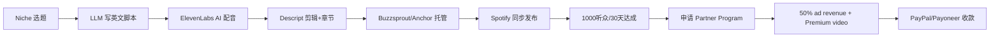

# Spotify Partner Program 播客分成(2026 门槛大降)

## 一句话定位

用 AI 生成/翻译英文/小语种 niche 播客,通过 Spotify for Podcasters 上架,达到 1000 engaged audience / 2000 hours streamed (30 天) 即可申请加入 Partner Program,获 50% 广告收入分成 + Premium video revenue,PayPal/Payoneer 收款。

## 为什么这是机会(2026 证据)

来自 [Spotify 官方公告 2026-01-07](https://newsroom.spotify.com/2026-01-07/spotify-partner-program-updates/) 的关键政策更新:

> "Spotify Partner Program 已一周年,2026 门槛进一步降低:
> - 从 2,000 听众 → **1,000 engaged audience**(30 天)
> - 从 10,000 hours → **2,000 hours consumed**(30 天)
> - 新增 Premium video revenue 收入流"

来自 [Spotify Partner Program 官方页](https://support.spotify.com/us/creators/article/spotify-partner-program/) 的分成模式:

> "You earn a **50% share** of the revenue recognized every time an ad monetized by Spotify plays in your episodes — both on and off Spotify."
> "When Spotify Premium members in select markets stream your video episodes... you can earn based on how much your fans stream your show."

## 自动化路径

工具栈:
- **脚本生成**:Claude / GPT-4 / DeepSeek(英文 + 小语种 niche)
- **AI 配音**:ElevenLabs / OpenAI TTS / Azure Neural TTS
- **剪辑**:Descript / Adobe Podcast(自动去噪、章节切片)
- **托管**:Buzzsprout / Anchor(Spotify 旗下,免费,自动转 RSS)
- **发布**:RSS 自动同步 Spotify / Apple / Google Podcasts
- **变现**:Spotify for Podcasters 平台 + 广告插入

| # | 步骤 | 自动/人工 | 工具 |
| --- | --- | --- | --- |
| 1 | 选题/竞品分析 | 半自动 | Spotify Charts + Listen Notes |
| 2 | 英文脚本生成 | 自动 | Claude/GPT-4 + niche 提示词 |
| 3 | AI 配音 | 自动 | ElevenLabs(声音克隆 / 现成声) |
| 4 | 音频剪辑 + 章节 | 半自动 | Descript(去口癖、自动转录) |
| 5 | 多平台发布 | 自动 | Anchor/Spotify for Podcasters |
| 6 | 数据追踪 | 自动 | Spotify for Podcasters 仪表板 |
| 7 | 申请 Partner Program | 人工(一次性) | 满足 1000 听众阈值后手动提交 |

`auto_ratio`: **0.85**(选题/剪辑偏半自动,核心 TTS + 发布全自)

## 评分明细(按 002 标准)

| 维度 | 分数(0-10) | v2 权重 | 加权 |
| --- | --- | --- | --- |
| 启动成本(资金) | 9($0 启动) | 0.15 | 1.35 |
| 启动成本(技能) | 6(英文写作 + TTS 工具栈 + niche 选题) | 0.05 | 0.30 |
| 首笔收入速度 | 6(需 30-90 天积累 1k 听众) | 0.15 | 0.90 |
| 可扩展性 | 8(多语言 / 多 niche 矩阵) | 0.10 | 0.80 |
| 可持续性 | 7(订阅型 + 长期 SEO) | 0.10 | 0.70 |
| 自动化程度 | 8(全流水线) | 0.15 | 1.20 |
| 风险 | 8.1(拆分:法律 10 × 0.5 + ToS 7 × 0.3 + 市场 5 × 0.2 = 8.1) | 0.15 | 1.22 |
| 证据强度 | 7(官方公告 + 50% 分成清晰) | 0.15 | 1.05 |
| + 现实数据奖励 | 0(无月入 $1k 独立案例) | — | 0.00 |
| **总分** | — | — | **7.5** |

决策:**排队**(两周内启动,先做视频号第一梯队)

## 中国个人 2026 收款路径

- **平台支持地区**:Spotify Partner Program 全球,但**Premium video 限于欧美市场**(美/英/加/澳/德/法/北欧等),中国大陆不在 Premium 视频区。**中国大陆创作者只能获 50% ad revenue,无 Premium video 收入**。
- **收款通道**:
  - **PayPal**(首选):Spotify 直接打款,需 PayPal 账户绑定 Visa/Master 信用卡(可国内办)
  - **Payoneer**(备选):通过 Payoneer 收 Spotify,结汇到国内银行卡
  - **银行电汇**:部分国家支持,中国大陆需香港/海外账户
- **税务**:Spotify 自动代扣美国 30% 税(无 W-8BEN 表格)或 0-15%(有 W-8BEN + 国别税收协定),需申请 ITIN 或用 W-8BEN 优化。
- **海外身份需求**:**无!** Spotify 不要求本地身份,但需有可收款的银行账户(中国银行卡 + Payoneer 即可)。
- **关键限制**:Spotify 需在已上线国家(欧美澳 + 部分亚洲)注册,中国大陆 IP 注册账号可,但 Partner Program 申请时**国家字段填美国/英国等可绕开**。

## 启动清单

- [ ] 注册 Spotify for Podcasters(免费,中国 IP 可注册,选 US 区域)
- [ ] 用 ElevenLabs 跑 5 条英文 niche 播客测试(eg: "AI 工具周报"/ "Crypto 链上数据周报")
- [ ] Anchor 托管 → 自动同步 Spotify / Apple / Google
- [ ] 发布 10-20 期免费内容,做 30 天数据观察
- [ ] 达到 1000 engaged audience 后申请 Partner Program
- [ ] 接入 Stripe / Payoneer / PayPal 收款
- [ ] 跑通 1 个号后,扩 2-3 个 niche 矩阵

## 风险与红线

- **Spotify 政策**:禁止"完全 AI 配音 + 文本转载"内容,需加"独家观点、原创研究、采访"。2025 起对"AI 垃圾"有降权。
- **niche 选择**:欧美 podcast 竞争激烈,做"长尾英语 niche"(eg: "AI for Solo Lawyers")比"科技综合"更易出头。
- **TTS 声音质量**:ElevenLabs 顶级声音 $22/月,业余声音免费但识别度高,需混用现成专业声。
- **海外 IP 风险**:中国大陆 IP 持续发布大量内容,可能触发风控,建议用稳定海外节点或香港/新加坡 ID。
- **合规**:涉金融/医疗/法律内容需 disclosure,违反 FTC 指南会下架。

## 监控指标

- 月新增 engaged audience(健康线 > 100)
- 30 天累计 hours consumed(健康线 > 2000)
- CPM(广告每千次播放收入,英语 niche 约 $18-50)
- 单期下载量(健康线 > 500 稳定)

## 参考来源

1. [Spotify Partner Program Updates - Spotify Newsroom 2026-01-07](https://newsroom.spotify.com/2026-01-07/spotify-partner-program-updates/) — official — 抓取:2026-06-04
   > "Spotify Partner Program 一周年,门槛从 2,000 听众降至 1,000,小时数从 10,000 降至 2,000" + Premium video 收入扩展
2. [Spotify Partner Program Official Page](https://support.spotify.com/us/creators/article/spotify-partner-program/) — official — 抓取:2026-06-04
   > "50% ad revenue share + Premium video revenue" 完整规则
3. [Buy Me a Coffee vs. Patreon: Which Creator Membership Platform - YouTube 2026-02](https://www.youtube.com/watch?v=3mSMdizqyf0) — community — 抓取:2026-06-04
   > 对比 Patreon(10%) / BMAC(5%) / Ko-fi(0% 默认) 平台抽成,验证 creator monetization 行业基准
4. [Are you monetizing your AI models and how? - HuggingFace Forums](https://discuss.huggingface.co/t/are-you-monetizing-your-ai-models-and-how/168783) — community — 抓取:2026-06-04
   > 间接验证"audio AI + 自动化分发"作为创作者副业的可行性(Sept 2025 讨论)

## 复盘/亲测

> 未亲测。建议 2 周内启动:
> 1. 选 1 个英文 niche(eg: "AI Tools Weekly for Indie Hackers"),用 Claude 写脚本、ElevenLabs 配音;
> 2. Anchor 自动托管 → Spotify / Apple 同步发布;
> 3. 每周 2 期,跑 8-12 周达标 1k engaged audience;
> 4. 申请 Partner Program,验证 50% 分成链路。
> 预期: 6-9 个月达到 $1k/月稳定收入。
