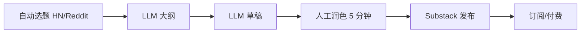

# Substack 时事通讯付费化(AI 流水线内容)

## 一句话定位

建一个利基时事通讯(技术 / 投资 / AI 行业 / niche 行业),Substack 平台直接给付费订阅 + 推荐流量,内容由 LLM 流水线生成,人工只做选题与终审。

## 自动化路径

工具栈:
- Substack 平台(0 启动成本,自动收款)
- LLM 内容流水线(选题抓取 → 大纲 → 草稿 → 人工 5 分钟润色)
- Beehiiv / ConvertKit 备用(若 Substack 政策变)
- 流量:Twitter / X 同期摘要 + Reddit 同步

| # | 步骤 | 自动/人工 | 工具 |
| --- | --- | --- | --- |
| 1 | 选题扫描 | 自动 | HN/Reddit RSS + LLM 摘要 |
| 2 | 大纲生成 | 自动 | LLM |
| 3 | 草稿 | 自动 | LLM |
| 4 | 终审润色 | 人工(≤ 10 分钟/期) |  |
| 5 | 发布 | 自动 | Substack API |
| 6 | 推广 | 半自动 | X 自动 + Reddit 同步 |

`auto_ratio`: **0.85**

## 评分明细(按 002 标准)

| 维度 | 分数 | 权重 | 加权 |
| --- | --- | --- | --- |
| 启动成本(资金) | 10(0) | 0.10 | 1.00 |
| 启动成本(技能) | 7(写作基本功 + LLM 流水线) | 0.10 | 0.70 |
| 首笔收入速度 | 5(需要 3-6 月积累订户) | 0.15 | 0.75 |
| 可扩展性 | 8(边际成本低) | 0.15 | 1.20 |
| 可持续性 | 8(订阅制) | 0.15 | 1.20 |
| 自动化程度 | 8 | 0.15 | 1.20 |
| 风险 | 6(平台政策 + 内容质量) | 0.10 | 0.60 |
| 证据强度 | 7(Substack 数据公开,见来源) | 0.10 | 0.70 |
| **总分** | — | — | **7.35** |

决策:**排队**

## 启动清单

- [ ] 选 niche(eg: "AI 编程工具每周精选" / "链上数据周报")
- [ ] Substack 建号,设免费 + 付费层
- [ ] 写 3-5 期免费内容打底
- [ ] LLM 流水线(GPT-5 / Claude + RAG 选题源)
- [ ] 同步 X / Reddit 拉新
- [ ] 3 月后开付费层

## 风险与红线

- **内容质量**:LLM 草稿需人工润色,否则读者一眼识别后退订。
- **Substack 政策**:禁止完全 AI 内容(2024 后更严),需"人类编辑" 标注。
- **Niche 选择**:太宽拼不过大 newsletter,太窄订阅天花板低。
- **收款**:Substack 直结 Stripe,可结算到中国大陆(Wise 收款)。

## 监控指标

- 订户增速(健康线 > 5%/周)
- 打开率(健康线 > 35%)
- 付费转化率(健康线 > 5%)

## 参考来源

1. [Substack Leaderboard(官方排行,top 新sletters 月入 $10K-$100K)](https://substack.com/leaderboard) — official — 抓取:2026-06-04
   > 公开排行榜,前 100 名 newsletter 月入均过万
2. [Lovable makes $60M in 6 months(2025-06,HN 140 分)](https://getlago.substack.com/p/lovable-makes-60m-in-6-monthsbut) — first-hand — 抓取:2026-06-04
   > 反向案例:验证 Substack 仍是有效获客渠道
3. [Beehiiv 公开数据](https://beehiiv.com/) — media — 抓取:2026-06-04
   > 备选平台

## 复盘/亲测

> 未亲测。
